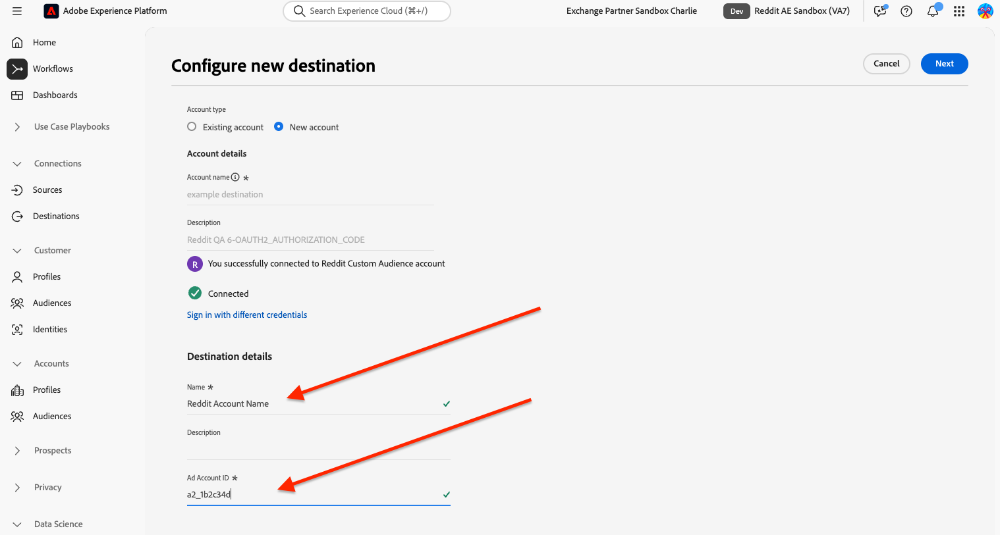

# Connexion [!DNL Reddit Custom Audience] {#reddit-custom-audience-connection}

## Vue d’ensemble {#overview}

[!DNL Reddit Ads] connectez les marques aux personnes qui explorent activement leurs passions et leurs problèmes en temps réel. En associant des conversations axées sur la communauté à de hautes intentions, des formats d&#39;annonce flexibles et un ciblage robuste, [!DNL Reddit Ads] aident les annonceurs à atteindre des audiences engagées, à stimuler les résultats de performance et à apprendre directement des communautés qui façonnent la culture en ligne.

Ce guide est destiné aux annonceurs et aux équipes médias qui utilisent [!DNL Adobe Experience Platform] pour envoyer des audiences à [!DNL Reddit Ads]. Elle couvre ce dont vous avez besoin pour connecter vos comptes, mapper des identités et activer des audiences.

>[!IMPORTANT]
>
>Ce connecteur de destination et cette page de documentation sont créés et gérés par l’équipe [!DNL Reddit]. Pour toute question ou demande de mise à jour, contactez directement l’équipe d’Amazon Ads au <adsapi-partner-support@reddit.com>.

## Cas d’utilisation {#use-cases}

Pour mieux comprendre quand et comment utiliser la destination [!DNL Reddit Custom Audience], consultez les exemples de cas d’utilisation ci-dessous que [!DNL Adobe Experience Platform] clients peuvent résoudre à l’aide de cette destination.

### Reciblage des clients existants avec des offres personnalisées {#use-case-1}

Un retailer en ligne souhaite atteindre les clients existants par le biais de plateformes sociales et leur présenter des offres personnalisées en fonction de leurs commandes précédentes. Le retailer en ligne peut ingérer des adresses e-mail et des identifiants d’appareil (IDFA et GAID) depuis son propre CRM vers [!DNL Adobe Experience Platform], créer des audiences à partir de ses propres données hors ligne et envoyer ces audiences à [!DNL Reddit Ads], optimisant ainsi leurs dépenses publicitaires.

## Conditions préalables {#prerequisites}

Avant de configurer cette destination, veillez à respecter les conditions préalables suivantes :

* Compte [!DNL Reddit Ads] autorisé à utiliser des audiences et des listes de clients personnalisées.
* Autorisation d’autoriser la connexion. Il doit s’agir d’un utilisateur pouvant se connecter pour [!DNL Reddit] et approuver l’accès de [!DNL Experience Platform] à la gestion des audiences au nom du compte publicitaire.
* L’identifiant de votre compte publicitaire [!DNL Reddit] : l’identifiant du compte publicitaire où les audiences sont créées. Votre identifiant de compte publicitaire se trouve dans [Comptes](https://ads.reddit.com/accounts). Par exemple : `a2_1b2c34d`.

## Identités prises en charge {#supported-identities}

[!DNL Reddit Custom Audience] prend en charge l’activation des identités décrites dans le tableau ci-dessous. En savoir plus sur les [identités](/help/identity-service/features/namespaces.md).

| Identité cible | Description | Considérations |
| --- | --- | --- |
| email_lc_sha256 | Adresses e-mail hachées avec l’algorithme SHA256 | Le texte brut et les adresses e-mail hachées SHA256 sont pris en charge par [!DNL Adobe Experience Platform]. Lorsque votre champ source contient des attributs non hachés, cochez l’option **[!UICONTROL Apply transformation]** afin que [!DNL Platform] hache automatiquement les données lors de l’activation. |
| servante | Google Advertising ID ou Apple ID pour les annonceurs, tous deux hachés avec l’algorithme SHA256 | Mappez GAID ou IDFA sur **maid**. Lorsque votre champ source contient des attributs non hachés, cochez l’option **[!UICONTROL Apply transformation]** afin que [!DNL Platform] hache automatiquement les données lors de l’activation. |

{style="table-layout:auto"}

## Audiences prises en charge {#supported-audiences}

Cette section décrit les types d’audiences que vous pouvez exporter vers cette destination.

| Origine de l’audience | Pris en charge | Description |
| --- | --- | --- |
| [!DNL Segmentation Service] | Oui | Audiences générées via le [!DNL Experience Platform] [Segmentation Service](../../../segmentation/home.md). |
| Toutes les autres origines d’audience | Oui | Cette catégorie inclut toutes les origines d’audience en dehors des audiences générées par le service de segmentation. Découvrez les [différentes origines d’audience](/help/segmentation/ui/audience-portal.md#customize). |

{style="table-layout:auto"}

Audiences prises en charge par type de données :

| Type de données d’audience | Pris en charge | Description | Cas d’utilisation |
| --- | --- | --- | --- |
| [Audiences de personnes](/help/segmentation/types/people-audiences.md) | Oui | En fonction des profils client, ce qui vous permet de cibler des groupes spécifiques de personnes pour les campagnes marketing. | Acheteurs fréquents, personnes abandonnant leur panier |
| [Audiences de compte](/help/segmentation/types/account-audiences.md) | Non | Ciblez des individus au sein d’organisations spécifiques pour les stratégies marketing basées sur les comptes. | Marketing B2B |
| [Audiences de prospects &#x200B;](/help/segmentation/types/prospect-audiences.md) | Non | Ciblez les individus qui ne sont pas encore clients, mais qui partagent des caractéristiques avec votre audience cible. | Prospection à l’aide de données tierces |
| [Exportations de jeux de données](/help/catalog/datasets/overview.md) | Non | Collections de données structurées stockées dans le lac de données [!DNL Adobe Experience Platform]. | Rapports, workflows de science des données |

{style="table-layout:auto"}

## Type et fréquence d’exportation {#export-type-frequency}

Reportez-vous au tableau ci-dessous pour plus d’informations sur le type et la fréquence d’exportation des destinations.

| Élément | Type | Notes |
| --- | --- | --- |
| Type d’exportation | **[!UICONTROL Audience export]** | Vous exportez tous les profils membres d’une audience ainsi que les identifiants (nom, numéro de téléphone ou autres) utilisés dans la destination [!DNL Reddit Custom Audience]. |
| Fréquence des exportations | **[!UICONTROL Streaming]** | Les destinations de diffusion en continu sont des connexions basées sur l’API « toujours actives ». Dès qu’un profil est mis à jour dans Experience Platform en fonction de l’évaluation des audiences, le connecteur envoie la mise à jour en aval vers la plateforme de destination. En savoir plus sur les [destinations de diffusion en continu](/help/destinations/destination-types.md#streaming-destinations). |

{style="table-layout:auto"}

## Se connecter à la destination {#connect}

>[!IMPORTANT]
>
>Pour vous connecter à la destination, vous avez besoin des **[!UICONTROL View Destinations]** et **[!UICONTROL Manage Destinations]** [autorisations de contrôle d’accès](/help/access-control/home.md#permissions). Lisez la [présentation du contrôle d’accès](/help/access-control/ui/overview.md) ou contactez votre administrateur de produit pour obtenir les autorisations requises.

Pour vous connecter à cette destination, procédez comme décrit dans le [tutoriel sur la configuration des destinations](../../ui/connect-destination.md). Dans le workflow de configuration des destinations, renseignez les champs répertoriés dans les deux sections ci-dessous.

### S’authentifier auprès de la destination {#authenticate}

Pour vous authentifier auprès de la destination, renseignez les champs requis et sélectionnez **[!UICONTROL Connect to destination]**.


On vous redirige pour vous connecter avec [!DNL Reddit]. Après avoir examiné les autorisations demandées, sélectionnez **[!UICONTROL Allow]** afin que [!DNL Experience Platform] puissiez créer des audiences et mettre à jour l’appartenance au nom de votre compte publicitaire.


### Renseigner les détails de la destination {#destination-details}

Pour configurer les détails de la destination, renseignez les champs obligatoires et facultatifs ci-dessous. Un astérisque situé en regard d’un champ de l’interface utilisateur indique que le champ est obligatoire.



* **[!UICONTROL Name]** : nom par lequel vous reconnaissez cette destination.
* **[!UICONTROL Description]** : description qui vous aide à identifier cette destination.
* **[!UICONTROL Ad Account ID]** : ID de votre compte publicitaire [!DNL Reddit].

### Activer les alertes {#enable-alerts}

Vous pouvez activer les alertes pour recevoir des notifications sur le statut de votre flux de données vers votre destination. Sélectionnez une alerte dans la liste et abonnez-vous à des notifications concernant le statut de votre flux de données. Pour plus d’informations sur les alertes, consultez le guide sur l’[abonnement aux alertes des destinations dans l’interface utilisateur](../../ui/alerts.md).

Lorsque vous avez terminé de renseigner les détails sur votre connexion de destination, sélectionnez **[!UICONTROL Next]**.

## Activer des audiences vers cette destination {#activate}

>[!IMPORTANT]
>
>* Pour activer les données, vous avez besoin des autorisations de contrôle d’accès **[!UICONTROL View Destinations]**, **[!UICONTROL Activate Destinations]**, **[!UICONTROL View Profiles]** et **[!UICONTROL View Segments]** [Access control](/help/access-control/home.md#permissions). Lisez la [présentation du contrôle d’accès](/help/access-control/ui/overview.md) ou contactez votre administrateur ou administratrice du produit pour obtenir les autorisations requises.
>* Pour exporter des *identités*, vous devez disposer de l’autorisation de contrôle d’accès **[!UICONTROL View Identity Graph]**&#x200B;[&#128279;](/help/access-control/home.md#permissions). <br> {width="100" zoomable="yes"}

Consultez la section [Activer les profils et les audiences vers les destinations d’exportation d’audiences en flux continu](/help/destinations/ui/activate-segment-streaming-destinations.md) pour obtenir des instructions sur l’activation des audiences vers cette destination.

### Mapper les attributs et les identités {#map}

Les espaces de noms d’identité cibles suivants doivent être mappés selon le cas d’utilisation :

| Champ source | Champ cible | Remarques |
| --- | --- | --- |
| E-mail (texte brut ou haché) | email_lc_sha256 | Votre champ source peut être haché ou non haché. [!DNL Reddit] accepte uniquement les valeurs hachées. Activez **[!UICONTROL Apply transformation]** afin que [!DNL Experience Platform] hache l’e-mail avant l’envoi. |
| MAID (texte brut ou haché) | servante | Votre champ source peut être haché ou non haché. [!DNL Reddit] accepte uniquement les valeurs hachées. Activez **[!UICONTROL Apply transformation]** afin que [!DNL Experience Platform] hache la valeur avant l’envoi. |

Vous devez mapper au moins une des identités.


## Données exportées / Valider l’exportation des données {#exported-data}

Une fois vos audiences activées, vous pouvez les voir dans votre compte [!DNL Reddit] Ads Manager.

Les audiences nouvellement créées dans [!DNL Reddit] apparaissent dans un statut en attente. Une fois que votre flux de données s’exécute et que les profils sont exportés, [!DNL Reddit] compare les profils aux utilisateurs [!DNL Reddit]. Une fois les données traitées, le statut de l’audience passe à **[!UICONTROL Valid]**. La taille de l’audience doit atteindre 1 000 utilisateurs [&#x200B; ou plus](https://ads-api.reddit.com/docs/v3/manage-customer-lists) pour être considérée comme valide. Les audiences qui ne répondent pas à la taille requise s’affichent sous la forme **[!UICONTROL Invalid]**.


Voici un exemple de payload envoyée à [!DNL Reddit] :

```json
{
  "data": {
    "action_type": "ADD",
    "column_order": [
      "EMAIL_SHA256",
      "MAID_SHA256"
    ],
    "user_data": [
      [
        "d7ef2e7b2a3663c25284a3d6d13b1ca727fc8c659474b81afe0cec997a4737d2",
        "510870d7b3e47a28a2b2f3aef27a4c81aab0b2eefda27dea50bc4c991d9e5435"
      ]
    ]
  }
}
```

Voir la [documentation de l’API Reddit](https://ads-api.reddit.com/docs/v3/operations/Update%20Custom%20Audience%20Users) pour plus d’informations.

## Utilisation et gouvernance des données {#data-usage-governance}

Lors de la gestion de vos données, toutes les destinations [!DNL Adobe Experience Platform] se conforment aux politiques d’utilisation des données. Pour obtenir des informations détaillées sur la manière dont [!DNL Adobe Experience Platform] applique la gouvernance des données, consultez la [Présentation de la gouvernance des données](/help/data-governance/home.md).

## Ressources supplémentaires {#additional-resources}

Consultez la [documentation de l’API Reddit](https://ads-api.reddit.com/docs/v3/operations/Update%20Custom%20Audience%20Users) pour plus d’informations sur le fonctionnement du point d’entrée des audiences personnalisées.
