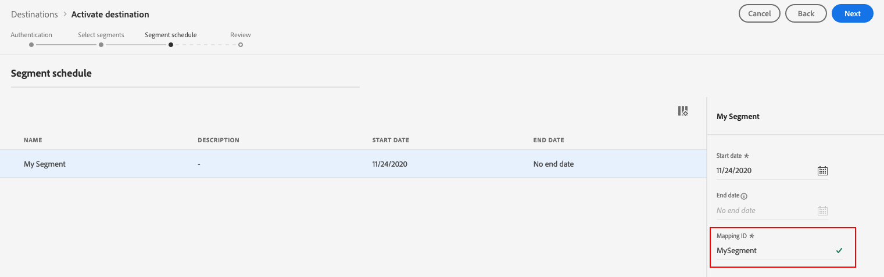

# Connexion [!DNL The Trade Desk]

## Présentation {#overview}

Utilisez ce connecteur de destination pour envoyer des données de profil à [!DNL The Trade Desk]. Ce connecteur envoie des données au point d’entrée propriétaire [!DNL The Trade Desk]. L’intégration entre Adobe Experience Platform et [!DNL The Trade Desk] ne prend pas en charge l’exportation de données vers le point d’entrée tiers [!DNL The Trade Desk].

[!DNL The Trade Desk] est une plateforme en libre-service permettant aux acheteurs d’annonces publicitaires d’exécuter des campagnes numériques de reciblage et de ciblage d’audience sur des sources d’affichage, de vidéo et d’inventaire mobile.

Pour envoyer des données de profil à [!DNL Trade Desk], vous devez d’abord vous connecter à la destination, comme décrit dans les sections suivantes de cette page.

## Cas d’utilisation {#use-cases}

En tant que spécialiste marketing, je souhaite pouvoir utiliser des audiences créées à partir d’[!DNL Trade Desk IDs] ou d’identifiants d’appareil pour créer des campagnes numériques de reciblage ou de ciblage d’audience.

## Identités prises en charge {#supported-identities}

[!DNL The Trade Desk] prend en charge l’activation des audiences en fonction des identités présentées dans le tableau ci-dessous. En savoir plus sur les [identités](/help/identity-service/features/namespaces.md).

| Identité | Description |
|---|---|
| GAID | [!DNL Google Advertising ID] |
| IDFA | [!DNL Apple ID for Advertisers] |
| ID de Trade Desk | ID d’annonceur dans la plateforme The Trade Desk |

{style="table-layout:auto"}

## Audiences prises en charge {#supported-audiences}

Cette section décrit les types d’audiences que vous pouvez exporter vers cette destination.

| Origine de l’audience | Pris en charge | Description |
|---------|----------|----------|
| [!DNL Segmentation Service] | ✓ | Audiences générées via Experience Platform [Segmentation Service](../../../segmentation/home.md). |
| Chargements personnalisés | ✓ | Audiences [importées](../../../segmentation/ui/audience-portal.md#import-audience) dans Experience Platform à partir de fichiers CSV. |

{style="table-layout:auto"}

## Type et fréquence d’exportation {#export-type-frequency}

Reportez-vous au tableau ci-dessous pour plus d’informations sur le type et la fréquence d’exportation des destinations.

| Élément | Type | Notes |
---------|----------|---------|
| Type d’exportation | **[!UICONTROL Export d’audience]** | Vous exportez tous les membres d’une audience vers la destination . |
| Fréquence des exportations | **[!UICONTROL Diffusion en continu]** | Les destinations de diffusion en continu sont des connexions basées sur l’API « toujours actives ». Dès qu’un profil est mis à jour dans Experience Platform en fonction de l’évaluation des audiences, le connecteur envoie la mise à jour en aval vers la plateforme de destination. En savoir plus sur les [destinations de diffusion en continu](/help/destinations/destination-types.md#streaming-destinations). |

{style="table-layout:auto"}

## Conditions préalables {#prerequisites}

>[!IMPORTANT]
>
>Si vous souhaitez créer votre première destination avec [!DNL The Trade Desk] sans jamais avoir activé la fonctionnalité de synchronisation des identifiants [ID](https://experienceleague.adobe.com/en/docs/id-service/using/id-service-api/methods/idsync) dans le service Experience Cloud ID par le passé (avec Adobe Audience Manager ou d’autres applications), contactez Adobe Consulting ou l’assistance clientèle pour activer la synchronisation des identifiants. Si vous avez configuré précédemment des intégrations [!DNL The Trade Desk] dans Audience Manager, les synchronisations d’identifiant que vous aviez configurées sont transférées vers Experience Platform.

## Se connecter à la destination {#connect}

>[!IMPORTANT]
> 
>Pour vous connecter à la destination, vous avez besoin des autorisations de contrôle d’accès **[!UICONTROL Afficher les destinations]** et **[!UICONTROL Gérer les destinations]** . Lisez la [présentation du contrôle d’accès](/help/access-control/ui/overview.md) ou contactez votre administrateur ou administratrice du produit pour obtenir les autorisations requises.

Pour vous connecter à cette destination, procédez comme décrit dans le [tutoriel sur la configuration des destinations](../../ui/connect-destination.md).

### Paramètres de connexion {#parameters}

Pendant la [configuration](../../ui/connect-destination.md) de cette destination, vous devez fournir les informations suivantes :

* **[!UICONTROL Nom]** : un nom par lequel vous reconnaîtrez cette destination à l’avenir.
* **[!UICONTROL Description]** : une description qui vous aidera à identifier cette destination à l’avenir.
* **[!UICONTROL Identifiant de compte]** : votre [!DNL Trade Desk] [!UICONTROL identifiant de compte].
* **[!UICONTROL Emplacement du serveur]** : demandez à votre représentant [!DNL Trade Desk] quel serveur régional vous devez utiliser. Vous trouverez ci-dessous les serveurs régionaux disponibles que vous pouvez choisir :
   * **[!UICONTROL Europe]**
   * **[!UICONTROL Singapour]**
   * **[!UICONTROL Tokyo]**
   * **[!UICONTROL Est de l’Amérique du Nord]**
   * **[!UICONTROL Ouest de l’Amérique du Nord]**
   * **[!UICONTROL Amérique latine]**

### Activer les alertes {#enable-alerts}

Vous pouvez activer les alertes pour recevoir des notifications sur le statut de votre flux de données vers votre destination. Sélectionnez une alerte dans la liste et abonnez-vous à des notifications concernant le statut de votre flux de données. Pour plus d’informations sur les alertes, consultez le guide sur l’[abonnement aux alertes des destinations dans l’interface utilisateur](../../ui/alerts.md).

Lorsque vous avez terminé de renseigner les détails sur votre connexion de destination, sélectionnez **[!UICONTROL Suivant]**.

## Activer des audiences vers cette destination {#activate}

>[!IMPORTANT]
> 
>* Pour activer les données, vous avez besoin des autorisations de contrôle d’accès **[!UICONTROL Afficher les destinations]**, **[!UICONTROL Activer les destinations]**, **[!UICONTROL Afficher les profils]** et **[!UICONTROL Afficher les segments]** . Lisez la [présentation du contrôle d’accès](/help/access-control/ui/overview.md) ou contactez votre administrateur ou administratrice du produit pour obtenir les autorisations requises.
>* Pour exporter des *identités*, vous devez disposer de l’autorisation de contrôle d’accès **[!UICONTROL Afficher le graphique d’identités]** .   {width="100" zoomable="yes"}

Voir [Activer les données d’audience vers des destinations d’export d’audiences en flux continu](../../ui/activate-segment-streaming-destinations.md) pour obtenir des instructions sur l’activation des audience vers cette destination.

Dans l’étape [Planning des audiences](../../ui/activate-segment-streaming-destinations.md#scheduling), vous devez mapper manuellement vos audiences à l’identifiant ou au nom convivial correspondant dans la plateforme de destination.

Lors du mappage des audiences, Adobe vous recommande d’utiliser le nom de l’audience Experience Platform ou une forme plus courte de celui-ci, pour plus de facilité d’utilisation. Cependant, l’identifiant ou le nom de l’audience dans la destination n’a pas besoin de correspondre à celui de votre compte Experience Platform. Toute valeur que vous insérez dans le champ de mappage est reflétée par la destination.

Si vous utilisez plusieurs mappages d’appareils (ID de cookie, [!DNL IDFA], [!DNL GAID]), veillez à utiliser la même valeur de mappage pour les trois mappages. [!DNL The Trade Desk] les regroupe tous en un seul segment, avec une répartition au niveau de l’appareil.

## Données exportées {#exported-data}

Pour vérifier si les données ont bien été exportées vers la destination [!DNL The Trade Desk], vérifiez votre compte [!DNL Trade Desk]. Si l’activation a réussi, les audiences sont renseignées dans votre compte.
