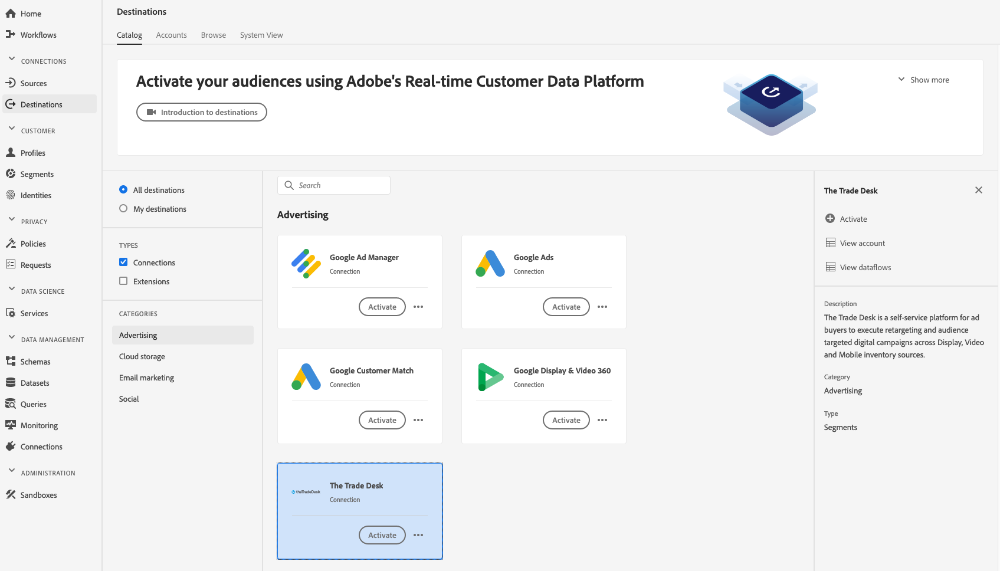

# [!DNL The Trade Desk] connexion

## Présentation {#overview}

[!DNL The Trade Desk] destination vous aide à envoyer des données de profil à  [!DNL The Trade Desk].

[!DNL The Trade Desk] est une plateforme en libre-service permettant aux acheteurs d’annonces publicitaires d’exécuter des reciblages et d’audience de campagnes numériques ciblées sur l’affichage, la vidéo et les sources d’inventaire mobiles.

Pour envoyer des données de profil à [!DNL Trade Desk], vous devez d&#39;abord vous connecter à la destination.

## Cas d’utilisation {#use-cases}

En tant que spécialiste du marketing, je souhaite pouvoir utiliser des segments reposant sur [!DNL Trade Desk IDs] ou des ID d’appareil pour créer des campagnes numériques ciblées de reciblage ou d’audience.

## Identités prises en charge {#supported-identities}

[!DNL The Trade Desk] prend en charge l&#39;activation des identités décrites dans le tableau ci-dessous. En savoir plus sur les [identités](/help/identity-service/namespaces.md).

| Identité de cible | Description |
|---|---|
| GAID | [!DNL Google Advertising ID] |
| IDFA | [!DNL Apple ID for Advertisers] |
| ID bureau commercial | Identifiant publicitaire sur la plate-forme Trade Desk |

## Type d&#39;exportation {#export-type}

**[!DNL Segment export]** - vous exportez tous les membres d&#39;un segment (audience) vers la destination.

## Conditions préalables {#prerequisites}

Si vous souhaitez créer votre première destination avec [!DNL The Trade Desk] et que vous n’avez pas activé la fonctionnalité de synchronisation des identifiants [ID](https://experienceleague.adobe.com/docs/id-service/using/id-service-api/methods/idsync.html) dans le service d’identification des Experience Cloud par le passé (avec Adobe Audience Manager ou d’autres applications), contactez le service de conseil en Adobe ou le service à la clientèle pour activer la synchronisation des identifiants. Si vous aviez précédemment configuré des intégrations [!DNL The Trade Desk] dans l&#39;Audience Manager, les synchronisations d&#39;ID que vous avez configurées sont transférées à Platform.

## Se connecter à la destination {#connect-destination}

Dans **[!UICONTROL Connexions]** > **[!UICONTROL Destinations]**, sélectionnez [!DNL The Trade Desk], puis **[!UICONTROL Configurer]**.

Si une connexion avec cette destination existe déjà, vous pouvez voir un bouton **[!UICONTROL Activer]** sur la carte de destination. Pour plus d&#39;informations sur la différence entre **[!UICONTROL Activer]** et **[!UICONTROL Configurer]**, consultez la section [Catalogue](../../ui/destinations-workspace.md#catalog) de la documentation de l&#39;espace de travail de destination.

## Étape d&#39;authentification {#authentication}

À l’étape **[!UICONTROL Authentification]**, vous devez saisir les détails de la connexion [!DNL The Trade Desk] :

* **[!UICONTROL Nom]** : Nom par lequel vous reconnaîtrez cette destination dans le futur.
* **[!UICONTROL Description]** : Description qui vous aidera à identifier cette destination dans le futur.
* **[!UICONTROL ID]** du compte : Votre ID [!DNL Trade Desk] de compte.
* **[!UICONTROL Emplacement]** du serveur : Demandez à votre  [!DNL Trade Desk] représentant quel serveur régional vous devriez utiliser. Voici les serveurs régionaux disponibles :

   * **[!UICONTROL Europe]**
   * **[!UICONTROL Singapour]**
   * **[!UICONTROL Tokyo]**
   * **[!UICONTROL Amérique du Nord Est]**
   * **[!UICONTROL Amérique du Nord Ouest]**
   * **[!UICONTROL Amérique latine]**

* **[!UICONTROL Action]** marketing : Les actions marketing indiquent l’intention d’exporter les données vers la destination. Vous pouvez choisir parmi des actions marketing définies par Adobe ou créer votre propre action marketing. Pour plus d’informations sur les actions marketing, voir la page [Gouvernance des données dans Adobe Experience Platform](../../../data-governance/policies/overview.md). Pour plus d&#39;informations sur les actions marketing définies par l&#39;Adobe, consultez la [Présentation des stratégies d&#39;utilisation des données](../../../data-governance/policies/overview.md).

Cliquez sur **[!UICONTROL Créer une destination]**. Votre destination est maintenant créée. Vous pouvez cliquer sur [!UICONTROL Enregistrer et quitter] si vous souhaitez activer les segments ultérieurement, ou vous pouvez sélectionner [!UICONTROL Suivant] pour continuer le processus et sélectionner les segments à activer. Dans les deux cas, consultez la section suivante, [Activer les segments](#activate-segments), pour le reste du flux de travail.

## Activation des segments {#activate-segments}

Pour obtenir des informations sur le processus d’activation des segments, voir [Activer les profils et les segments à une destination](../../ui/activate-destinations.md#select-attributes).

À l’étape [Planification des segments](../../ui/activate-destinations.md#segment-schedule), vous devez mapper manuellement vos segments à leur identifiant ou nom convivial correspondant dans la destination.

Lors du mappage de segments, nous vous recommandons d’utiliser le nom de segment [!DNL Platform] ou une forme plus courte de celui-ci, pour en faciliter l’utilisation. Cependant, l’ID ou le nom du segment dans votre destination ne doit pas nécessairement correspondre à celui de votre compte [!DNL Platform]. Toute valeur que vous insérez dans le champ de mappage est répercutée par la destination.

Si vous utilisez plusieurs mappages de périphériques (identifiants de cookie, [!DNL IDFA], [!DNL GAID]), veillez à utiliser la même valeur de mappage pour les trois mappages. [!DNL The Trade Desk] les agrégat tous dans un seul segment, avec une ventilation au niveau du périphérique.

## Données exportées {#exported-data}

Pour vérifier si les données ont bien été exportées vers la destination [!DNL The Trade Desk], vérifiez votre compte [!DNL Trade Desk]. Si l’activation a réussi, les audiences sont renseignées dans votre compte.
