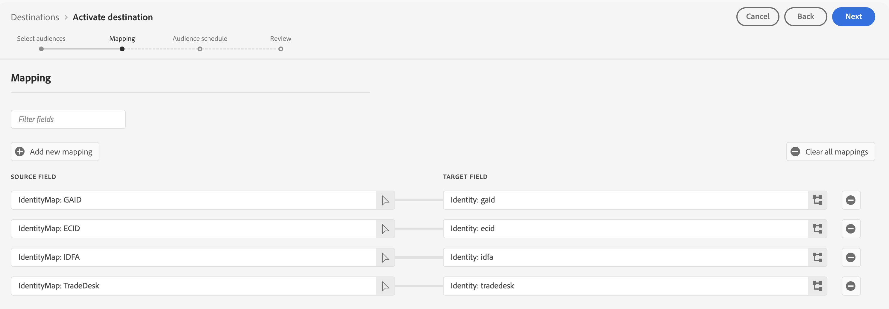

# Connexion [!DNL The Trade Desk]

## Vue d’ensemble {#overview}

>[!IMPORTANT]
>
> Suite à la [mise à niveau interne](../../../release-notes/2025/july-2025.md#destinations) du service de destinations de juillet 2025, vous remarquerez peut-être une **diminution du nombre de profils activés** dans vos flux de données à [!DNL The Trade Desk].
> Cette baisse est due à l’amélioration de la visibilité de la surveillance. Les profils sans ECID sont désormais correctement comptabilisés comme déposés dans les mesures d’activation. Pour plus d’informations, consultez la section [mappage obligatoire](#mandatory-mappings) de cette page.
>
>**Changements :**
>
>* Le service de destinations signale désormais correctement lorsque des profils sans ECID sont supprimés de l’activation.
>* **Important :** profils sans ECID n’ont jamais été [!DNL The Trade Desk] avant même cette mise à niveau. L’intégration a toujours nécessité un ECID. Cette mise à niveau corrige un bug qui empêchait auparavant la visibilité de ces abandons dans vos mesures.
>
>**Ce que vous devez faire**
>
>* Vérifiez les données de votre audience pour vous assurer que les profils possèdent des valeurs ECID valides.
>* Surveillez vos mesures d’activation pour vérifier le nombre de profils attendu. Des nombres plus faibles reflètent des rapports précis, pas un changement de comportement de destination.

Utilisez ce connecteur de destination pour envoyer des données de profil à [!DNL The Trade Desk]. Ce connecteur envoie des données au point d’entrée propriétaire [!DNL The Trade Desk]. L’intégration entre Adobe Experience Platform et [!DNL The Trade Desk] ne prend pas en charge l’exportation de données vers le point d’entrée tiers [!DNL The Trade Desk].

[!DNL The Trade Desk] est une plateforme en libre-service permettant aux acheteurs d’annonces publicitaires d’exécuter des campagnes numériques de reciblage et de ciblage d’audience sur des sources d’affichage, de vidéo et d’inventaire mobile.

Pour envoyer des données de profil à [!DNL The Trade Desk], vous devez d’abord vous connecter à la destination, comme décrit dans les sections suivantes de cette page.

## Cas d’utilisation {#use-cases}

En tant que spécialiste marketing, je souhaite pouvoir utiliser des audiences créées à partir d’[!DNL Trade Desk IDs] ou d’identifiants d’appareil pour créer des campagnes numériques de reciblage ou de ciblage d’audience.

## Identités prises en charge {#supported-identities}

[!DNL The Trade Desk] prend en charge l’activation des audiences en fonction des identités présentées dans le tableau ci-dessous. En savoir plus sur les [identités](/help/identity-service/features/namespaces.md).

Vous trouverez ci-dessous les identités prises en charge par [!DNL The Trade Desk] destination. Ces identités peuvent être utilisées pour activer des audiences à [!DNL The Trade Desk].

Toutes les identités du tableau ci-dessous sont des mappages obligatoires.

| Identité cible | Description | Considérations |
|---|---|---|
| [!DNL GAID] | GOOGLE ADVERTISING ID | Sélectionnez l’identité cible GAID lorsque votre identité source est un espace de noms GAID. |
| [!DNL IDFA] | Identifiant Apple pour les annonceurs | Sélectionnez l’identité cible IDFA lorsque votre identité source est un espace de noms IDFA. |
| [!DNL ECID] | Experience Cloud ID | Cette identité est obligatoire pour que l’intégration fonctionne correctement, mais elle n’est pas utilisée pour l’activation de l’audience. |
| [!DNL Tradedesk] | [!DNL TDID] dans la plateforme [!DNL The Trade Desk] | Utilisez cette identité lors de l&#39;activation des audiences en fonction de l&#39;identifiant propriétaire de The Trade Desk. |

{style="table-layout:auto"}

## Audiences prises en charge {#supported-audiences}

Cette section décrit les types d’audiences que vous pouvez exporter vers cette destination.

| Origine de l’audience | Pris en charge | Description |
|---------|----------|----------|
| [!DNL Segmentation Service] | ✓ | Audiences générées via Experience Platform [Segmentation Service](../../../segmentation/home.md). |
| Chargements personnalisés | ✓ | Audiences [importées](../../../segmentation/ui/audience-portal.md#import-audience) dans Experience Platform à partir de fichiers CSV. |

{style="table-layout:auto"}

## Type et fréquence d’exportation {#export-type-frequency}

Reportez-vous au tableau ci-dessous pour plus d’informations sur le type et la fréquence d’exportation des destinations.

| Élément | Type | Notes |
|---------|----------|---------|
| Type d’exportation | **[!UICONTROL Audience export]** | Vous exportez tous les membres d’une audience vers la destination . |
| Fréquence des exportations | **[!UICONTROL Streaming]** | Les destinations de diffusion en continu sont des connexions basées sur l’API « toujours actives ». Dès qu’un profil est mis à jour dans Experience Platform en fonction de l’évaluation des audiences, le connecteur envoie la mise à jour en aval vers la plateforme de destination. En savoir plus sur les [destinations de diffusion en continu](/help/destinations/destination-types.md#streaming-destinations). |

{style="table-layout:auto"}

## Conditions préalables {#prerequisites}

>[!IMPORTANT]
>
>Si vous souhaitez créer votre première destination avec [!DNL The Trade Desk] sans jamais avoir activé la fonctionnalité de synchronisation des identifiants [ID](https://experienceleague.adobe.com/fr/docs/id-service/using/id-service-api/methods/idsync) dans le service Experience Cloud ID par le passé (avec Adobe Audience Manager ou d’autres applications), contactez Adobe Consulting ou l’assistance clientèle pour activer la synchronisation des identifiants. Si vous avez configuré précédemment des intégrations [!DNL The Trade Desk] dans Audience Manager, les synchronisations d’identifiant que vous aviez configurées sont transférées vers Experience Platform.

## Se connecter à la destination {#connect}

>[!IMPORTANT]
> 
>Pour vous connecter à la destination, vous avez besoin des **[!UICONTROL View Destinations]** et **[!UICONTROL Manage Destinations]** [autorisations de contrôle d’accès](/help/access-control/home.md#permissions). Lisez la [présentation du contrôle d’accès](/help/access-control/ui/overview.md) ou contactez votre administrateur ou administratrice du produit pour obtenir les autorisations requises.

Pour vous connecter à cette destination, procédez comme décrit dans le [tutoriel sur la configuration des destinations](../../ui/connect-destination.md).

### Paramètres de connexion {#parameters}

Pendant la [configuration](../../ui/connect-destination.md) de cette destination, vous devez fournir les informations suivantes :

* **[!UICONTROL Name]** : nom par lequel vous reconnaîtrez cette destination à l’avenir.
* **[!UICONTROL Description]** : une description qui vous aidera à identifier cette destination à l’avenir.
* **[!UICONTROL Account ID]** : votre [!DNL The Trade Desk] [!UICONTROL Account ID].
* **[!UICONTROL Server Location]** : demandez à votre représentant [!DNL The Trade Desk] quel serveur régional vous devez utiliser. Vous trouverez ci-dessous les serveurs régionaux disponibles que vous pouvez choisir :

   * **[!UICONTROL APAC]**
   * **[!UICONTROL China]**
   * **[!UICONTROL Tokyo]**
   * **[!UICONTROL UK/EU]**
   * **[!UICONTROL US East Coast]**
   * **[!UICONTROL US West Coast]**

### Activer les alertes {#enable-alerts}

Vous pouvez activer les alertes pour recevoir des notifications sur le statut de votre flux de données vers votre destination. Sélectionnez une alerte dans la liste et abonnez-vous à des notifications concernant le statut de votre flux de données. Pour plus d’informations sur les alertes, consultez le guide sur l’[abonnement aux alertes des destinations dans l’interface utilisateur](../../ui/alerts.md).

Lorsque vous avez terminé de renseigner les détails sur votre connexion de destination, sélectionnez **[!UICONTROL Next]**.

## Activer des audiences vers cette destination {#activate}

>[!IMPORTANT]
> 
>* Pour activer les données, vous avez besoin des autorisations de contrôle d’accès **[!UICONTROL View Destinations]**, **[!UICONTROL Activate Destinations]**, **[!UICONTROL View Profiles]** et **[!UICONTROL View Segments]** [Access control](/help/access-control/home.md#permissions). Lisez la [présentation du contrôle d’accès](/help/access-control/ui/overview.md) ou contactez votre administrateur ou administratrice du produit pour obtenir les autorisations requises.
>* Pour exporter des *identités*, vous devez disposer de l’autorisation de contrôle d’accès **[!UICONTROL View Identity Graph]**&#x200B;[&#128279;](/help/access-control/home.md#permissions).   {width="100" zoomable="yes"}

Voir [Activer les données d’audience vers des destinations d’export d’audiences en flux continu](../../ui/activate-segment-streaming-destinations.md) pour obtenir des instructions sur l’activation des audience vers cette destination.

Dans l’étape [Planning des audiences](../../ui/activate-segment-streaming-destinations.md#scheduling), vous devez mapper manuellement vos audiences à l’identifiant ou au nom convivial correspondant dans la plateforme de destination.

Lors du mappage des audiences, Adobe vous recommande d’utiliser le nom de l’audience Experience Platform ou une forme plus courte de celui-ci, pour plus de facilité d’utilisation. Cependant, l’identifiant ou le nom de l’audience dans la destination n’a pas besoin de correspondre à celui de votre compte Experience Platform. Toute valeur que vous insérez dans le champ de mappage est reflétée par la destination.

### Mappages obligatoires {#mandatory-mappings}

>[!CONTEXTUALHELP]
>id="platform_destinations_required_mappings_ttd"
>title="Jeux de mappages préconfigurés"
>abstract="Nous avons préconfiguré ces quatre jeux de mappages pour vous. Lorsque vous activez des données vers The Trade Desk, les profils qualifiés pour les audiences activées n’ont pas nécessairement besoin que les quatre identités soient présentes sur les profils, car cette destination fonctionnera avec l’une des identités cibles affichées ici. En savoir plus sur les &lt;a href= »https://experienceleague.adobe.com/fr/docs/experience-platform/destinations/catalog/advertising/tradedesk#preconfigured-mappings« >mappages préconfigurés</a>"

Toutes les identités cibles décrites dans la section [identités prises en charge](#supported-identities) doivent être mappées à l’étape de mappage du workflow d’activation de l’audience. Cela inclut :

* [!DNL GAID] (Google Advertising ID)
* [!DNL IDFA] (Apple ID pour les annonceurs)
* [!DNL ECID] (Experience Cloud ID)
* [!DNL The Trade Desk ID]

Le mappage de toutes les identités cibles garantit que l’activation peut correctement fractionner et diffuser des profils à l’aide de n’importe quelle identité présente. Cela ne signifie pas que toutes les identités doivent être présentes sur chaque profil.

Pour que l&#39;exportation vers The Trade Desk réussisse, un profil doit contenir :

* [!DNL ECID], et
* au moins un des éléments suivants : [!DNL GAID], [!DNL IDFA] ou [!DNL The Trade Desk ID]

Exemples :

* [!DNL ECID] uniquement : non exporté
* [!DNL ECID] + [!DNL The Trade Desk ID] : exporté
* [!DNL ECID] + [!DNL IDFA] : exporté
* [!DNL ECID] + [!DNL GAID] : exporté
* [!DNL IDFA] + [!DNL The Trade Desk ID] (pas de [!DNL ECID]) : non exporté

>[!NOTE]
> 
>Suite à la mise à niveau de [juillet 2025](/help/release-notes/2025/july-2025.md#destinations) vers le service de destinations, les profils manquants [!DNL ECID] désormais correctement signalés comme abandonnés dans les mesures d’activation. Cela a toujours été le comportement de l’intégration (les profils sans [!DNL ECID] n’ont jamais atteint [!DNL The Trade Desk]), mais les abandons sont désormais correctement visibles dans la surveillance de votre flux de données. Un nombre d’activations plus faible reflète des rapports précis, et non un changement de fonctionnalité de destination.

## Données exportées {#exported-data}

Pour vérifier si les données ont bien été exportées vers la destination [!DNL The Trade Desk], vérifiez votre compte [!DNL The Trade Desk]. Si l’activation a réussi, les audiences sont renseignées dans votre compte.
