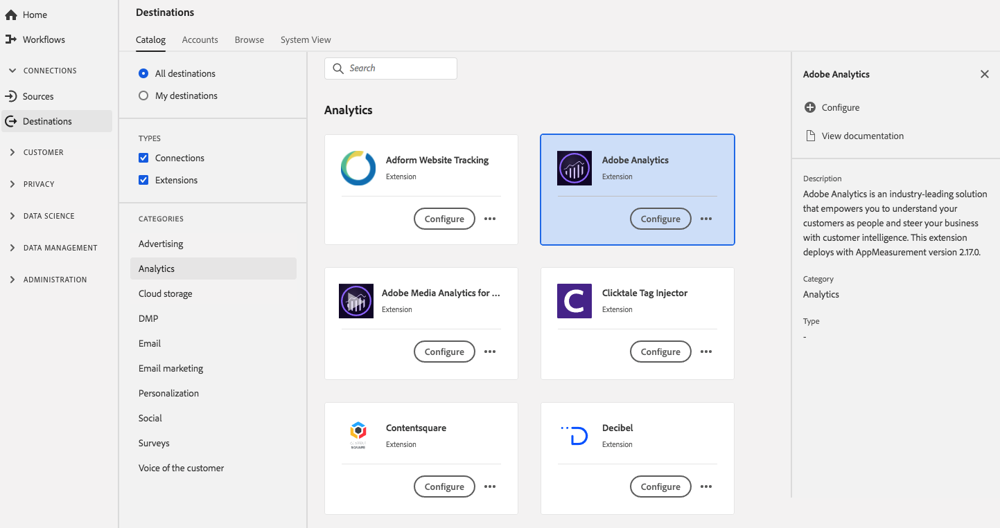

# Extension Adobe Analytics {#adobe-analytics-extension}

## Présentation {#overview}

Adobe Analytics est une solution de pointe qui vous permet de comprendre vos clients en tant que personnes et d’orienter votre activité grâce aux renseignements sur vos clients.

 Analytics est une extension d’analyse de la plateforme de données clients en temps réel d’Adobe. Pour plus d’informations sur les fonctionnalités de l’extension, consultez la page de l’extension dans [Adobe Exchange](https://exchange.adobe.com/experiencecloud.details.100156.html).

Cette destination est une [!DNL Adobe Experience Platform Launch] extension. For more information about how [!DNL Platform Launch] extensions work in Real-time CDP, see [Experience Platform Launch extensions overview](../launch-extensions/overview.md).

## Conditions préalables  {#prerequisites}

Cette extension est disponible dans le catalogue Destinations pour tous les clients qui ont acheté du CDP en temps réel.

To use this extension, you need access to [!DNL Experience Platform Launch]. [!DNL Experience Platform Launch] est proposé aux clients de Adobe Experience Cloud en tant que fonctionnalité à valeur ajoutée incluse. Contact your organization administrator to get access to [!DNL Launch] and ask them to grant you the **[!UICONTROL manage_properties]** permission so you can install extensions.

## Installation de l’extension {#install-extension}

Pour installer l’extension Adobe Analytics :

In the [Real-time CDP interface](http://platform.adobe.com/), go to **[!UICONTROL Destinations]** > **[!UICONTROL Catalog]**.

Sélectionnez l’extension dans le catalogue ou utilisez la barre de recherche.

Click on the destination to highlight it, then select **[!UICONTROL Configure]** in the right rail. If the **[!UICONTROL Configure]** control is greyed out, you are missing the **[!UICONTROL manage_properties]** permission. Voir les [Conditions préalables](#prerequisites).

In the **[!UICONTROL Select available Platform Launch property]** window, select the [!DNL Platform Launch] property in which you want to install the extension. Vous pouvez aussi créer une nouvelle propriété dans [!DNL Platform Launch]. Une propriété est un ensemble de règles, d’éléments de données, d’extensions configurées, d’environnements et de bibliothèques. Pour en savoir plus sur les propriétés, consultez la [section de la page Propriétés](https://experienceleague.adobe.com/docs/launch/using/reference/admin/companies-and-properties.html#properties-page) de la documentation de [!DNL Launch]

The workflow takes you to [!DNL Platform Launch] to complete the installation.

Pour plus d’informations sur les options de configuration de l’extension, consultez la [page de l’extension Adobe Analytics](https://experienceleague.adobe.com/docs/launch-learn/implementing-in-websites-with-launch/implement-solutions/analytics.html) dans la documentation Experience [!DNL Launch]

You can also install the extension directly in the [Adobe Experience Platform Launch interface](https://launch.adobe.com/). Consultez la section [Ajout d’une nouvelle extension](https://experienceleague.adobe.com/docs/launch/using/reference/manage-resources/extensions/overview.html?lang=en#add-a-new-extension) de la documentation de [!DNL Platform Launch]

## Utilisation de l’extension {#how-to-use}

Une fois que vous avez installé l’extension, vous pouvez commencer à configurer des règles pour cette extension directement dans [!DNL Platform Launch].

In [!DNL Platform Launch], you can set up rules for your installed extensions to send event data to the extension destination only in certain situations. Pour plus d’informations sur la configuration de règles pour vos extensions, consultez la [documentation des règles](https://experienceleague.adobe.com/docs/launch/using/reference/manage-resources/rules.html).

## Configuration, mise à niveau et suppression de l’extension {#configure-upgrade-delete}

You can configure, upgrade, and delete extensions in the [!DNL Platform Launch] interface.

>[!TIP]
>
>If the extension is already installed on one of your properties, the Real-time CDP UI still displays **[!UICONTROL Install]** for the extension. Démarrez le workflow d’installation comme décrit dans [Installer l’extension](#install-extension) pour accéder à et configurer ou supprimer votre extension.[!DNL Platform Launch]

Pour mettre à niveau votre extension, consultez la section [Mise à niveau d’extension](https://experienceleague.adobe.com/docs/launch/using/reference/manage-resources/extensions/extension-upgrade.html) dans la documentation de [!DNL Platform Launch]

