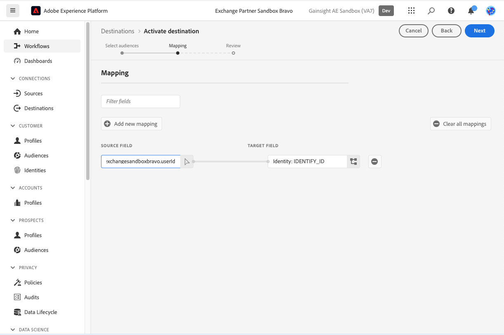
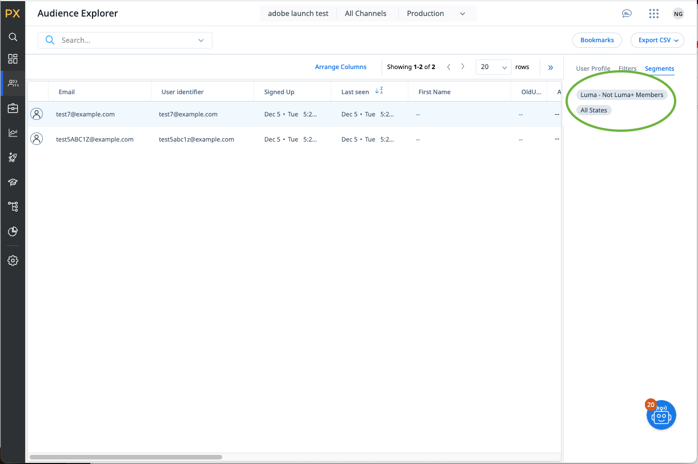

# Connexion de Gainsight PX {#gainsight-px}

## Vue d’ensemble {#overview}

[[!DNL Gainsight PX]](https://www.gainsight.com/product-experience/) est une plateforme d’expérience de produit qui permet aux équipes produit de comprendre comment les utilisateurs utilisent leurs produits, collectent des commentaires et créent des engagements in-app tels que des consultations produit pour stimuler l’intégration des utilisateurs et l’adoption des produits.

>[!IMPORTANT]
>
>Le connecteur de destination et la page de documentation sont créés et conservés par l’équipe *Gainsight PX*. Pour toute question ou demande de mise à jour, contactez-les directement à l’adresse *`pxsupport@gainsight.com`*.

## Cas d’utilisation {#use-cases}

Pour vous aider à mieux comprendre comment et à quel moment utiliser la destination *Gainsight PX*, voici des exemples de cas d’utilisation que les clients Adobe Experience Platform peuvent résoudre à l’aide de cette destination.

### Ciblage des engagements In-App {#targeting-in-app-engagements}

Une société SaaS souhaite impliquer ses clients via un guide In-App construit sur Gainsight PX. Une audience pour recevoir cet engagement a été créée sur Adobe Experience Platform. La destination Gainsight PX reçoit l’audience et la rend disponible dans l’environnement Gainsight PX.

## Conditions préalables {#prerequisites}

* Contactez l’équipe d’assistance [!DNL Gainsight] et demandez l’activation de fonctionnalités de segments externes pour votre abonnement.
* Générez une valeur secrète OAuth pour votre abonnement PX, à l’aide du bouton **[!UICONTROL Générer un nouveau secret]** au bas de la [&#x200B; page Détails de la société](https://app.aptrinsic.com/settings/subscription).
  

## Identités prises en charge {#supported-identities}

Gainsight PX prend en charge l’activation des identités décrites dans le tableau ci-dessous. En savoir plus sur les [identités](../../../identity-service/features/namespaces.md).

| Identité cible | Description |
|---|----|
| Identifiant | Identifiant utilisateur commun qui identifie de manière unique un utilisateur dans Gainsight PX et Adobe Experience Platform |

{style="table-layout:auto"}

## Audiences prises en charge {#supported-audiences}

Cette section décrit le type d’audience que vous pouvez exporter vers cette destination.

| Origine de l’audience | Pris en charge | Description |
|---|---|---|
| [!DNL Segmentation Service] | ✓ | Audiences générées par l’Experience Platform [Segmentation Service](../../../segmentation/home.md). |
| Chargements personnalisés | X | Audiences [importées](../../../segmentation/ui/audience-portal.md#import-audience) dans Experience Platform à partir de fichiers CSV. |

{style="table-layout:auto"}

## Type et fréquence d’exportation {#export-type-frequency}

Reportez-vous au tableau ci-dessous pour plus d’informations sur le type et la fréquence d’exportation des destinations.

| Élément | Type | Notes |
|---|---|---|
| Type d’exportation | **[!UICONTROL Exportation des segments]** | Vous exportez tous les profils membres d’une audience ainsi que les identifiants (nom, numéro de téléphone ou autres) utilisés dans la destination [!DNL Gainsight PX]. |
| Fréquence des exportations | **[!UICONTROL Diffusion en continu]** | Les destinations de diffusion en continu sont des connexions basées sur l’API « toujours actives ». Lorsqu’un profil est mis à jour en Experience Platform en fonction de l’évaluation de l’audience, le connecteur envoie la mise à jour en aval vers la plateforme de destination. En savoir plus sur les [destinations de diffusion en continu](/help/destinations/destination-types.md#streaming-destinations). |

{style="table-layout:auto"}

## Se connecter à la destination {#connect}

>[!IMPORTANT]
>
>Pour vous connecter à la destination, vous devez disposer de l’[autorisation de contrôle d’accès](/help/access-control/home.md#permissions) **[!UICONTROL Gérer les destinations]**. Lisez la [présentation du contrôle d’accès](/help/access-control/ui/overview.md) ou contactez votre administrateur de produit pour obtenir les autorisations requises.

Pour vous connecter à cette destination, procédez comme décrit dans le [tutoriel sur la configuration des destinations](../../ui/connect-destination.md). Dans le workflow de configuration des destinations, renseignez les champs répertoriés dans les deux sections ci-dessous.

### S’authentifier auprès de la destination {#authenticate}

Pour vous authentifier à la destination, renseignez les champs requis et sélectionnez **[!UICONTROL Se connecter à la destination]**.

* **[!UICONTROL Mot de passe]** : mot de passe utilisé pour se connecter à [[!DNL Gainsight PX]](https://app.aptrinsic.com)
* **[!UICONTROL ID client]** : ID d’abonnement PX Gainsight sur la [&#x200B; page Détails de la société &#x200B;](https://app.aptrinsic.com/settings/subscription)
* **[!UICONTROL Client secret]** : secret OAuth généré au bas de la [&#x200B; page Détails de la société &#x200B;](https://app.aptrinsic.com/settings/subscription) dans l’interface utilisateur de [!DNL Gainsight PX].
* **[!UICONTROL Nom d’utilisateur]** : adresse électronique utilisée pour se connecter à l’interface utilisateur [[!DNL Gainsight PX]](https://app.aptrinsic.com)

### Renseigner les détails de la destination {#destination-details}

Pour configurer les détails de la destination, renseignez les champs obligatoires et facultatifs ci-dessous. Un astérisque situé en regard d’un champ de l’interface utilisateur indique que le champ est obligatoire.

* **[!UICONTROL Nom]** : un nom par lequel vous reconnaîtrez cette destination à l’avenir.
* **[!UICONTROL Description]** : une description qui vous aidera à identifier cette destination à l’avenir.

Lorsque vous avez terminé de renseigner les détails sur votre connexion de destination, sélectionnez **[!UICONTROL Suivant]**.

## Activer des segments vers cette destination {#activate}

>[!IMPORTANT]
>
>* Pour activer les données, vous avez besoin des [autorisations de contrôle d’accès](/help/access-control/home.md#permissions) pour les fonctions **[!UICONTROL Gérer les destinations]**, **[!UICONTROL Activer les destinations]**, **[!UICONTROL Afficher les profils]**, et **[!UICONTROL Afficher les segments]**. Lisez la [présentation du contrôle d’accès](/help/access-control/ui/overview.md) ou contactez votre administrateur de produit pour obtenir les autorisations requises.
>* Pour exporter des *identités*, vous avez besoin de l&#39;autorisation **[!UICONTROL Afficher le graphique d&#39;identités]** [&#128279;](/help/access-control/home.md#permissions).   {width="100" zoomable="yes"}

Consultez [Activer les profils et les segments vers les destinations d’exportation de segments de diffusion en continu](/help/destinations/ui/activate-segment-streaming-destinations.md) pour obtenir des instructions sur l’activation des segments d’audience vers cette destination.

### Mapping d’identités {#map}

Cette destination prend en charge le mappage des attributs de profil et des espaces de noms d’identité. Le mapping de ciblage doit toujours être l’espace de noms d’identité **[!UICONTROL IDENTIFY_ID]**.

Consultez les exemples ci-dessous pour mieux comprendre comment configurer le mappage.

#### Mappage d’un attribut de profil {#map-profile-attribute}

Dans l’exemple ci-dessous, le champ source est un attribut de profil XDM qui est mappé à l’espace de noms cible IDENTIFY_ID.

#### Mappage d’un espace de noms d’identité {#map-identity-namespace}

Dans l’exemple ci-dessous, le champ source est un espace de noms d’identité (**[!UICONTROL ECID]**) qui est mappé à l’espace de noms cible **[!UICONTROL IDENTIFY_ID]**.

## Données exportées / Valider l’exportation des données {#exported-data}

Les données de segmentation sont diffusées de l’Experience Platform vers Gainsight PX.

Les métadonnées de segment sont visibles dans l’écran Segments de l’interface utilisateur de [!DNL Gainsight PX].

Les informations sur l’appartenance aux segments sont visibles dans l’onglet Segments de l’écran de l’explorateur d’audiences de l’interface utilisateur [!DNL Gainsight PX].

## Utilisation et gouvernance des données {#data-usage-governance}

Lors de la gestion de vos données, toutes les destinations [!DNL Adobe Experience Platform] se conforment aux politiques d’utilisation des données. Pour obtenir des informations détaillées sur la manière dont [!DNL Adobe Experience Platform] applique la gouvernance des données, consultez la [Présentation de la gouvernance des données](/help/data-governance/home.md).
