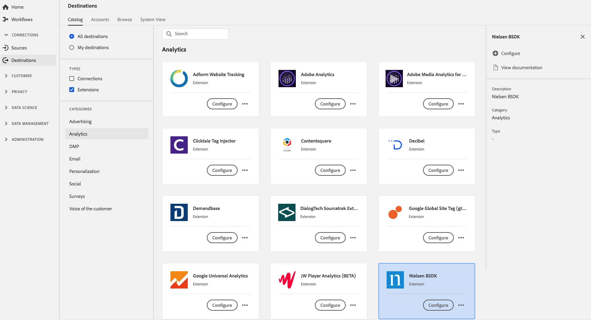

# [!DNL Nielsen BSDK] Extension {#nielsen-bsdk-extension}

## Présentation {#overview}

[!DNL Nielsen Digital SDK] l’extension launch offre la mesure de l’audience via les produits de mesure numérique suivants :

DCR : une solution de mesure qui permet de mesurer quotidiennement le contenu numérique non linéaire, y compris le contenu comportant des publicités, et d’obtenir une vue exhaustive de la consommation du contenu numérique par l’audience sur les ordinateurs de bureau, les téléphones portables, les tablettes et les appareils connectés.

DTVR : cette solution tient compte du visionnage linéaire de la télévision sur les ordinateurs de bureau et les appareils mobiles pour les sources de programmation participantes. Il s’agit de la première solution ayant obtenu une accréditation du MRC pour sa contribution à la mesure de l’audience télévisuelle pour les programmes visionnés sur des ordinateurs et des appareils mobiles.

[!DNL Nielsen BSDK] est une extension d’analyse dans Adobe Experience Platform. Pour plus d’informations sur les fonctionnalités de l’extension, consultez la page de l’extension dans [Adobe Exchange](https://exchange.adobe.com/experiencecloud.details.101361.html).

Cette destination est une extension Adobe Experience Platform Launch. Pour plus d’informations sur le fonctionnement des extensions de Platform launch dans Platform, voir [Présentation des extensions Adobe Experience Platform Launch](../launch-extensions/overview.md).

## Conditions préalables  {#prerequisites}

Cette extension est disponible dans le catalogue [!DNL Destinations] pour tous les clients qui ont acheté Platform.

Pour utiliser cette extension, vous devez accéder à Adobe Experience Platform Launch.  Platform Launch est une fonctionnalité gratuite intégrée à Adobe Experience Cloud. Contactez l’administrateur de votre organisation pour accéder à Platform launch et demandez-lui de vous accorder l’autorisation **[!UICONTROL manage_properties]** afin que vous puissiez installer les extensions.

## Installation de l’extension {#install-extension}

Pour installer l’extension [!DNL Nielsen BSDK] :

Dans l’ [interface de Platform](http://platform.adobe.com/), accédez à **[!UICONTROL Destinations]** > **[!UICONTROL Catalogue]**.

Sélectionnez l’extension dans le catalogue ou utilisez la barre de recherche.

Cliquez sur la destination pour la mettre en surbrillance, puis sélectionnez **[!UICONTROL Configurer]** dans le rail de droite. Si le contrôle **[!UICONTROL Configure]** est grisé, vous ne disposez pas de l’autorisation **[!UICONTROL manage_properties]**. Voir les [Conditions préalables](#prerequisites).

Dans la fenêtre **[!UICONTROL Sélectionner la propriété de Platform launch disponible]** , sélectionnez la propriété de Platform launch dans laquelle vous souhaitez installer l’extension. Vous avez également la possibilité de créer une propriété dans Platform launch. Une propriété est un ensemble de règles, d’éléments de données, d’extensions configurées, d’environnements et de bibliothèques. Découvrez les propriétés dans la [section de la page Propriétés](../../../tags/ui/administration/companies-and-properties.md#properties-page) de la documentation du Platform launch.

Le workflow vous permet de réaliser l’installation par Platform launch.

Pour plus d’informations sur les options de configuration d’extension et la prise en charge de l’installation, consultez la [page consacrée à Nielsen BSDK sur Adobe Exchange](https://exchange.adobe.com/experiencecloud.details.101361.html).

Vous pouvez également installer l’extension directement dans l’[interface Adobe Experience Platform Launch](https://launch.adobe.com/). Voir [Ajouter une nouvelle extension](../../../tags/ui/managing-resources/extensions/overview.md#add-a-new-extension) dans la documentation du Platform launch.

## Utilisation de l’extension {#how-to-use}

Une fois que vous avez installé l’extension, vous pouvez commencer à configurer des règles pour celle-ci directement dans Platform launch.

Dans Platform launch, vous pouvez configurer des règles pour vos extensions installées afin d’envoyer des données d’événement vers la destination de l’extension uniquement dans certains cas. Pour plus d’informations sur la configuration de règles pour vos extensions, consultez la [documentation des règles](../../../tags/ui/managing-resources/rules.md).

## Configuration, mise à niveau et suppression de l’extension {#configure-upgrade-delete}

Vous pouvez configurer, mettre à niveau et supprimer des extensions dans l’interface de Platform launch.

>[!TIP]
>
>Si l’extension est déjà installée sur l’une de vos propriétés, l’interface utilisateur de Platform affiche toujours **[!UICONTROL Install]** pour l’extension. Lancez le workflow d’installation comme décrit dans la section [Installer l’extension](#install-extension) pour accéder au Platform launch et configurer ou supprimer votre extension.

Pour mettre à niveau votre extension, voir [Mise à niveau de l’extension](../../../tags/ui/managing-resources/extensions/extension-upgrade.md) dans la documentation du Platform launch.
