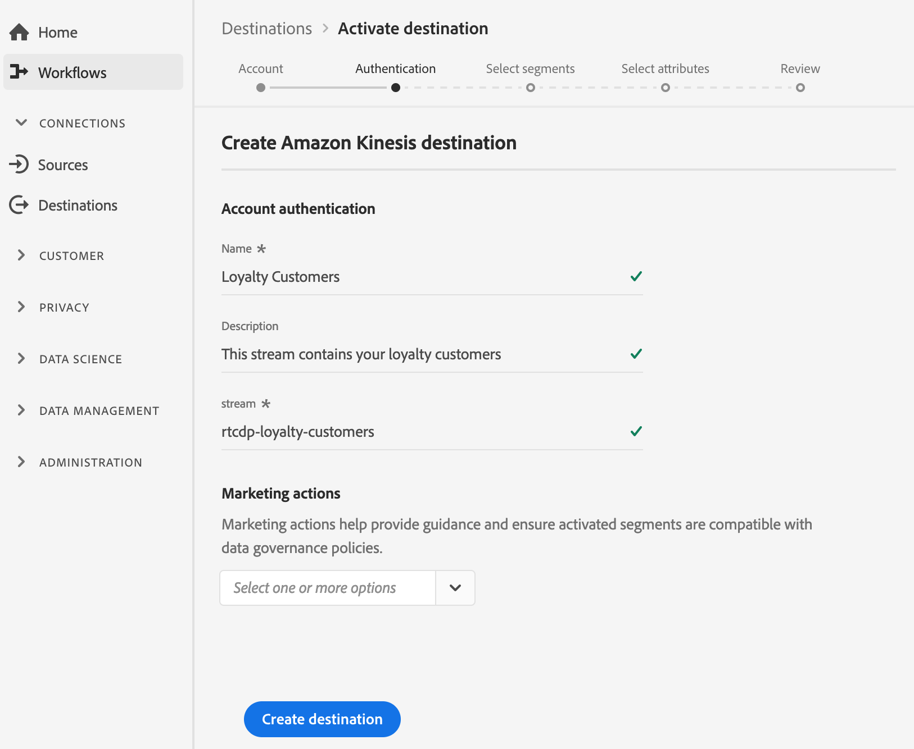

# (Version bêta) [!DNL Amazon Kinesis] connexion

## Présentation {#overview}

>[!IMPORTANT]
>
>La destination [!DNL Amazon Kinesis] de Platform est actuellement en version bêta. La documentation et les fonctionnalités peuvent changer.

Le service [!DNL Kinesis Data Streams] de [!DNL Amazon Web Services] vous permet de collecter et de traiter de larges flux d’enregistrements de données en temps réel.

Vous pouvez créer une connexion sortante en temps réel à votre stockage [!DNL Amazon Kinesis] pour diffuser des données depuis Adobe Experience Platform.

* Pour plus d’informations sur [!DNL Amazon Kinesis], consultez la [documentation Amazon](https://docs.aws.amazon.com/streams/latest/dev/introduction.html).
* Pour vous connecter à [!DNL Amazon Kinesis] par programmation, consultez le [tutoriel sur l’API des destinations de diffusion en continu](../../api/streaming-destinations.md).
* Pour vous connecter à [!DNL Amazon Kinesis] à l’aide de l’interface utilisateur de Platform, reportez-vous aux sections ci-dessous.


## Cas d’utilisation {#use-cases}

En utilisant des destinations de diffusion en continu telles que [!DNL Amazon Kinesis], vous pouvez facilement alimenter les événements de segmentation à valeur élevée et les attributs de profil associés dans vos systèmes de votre choix.

Par exemple, un prospect a téléchargé un livre blanc qui les qualifie en segment &quot;forte propension à convertir&quot;. En mappant le segment dans lequel le prospect est ajouté à la destination [!DNL Amazon Kinesis], vous recevrez cet événement dans [!DNL Amazon Kinesis]. Vous pouvez y utiliser une approche par vous-même et décrire la logique commerciale en plus de l’événement, comme vous le pensez, qui fonctionne le mieux avec vos systèmes informatiques d’entreprise.

## Type d’exportation {#export-type}

**Basé sur un profil**  : vous exportez tous les membres d’un segment, ainsi que les champs de schéma de votre choix (par exemple : adresse email, numéro de téléphone, nom), tel que sélectionné dans l’écran de sélection des attributs du workflow d’activation de  [destination](../../ui/activate-destinations.md#select-attributes).

## Autorisations [!DNL Amazon Kinesis] requises {#required-kinesis-permission}

Pour connecter et exporter des données vers vos flux [!DNL Amazon Kinesis], l’Experience Platform a besoin d’autorisations pour les actions suivantes :

* `kinesis:ListStreams`
* `kinesis:PutRecord`
* `kinesis:PutRecords`

Ces autorisations sont organisées via la console [!DNL Kinesis] et sont vérifiées par Platform une fois que vous avez configuré votre destination Kinesis dans l’interface utilisateur de Platform.

L’exemple ci-dessous illustre les droits d’accès minimaux requis pour exporter les données vers une destination [!DNL Kinesis].

```json
{
    "Version": "2012-10-17",
    "Statement": [
        {
            "Effect": "Allow",
            "Action": [
                "kinesis:ListStreams",
                "kinesis:PutRecord",
                "kinesis:PutRecords"
            ],
            "Resource": [
                "arn:aws:kinesis:us-east-2:901341027596:stream/*"
            ]
        }
    ]
}
```

| Propriété | Description |
| -------- | ----------- |
| `kinesis:ListStreams` | Action qui répertorie vos flux de données Kinesis Amazon. |
| `kinesis:PutRecord` | Action qui écrit un enregistrement de données unique dans un flux de données Kinesis. |
| `kinesis:PutRecords` | Action qui écrit plusieurs enregistrements de données dans un flux de données Kinesis au cours d’un seul appel. |

Pour plus d’informations sur le contrôle de l’accès aux flux de données [!DNL Kinesis], consultez le [[!DNL Kinesis] document](https://docs.aws.amazon.com/streams/latest/dev/controlling-access.html) suivant.

## Connexion à la destination {#connect-destination}

Voir [Processus des destinations de stockage dans le cloud ](./workflow.md)pour obtenir des instructions sur la connexion à vos destinations de stockage dans le cloud, y compris celles prises en charge par [!DNL Amazon].

Pour les destinations [!DNL Amazon Kinesis], saisissez les informations suivantes dans le workflow de création de destination :

## Étape du compte {#account-step}

* **[!DNL Amazon Web Services]clé d&#39;accès et clé** secrète : Dans  [!DNL Amazon Web Services], générez une  `access key - secret access key` paire pour accorder l’accès à Platform à votre  [!DNL Amazon Kinesis] compte. Pour en savoir plus, consultez la [documentation des services Web Amazon](https://docs.aws.amazon.com/IAM/latest/UserGuide/id_credentials_access-keys.html).
* **region** : Permet d’indiquer la  [!DNL Amazon Web Services] région vers laquelle les données de diffusion en continu doivent être envoyées.


## Étape d’authentification {#authentication-step}

* **Nom** : Attribuez un nom à votre connexion pour  [!DNL Amazon Kinesis]
* **Description** : Fournissez une description de votre connexion à  [!DNL Amazon Kinesis].
* **stream** : Indiquez le nom d’un flux de données existant dans votre  [!DNL Amazon Kinesis] compte. Platform exportera les données vers ce flux.
* **[!UICONTROL Actions]** marketing : Les actions marketing indiquent l’intention pour laquelle les données seront exportées vers la destination. Vous pouvez effectuer un choix parmi des actions marketing définies par l’Adobe ou créer votre propre action marketing. Pour plus d’informations sur les actions marketing, consultez la page [Gouvernance des données dans Adobe Experience Platform](../../../data-governance/policies/overview.md) . Pour plus d’informations sur les actions marketing définies par l’Adobe, consultez la [Présentation des stratégies d’utilisation des données](../../../data-governance/policies/overview.md).



<!--

>[!IMPORTANT]
>
>Platform needs `write` permissions on the bucket object where the export files will be delivered.

-->

## Activation des segments {#activate-segments}

Pour obtenir des informations sur le processus d’activation des segments, voir [Activer les profils et les segments à une destination](../../ui/activate-destinations.md).

## Données exportées {#exported-data}

Vos données [!DNL Experience Platform] exportées se trouvent dans [!DNL Amazon Kinesis] au format JSON. Par exemple, l’événement ci-dessous contient l’attribut de profil d’adresse électronique d’une audience qui s’est qualifiée pour un certain segment et qui a quitté un autre segment. Les identités de ce prospect sont ECID et email.

```json
{
  "person": {
    "email": "yourstruly@adobe.con"
  },
  "segmentMembership": {
    "ups": {
      "7841ba61-23c1-4bb3-a495-00d3g5fe1e93": {
        "lastQualificationTime": "2020-05-25T21:24:39Z",
        "status": "exited"
      },
      "59bd2fkd-3c48-4b18-bf56-4f5c5e6967ae": {
        "lastQualificationTime": "2020-05-25T23:37:33Z",
        "status": "existing"
      }
    }
  },
  "identityMap": {
    "ecid": [
      {
        "id": "14575006536349286404619648085736425115"
      },
      {
        "id": "66478888669296734530114754794777368480"
      }
    ],
    "email_lc_sha256": [
      {
        "id": "655332b5fa2aea4498bf7a290cff017cb4"
      },
      {
        "id": "66baf76ef9de8b42df8903f00e0e3dc0b7"
      }
    ]
  }
}
```


>[!MORELIKETHIS]
>
>* [Connexion à Amazon Kinesis et activation des données à l’aide de l’API Flow Service](../../api/streaming-destinations.md)
* [Destination des centres d’événements Azure](./azure-event-hubs.md)
* [Types et catégories de destination](../../destination-types.md)

