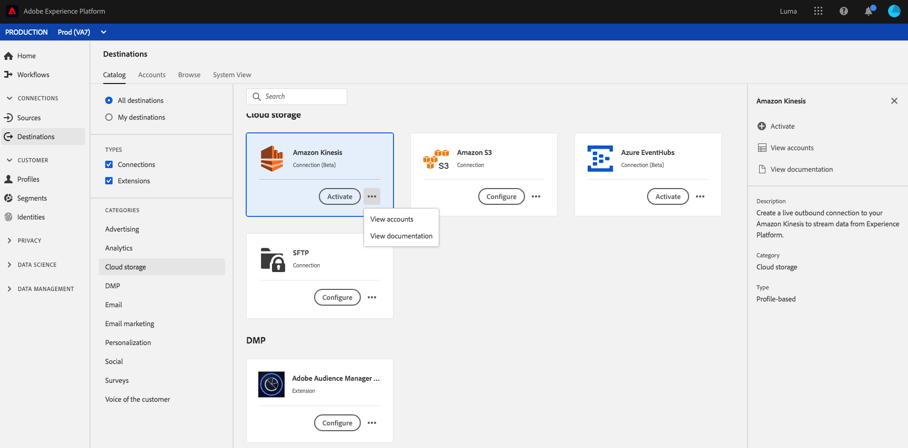
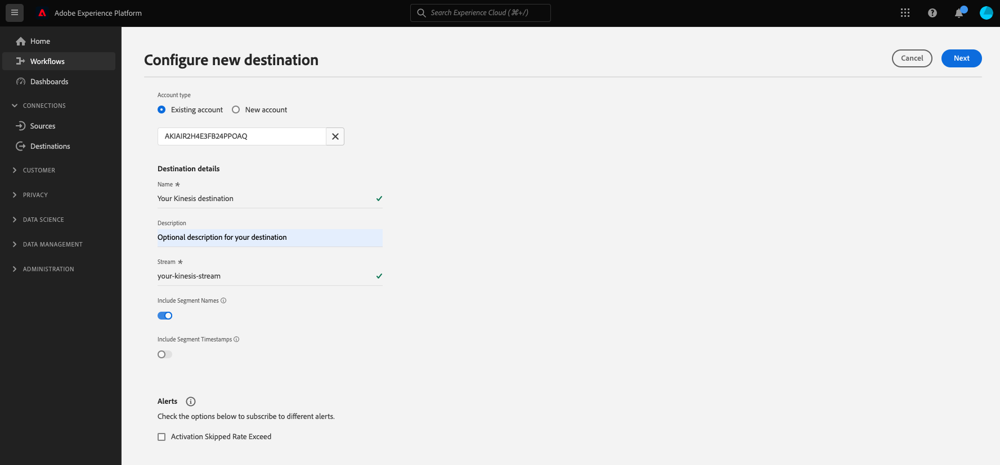

# Connexion [!DNL Amazon Kinesis]

## Présentation {#overview}

>[!IMPORTANT]
>
> Cette destination est disponible uniquement pour les clients d’[Adobe Real-Time Customer Data Platform Ultimate](https://helpx.adobe.com/fr/legal/product-descriptions/real-time-customer-data-platform.html).

Le service [!DNL Kinesis Data Streams] par [!DNL Amazon Web Services] vous permet de collecter et de traiter de grands flux d’enregistrements de données en temps réel.

Vous pouvez créer une connexion sortante en temps réel vers votre stockage [!DNL Amazon Kinesis] pour diffuser des données à partir de Adobe Experience Platform.

* Pour plus d’informations sur [!DNL Amazon Kinesis], consultez la [documentation Amazon](https://docs.aws.amazon.com/streams/latest/dev/introduction.html).
* Pour vous connecter à [!DNL Amazon Kinesis] par programmation, consultez le tutoriel [API des destinations de streaming](../../api/streaming-destinations.md).
* Pour vous connecter à [!DNL Amazon Kinesis] à l’aide de l’interface utilisateur d’Experience Platform, reportez-vous aux sections ci-dessous.



## Cas d’utilisation {#use-cases}

En utilisant des destinations de diffusion en continu telles que [!DNL Amazon Kinesis], vous pouvez facilement alimenter vos systèmes de votre choix en événements de segmentation à forte valeur et en attributs de profil associés.

Par exemple, un prospect a téléchargé un article technique qui le qualifie en segment « à forte propension à convertir ». En mappant l’audience dans laquelle le prospect se trouve à la destination [!DNL Amazon Kinesis], vous recevrez cet événement en [!DNL Amazon Kinesis]. Vous pouvez y adopter une approche autonome et décrire la logique commerciale en amont de l’événement, comme vous pensez qu’il conviendrait le mieux à vos systèmes informatiques d’entreprise.

## Audiences prises en charge {#supported-audiences}

Cette section décrit les types d’audiences que vous pouvez exporter vers cette destination.

| Origine de l’audience | Pris en charge | Description |
|---------|----------|----------|
| [!DNL Segmentation Service] | ✓ | Audiences générées via Experience Platform [Segmentation Service](../../../segmentation/home.md). |
| Chargements personnalisés | ✓ | Audiences [importées](../../../segmentation/ui/audience-portal.md#import-audience) dans Experience Platform à partir de fichiers CSV. |

{style="table-layout:auto"}

## Type et fréquence d’exportation {#export-type-frequency}

Reportez-vous au tableau ci-dessous pour plus d’informations sur le type et la fréquence d’exportation des destinations.

| Élément | Type | Notes |
---------|----------|---------|
| Type d’exportation | **[!UICONTROL Basé sur les profils]** | Vous exportez tous les membres d’un segment, ainsi que les champs de schéma de votre choix (par exemple : adresse électronique, numéro de téléphone, nom), tel que sélectionné dans l’écran de sélection des attributs de profil du [workflow d’activation de destination](../../ui/activate-batch-profile-destinations.md#select-attributes). |
| Fréquence des exportations | **[!UICONTROL Diffusion en continu]** | Les destinations de diffusion en continu sont des connexions basées sur l’API « toujours actives ». Dès qu’un profil est mis à jour dans Experience Platform en fonction de l’évaluation des audiences, le connecteur envoie la mise à jour en aval vers la plateforme de destination. En savoir plus sur les [destinations de diffusion en continu](/help/destinations/destination-types.md#streaming-destinations). |

{style="table-layout:auto"}

## Liste autorisée d’adresses IP {#ip-address-allowlist}

Pour répondre aux exigences de sécurité et de conformité des clients, Experience Platform fournit une liste d’adresses IP statiques que vous pouvez placer sur la liste autorisée pour la destination [!DNL Amazon Kinesis]. Reportez-vous à la [liste autorisée d’adresses IP pour les destinations en flux continu](/help/destinations/catalog/streaming/ip-address-allow-list.md) pour la liste complète des adresses IP à autoriser.

## Autorisations [!DNL Amazon Kinesis] nécessaires {#required-kinesis-permission}

Pour établir une connexion et exporter des données vers vos flux [!DNL Amazon Kinesis], Experience Platform a besoin d’autorisations pour les actions suivantes :

* `kinesis:ListStreams`
* `kinesis:PutRecord`
* `kinesis:PutRecords`

Ces autorisations sont organisées via la console [!DNL Kinesis] et sont vérifiées par Experience Platform une fois que vous avez configuré votre destination Kinesis dans l’interface utilisateur d’Experience Platform.

L’exemple ci-dessous affiche les droits d’accès minimum requis pour exporter des données vers une destination [!DNL Kinesis].

```json
{
    "Version": "2012-10-17",
    "Statement": [
        {
            "Effect": "Allow",
            "Action": [
                "kinesis:ListStreams",
                "kinesis:PutRecord",
                "kinesis:PutRecords"
            ],
            "Resource": [
                "arn:aws:kinesis:us-east-2:901341027596:stream/*"
            ]
        }
    ]
}
```

| Propriété | Description |
| -------- | ----------- |
| `kinesis:ListStreams` | Action qui répertorie vos flux de données Amazon Kinesis. |
| `kinesis:PutRecord` | Action qui écrit un seul enregistrement de données dans un flux de données Kinesis. |
| `kinesis:PutRecords` | Action qui écrit plusieurs enregistrements de données dans un flux de données Kinesis en un seul appel. |

{style="table-layout:auto"}

Pour plus d’informations sur le contrôle de l’accès pour les flux de données [!DNL Kinesis], consultez le [[!DNL Kinesis] document](https://docs.aws.amazon.com/streams/latest/dev/controlling-access.html) suivant.

## Se connecter à la destination {#connect}

>[!IMPORTANT]
> 
>Pour vous connecter à la destination, vous avez besoin des autorisations de contrôle d’accès **[!UICONTROL Afficher les destinations]** et **[!UICONTROL Gérer les destinations]** [](/help/access-control/home.md#permissions). Lisez la [présentation du contrôle d’accès](/help/access-control/ui/overview.md) ou contactez votre administrateur de produit pour obtenir les autorisations requises.

Pour vous connecter à cette destination, procédez comme décrit dans le [tutoriel sur la configuration des destinations](../../ui/connect-destination.md). Lors de la connexion à cette destination, vous devez fournir les informations suivantes :

### Informations d’authentification {#authentication-information}

Saisissez les champs ci-dessous et sélectionnez **[!UICONTROL Se connecter à la destination]** :


* Clé d’accès **[!DNL Amazon Web Services]et clé secrète** : dans [!DNL Amazon Web Services], générez une paire de `access key - secret access key` pour accorder à Experience Platform l’accès à votre compte [!DNL Amazon Kinesis]. En savoir plus dans la [Documentation Amazon Web Services](https://docs.aws.amazon.com/fr_fr/IAM/latest/UserGuide/id_credentials_access-keys.html).
* **[!UICONTROL Région]** : indiquez la région [!DNL Amazon Web Services] vers laquelle diffuser des données.

### Renseigner les détails de la destination {#destination-details}

>[!CONTEXTUALHELP]
>id="platform_destinations_connect_kinesis_includesegmentnames"
>title="Inclure les noms de segment"
>abstract="Activez ce bouton si vous voulez que l’export de données inclue les noms des audiences que vous exportez. Consultez la documentation pour un exemple d’exportation de données avec cette option sélectionnée."

>[!CONTEXTUALHELP]
>id="platform_destinations_connect_kinesis_includesegmenttimestamps"
>title="Inclure la date et l’heure de segment"
>abstract="Activez ce bouton si vous souhaitez que l’export de données inclue la date et l’heure UNIX de la création et des mises à jour des audiences, ainsi que la date et l’heure UNIX du mappage des audiences à la destination pour l’activation. Consultez la documentation pour un exemple d’exportation de données avec cette option sélectionnée."

Pour configurer les détails de la destination, renseignez les champs obligatoires et facultatifs ci-dessous. Un astérisque situé en regard d’un champ de l’interface utilisateur indique que le champ est obligatoire.



* **[!UICONTROL Nom]** : attribuez un nom à votre connexion à [!DNL Amazon Kinesis]
* **[!UICONTROL Description]** : indiquez une description de votre connexion à [!DNL Amazon Kinesis].
* **[!UICONTROL Flux]** : indiquez le nom d’un flux de données existant dans votre compte [!DNL Amazon Kinesis]. Experience Platform exportera les données vers ce flux.
* **[!UICONTROL Inclure les noms de segment]** : activez ce bouton si vous souhaitez que l’exportation des données inclue les noms des audiences que vous exportez. Pour un exemple d’exportation de données avec cette option sélectionnée, reportez-vous à la section [Données exportées](#exported-data) plus bas.
* **[!UICONTROL Inclure la date et l’heure de segment]** : activez ce bouton si vous souhaitez que l’exportation de données inclue la date et l’heure UNIX de la création et des mises à jour des audiences, ainsi que la date et l’heure UNIX du mappage des audiences à la destination pour l’activation. Pour un exemple d’exportation de données avec cette option sélectionnée, reportez-vous à la section [Données exportées](#exported-data) plus bas.

<!--

>[!IMPORTANT]
>
>Experience Platform needs `write` permissions on the bucket object where the export files will be delivered.

-->

### Activer les alertes {#enable-alerts}

Vous pouvez activer les alertes pour recevoir des notifications sur le statut de votre flux de données vers votre destination. Sélectionnez une alerte dans la liste et abonnez-vous à des notifications concernant le statut de votre flux de données. Pour plus d’informations sur les alertes, consultez le guide sur l’[abonnement aux alertes des destinations dans l’interface utilisateur](../../ui/alerts.md).

Lorsque vous avez terminé de renseigner les détails sur votre connexion de destination, sélectionnez **[!UICONTROL Suivant]**.

## Activer des audiences vers cette destination {#activate}

>[!IMPORTANT]
> 
>* Pour activer les données, vous avez besoin des autorisations de contrôle d’accès **[!UICONTROL Afficher les destinations]**, **[!UICONTROL Activer les destinations]**, **[!UICONTROL Afficher les profils]** et **[!UICONTROL Afficher les segments]** [](/help/access-control/home.md#permissions). Lisez la [présentation du contrôle d’accès](/help/access-control/ui/overview.md) ou contactez votre administrateur ou administratrice du produit pour obtenir les autorisations requises.
>* L’[évaluation de la politique de consentement](/help/data-governance/enforcement/auto-enforcement.md#consent-policy-evaluation) n’est actuellement pas prise en charge dans les exportations vers la destination Amazon Kinesis. [En savoir plus](/help/destinations/ui/activate-streaming-profile-destinations.md#consent-policy-evaluation).

Consultez [ Activer les données d’audience vers des destinations d’exportation de profil de diffusion en continu ](../../ui/activate-streaming-profile-destinations.md) pour obtenir des instructions sur l’activation des audiences vers cette destination.

## Comportement d’exportation de profils {#profile-export-behavior}

Experience Platform optimise le comportement d’exportation de profils vers votre destination [!DNL Amazon Kinesis] afin de n’exporter des données vers votre destination que lorsque des mises à jour pertinentes d’un profil se sont produites à la suite de la qualification d’une audience ou d’autres événements significatifs. Les profils sont exportés vers votre destination dans les situations suivantes :

* La mise à jour du profil a été déterminée par un changement de l’appartenance à l’audience pour au moins une des audiences mappées à la destination. Par exemple, le profil est éligible à l’une des audiences mappées à la destination ou a quitté l’une de ces audiences.
* La mise à jour du profil a été déterminée par une modification dans le [mappage d’identités](/help/xdm/field-groups/profile/identitymap.md). Par exemple, une nouvelle identité a été ajoutée dans l’attribut de mappage d’identités à un profil qui était déjà éligible à l’une des audiences mappées à la destination.
* La mise à jour du profil a été déterminée par une modification des attributs pour au moins un des attributs mappés à la destination. Par exemple, l’un des attributs mappés à la destination dans l’étape de mappage est ajouté à un profil.

Dans tous les cas décrits ci-dessus, seuls les profils pour lesquels des mises à jour pertinentes se sont produites sont exportés vers votre destination. Par exemple, si une audience mappée au flux de destination comporte cent membres et que cinq nouveaux profils sont éligibles à ce segment, l’exportation vers votre destination est incrémentielle et inclut uniquement les cinq nouveaux profils.

Remarque : tous les attributs mappés sont exportés pour un profil, quel que soit l’emplacement des modifications. Ainsi, dans l’exemple ci-dessus, tous les attributs mappés pour ces cinq nouveaux profils seront exportés même si les attributs eux-mêmes restent inchangés.

### Ce qui détermine une exportation de données et ce qui est inclus dans l’exportation. {#what-determines-export-what-is-included}

Concernant les données exportées pour un profil donné, il est important de comprendre les deux concepts différents entre *ce qui détermine l’exportation de données vers votre destination [!DNL Amazon Kinesis]* et *quelles données sont incluses dans l’exportation*.

| Ce qui détermine une exportation de destination | Éléments inclus dans l’exportation de destination |
|---------|----------|
| <ul><li>Les attributs et segments mappés servent de repère pour une exportation de destination. Cela signifie que si le statut de `segmentMembership` d’un profil passe à `realized` ou `exiting` ou qu’un attribut mappé est mis à jour, une exportation de destination est déclenchée.</li><li>Comme les identités ne peuvent actuellement pas être mappées à des destinations [!DNL Amazon Kinesis], les modifications d’identité sur un profil donné déterminent également les exportations de destination.</li><li>Toute modification pour un attribut est considérée comme une mise à jour, qu’il s’agisse ou non de la même valeur. Cela signifie qu’une réécriture sur un attribut est considérée comme une modification, même si la valeur elle-même n’a pas changé.</li></ul> | <ul><li>L’objet `segmentMembership` inclut le segment mappé dans le flux de données d’activation, pour lequel le statut du profil a changé suite à un événement de qualification ou de sortie de segment. Notez que d’autres segments non mappés pour lesquels le profil s’est qualifié peuvent faire partie de l’exportation de destination, si ces segments appartiennent à la même [politique de fusion](/help/profile/merge-policies/overview.md) que le segment mappé dans le flux de données d’activation. </li><li>Toutes les identités dans l’objet `identityMap` sont également incluses (Experience Platform ne prend actuellement pas en charge le mappage d’identité dans la destination [!DNL Amazon Kinesis]).</li><li>Seuls les attributs mappés sont inclus dans l’exportation de destination.</li></ul> |

{style="table-layout:fixed"}

>[!BEGINSHADEBOX]

Prenons l’exemple d’un flux de données vers une destination [!DNL Amazon Kinesis] dans lequel trois audiences sont sélectionnées et quatre attributs sont mappés à la destination.


Une exportation de profil vers la destination peut être déterminée par un profil éligible ou sortant de l’un des *trois segments mappés*. Lors de l’exportation des données, dans l’objet `segmentMembership` (voir la section [Données exportées](#exported-data) ci-dessous), d’autres audiences mappées peuvent apparaître si ce profil particulier en est membre et s’il partage la même politique de fusion que l’audience qui a déclenché l’exportation. Si un profil est qualifié pour le segment **Client avec des voitures DeLorean** et est également membre des segments **Site de base actif et Ville - Dallas**, alors ces deux autres audiences seront également présentes dans l’objet `segmentMembership` de l’exportation des données, car elles sont mappées dans le flux de données, si elles partagent la même politique de fusion que le segment **Client avec des voitures DeLorean**.

Du point de vue des attributs de profil, toute modification apportée aux quatre attributs mappés ci-dessus déterminera une exportation de destination et chacun de ces quatre attributs mappés et présents sur le profil sera présent dans l’exportation des données.

>[!ENDSHADEBOX]

## Renvoyer des données historiques {#historical-data-backfill}

Lorsque vous ajoutez une nouvelle audience à une destination existante, ou lorsque vous créez une nouvelle destination et que vous y mappez des audiences, Experience Platform exporte les données historiques de qualification d’audience vers la destination. Les profils qualifiés pour l’audience *auparavant* celle-ci a été ajoutée à la destination sont exportés vers la destination sous une heure environ.

## Données exportées {#exported-data}

Les données [!DNL Experience Platform] exportées arrivent dans votre destination [!DNL Amazon Kinesis] au format JSON. Par exemple, l’exportation ci-dessous contient un profil qualifié pour un certain segment, qui est membre de deux autres segments et qui a quitté un autre segment. L’exportation inclut également le prénom, le nom, la date de naissance et l’adresse e-mail personnelle de l’attribut de profil. Les identités de ce profil sont ECID et e-mail.

```json
{
  "person": {
    "birthDate": "YYYY-MM-DD",
    "name": {
      "firstName": "John",
      "lastName": "Doe"
    }
  },
  "personalEmail": {
    "address": "john.doe@acme.com"
  },
  "segmentMembership": {
   "ups":{
      "7841ba61-23c1-4bb3-a495-00d3g5fe1e93":{
         "lastQualificationTime":"2022-01-11T21:24:39Z",
         "status":"exited"
      },
      "59bd2fkd-3c48-4b18-bf56-4f5c5e6967ae":{
         "lastQualificationTime":"2022-01-02T23:37:33Z",
         "status":"realized"
      },
      "947c1c46-008d-40b0-92ec-3af86eaf41c1":{
         "lastQualificationTime":"2021-08-25T23:37:33Z",
         "status":"realized"
      },
      "5114d758-ce71-43ba-b53e-e2a91d67b67f":{
         "lastQualificationTime":"2022-01-11T23:37:33Z",
         "status":"realized"
      }
   }
},
  "identityMap": {
    "ecid": [
      {
        "id": "14575006536349286404619648085736425115"
      },
      {
        "id": "66478888669296734530114754794777368480"
      }
    ],
    "email_lc_sha256": [
      {
        "id": "655332b5fa2aea4498bf7a290cff017cb4"
      },
      {
        "id": "66baf76ef9de8b42df8903f00e0e3dc0b7"
      }
    ]
  }
}
```

Vous trouverez ci-dessous d’autres exemples de données exportées, en fonction des paramètres de l’interface utilisateur que vous sélectionnez dans le flux de connexion à la destination pour les options **[!UICONTROL Inclure les noms de segment]** et **[!UICONTROL Inclure la date et l’heure de segment]** :

+++ L’exemple d’exportation de données ci-dessous inclut des noms d’audience dans la section `segmentMembership`

```json
"segmentMembership": {
        "ups": {
          "5b998cb9-9488-4ec3-8d95-fa8338ced490": {
            "lastQualificationTime": "2019-04-15T02:41:50+0000",
            "status": "realized",
            "createdAt": 1648553325000,
            "updatedAt": 1648553330000,
            "mappingCreatedAt": 1649856570000,
            "mappingUpdatedAt": 1649856570000,
            "name": "First name equals John"
          }
        }
      }
```

+++

+++ L’exemple d’exportation de données ci-dessous inclut les horodatages d’audience dans la section `segmentMembership`

```json
"segmentMembership": {
        "ups": {
          "5b998cb9-9488-4ec3-8d95-fa8338ced490": {
            "lastQualificationTime": "2019-04-15T02:41:50+0000",
            "status": "realized",
            "createdAt": 1648553325000,
            "updatedAt": 1648553330000,
            "mappingCreatedAt": 1649856570000,
            "mappingUpdatedAt": 1649856570000,
          }
        }
      }
```

+++

## Politique de limitation et de reprise {#limits-retry-policy}

Dans 95 % des cas, Experience Platform tente d’offrir une latence de débit inférieure à 10 minutes pour les messages envoyés avec succès, avec un taux de moins de 10 000 demandes par seconde pour chaque flux de données vers une destination HTTP.

En cas d’échec des requêtes vers la destination API HTTP, Experience Platform stocke les requêtes ayant échoué et tente à deux reprises d’envoyer les requêtes à votre point d’entrée.

>[!MORELIKETHIS]
>
>* [Connexion à Amazon Kinesis et activation des données à l’aide de l’API Flow Service](../../api/streaming-destinations.md)
>* [Destination Azure Event Hubs](./azure-event-hubs.md)
>* [Types et catégories de destination](../../destination-types.md)
