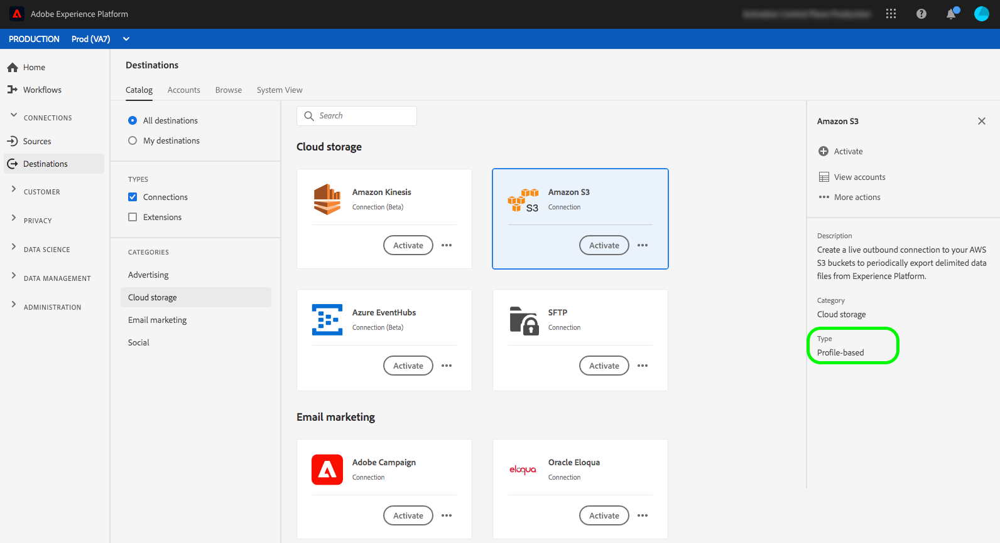

# Connexion [!DNL Amazon S3] {#s3-connection}

## Journal des modifications de destination {#changelog}

+++ Afficher le journal des modifications


| Mois de publication | Type de mise à jour | Description |
|---|---|---|
| Janvier 2024 | Nouvelles fonctionnalités et mise à jour de la documentation | Le connecteur de destination Amazon S3 prend désormais en charge un nouveau type d’authentification de rôle assumé. En savoir plus à ce sujet dans la [section authentification](#assumed-role-authentication). |
| Juillet 2023 | Nouvelles fonctionnalités et mise à jour de la documentation | Avec la version d’Experience Platform de juillet 2023, la destination [!DNL Amazon S3] fournit de nouvelles fonctionnalités, comme indiqué ci-dessous : <br><ul><li>[&#x200B; Prise en charge de l’exportation des jeux de données &#x200B;](/help/destinations/ui/export-datasets.md)</li><li>[Options de dénomination de fichier](/help/destinations/ui/activate-batch-profile-destinations.md#scheduling) supplémentaires.</li><li>Possibilité de définir des en-têtes de fichier personnalisés dans vos fichiers exportés via l’[étape de mappage améliorée](/help/destinations/ui/activate-batch-profile-destinations.md#mapping).</li><li>[Possibilité de personnaliser le formatage des fichiers de données CSV exportés](/help/destinations/ui/batch-destinations-file-formatting-options.md).</li></ul> |

{style="table-layout:auto"}

+++

## Connexion à votre stockage [!DNL Amazon S3] via l’API ou l’interface utilisateur {#connect-api-or-ui}

* Pour vous connecter à l’emplacement de stockage de votre [!DNL Amazon S3] à l’aide de l’interface utilisateur d’Experience Platform, lisez les sections [Se connecter à la destination](#connect) et [Activer des audiences vers cette destination](#activate) ci-dessous.
* Pour vous connecter à l’emplacement de stockage de votre [!DNL Amazon S3] par programmation, consultez le guide expliquant comment [activer des audiences vers des destinations basées sur des fichiers à l’aide du tutoriel de l’API Flow Service](../../api/activate-segments-file-based-destinations.md).

## Audiences prises en charge {#supported-audiences}

Cette section décrit les types d’audiences que vous pouvez exporter vers cette destination.

| Origine de l’audience | Pris en charge | Description |
|---------|----------|----------|
| [!DNL Segmentation Service] | ✓ | Audiences générées via Experience Platform [Segmentation Service](../../../segmentation/home.md). |
| Chargements personnalisés | ✓ | Audiences [importées](../../../segmentation/ui/audience-portal.md#import-audience) dans Experience Platform à partir de fichiers CSV. |

{style="table-layout:auto"}

## Type et fréquence d’exportation {#export-type-frequency}

Reportez-vous au tableau ci-dessous pour plus d’informations sur le type et la fréquence d’exportation des destinations.

| Élément | Type | Notes |
|---------|----------|---------|
| Type d’exportation | **[!UICONTROL Profile-based]** | Vous exportez tous les membres d’un segment, ainsi que les champs de schéma de votre choix (par exemple : adresse électronique, numéro de téléphone, nom), tel que sélectionné dans l’écran de sélection des attributs de profil du [workflow d’activation de destination](../../ui/activate-batch-profile-destinations.md#select-attributes). |
| Fréquence des exportations | **[!UICONTROL Batch]** | Les destinations par lots exportent des fichiers vers des plateformes en aval par incréments de trois, six, huit, douze ou vingt-quatre heures. En savoir plus sur les [destinations basées sur des fichiers par lots](/help/destinations/destination-types.md#file-based). |

{style="table-layout:auto"}



## Exporter des jeux de données {#export-datasets}

Cette destination prend en charge les exportations de jeux de données. Pour obtenir des informations complètes sur la configuration des exportations de jeux de données, consultez les tutoriels :

* Comment [exporter des jeux de données à l’aide de l’interface utilisateur Experience Platform](/help/destinations/ui/export-datasets.md).
* Comment [exporter des jeux de données par programmation à l’aide de l’API Flow Service](/help/destinations/api/export-datasets.md).

## Format des données exportées {#file-format}

Lors de l’exportation de *données d’audience*, Experience Platform crée un fichier `.csv`, `parquet` ou `.json` à l’emplacement de stockage indiqué. Pour plus d’informations sur les fichiers, consultez la section [formats de fichiers pris en charge pour l’exportation](../../ui/activate-batch-profile-destinations.md#supported-file-formats-export) dans le tutoriel sur l’activation des audiences.

Lors de l’exportation de *jeux de données*, Experience Platform crée un fichier `.parquet` ou `.json` dans l’emplacement de stockage que vous avez fourni. Pour plus d’informations sur les fichiers, consultez la section [vérifier la réussite de l’exportation du jeu de données](../../ui/export-datasets.md#verify) dans le tutoriel sur l’exportation des jeux de données.

## Se connecter à la destination {#connect}

>[!IMPORTANT]
> 
>Pour vous connecter à la destination, vous avez besoin des **[!UICONTROL View Destinations]** et **[!UICONTROL Manage Destinations]** [autorisations de contrôle d’accès](/help/access-control/home.md#permissions). Lisez la [présentation du contrôle d’accès](/help/access-control/ui/overview.md) ou contactez votre administrateur de produit pour obtenir les autorisations requises.

Pour vous connecter à cette destination, procédez comme décrit dans le [tutoriel sur la configuration des destinations](../../ui/connect-destination.md). Dans le workflow de configuration des destinations, renseignez les champs répertoriés dans les deux sections ci-dessous.

### S’authentifier auprès de la destination {#authenticate}

>[!CONTEXTUALHELP]
>id="platform_destinations_connect_s3_rsa"
>title="Clé publique RSA"
>abstract="Vous pouvez éventuellement joindre votre clé publique au format RSA pour ajouter un chiffrement à vos fichiers exportés. Affichez un exemple de clé correctement formatée dans le lien de documentation ci-dessous."

Pour vous authentifier auprès de la destination, renseignez les champs requis et sélectionnez **[!UICONTROL Connect to destination]**. La destination Amazon S3 prend en charge deux méthodes d’authentification :

* Authentification par clé d’accès et clé secrète
* Authentification du rôle assumé

#### Authentification avec clé d’accès S3 et clé secrète

Utilisez cette méthode d’authentification lorsque vous souhaitez saisir votre clé d’accès Amazon S3 et votre clé secrète pour permettre à Experience Platform d’exporter des données vers vos propriétés Amazon S3.


* Clé d’accès **[!DNL Amazon S3]** et clé secrète **[!DNL Amazon S3]** : dans [!DNL Amazon S3], générez une paire de `access key - secret access key` pour accorder à Experience Platform l’accès à votre compte [!DNL Amazon S3]. En savoir plus dans la [Documentation Amazon Web Services](https://docs.aws.amazon.com/fr_fr/IAM/latest/UserGuide/id_credentials_access-keys.html).
* **[!UICONTROL Encryption key]** : vous pouvez éventuellement joindre votre clé publique au format RSA pour ajouter un chiffrement à vos fichiers exportés. Vous pouvez voir un exemple de clé correctement formatée dans l’image ci-dessous.

  

#### Authentification avec le rôle assumé par S3 {#assumed-role-authentication}

>[!CONTEXTUALHELP]
>id="platform_destinations_connect_s3_assumed_role"
>title="Authentification du rôle assumé"
>abstract="Utilisez ce type d’authentification si vous préférez ne pas partager les clés de compte et les clés secrètes avec Adobe. Au lieu de cela, Experience Platform se connecte à votre emplacement Amazon S3 en utilisant un accès basé sur les rôles. Collez l’ARN (nom de ressource Amazon) du rôle que vous avez créé dans AWS pour l’utilisateur ou l’utilisatrice Adobe. Le modèle est similaire à `arn:aws:iam::800873819705:role/destinations-role-customer`. "

Utilisez ce type d’authentification si vous préférez ne pas partager les clés de compte et les clés secrètes avec Adobe. Au lieu de cela, Experience Platform se connecte à votre emplacement Amazon S3 à l’aide d’un accès en fonction du rôle.


* **[!DNL Role]** : collez l’ARN du rôle que vous avez créé dans AWS pour l’utilisateur Adobe. Le schéma est similaire à `arn:aws:iam::800873819705:role/destinations-role-customer`. Consultez les étapes ci-dessous pour obtenir des conseils détaillés sur la configuration correcte de l’accès à S3.
* **[!UICONTROL Encryption key]** : vous pouvez éventuellement joindre votre clé publique au format RSA pour ajouter un chiffrement à vos fichiers exportés. Vous pouvez voir un exemple de clé correctement formatée dans l’image ci-dessous.

Pour ce faire, vous devez créer dans la console AWS un rôle prédéfini pour Adobe avec les [autorisations requises adéquates](#minimum-permissions-iam-user) pour écrire dans vos compartiments Amazon S3.

**Créer une politique avec les autorisations requises**

1. Ouvrez la console AWS et accédez à IAM > Politiques > Créer une politique
2. Sélectionnez Éditeur de politiques > JSON et ajoutez les autorisations ci-dessous.

   ```json
   {
       "Version": "2012-10-17",
       "Statement": [
           {
               "Sid": "VisualEditor0",
               "Effect": "Allow",
               "Action": [
                   "s3:PutObject",
                   "s3:GetObject",
                   "s3:DeleteObject",
                   "s3:GetBucketLocation",
                   "s3:ListMultipartUploadParts"
               ],
               "Resource": "arn:aws:s3:::bucket/folder/*"
           },
           {
               "Sid": "VisualEditor1",
               "Effect": "Allow",
               "Action": [
                   "s3:ListBucket"
               ],
               "Resource": "arn:aws:s3:::bucket"
           }
       ]
   }
   ```

3. Sur la page suivante, saisissez un nom pour votre politique et enregistrez-le pour référence. Vous aurez besoin de ce nom de politique lors de la création du rôle à l’étape suivante.

**Créer un rôle d’utilisateur dans votre compte client S3**

1. Ouvrez la console AWS et accédez à IAM > Rôles > Créer un nouveau rôle
2. Sélectionnez **Type d’entité de confiance** > **Compte AWS**
3. Sélectionnez **Un compte AWS** > **Un autre compte AWS** et saisissez l’identifiant du compte Adobe : `670664943635`
4. Ajoutez des autorisations à l’aide de la politique créée précédemment
5. Saisissez un nom de rôle (par exemple, `destinations-role-customer`). Le nom du rôle doit être traité comme confidentiel, comme un mot de passe. Il peut contenir jusqu’à 64 caractères et contenir des caractères alphanumériques ainsi que les caractères spéciaux suivants : `+=,.@-_`. Vérifiez ensuite que :
   * L’identifiant de compte Adobe `670664943635` est présent dans la section **[!UICONTROL Select trusted entities]** .
   * La politique créée précédemment est présente dans **[!UICONTROL Permissions policy summary]**

**Indiquez le rôle qu’Adobe doit assumer**

Après avoir créé le rôle dans AWS, vous devez fournir le rôle ARN à Adobe. L’ARN suit ce modèle : `arn:aws:iam::800873819705:role/destinations-role-customer`

L’ARN apparaît sur la page principale après la création du rôle dans la console AWS. Vous utiliserez cet ARN lors de la création de la destination.

**Vérification des autorisations des rôles et des relations d’approbation**

Assurez-vous que votre rôle possède la configuration suivante :

* **Autorisations** : le rôle doit disposer des autorisations d’accès à S3 (accès complet ou autorisations minimales fournies dans l’étape **Créer une politique avec les autorisations requises** ci-dessus)
* **Relations d’approbation** : le rôle doit comporter le compte Adobe racine (`670664943635`) dans ses relations d’approbation

**Alternative : se limiter à un utilisateur Adobe spécifique (facultatif)**

Si vous préférez ne pas autoriser le compte Adobe entier, vous pouvez restreindre l’accès à un utilisateur Adobe spécifique uniquement. Pour ce faire, modifiez la politique d’approbation avec la configuration suivante :

```json
{
    "Version": "2012-10-17",
    "Statement": [
        {
            "Effect": "Allow",
            "Principal": {
                "AWS": "arn:aws:iam::670664943635:user/destinations-adobe-user"
            },
            "Action": "sts:AssumeRole",
            "Condition": {}
        }
    ]
}
```

Pour plus d’informations, consultez la documentation d’[AWS sur la création de rôles](https://docs.aws.amazon.com/IAM/latest/UserGuide/id_roles_create_for-user.html).


### Renseigner les détails de la destination {#destination-details}

>[!CONTEXTUALHELP]
>id="platform_destinations_connect_s3_bucket"
>title="Nom du compartiment"
>abstract="Doit comporter entre 3 et 63 caractères. Doit commencer et se terminer par une lettre ou un numéro. Ne doit contenir que des lettres minuscules, des chiffres ou des tirets ( - ). Ne doit pas être formaté comme une adresse IP (par exemple, 192.100.1.1)."

>[!CONTEXTUALHELP]
>id="platform_destinations_connect_s3_folderpath"
>title="Chemin du dossier"
>abstract="Doit contenir uniquement les caractères A-Z, a-z, 0-9 et peut contenir les caractères spéciaux suivants : `/!-_.'()"^[]+$%.*"`. Pour créer un dossier par fichier d’audience, insérez la macro `/%SEGMENT_NAME%` ou `/%SEGMENT_ID%` ou `/%SEGMENT_NAME%/%SEGMENT_ID%` dans le champ de texte. Les macros ne peuvent être insérées qu’à la fin du chemin du dossier. Affichez des exemples de macro dans la documentation."
>additional-url="https://experienceleague.adobe.com/docs/experience-platform/destinations/catalog/cloud-storage/overview.html?lang=fr#use-macros" text="Utiliser les macros pour créer un dossier à votre emplacement de stockage"

Pour configurer les détails de la destination, renseignez les champs obligatoires et facultatifs ci-dessous. Un astérisque situé en regard d’un champ de l’interface utilisateur indique que le champ est obligatoire.

* **[!UICONTROL Name]** : saisissez un nom qui vous aidera à identifier cette destination.
* **[!UICONTROL Description]** : saisissez une description de cette destination.
* **[!UICONTROL Bucket name]** : saisissez le nom de l’intervalle de [!DNL Amazon S3] à utiliser par cette destination.
* **[!UICONTROL Folder path]** : saisissez le chemin d’accès au dossier de destination qui hébergera les fichiers exportés.
* **[!UICONTROL File type]** : sélectionnez le format qu’Experience Platform doit utiliser pour les fichiers exportés. Lors de la sélection de l’option [!UICONTROL CSV] , vous pouvez également [configurer les options de formatage des fichiers](../../ui/batch-destinations-file-formatting-options.md).
* **[!UICONTROL Compression format]** : sélectionnez le type de compression qu’Experience Platform doit utiliser pour les fichiers exportés.
* **[!UICONTROL Include manifest file]** : activez cette option si vous souhaitez que les exportations incluent un fichier JSON manifeste contenant des informations sur l’emplacement de l’exportation, la taille de l’exportation, etc. Le manifeste est nommé à l’aide du format `manifest-<<destinationId>>-<<dataflowRunId>>.json`. Affichez un [exemple de fichier de manifeste](/help/destinations/assets/common/manifest-d0420d72-756c-4159-9e7f-7d3e2f8b501e-0ac8f3c0-29bd-40aa-82c1-f1b7e0657b19.json). Le fichier manifeste comprend les champs suivants :
   * `flowRunId` : exécution [flux de données](/help/dataflows/ui/monitor-destinations.md#dataflow-runs-for-batch-destinations) qui a généré le fichier exporté.
   * `scheduledTime` : heure en UTC à laquelle le fichier a été exporté.
   * `exportResults.sinkPath` : chemin d’accès à l’emplacement de stockage où le fichier exporté est déposé.
   * `exportResults.name` : nom du fichier exporté.
   * `size` : taille du fichier exporté, en octets.

>[!TIP]
>
>Dans le workflow de connexion à la destination , vous pouvez créer un dossier personnalisé dans votre stockage Amazon S3 par fichier d’audience exporté. Lisez [Utiliser les macros pour créer un dossier à l’emplacement de stockage](overview.md#use-macros) pour obtenir des instructions.

### Activer les alertes {#enable-alerts}

Vous pouvez activer les alertes pour recevoir des notifications sur le statut de votre flux de données vers votre destination. Sélectionnez une alerte dans la liste et abonnez-vous à des notifications concernant le statut de votre flux de données. Pour plus d’informations sur les alertes, consultez le guide sur l’[abonnement aux alertes des destinations dans l’interface utilisateur](../../ui/alerts.md).

Lorsque vous avez terminé de renseigner les détails sur votre connexion de destination, sélectionnez **[!UICONTROL Next]**.

### Autorisations [!DNL Amazon S3] nécessaires {#required-s3-permission}

Pour établir une connexion et exporter des données vers votre emplacement de stockage [!DNL Amazon S3], créez un utilisateur de gestion des identités et des accès (IAM) pour [!DNL Experience Platform] dans [!DNL Amazon S3] et attribuez des autorisations pour les actions suivantes :

* `s3:DeleteObject`
* `s3:GetBucketLocation`
* `s3:GetObject`
* `s3:ListBucket`
* `s3:PutObject`
* `s3:ListMultipartUploadParts`

#### Autorisations minimales requises pour l’authentification du rôle assumé par l’IAM {#minimum-permissions-iam-user}

Lors de la configuration du rôle IAM en tant que client, assurez-vous que la politique d’autorisation associée au rôle inclut les actions requises dans le dossier cible du compartiment et l’action `s3:ListBucket` pour la racine du compartiment. Consultez ci-dessous un exemple de politique d’autorisations minimales pour ce type d’authentification :

```json
{
    "Version": "2012-10-17",
    "Statement": [
        {
            "Sid": "VisualEditor0",
            "Effect": "Allow",
            "Action": [
                "s3:PutObject",
                "s3:GetObject",
                "s3:DeleteObject",
                "s3:GetBucketLocation",
                "s3:ListMultipartUploadParts"
            ],
            "Resource": "arn:aws:s3:::bucket/folder/*"
        },
        {
            "Sid": "VisualEditor1",
            "Effect": "Allow",
            "Action": [
                "s3:ListBucket"
            ],
            "Resource": "arn:aws:s3:::bucket"
        }
    ]
}  
```

<!--

Commenting out this note, as write permissions are assigned through the s3:PutObject permission.

>[!IMPORTANT]
>
>Experience Platform needs `write` permissions on the bucket object where the export files will be delivered.

-->

## Activer des audiences vers cette destination {#activate}

>[!IMPORTANT]
> 
>* Pour activer les données, vous avez besoin des autorisations de contrôle d’accès **[!UICONTROL View Destinations]**, **[!UICONTROL Activate Destinations]**, **[!UICONTROL View Profiles]** et **[!UICONTROL View Segments]** [Access control](/help/access-control/home.md#permissions). Lisez la [présentation du contrôle d’accès](/help/access-control/ui/overview.md) ou contactez votre administrateur ou administratrice du produit pour obtenir les autorisations requises.
>* Pour exporter des *identités*, vous devez disposer de l’autorisation de contrôle d’accès **[!UICONTROL View Identity Graph]**&#x200B;[&#128279;](/help/access-control/home.md#permissions). <br> {width="100" zoomable="yes"}

Consultez [&#x200B; Activer les données d’audience vers des destinations d’exportation de profils par lots &#x200B;](../../ui/activate-batch-profile-destinations.md) pour obtenir des instructions sur l’activation des audiences vers cette destination.

## Valider l’exportation des données avec succès {#exported-data}

Pour vérifier si l’exportation des données a réussi, vérifiez le stockage [!DNL Amazon S3] et assurez-vous que les fichiers exportés contiennent les populations de profils attendues.

## Liste autorisée d’adresses IP {#ip-address-allow-list}

Reportez-vous à l’article [Adresse IP](ip-address-allow-list.md) de la place sur la liste autorisée si vous devez ajouter des adresses IP Adobe à un place sur la liste autorisée.