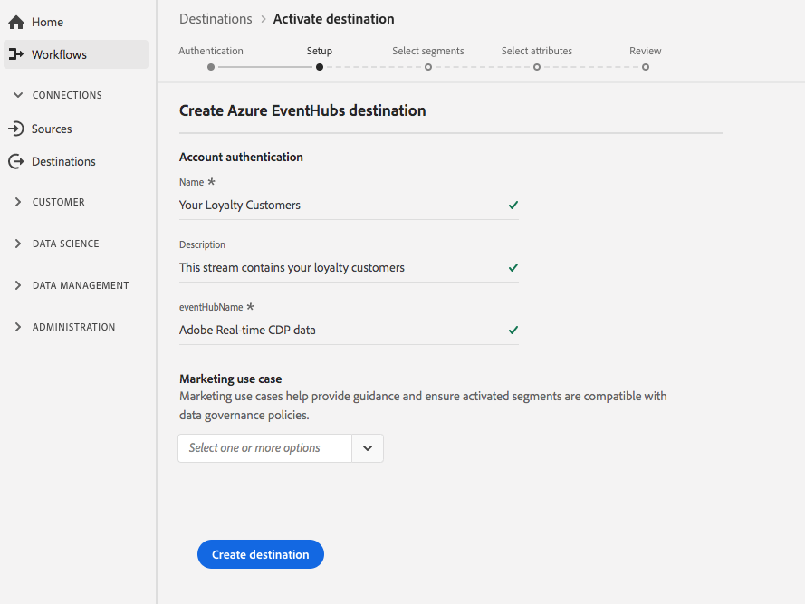

# (Beta) [!DNL Azure Event Hubs] connexion

## Présentation {#overview}

>[!IMPORTANT]
>
>La destination [!DNL Azure Event Hubs] dans Platform est actuellement en version bêta. La documentation et les fonctionnalités peuvent changer.

[!DNL Azure Event Hubs] est une plate-forme de diffusion de données massives et un service d’assimilation de événements. Il peut recevoir et traiter des millions de événements par seconde. Les données envoyées à un hub de événement peuvent être transformées et stockées à l’aide de n’importe quel fournisseur d’analyses en temps réel ou de cartes de traitement par lot/d’enregistrement.

Vous pouvez créer une connexion sortante en temps réel à votre [!DNL Azure Event Hubs] enregistrement de diffusion de données à partir de Adobe Experience Platform.

* Pour plus d&#39;informations sur [!DNL Azure Event Hubs], consultez la [documentation Microsoft](https://docs.microsoft.com/en-us/azure/event-hubs/event-hubs-about).
* Pour vous connecter à [!DNL Azure Event Hubs] par programmation, consultez le [didacticiel sur l&#39;API de destinations de diffusion en continu](../../api/streaming-destinations.md).
* Pour vous connecter à [!DNL Azure Event Hubs] à l&#39;aide de l&#39;interface utilisateur de la plate-forme, consultez les sections ci-dessous.


## Cas d’utilisation {#use-cases}

En utilisant des destinations de diffusion en flux continu telles que [!DNL Azure Event Hubs], vous pouvez facilement intégrer des événements de segmentation à forte valeur ajoutée et des attributs de profil associés dans vos systèmes de choix.

Par exemple, une prospect a téléchargé un livre blanc qui les classe dans un segment &quot;forte propension à la conversion&quot;. En mappant le segment dans lequel la prospect se trouve sur la destination [!DNL Azure Event Hubs], vous recevriez ce événement dans [!DNL Azure Event Hubs]. Vous pouvez y appliquer une approche par soi-même et décrire la logique d&#39;entreprise en plus du événement, comme vous pensez qu&#39;elle fonctionne le mieux avec vos systèmes informatiques d&#39;entreprise.

## Type d&#39;exportation {#export-type}

**Basé sur**  le profil : vous exportez tous les membres d’un segment, ainsi que les champs de schéma de votre choix (par exemple : adresse électronique, numéro de téléphone, nom de famille), tel que choisi dans l’écran de sélection des attributs du processus [ d’activation de ](../../ui/activate-destinations.md#select-attributes)destination.

## Connexion à la destination {#connect-destination}

Voir [Flux de travaux de destination des enregistrements cloud ](./workflow.md)pour obtenir des instructions sur la connexion à vos destinations d’enregistrement cloud, y compris [!DNL Azure Event Hubs].

Pour les destinations [!DNL Azure Event Hubs], saisissez les informations suivantes dans le processus de création de destination :

## Étape d&#39;authentification {#authentication-step}

* **[!UICONTROL Clé]** de clé SAS et Clé **** SAS : Renseignez votre clé et votre nom de clé SAS. Découvrez comment vous authentifier auprès de [!DNL Azure Event Hubs] avec des clés SAS dans la [documentation Microsoft](https://docs.microsoft.com/en-us/azure/event-hubs/authenticate-shared-access-signature).
* **[!UICONTROL Espace de nommage]** : Remplissez votre  [!DNL Azure Event Hubs] espace de nommage. Découvrez les espaces de nommage [!DNL Azure Event Hubs] dans la [documentation Microsoft](https://docs.microsoft.com/en-us/azure/event-hubs/event-hubs-create#create-an-event-hubs-namespace).


## Étape de configuration {#setup-step}

* **[!UICONTROL Nom]** : Renseignez le nom de la connexion à  [!DNL Azure Event Hubs].
* **[!UICONTROL Description]** : Fournissez une description de la connexion.  Exemples : &quot;Clients Premium&quot;, &quot;Hommes intéressés par le kitesurf&quot;.
* **[!UICONTROL eventHubName]** : Attribuez un nom au flux jusqu’à votre  [!DNL Azure Event Hubs] destination.
* **[!UICONTROL Actions]** marketing : Les actions marketing indiquent l’intention d’exporter les données vers la destination. Vous pouvez choisir parmi des actions marketing définies par Adobe ou créer votre propre action marketing. Pour plus d’informations sur les actions marketing, voir la page [Gouvernance des données dans Adobe Experience Platform](../../../data-governance/policies/overview.md). Pour plus d&#39;informations sur les actions marketing définies par l&#39;Adobe, consultez la [Présentation des stratégies d&#39;utilisation des données](../../../data-governance/policies/overview.md).



## Activation des segments {#activate-segments}

Pour obtenir des informations sur le processus d’activation des segments, voir [Activer les profils et les segments à une destination](../../ui/activate-destinations.md).

## Données exportées {#exported-data}

Vos données [!DNL Experience Platform] exportées atterrissent dans [!DNL Azure Event Hubs] au format JSON. Par exemple, le événement ci-dessous contient l’attribut profil d’adresse électronique d’une audience qui s’est qualifiée pour un certain segment et a quitté un autre segment. Les identités de cette prospect sont ECID et email.

```json
{
  "person": {
    "email": "yourstruly@adobe.con"
  },
  "segmentMembership": {
    "ups": {
      "7841ba61-23c1-4bb3-a495-00d3g5fe1e93": {
        "lastQualificationTime": "2020-05-25T21:24:39Z",
        "status": "exited"
      },
      "59bd2fkd-3c48-4b18-bf56-4f5c5e6967ae": {
        "lastQualificationTime": "2020-05-25T23:37:33Z",
        "status": "existing"
      }
    }
  },
  "identityMap": {
    "ecid": [
      {
        "id": "14575006536349286404619648085736425115"
      },
      {
        "id": "66478888669296734530114754794777368480"
      }
    ],
    "email_lc_sha256": [
      {
        "id": "655332b5fa2aea4498bf7a290cff017cb4"
      },
      {
        "id": "66baf76ef9de8b42df8903f00e0e3dc0b7"
      }
    ]
  }
}
```


>[!MORELIKETHIS]
>
>* [Se connecter aux concentrateurs de Événement Azure et activer les données à l&#39;aide de l&#39;API Flow Service](../../api/streaming-destinations.md)
>* [Destination AWS Kinesis](./amazon-kinesis.md)
>* [Types et catégories de destination](../../destination-types.md)