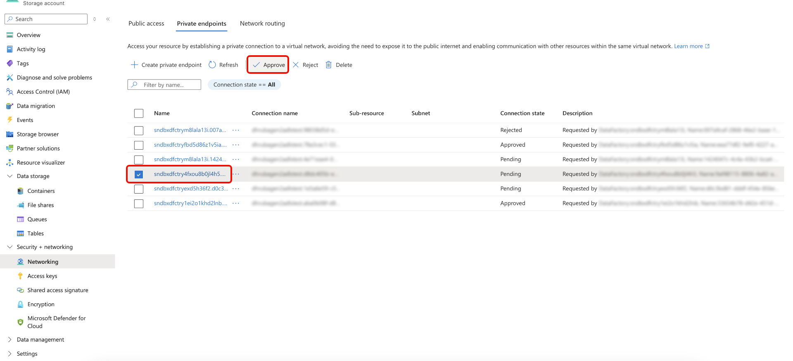

# Lien privé pour les destinations [!DNL Azure]

[!DNL Azure] [Lien privé](https://azure.microsoft.com/en-us/products/private-link) vous permet d’acheminer les exportations de données de [!DNL Adobe Experience Platform] vers vos ressources [!DNL Azure] via des adresses IP privées sur la colonne vertébrale [!DNL Microsoft Azure], plutôt que sur l’Internet public. Vos données d’activation ne traversent jamais l’infrastructure publique.

[!DNL Adobe] crée et gère un point d’entrée privé dans un réseau virtuel (VNet) détenu par Adobe qui pointe vers votre ressource [!DNL Azure]. Lorsque [!DNL Azure] négocie la demande de connexion, vous l’approuvez à partir de votre portail [!DNL Azure]. Après approbation, tout le trafic d’activation pour cette ressource est acheminé via le point d’entrée privé.

>[!IMPORTANT]
>
>[!DNL Azure] Lien privé pour les destinations n’a pas d’interface utilisateur en libre-service. Pour demander la configuration, contactez votre gestionnaire de compte Adobe. Patientez jusqu’à cinq jours ouvrables pour que les [!DNL Adobe] configurent le point d’entrée après l’envoi de votre requête.

## Destinations prises en charge {#supported-destinations}

[!DNL Azure] lien privé est pris en charge pour les destinations suivantes :

* [Stockage Azure Blob](./azure-blob.md)
* [Azure Data Lake Storage Gen2](./adls-gen2.md)
* [Azure Event Hubs](./azure-event-hubs.md)

## Conditions préalables {#prerequisites}

[!DNL Azure] lien privé pour les destinations nécessite l’un des droits suivants :

* [Adobe Healthcare Shield](https://www.adobe.com/trust/compliance/hipaa-ready.html)
* Adobe Privacy &amp; Security Shield

## Fonctionnement [!DNL Azure] Lien privé {#how-it-works}

[!DNL Adobe Experience Platform] gère un réseau VNet dédié à Private Connectivity Hub. Lorsque vous demandez la configuration d’une liaison privée, [!DNL Adobe] met en service un point d’entrée privé dans ce réseau virtuel qui cible votre ressource [!DNL Azure]. [!DNL Azure] vous négocie ensuite une demande d’approbation en attente.

Après avoir approuvé la demande dans votre portail [!DNL Azure], tous les flux de données de destination existants et nouveaux pour cette ressource passent par le point d’entrée privé sur la colonne vertébrale [!DNL Microsoft Azure].

Le routage privé est transparent pour votre configuration de destination existante dans [!DNL Experience Platform]. Vous n’avez pas besoin de mettre à jour les noms d’hôte, les informations d’identification ou tout autre paramètre de destination après l’approbation du point d’entrée privé.

Si vous désactivez Lien privé, le trafic est automatiquement acheminé via Internet public. Les flux de données existants se poursuivent sans interruption.

## Mécanismes de sécurisation {#guardrails}

Les limites suivantes s’appliquent à [!DNL Azure] lien privé pour les destinations.

| Mécanisme de sécurisation | Limite |
|-----------|-------|
| Points d’entrée du sandbox de production | Maximum de 10 points d’entrée par organisation, pour tous les types de destination Azure ([!DNL Azure Blob Storage], [!DNL Azure Data Lake Storage Gen2] et [!DNL Azure Event Hubs]) |
| Points d’entrée de sandbox de développement | Maximum de 1 point d’entrée par organisation |

>[!NOTE]
>
>Un point d’entrée privé ne se limite pas à un sandbox [!DNL Experience Platform] individuel. Une fois [!DNL Adobe] avez créé un point d’entrée privé pour votre ressource [!DNL Azure], celle-ci est accessible de manière privée sur tous les sandbox de votre organisation Experience Platform.

## Demander la configuration du lien privé {#request-setup}

Il n’existe actuellement aucune interface utilisateur qui vous permet de configurer des connexions de lien privé pour des destinations en mode libre-service. Contactez votre gestionnaire de compte Adobe pour demander la configuration de la liaison privée et fournissez les informations suivantes, selon la destination pour laquelle vous configurez la connexion de liaison privée.

### [!DNL Azure Event Hubs] {#request-setup-event-hubs}

* [!DNL Azure] [Identifiant de ressource](https://learn.microsoft.com/en-us/azure/communication-services/quickstarts/voice-video-calling/get-resource-id) de votre espace de noms [!DNL Event Hubs]
* Le [nom de domaine complet (FQDN)](https://learn.microsoft.com/en-us/azure/event-hubs/event-hubs-get-connection-string) de votre espace de noms [!DNL Event Hubs] (par exemple, `<namespace>.servicebus.windows.net`)
* Région [!DNL Azure] (alignez-vous sur votre région de données [!DNL Experience Platform] pour obtenir de meilleures performances)

>[!TIP]
>
>Si vous disposez déjà d’un point d’entrée privé pour [!DNL Azure Event Hubs] configuré pour une source [!DNL Experience Platform], ce point d’entrée peut également être utilisé pour les destinations. Vous n’avez pas besoin de configurer un point d’entrée distinct. Pour plus d’informations[&#128279;](/help/sources/tutorials/ui/private-link.md) voir  Prise en charge des liens privés pour les sources .

### [!DNL Azure Blob Storage] {#request-setup-blob}

* [!DNL Azure] [Identifiant de ressource](https://learn.microsoft.com/en-us/azure/communication-services/quickstarts/voice-video-calling/get-resource-id) de votre compte de stockage
* Le [nom de domaine complet)](https://learn.microsoft.com/en-us/azure/storage/common/storage-account-overview#standard-endpoints) de votre compte de stockage (par exemple, `<account>.blob.core.windows.net`)
* Si vous avez besoin d’un point d’entrée Blob, DFS ou des deux
* Région [!DNL Azure] (alignez-vous sur votre région de données [!DNL Experience Platform] pour obtenir de meilleures performances)

### [!DNL Azure Data Lake Storage Gen2] {#request-setup-adls}

* [!DNL Azure] [Identifiant de ressource](https://learn.microsoft.com/en-us/azure/communication-services/quickstarts/voice-video-calling/get-resource-id) de votre compte de stockage
* Le [nom de domaine complet)](https://learn.microsoft.com/en-us/azure/storage/common/storage-account-overview#standard-endpoints) de votre compte de stockage (par exemple, `<account>.dfs.core.windows.net`)
* Si vous avez besoin d’un point d’entrée Blob, DFS ou des deux
* Région [!DNL Azure] (alignez-vous sur votre région de données [!DNL Experience Platform] pour obtenir de meilleures performances)

[!DNL Adobe] crée le point d’entrée privé et vous avertit lorsque la demande d’approbation est disponible dans votre portail [!DNL Azure].

## Approuver le point d’entrée privé {#approve-private-endpoint}

Une fois [!DNL Adobe] a créé le point d’entrée privé, une demande d’approbation en attente s’affiche dans votre portail [!DNL Azure]. Pour l&#39;approuver :

1. Dans votre portail [!DNL Azure], accédez à la ressource que vous avez partagée avec [!DNL Adobe] : votre espace de noms [!DNL Event Hubs], votre compte [!DNL Blob Storage] ou votre compte [!DNL Data Lake Storage Gen2].
1. Dans le volet de navigation de gauche, sélectionnez **[!UICONTROL Sécurité + mise en réseau]**, puis **[!UICONTROL Mise en réseau]**.
1. Sélectionnez **[!UICONTROL Points d’entrée privés]** pour afficher la liste des points d’entrée privés associés à votre compte et leurs états de connexion actuels.
1. Recherchez la connexion en attente à partir de [!DNL Adobe] et sélectionnez **[!UICONTROL Approuver]**.

En quelques minutes, tous les flux de données de destination existants et nouveaux pour cette ressource acheminent vers le point d’entrée privé.

Si vous sélectionnez plutôt **[!UICONTROL Rejeter]**, les données continuent de circuler sur l’Internet public.

## Bonnes pratiques {#best-practices}

Suivez ces recommandations pour tirer le meilleur parti d’[!DNL Azure] lien privé pour les destinations.

* Ne créez pas de réseau virtuel dédié et n&#39;ouvrez pas votre réseau pour le [!DNL Adobe]. Le point d’entrée privé réside entièrement dans le réseau virtuel Adobe.
* Alignez votre région de ressources [!DNL Azure] avec votre région de données [!DNL Experience Platform] pour obtenir de meilleures performances.
* Une fois que le point d’entrée privé est actif, désactivez l’accès au réseau public à votre ressource [!DNL Azure] pour une sécurité totale.

## Limites {#limitations}

Tenez compte des contraintes suivantes avant de demander [!DNL Azure] configuration de lien privé.

* Private Link est disponible pour les destinations [!DNL Azure] uniquement. Les destinations [!DNL AWS] et Google Cloud Platform ne sont pas encore prises en charge.
* La configuration nécessite la participation d’ingénieurs [!DNL Adobe]. La mise en service en libre-service n’est pas disponible actuellement.

## [!DNL Azure] la suppression de ressources {#resource-deletion}

Lorsque vous supprimez la ressource, le point d’entrée privé devient orphelin. Un point d’entrée orphelin a le statut **Déconnecté**, ne peut pas diffuser de données et continue à entraîner des frais sur l’infrastructure d’Adobe. Contactez [!DNL Adobe] avant de supprimer toute ressource [!DNL Azure] ayant un point d’entrée privé actif.

>[!WARNING]
>
>Ne supprimez pas une ressource [!DNL Azure] dont le point d’entrée privé est actif sans en informer au préalable [!DNL Adobe].

## Instructions internes à Adobe : activer le lien privé pour un client {#internal-activation}

+++Équipes Adobe uniquement. Développez pour afficher les instructions d’activation.

Pour activer Private Link pour un client, clonez le ticket Jira PLATIR-64767 et renseignez-le avec les détails du client collectés par le gestionnaire de compte.

Les champs obligatoires varient selon le type de destination. Collectez les éléments suivants auprès du client avant de cloner le ticket.

**[!DNL Azure Event Hubs]**

* ID de ressource [!DNL Azure] de l’espace de noms [!DNL Event Hubs]
* Nom de domaine complet de l’espace de noms (par exemple, `<namespace>.servicebus.windows.net`)
* région [!DNL Azure]
* Identifiant de l’organisation IMS

**[!DNL Azure Blob Storage]**

* ID de ressource [!DNL Azure] du compte de stockage
* Nom de domaine complet du compte de stockage (par exemple, `<account>.blob.core.windows.net`)
* Si un point d’entrée Blob, DFS ou les deux sont nécessaires
* région [!DNL Azure]
* Identifiant de l’organisation IMS

**[!DNL Azure Data Lake Storage Gen2]**

* ID de ressource [!DNL Azure] du compte de stockage
* Nom de domaine complet du compte de stockage (par exemple, `<account>.dfs.core.windows.net`)
* Si un point d’entrée Blob, DFS ou les deux sont nécessaires
* région [!DNL Azure]
* Identifiant de l’organisation IMS

Après la mise en service, avertissez le client que la demande d’approbation de point d’entrée privé est disponible dans son portail [!DNL Azure].

+++
