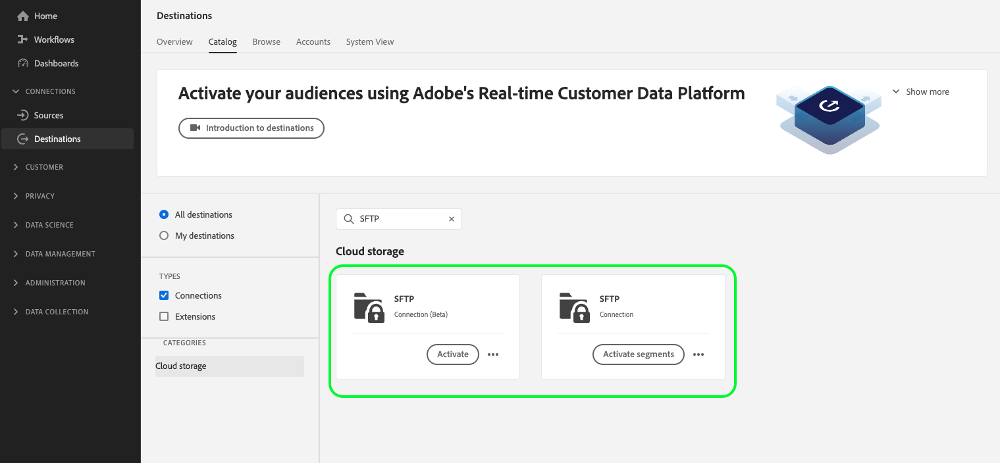

# Connexion SFTP

## Journal des modifications de destination {#changelog}

>[!IMPORTANT]
>
>Avec la version Beta de la fonctionnalité d’exportation des jeux de données et l’amélioration de la fonctionnalité d’exportation de fichiers, vous pouvez maintenant voir deux cartes [!DNL SFTP] dans le catalogue des destinations.
>* Si vous exportez déjà des fichiers vers la destination **[!UICONTROL SFTP]**, créez des flux de données vers la nouvelle destination **[!UICONTROL SFTP en version Beta]**.
>* Si vous n’avez pas encore créé de flux de données pour la variable **[!UICONTROL SFTP]** destination, utilisez la nouvelle **[!UICONTROL Version bêta SFTP]** carte pour exporter des fichiers vers **[!UICONTROL SFTP]**.

Améliorations de la nouvelle carte de destination [!DNL SFTP] :

* [Prise en charge de l’exportation des jeux de données](/help/destinations/ui/export-datasets.md).
* [Options de dénomination de fichier](/help/destinations/ui/activate-batch-profile-destinations.md#scheduling) supplémentaires.
* Possibilité de définir des en-têtes de fichier personnalisés dans vos fichiers exportés via l’[étape de mappage améliorée](/help/destinations/ui/activate-batch-profile-destinations.md#mapping).
* [Possibilité de personnaliser le formatage des fichiers de données CSV exportés](/help/destinations/ui/batch-destinations-file-formatting-options.md).

## Présentation {#overview}

Créez une connexion sortante active à votre serveur SFTP afin d’exporter périodiquement des fichiers de données délimités à partir d’Adobe Experience Platform.

>[!IMPORTANT]
>
> Bien qu’Experience Platform prenne en charge les exportations de données vers des serveurs SFTP, les emplacements de stockage dans le cloud recommandés pour exporter les données sont [!DNL Amazon S3] et [!DNL SFTP].

## Connexion à SFTP via l’API ou l’interface utilisateur {#connect-api-or-ui}

* Pour vous connecter à votre emplacement de stockage SFTP à l’aide de l’interface utilisateur de Platform, lisez les sections [Connexion à la destination](#connect) et [Activer les audiences vers cette destination](#activate) ci-dessous.
* Pour vous connecter à votre emplacement de stockage SFTP par programmation, lisez le [Activation des audiences vers des destinations basées sur des fichiers à l’aide du tutoriel de l’API Flow Service](../../api/activate-segments-file-based-destinations.md).

## Audiences prises en charge {#supported-audiences}

Cette section décrit toutes les audiences que vous pouvez exporter vers cette destination.

Toutes les destinations prennent en charge l’activation des audiences générées par l’Experience Platform [Segmentation Service](../../../segmentation/home.md).

En outre, cette destination prend également en charge l’activation des audiences décrites dans le tableau ci-dessous.

| Type d’audience | Description |
---------|----------|
| Chargements personnalisés | Audiences ingérées dans Experience Platform à partir de fichiers CSV. |

{style="table-layout:auto"}

## Type et fréquence d’exportation {#export-type-frequency}

Reportez-vous au tableau ci-dessous pour plus d’informations sur le type et la fréquence d’exportation des destinations.

| Élément | Type | Notes |
---------|----------|---------|
| Type d’exportation | **[!UICONTROL Basé sur les profils]** | Vous exportez tous les membres d’un segment, ainsi que les champs de schéma de votre choix (par exemple : adresse électronique, numéro de téléphone, nom), tel que sélectionné dans l’écran de sélection des attributs de profil du [workflow d’activation de destination](../../ui/activate-batch-profile-destinations.md#select-attributes). |
| Fréquence des exportations | **[!UICONTROL Lot]** | Les destinations par lots exportent des fichiers vers des plateformes en aval par incréments de trois, six, huit, douze ou vingt-quatre heures. En savoir plus sur les [destinations basées sur des fichiers par lots](/help/destinations/destination-types.md#file-based). |

{style="table-layout:auto"}

## Se connecter à la destination {#connect}

>[!IMPORTANT]
> 
>Pour vous connecter à la destination, vous devez disposer de l’[autorisation de contrôle d’accès](/help/access-control/home.md#permissions) **[!UICONTROL Gérer les destinations]**. Lisez la [présentation du contrôle d’accès](/help/access-control/ui/overview.md) ou contactez votre administrateur de produit pour obtenir les autorisations requises.

Pour vous connecter à cette destination, procédez comme décrit dans le [tutoriel sur la configuration des destinations](../../ui/connect-destination.md). Dans le workflow de configuration des destinations, renseignez les champs répertoriés dans les deux sections ci-dessous.

### Informations d’authentification {#authentication-information}

>[!CONTEXTUALHELP]
>id="platform_destinations_connect_sftp_rsa"
>title="Clé publique RSA"
>abstract="Vous pouvez éventuellement joindre votre clé publique au format RSA pour ajouter un chiffrement à vos fichiers exportés. Affichez un exemple de clé correctement formatée dans le lien de documentation ci-dessous."

>[!CONTEXTUALHELP]
>id="platform_destinations_connect_sftp_ssh"
>title="Clé SSH privée"
>abstract="La clé SSH privée doit être une chaîne codée en Base64 au format RSA et ne doit pas être protégée par un mot de passe."

Si vous sélectionnez la variable **[!UICONTROL SFTP avec mot de passe]** type d’authentification pour se connecter à votre emplacement SFTP :

* **[!UICONTROL Domaine]**: l’adresse de votre emplacement de stockage SFTP ;
* **[!UICONTROL Nom d’utilisateur]** : nom d’utilisateur pour se connecter à l’emplacement de stockage de votre SFTP ;
* **[!UICONTROL Port]** : le port utilisé par votre emplacement de stockage SFTP ;
* **[!UICONTROL Mot de passe]** : mot de passe pour se connecter à l’emplacement de stockage de votre SFTP.
* **[!UICONTROL Clé de chiffrement]** : vous pouvez éventuellement joindre votre clé publique au format RSA pour ajouter un chiffrement à vos fichiers exportés. Vous pouvez voir un exemple de clé correctement formatée dans l’image ci-dessous.

  

Si vous sélectionnez le type d’authentification **[!UICONTROL SFTP avec clé SSH]** pour vous connecter à votre emplacement SFTP :

* **[!UICONTROL Domaine]** : indiquez l’adresse IP ou le nom de domaine de votre compte SFTP ;
* **[!UICONTROL Port]** : le port utilisé par votre emplacement de stockage SFTP ;
* **[!UICONTROL Nom d’utilisateur]** : nom d’utilisateur pour se connecter à l’emplacement de stockage de votre SFTP ;
* **[!UICONTROL Clé SSH]** : clé SSH privée utilisée pour se connecter à l’emplacement de stockage de votre SFTP. La clé privée doit être une chaîne codée en Base64 au format RSA et ne doit pas être protégée par un mot de passe.
* **[!UICONTROL Clé de chiffrement]** : vous pouvez éventuellement joindre votre clé publique au format RSA pour ajouter un chiffrement à vos fichiers exportés. Vous pouvez voir un exemple de clé correctement formatée dans l’image ci-dessous.

  

### Détails de la destination {#destination-details}

Après avoir établi la connexion d’authentification à l’emplacement SFTP, fournissez les informations suivantes pour la destination :

* **[!UICONTROL Nom]**: saisissez un nom qui vous aide à identifier cette destination dans l’interface utilisateur de l’Experience Platform ;
* **[!UICONTROL Description]** : saisissez une description pour cette destination ;
* **[!UICONTROL Chemin du dossier]** : saisissez le chemin d’accès au dossier de votre emplacement SFTP où les fichiers seront exportés.
* **[!UICONTROL Type de fichier]**: sélectionnez le format que l’Experience Platform doit utiliser pour les fichiers exportés. Cette option n’est disponible que pour la variable **[!UICONTROL Version bêta SFTP]** destination. Lorsque vous sélectionnez la variable [!UICONTROL CSV] , vous pouvez également [configuration des options de formatage de fichier](../../ui/batch-destinations-file-formatting-options.md).
* **[!UICONTROL Format de compression]**: sélectionnez le type de compression que l’Experience Platform doit utiliser pour les fichiers exportés. Cette option n’est disponible que pour la variable **[!UICONTROL Version bêta SFTP]** destination.
* **[!UICONTROL Inclure le fichier manifeste]**: activez cette option si vous souhaitez que les exportations incluent un fichier JSON manifeste contenant des informations sur l’emplacement de l’exportation, la taille de l’exportation, etc. Cette option n’est disponible que pour la variable **[!UICONTROL Version bêta SFTP]** destination.

## Activer les audiences vers cette destination {#activate}

>[!IMPORTANT]
> 
>Pour activer les données, vous avez besoin des [autorisations de contrôle d’accès](/help/access-control/home.md#permissions) pour les fonctions **[!UICONTROL Gérer les destinations]**, **[!UICONTROL Activer les destinations]**, **[!UICONTROL Afficher les profils]**, et **[!UICONTROL Afficher les segments]**. Lisez la [présentation du contrôle d’accès](/help/access-control/ui/overview.md) ou contactez votre administrateur de produit pour obtenir les autorisations requises.

Voir [Activation des données d’audience vers des destinations d’exportation de profils par lots](../../ui/activate-batch-profile-destinations.md) pour obtenir des instructions sur l’activation des audiences vers cette destination.

## (Version bêta) Exporter des jeux de données {#export-datasets}

Cette destination prend en charge les exportations de jeux de données. Pour obtenir des informations complètes sur la configuration des exportations de jeux de données, consultez les tutoriels :

* Comment [exportation de jeux de données à l’aide de l’interface utilisateur de Platform](/help/destinations/ui/export-datasets.md).
* Comment [exporter des jeux de données par programmation à l’aide de l’API Flow Service](/help/destinations/api/export-datasets.md).

## Données exportées {#exported-data}

Pour les destinations [!DNL SFTP], Platform crée un fichier `.csv` à l’emplacement de stockage que vous avez indiqué. Pour plus d’informations sur les fichiers, voir [Activation des données d’audience vers des destinations d’exportation de profils par lots](../../ui/activate-batch-profile-destinations.md) dans le tutoriel sur l’activation de l’audience.

## Liste autorisée d’adresses IP {#ip-address-allow-list}

Voir [LISTE AUTORISÉE d’adresses IP pour les destinations SFTP](ip-address-allow-list.md) si vous devez ajouter des adresses IP d’Adobe à une liste autorisée.
