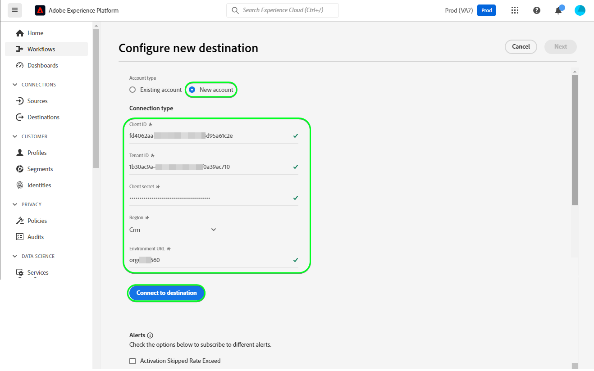

# Connexion [!DNL Microsoft Dynamics 365]

## Présentation {#overview}

[[!DNL Microsoft Dynamics 365]](https://dynamics.microsoft.com/fr-fr/) est une plateforme d’applications métier cloud qui combine la planification des ressources de l’entreprise (ERP) et la gestion de la relation client (CRM), ainsi que des applications de productivité et des outils d’IA, afin d’offrir des opérations de bout en bout plus fluides et plus contrôlées, un meilleur potentiel de croissance et des coûts réduits.

Cette [!DNL Adobe Experience Platform] [destination](/help/destinations/home.md) exploite le [[!DNL Contact Entity Reference API]](https://docs.microsoft.com/fr-fr/dynamics365/customerengagement/on-premises/developer/entities/contact?view=op-9-1) , ce qui vous permet de mettre à jour les identités d’une audience dans [!DNL Dynamics 365].

[!DNL Dynamics 365] utilise OAuth 2 avec l’octroi d’autorisation comme mécanisme d’authentification permettant de communiquer avec l’[!DNL Contact Entity Reference API]. Les instructions vous permettant de vous authentifier sur votre instance [!DNL Dynamics 365] sont plus loin dans la section [Authentifier à la destination](#authenticate).

## Cas d’utilisation {#use-cases}

En tant que professionnel du marketing, vous pouvez proposer des expériences personnalisées à vos utilisateurs en fonction des attributs de leurs profils Adobe Experience Platform. Vous pouvez créer des audiences à partir de vos données hors ligne et envoyer ces audiences à [!DNL Dynamics 365], pour les afficher dans les flux des utilisateurs dès que les audiences et les profils sont mis à jour dans Adobe Experience Platform.

## Conditions préalables {#prerequisites}

### Conditions préalables d’Experience Platform {#prerequisites-in-experience-platform}

Avant d’activer des données dans la destination [!DNL Dynamics 365], vous devez avoir créé un [schéma](/help/xdm/schema/composition.md), un [jeu de données](https://experienceleague.adobe.com/docs/platform-learn/tutorials/data-ingestion/create-datasets-and-ingest-data.html) et des [audiences](https://experienceleague.adobe.com/docs/platform-learn/tutorials/audiences/create-audiences.html) dans [!DNL Experience Platform].

Reportez-vous à la documentation d’Adobe pour le [groupe de champs de schéma Détails sur l’appartenance à une audience](/help/xdm/field-groups/profile/segmentation.md) si vous avez besoin de conseils sur les statuts de l’audience.

### Conditions préalables de [!DNL Microsoft Dynamics 365] {#prerequisites-destination}

Notez les conditions préalables suivantes dans [!DNL Dynamics 365], afin d’exporter des données d’Experience Platform vers votre compte [!DNL Dynamics 365] :

#### Vous devez avoir un compte [!DNL Microsoft Dynamics 365]. {#prerequisites-account}

Accédez à la page [Évaluation](https://dynamics.microsoft.com/fr-fr/dynamics-365-free-trial/) de [!DNL Dynamics 365] pour vous enregistrer et créer un compte, le cas échéant.

#### Créer un champ dans [!DNL Dynamics 365] {#prerequisites-custom-field}

Créez le champ personnalisé de type `Simple` avec le type de données de champ comme `Single Line of Text` qu’Experience Platform utilisera pour mettre à jour le statut de l’audience dans [!DNL Dynamics 365].

Reportez-vous à la documentation [!DNL Dynamics 365] [Créer ou modifier un champ (attribut)](https://docs.microsoft.com/fr-fr/dynamics365/customerengagement/on-premises/customize/create-edit-fields?view=op-9-1) si vous avez besoin de conseils supplémentaires.

Notez le **[!UICONTROL Customization prefix]** du champ personnalisé que vous créez dans [!DNL Dynamics 365]. Vous aurez besoin de ce préfixe lors de l’étape [Renseigner les détails de la destination](#destination-details). Reportez-vous à la section [Créer et modifier des champs](https://learn.microsoft.com/en-us/dynamics365/customerengagement/on-premises/customize/create-edit-fields?view=op-9-1#create-and-edit-fields) de la documentation [!DNL Dynamics 365] pour plus d’informations.

Un exemple de configuration dans [!DNL Dynamics 365] est illustré ci-dessous :

#### Enregistrez une application et un utilisateur de l’application dans Azure Active Directory. {#prerequisites-app-user}

Pour permettre à [!DNL Dynamics 365] d’accéder aux ressources, vous devez vous connecter avec votre [!DNL Azure Account] à [[!DNL Azure Active Directory]](https://docs.microsoft.com/fr-fr/azure/active-directory/develop/howto-create-service-principal-portal#register-an-application-with-azure-ad-and-create-a-service-principal) et créer les éléments suivants :

* Une application [!DNL Azure Active Directory]
* Un principal de service
* Une clé secrète

Vous devrez également [créer un utilisateur de l’application](https://docs.microsoft.com/fr-fr/power-platform/admin/manage-application-users#create-an-application-user) dans [!DNL Azure Active Directory] et l’associer à l’application nouvellement créée.

#### Collectez les informations d’identification de [!DNL Dynamics 365]. {#gather-credentials}

Notez les éléments ci-dessous avant de vous authentifier à la destination CRM [!DNL Dynamics 365] :

| Informations d’identification | Description | Exemple |
| --- | --- | --- |
| `Client ID` | L’identifiant client [!DNL Dynamics 365] pour votre application [!DNL Azure Active Directory]. Reportez-vous à la documentation de [[!DNL Dynamics 365] ](https://docs.microsoft.com/fr-fr/azure/active-directory/develop/howto-create-service-principal-portal#get-tenant-and-app-id-values-for-signing-in) pour obtenir des conseils. | `ababbaba-abab-baba-acac-acacacacacac` |
| `Client Secret` | Le Secret client [!DNL Dynamics 365] pour votre application [!DNL Azure Active Directory]. Vous utiliseriez l’option #2 dans la documentation de [[!DNL Dynamics 365] ](https://docs.microsoft.com/fr-fr/azure/active-directory/develop/howto-create-service-principal-portal#authentication-two-options). | `abcde~abcdefghijklmnopqrstuvwxyz12345678` pour obtenir des conseils. |
| `Tenant ID` | L’identifiant client [!DNL Dynamics 365] pour votre application [!DNL Azure Active Directory]. Reportez-vous à la documentation de [[!DNL Dynamics 365] ](https://docs.microsoft.com/fr-fr/azure/active-directory/develop/howto-create-service-principal-portal#get-tenant-and-app-id-values-for-signing-in) pour obtenir des conseils. | `1234567-aaaa-12ab-ba21-1234567890` |
| `Region` | Région Microsoft associée à l’URL de l’environnement.  Reportez-vous à la [[!DNL Dynamics 365] documentation](https://learn.microsoft.com/en-us/power-platform/admin/new-datacenter-regions) pour obtenir des conseils. | Si votre domaine est comme ci-dessous, vous devez fournir la valeur mise en surbrillance pour le champ CRM dans le sélecteur de liste déroulante lors de l’authentification auprès de la [destination](#authenticate).  *org57771b33.`crm`.dynamics.com*  À titre d’exemple : si votre société est approvisionnée dans la région Amérique du Nord (NAM), votre URL est `crm.dynamics.com` et vous devez sélectionner `crm`. Si votre entreprise est approvisionnée dans la région du Canada (CAN), votre URL sera `crm3.dynamics.com` et vous devrez sélectionner `crm3`. |
| `Environment URL` | Reportez-vous à la documentation de [[!DNL Dynamics 365] ](https://docs.microsoft.com/fr-fr/dynamics365/customerengagement/on-premises/developer/org-service/discover-url-organization-organization-service?view=op-9-1) pour obtenir des conseils. | Si votre domaine [!DNL Dynamics 365] est comme ci-dessous, vous avez besoin de la valeur mise en surbrillance.  *`org57771b33`.crm.dynamics.com* |

{style="table-layout:auto"}

## Mécanismes de sécurisation {#guardrails}

La page [Limites et allocations de requêtes](https://docs.microsoft.com/fr-fr/power-platform/admin/api-request-limits-allocations) détaille les limites d’API [!DNL Dynamics 365] associées à votre licence [!DNL Dynamics 365]. Vous devez vous assurer que vos données et votre payload sont conformes à ces contraintes.

## Identités prises en charge {#supported-identities}

[!DNL Dynamics 365] prend en charge la mise à jour des identités décrites dans le tableau ci-dessous. En savoir plus sur les [identités](/help/identity-service/features/namespaces.md).

| Identité cible | Exemple | Description | Considérations |
|---|---|---|---|
| `contactid` | 7eb682f1-ca75-e511-80d4-00155d2a68d1 | Identifiant unique d’un contact. | **Obligatoire**. Reportez-vous à la documentation de [[!DNL Dynamics 365] ](https://docs.microsoft.com/fr-fr/dynamics365/customerengagement/on-premises/developer/entities/contact?view=op-9-1) pour plus d’informations. |

{style="table-layout:auto"}

## Audiences prises en charge {#supported-audiences}

Cette section décrit toutes les audiences que vous pouvez exporter vers cette destination.

Cette destination prend en charge l’activation de toutes les audiences générées par le [Segmentation Service](../../../segmentation/home.md) d’Experience Platform.

## Type et fréquence d’exportation {#export-type-frequency}

Reportez-vous au tableau ci-dessous pour plus d’informations sur le type et la fréquence d’exportation des destinations.

| Élément | Type | Notes |
|---------|----------|---------|
| Type d’exportation | **[!UICONTROL Profile-based]** | <ul><li>Vous exportez tous les membres d’une audience, ainsi que les champs de schéma souhaités *(par exemple : adresse e-mail, numéro de téléphone, nom)*, en fonction de votre mappage de champs.</li><li> Chaque statut d’audience dans [!DNL Dynamics 365] est mis à jour avec le statut d’audience correspondant d’Experience Platform, en fonction de la valeur **[!UICONTROL Mapping ID]** fournie lors de l’étape [planification de l’audience](#schedule-audience-export-example).</li></ul> |
| Fréquence des exportations | **[!UICONTROL Streaming]** | <ul><li>Les destinations de diffusion en continu sont des connexions basées sur l’API « toujours actives ». Dès qu’un profil est mis à jour dans Experience Platform en fonction de l’évaluation des audiences, le connecteur envoie la mise à jour en aval vers la plateforme de destination. En savoir plus sur les [destinations de diffusion en continu](/help/destinations/destination-types.md#streaming-destinations).</li></ul> |

{style="table-layout:auto"}

## Se connecter à la destination {#connect}

>[!IMPORTANT]
>
>Pour vous connecter à la destination, vous avez besoin des **[!UICONTROL View Destinations]** et **[!UICONTROL Manage Destinations]** [autorisations de contrôle d’accès](/help/access-control/home.md#permissions). Lisez la [présentation du contrôle d’accès](/help/access-control/ui/overview.md) ou contactez votre administrateur de produit pour obtenir les autorisations requises.

Pour vous connecter à cette destination, procédez comme décrit dans le [tutoriel sur la configuration des destinations](../../ui/connect-destination.md). Dans le workflow de configuration des destinations, renseignez les champs répertoriés dans les deux sections ci-dessous.

Dans **[!UICONTROL Destinations]** > **[!UICONTROL Catalog]**, recherchez [!DNL Dynamics 365]. Vous pouvez également localiser cet élément dans la catégorie **[!UICONTROL CRM]** .

### S’authentifier auprès de la destination {#authenticate}

Pour vous authentifier auprès de la destination, sélectionnez **[!UICONTROL Connect to destination]**.

Renseignez les champs obligatoires ci-dessous. Reportez-vous à la section [Collecter des informations d’identification Dynamics 365](#gather-credentials) pour obtenir des conseils.

* **[!UICONTROL Client ID]** : identifiant client [!DNL Dynamics 365] pour votre application [!DNL Azure Active Directory].
* **[!UICONTROL Tenant ID]** : ID de client [!DNL Dynamics 365] pour votre application [!DNL Azure Active Directory].
* **[!UICONTROL Client Secret]** : secret client [!DNL Dynamics 365] pour votre application [!DNL Azure Active Directory].
* **[!UICONTROL Region]** : Votre Région [[!DNL Dynamics 365]](https://learn.microsoft.com/en-us/power-platform/admin/new-datacenter-regions). À titre d’exemple : si votre société est approvisionnée dans la région Amérique du Nord (NAM), votre URL est `crm.dynamics.com` et vous devez sélectionner `crm`. Si votre entreprise est approvisionnée dans la région du Canada (CAN), votre URL sera `crm3.dynamics.com` et vous devrez sélectionner `crm3`.
* **[!UICONTROL Environment URL]** : URL de votre environnement [!DNL Dynamics 365].

Si les détails fournis sont valides, l’interface utilisateur affiche un statut de **[!UICONTROL Connected]** avec une coche verte. Vous pouvez ensuite passer à l’étape suivante.

### Renseigner les détails de la destination {#destination-details}

Pour configurer les détails de la destination, renseignez les champs obligatoires et facultatifs ci-dessous. Un astérisque situé en regard d’un champ de l’interface utilisateur indique que le champ est obligatoire.

* **[!UICONTROL Name]** : nom par lequel vous reconnaîtrez cette destination à l’avenir.
* **[!UICONTROL Description]** : une description qui vous aidera à identifier cette destination à l’avenir.
* **[!UICONTROL Customization Prefix]** : `Customization prefix` du champ personnalisé que vous avez créé dans [!DNL Dynamics 365]. Reportez-vous à la section [Créer et modifier des champs](https://learn.microsoft.com/en-us/dynamics365/customerengagement/on-premises/customize/create-edit-fields?view=op-9-1#create-and-edit-fields) de la documentation [!DNL Dynamics 365] pour plus d’informations.

### Activer les alertes {#enable-alerts}

Vous pouvez activer les alertes pour recevoir des notifications sur le statut de votre flux de données vers votre destination. Sélectionnez une alerte dans la liste et abonnez-vous à des notifications concernant le statut de votre flux de données. Pour plus d’informations sur les alertes, consultez le guide sur l’[abonnement aux alertes des destinations dans l’interface utilisateur](../../ui/alerts.md).

Lorsque vous avez terminé de renseigner les détails sur votre connexion de destination, sélectionnez **[!UICONTROL Next]**.

## Activer des audiences vers cette destination {#activate}

>[!IMPORTANT]
> 
>* Pour activer les données, vous avez besoin des autorisations de contrôle d’accès **[!UICONTROL View Destinations]**, **[!UICONTROL Activate Destinations]**, **[!UICONTROL View Profiles]** et **[!UICONTROL View Segments]** [Access control](/help/access-control/home.md#permissions). Lisez la [présentation du contrôle d’accès](/help/access-control/ui/overview.md) ou contactez votre administrateur ou administratrice du produit pour obtenir les autorisations requises.
>* Pour exporter des *identités*, vous devez disposer de l’autorisation de contrôle d’accès **[!UICONTROL View Identity Graph]**.   {width="100" zoomable="yes"}

Consultez la section [Activer les profils et les audiences vers les destinations d’exportation d’audiences en flux continu](/help/destinations/ui/activate-segment-streaming-destinations.md) pour obtenir des instructions sur l’activation des audiences vers cette destination.

### Considérations sur le mappage et exemple {#mapping-considerations-example}

Pour envoyer correctement vos données d’audience d’Adobe Experience Platform vers la destination [!DNL Dynamics 365], vous devez passer par l’étape de mappage des champs. Le mappage consiste à créer un lien entre vos champs de schéma de modèle de données d’expérience (XDM) dans votre compte Experience Platform et leurs équivalents issus de la destination cible. Pour mapper correctement vos champs XDM vers les champs de destination [!DNL Dynamics 365], procédez comme suit :

1. À l’étape **[!UICONTROL Mapping]**, sélectionnez **[!UICONTROL Add new mapping]**. Une nouvelle ligne de mappage s’affichera à l’écran.
   

1. Dans la fenêtre de **[!UICONTROL Select source field]**, choisissez la catégorie **[!UICONTROL Select identity namespace]** et sélectionnez `contactid`.
   

1. Dans la fenêtre **[!UICONTROL Select target field]** , sélectionnez le type de champ cible vers lequel vous souhaitez mapper votre champ source.
   * **[!UICONTROL Select identity namespace]** : sélectionnez cette option pour mapper votre champ source vers un espace de noms d’identité de la liste.
     

   * Ajoutez le mappage suivant entre votre schéma de profil XDM et votre instance [!DNL Dynamics 365] :

     | Schéma de profil XDM | Instance [!DNL Dynamics 365] | Obligatoire |
     |---|---|---|
     | `contactid` | `contactid` | Oui |

   * **[!UICONTROL Select custom attributes]** : sélectionnez cette option pour mapper votre champ source vers un attribut personnalisé que vous définissez dans le champ **[!UICONTROL Attribute name]**. Pour une liste complète des attributs pris en charge, consultez la [[!DNL Dynamics 365] documentation](https://docs.microsoft.com/fr-fr/dynamics365/customerengagement/on-premises/developer/entities/contact?view=op-9-1#entity-properties).
     

     >[!IMPORTANT]
     >
     > * Les noms des champs cibles doivent être en `lowercase`.
     > * En outre, si vous disposez d’un champ source de date ou d’horodatage mappé à un champ cible [!DNL Dynamics 365] [date ou horodatage](https://docs.microsoft.com/fr-fr/power-apps/developer/data-platform/webapi/reference/timestampdatemapping?view=dataverse-latest), assurez-vous que la valeur mappée n’est pas vide. Si la valeur du champ exporté est vide, un message d’erreur *`Bad request reported while pushing events to the destination. Please contact the administrator and try again.`* s’affiche et les données ne sont pas mises à jour. Il s’agit d’une limitation de [!DNL Dynamics 365].

   * Par exemple, en fonction des valeurs que vous souhaitez mettre à jour, ajoutez le mappage suivant entre votre schéma de profil XDM et votre instance [!DNL Dynamics 365] :

     | Schéma de profil XDM | Instance [!DNL Dynamics 365] |
     |---|---|
     | `person.name.firstName` | `firstname` |
     | `person.name.lastName` | `lastname` |
     | `personalEmail.address` | `emailaddress1` |

   * Un exemple d’utilisation de ces mappages est illustré ci-dessous :

   

### Planifier l’exportation de l’audience et exemple {#schedule-audience-export-example}

Dans l’étape [[!UICONTROL Schedule audience export]](/help/destinations/ui/activate-segment-streaming-destinations.md#scheduling) du workflow d’activation, vous devez mapper manuellement les audiences Experience Platform vers l’attribut de champ personnalisé dans [!DNL Dynamics 365].

Pour ce faire, sélectionnez chaque audience, puis saisissez l’attribut de champ personnalisé correspondant à partir de [!DNL Dynamics 365] dans le champ **[!UICONTROL Mapping ID]** .

>[!IMPORTANT]
>
>La valeur utilisée pour le **[!UICONTROL Mapping ID]** doit correspondre exactement au nom de l’attribut de champ personnalisé créé dans [!DNL Dynamics 365]. Voir [[!DNL Dynamics 365] documentation](https://docs.microsoft.com/fr-fr/dynamics365/customerengagement/on-premises/customize/create-edit-fields?view=op-9-1) si vous avez besoin de conseils pour trouver vos attributs de champ personnalisés.

Un exemple est illustré ci-dessous :

## Valider l’exportation des données {#exported-data}

Pour vérifier que vous avez correctement configuré la destination, procédez comme suit :

1. Sélectionnez **[!UICONTROL Destinations]** > **[!UICONTROL Browse]** pour accéder à la liste des destinations.
   

1. Sélectionnez la destination et vérifiez que le statut est **[!UICONTROL enabled]**.
   

1. Passez à l’onglet **[!DNL Activation data]** , puis sélectionnez un nom d’audience.
   

1. Surveillez le résumé de l’audience et assurez-vous que le nombre de profils correspond au nombre créé dans l’audience.
   

1. Connectez-vous au site web [!DNL Dynamics 365], puis accédez à la page [!DNL Customers] > [!DNL Contacts] et vérifiez si les profils de l’audience ont été ajoutés. Comme vous pouvez le constater, chaque statut d’audience dans [!DNL Dynamics 365] a été mis à jour avec le statut d’audience correspondant d’Experience Platform, en fonction de la valeur **[!UICONTROL Mapping ID]** fournie lors de l’étape [planification de l’audience](#schedule-audience-export-example).
   

## Utilisation et gouvernance des données {#data-usage-governance}

Lors de la gestion de vos données, toutes les destinations [!DNL Adobe Experience Platform] se conforment aux politiques d’utilisation des données. Pour obtenir des informations détaillées sur la manière dont [!DNL Adobe Experience Platform] applique la gouvernance des données, lisez la [présentation de la gouvernance des données](/help/data-governance/home.md).

## Erreurs et résolution des problèmes {#errors-and-troubleshooting}

### Erreurs inconnues rencontrées lors de la publication d’événements vers la destination {#unknown-errors}

Lors de la vérification d’une exécution de flux de données, si vous obtenez le message d’erreur suivant : `Bad request reported while pushing events to the destination. Please contact the administrator and try again.`

Pour corriger cette erreur, vérifiez que le **[!UICONTROL Mapping ID]** que vous avez fourni dans [!DNL Dynamics 365] pour votre audience Experience Platform est valide et existe dans [!DNL Dynamics 365].

## Ressources supplémentaires {#additional-resources}

Retrouvez d’autres informations utiles de la documentation de [[!DNL Dynamics 365] ](https://docs.microsoft.com/fr-fr/dynamics365/) ci-dessous :

* [Méthode IOrganizationService.Update(Entity)](https://docs.microsoft.com/fr-fr/dotnet/api/microsoft.xrm.sdk.iorganizationservice.update?view=dataverse-sdk-latest)
* [Mettre à jour et supprimer des lignes de table à l’aide de l’API Web](https://docs.microsoft.com/fr-fr/power-apps/developer/data-platform/webapi/update-delete-entities-using-web-api#basic-update)

### Journal des modifications

Cette section répertorie les nouvelles fonctionnalités et les mises à jour importantes de la documentation consacrée au connecteur de destination.

+++ Afficher le journal des modifications

| Mois de publication | Type de mise à jour | Description |
|---|---|---|
| Octobre 2023 | Mise à jour de la documentation | Les conseils mis à jour pour indiquer tous les noms d’attributs cibles doivent être en minuscules, dans l’étape [Considérations relatives au mappage et exemple](#mapping-considerations-example). |
| Août 2023 | Nouvelles fonctionnalités et mise à jour de la documentation | Ajout de la prise en charge de préfixes de champ personnalisés [!DNL Dynamics 365] pour les champs personnalisés qui n’ont pas été créés dans la solution par défaut dans [!DNL Dynamics 365]. Un nouveau champ d’entrée, **[!UICONTROL Customization Prefix]**, a été ajouté à l’étape [Renseigner les détails de la destination](#destination-details). (PLATIR-31602). |
| Novembre 2022 | Version initiale | Publication de la destination initiale et de la documentation. |

{style="table-layout:auto"}

+++
