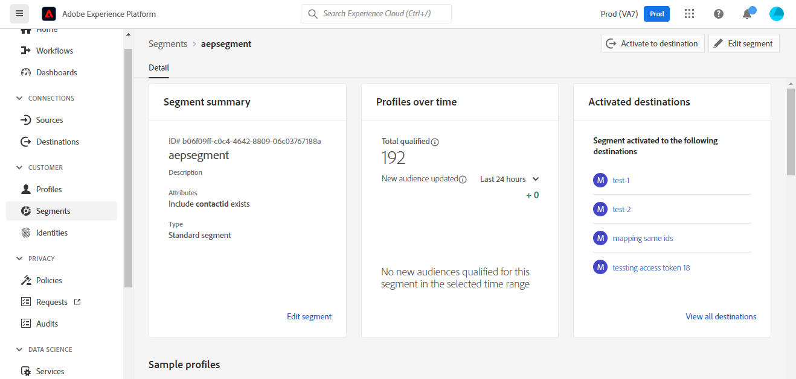

# Connexion [!DNL Microsoft Dynamics 365]

## Présentation {#overview}

[[!DNL Microsoft Dynamics 365]](https://dynamics.microsoft.com/fr-fr/) est une plateforme d’applications métier cloud qui combine la planification des ressources de l’entreprise (ERP) et la gestion de la relation client (CRM), ainsi que des applications de productivité et des outils d’IA, afin d’offrir des opérations de bout en bout plus fluides et plus contrôlées, un meilleur potentiel de croissance et des coûts réduits.

Cette [destination](/help/destinations/home.md) [!DNL Adobe Experience Platform] utilise [[!DNL Contact Entity Reference API]](https://docs.microsoft.com/fr-fr/dynamics365/customerengagement/on-premises/developer/entities/contact?view=op-9-1), ce qui vous permet de mettre à jour les identités d’un segment dans [!DNL Dynamics 365].

[!DNL Dynamics 365] utilise OAuth 2 avec l’octroi d’autorisation comme mécanisme d’authentification permettant de communiquer avec l’[!DNL Contact Entity Reference API]. Les instructions vous permettant de vous authentifier sur votre instance [!DNL Dynamics 365] sont plus loin dans la section [Authentifier à la destination](#authenticate).

## Cas d’utilisation {#use-cases}

En tant que professionnel du marketing, vous pouvez proposer des expériences personnalisées à vos utilisateurs en fonction des attributs de leurs profils Adobe Experience Platform. Vous pouvez créer des segments à partir de vos données hors ligne et envoyer ces segments vers [!DNL Dynamics 365], pour les afficher dans les flux des utilisateurs dès que les segments et les profils sont mis à jour dans Adobe Experience Platform.

## Conditions préalables {#prerequisites}

### Conditions préalables d’Experience Platform {#prerequisites-in-experience-platform}

Avant d’activer des données dans la destination [!DNL Dynamics 365], vous devez avoir un [schéma](/help/xdm/schema/composition.md), un [jeu de données](https://experienceleague.adobe.com/docs/platform-learn/tutorials/data-ingestion/create-datasets-and-ingest-data.html?lang=fr), ainsi que des [segments](https://experienceleague.adobe.com/docs/platform-learn/tutorials/segments/create-segments.html?lang=fr) créés dans [!DNL Experience Platform].

Si vous avez besoin de conseils pour les statuts de segment, reportez-vous à la documentation d’Adobe pour le [groupe de champs de schéma Détails de l’appartenance à un segment](/help/xdm/field-groups/profile/segmentation.md).

### Conditions préalables de [!DNL Microsoft Dynamics 365] {#prerequisites-destination}

Notez les conditions préalables suivantes dans [!DNL Dynamics 365], afin d’exporter des données de Platform vers votre compte [!DNL Dynamics 365] :

#### Vous devez avoir un compte [!DNL Microsoft Dynamics 365]. {#prerequisites-account}

Accédez à la page [Évaluation](https://dynamics.microsoft.com/fr-fr/dynamics-365-free-trial/) de [!DNL Dynamics 365] pour vous enregistrer et créer un compte, le cas échéant.

#### Créer un champ dans [!DNL Dynamics 365] {#prerequisites-custom-field}

Créez un champ personnalisé de type `Simple` avec le type de données de champ comme `Single Line of Text` qu’Experience Platform utilisera pour mettre à jour le statut du segment dans [!DNL Dynamics 365].
Reportez-vous à la documentation [!DNL Dynamics 365] pour [créer un champ (attribut)](https://docs.microsoft.com/fr-fr/dynamics365/customerengagement/on-premises/customize/create-edit-fields?view=op-9-1) si vous avez besoin de conseils supplémentaires.

Un exemple de configuration dans [!DNL Dynamics 365] est illustré ci-dessous :

#### Enregistrez une application et un utilisateur de l’application dans Azure Active Directory. {#prerequisites-app-user}

Pour permettre à [!DNL Dynamics 365] d’accéder aux ressources, vous devez vous connecter avec votre [!DNL Azure Account] à [[!DNL Azure Active Directory]](https://docs.microsoft.com/fr-fr/azure/active-directory/develop/howto-create-service-principal-portal#register-an-application-with-azure-ad-and-create-a-service-principal) et créer les éléments suivants :
* Une application [!DNL Azure Active Directory]
* Un principal de service
* Une clé secrète

Vous devrez également [créer un utilisateur de l’application](https://docs.microsoft.com/fr-fr/power-platform/admin/manage-application-users#create-an-application-user) dans [!DNL Azure Active Directory] et l’associer à l’application nouvellement créée.

#### Collectez les informations d’identification de [!DNL Dynamics 365]. {#gather-credentials}

Notez les éléments ci-dessous avant de vous authentifier à la destination CRM [!DNL Dynamics 365] :

| Informations d’identification | Description | Exemple |
| --- | --- | --- |
| `Client ID` | L’identifiant client [!DNL Dynamics 365] pour votre application [!DNL Azure Active Directory]. Reportez-vous à la documentation de [[!DNL Dynamics 365] ](https://docs.microsoft.com/fr-fr/azure/active-directory/develop/howto-create-service-principal-portal#get-tenant-and-app-id-values-for-signing-in) pour obtenir des conseils. | `ababbaba-abab-baba-acac-acacacacacac` |
| `Client Secret` | Le Secret client [!DNL Dynamics 365] pour votre application [!DNL Azure Active Directory]. Vous utiliseriez l’option #2 dans la documentation de [[!DNL Dynamics 365] ](https://docs.microsoft.com/fr-fr/azure/active-directory/develop/howto-create-service-principal-portal#authentication-two-options). | `abcde~abcdefghijklmnopqrstuvwxyz12345678` pour obtenir des conseils. |
| `Tenant ID` | L’identifiant client [!DNL Dynamics 365] pour votre application [!DNL Azure Active Directory]. Reportez-vous à la documentation de [[!DNL Dynamics 365] ](https://docs.microsoft.com/fr-fr/azure/active-directory/develop/howto-create-service-principal-portal#get-tenant-and-app-id-values-for-signing-in) pour obtenir des conseils. | `1234567-aaaa-12ab-ba21-1234567890` |
| `Environment URL` | Reportez-vous à la documentation de [[!DNL Dynamics 365] ](https://docs.microsoft.com/fr-fr/dynamics365/customerengagement/on-premises/developer/org-service/discover-url-organization-organization-service?view=op-9-1) pour obtenir des conseils. | Si votre domaine [!DNL Dynamics 365] est comme ci-dessous, vous avez besoin de la valeur mise en surbrillance.  *`org57771b33`.crm.dynamics.com* |

## Barrières de sécurité {#guardrails}

La page [Limites et allocations de requêtes](https://docs.microsoft.com/fr-fr/power-platform/admin/api-request-limits-allocations) détaille les limites d’API [!DNL Dynamics 365] associées à votre licence [!DNL Dynamics 365]. Vous devez vous assurer que vos données et votre payload sont conformes à ces contraintes.

## Identités prises en charge {#supported-identities}

[!DNL Dynamics 365] prend en charge la mise à jour des identités décrites dans le tableau ci-dessous. En savoir plus sur les [identités](/help/identity-service/namespaces.md).

| Identité cible | Exemple | Description | Considérations |
|---|---|---|---|
| `contactId` | 7eb682f1-ca75-e511-80d4-00155d2a68d1 | Identifiant unique d’un contact. | **Obligatoire**. Reportez-vous à la documentation de [[!DNL Dynamics 365] ](https://docs.microsoft.com/fr-fr/dynamics365/customerengagement/on-premises/developer/entities/contact?view=op-9-1) pour plus d’informations. |

## Type et fréquence d’exportation {#export-type-frequency}

Reportez-vous au tableau ci-dessous pour plus d’informations sur le type et la fréquence d’exportation des destinations.

| Élément | Type | Notes |
---------|----------|---------|
| Type d’exportation | **[!UICONTROL Basé sur les profils]** | <ul><li>Vous exportez tous les membres d’un segment, ainsi que les champs de schéma souhaités, *(par exemple : adresse e-mail, numéro de téléphone, nom)*, en fonction de votre mappage de champs.</li><li> Chaque statut du segment dans [!DNL Dynamics 365] est mis à jour avec le statut du segment correspondant de Platform, en fonction de la valeur de l’**[!UICONTROL identifiant de mappage]** fournie pendant l’étape de [planification des segments](#schedule-segment-export-example).</li></ul> |
| Fréquence des exportations | **[!UICONTROL Diffusion en continu]** | <ul><li>Les destinations de diffusion en continu sont des connexions basées sur l’API « toujours actives ». Dès qu’un profil est mis à jour dans Experience Platform en fonction de l’évaluation des segments, le connecteur envoie la mise à jour en aval vers la plateforme de destination. En savoir plus sur les [destinations de diffusion en continu](/help/destinations/destination-types.md#streaming-destinations).</li></ul> |

{style=&quot;table-layout:auto&quot;}

## Se connecter à la destination {#connect}

>[!IMPORTANT]
>
>Pour vous connecter à la destination, vous devez disposer de l’[autorisation de contrôle d’accès](/help/access-control/home.md#permissions) **[!UICONTROL Gérer les destinations]**. Lisez la [présentation du contrôle d’accès](/help/access-control/ui/overview.md) ou contactez votre administrateur de produit pour obtenir les autorisations requises.

Pour vous connecter à cette destination, procédez comme décrit dans le [tutoriel sur la configuration des destinations](../../ui/connect-destination.md). Dans le workflow de configuration des destinations, renseignez les champs répertoriés dans les deux sections ci-dessous.

Dans **[!UICONTROL Destinations]** > **[!UICONTROL Catalogue]**, recherchez [!DNL Dynamics 365]. Vous pouvez également localiser cet élément dans la catégorie **[!UICONTROL CRM]**.

### S’authentifier auprès de la destination {#authenticate}

Pour vous authentifier auprès de la destination, sélectionnez **[!UICONTROL Se connecter à la destination]**.

Renseignez les champs obligatoires ci-dessous. Reportez-vous à la section [Collecter des informations d’identification Dynamics 365](#gather-credentials) pour obtenir des conseils.
* **[!UICONTROL Identifiant client]** : l’identifiant client [!DNL Dynamics 365] pour votre application [!DNL Azure Active Directory].
* **[!UICONTROL Identifiant client]** : l’identifiant client [!DNL Dynamics 365] pour votre application [!DNL Azure Active Directory].
* **[!UICONTROL Secret client]** : le secret client [!DNL Dynamics 365] pour votre application [!DNL Azure Active Directory].
* **[!UICONTROL URL d’environnement]** : votre URL d’environnement [!DNL Dynamics 365].

Si les détails fournis sont valides, l’interface utilisateur affiche un statut **[!UICONTROL Connecté]** avec une coche verte. Vous pouvez ensuite passer à l’étape suivante.

### Renseigner les détails de la destination {#destination-details}

Pour configurer les détails de la destination, renseignez les champs obligatoires et facultatifs ci-dessous. Un astérisque situé en regard d’un champ de l’interface utilisateur indique que le champ est obligatoire.

* **[!UICONTROL Nom]** : un nom par lequel vous reconnaîtrez cette destination à l’avenir.
* **[!UICONTROL Description]** : une description qui vous aidera à identifier cette destination à l’avenir.

### Activer les alertes {#enable-alerts}

Vous pouvez activer les alertes pour recevoir des notifications sur le statut de votre flux de données vers votre destination. Sélectionnez une alerte dans la liste et abonnez-vous à des notifications concernant le statut de votre flux de données. Pour plus d’informations sur les alertes, consultez le guide sur l’[abonnement aux alertes des destinations dans l’interface utilisateur](../../ui/alerts.md).

Lorsque vous avez terminé de renseigner les détails sur votre connexion de destination, sélectionnez **[!UICONTROL Suivant]**.

## Activer des segments vers cette destination {#activate}

>[!IMPORTANT]
>
>Pour activer les données, vous avez besoin des [autorisations de contrôle d’accès](/help/access-control/home.md#permissions) pour les fonctions **[!UICONTROL Gérer les destinations]**, **[!UICONTROL Activer les destinations]**, **[!UICONTROL Afficher les profils]**, et **[!UICONTROL Afficher les segments]**. Lisez la [présentation du contrôle d’accès](/help/access-control/ui/overview.md) ou contactez votre administrateur de produit pour obtenir les autorisations requises.

Consultez [Activer les profils et les segments vers les destinations d’exportation de segments de diffusion en continu](/help/destinations/ui/activate-segment-streaming-destinations.md) pour obtenir des instructions sur l’activation des segments d’audience vers cette destination.

### Considérations sur le mappage et exemple {#mapping-considerations-example}

Pour envoyer correctement vos données d’audience d’Adobe Experience Platform vers la destination [!DNL Dynamics 365], vous devez passer par l’étape de mappage des champs. Le mappage consiste à créer un lien entre vos champs de schéma de modèle de données d’expérience (XDM) dans votre compte Platform et leurs équivalents issus de la destination cible. Pour mapper correctement vos champs XDM vers les champs de destination [!DNL Dynamics 365], procédez comme suit :

1. Dans l’étape **[!UICONTROL Mappage]**, sélectionnez **[!UICONTROL Ajouter un nouveau mappage]**. Une nouvelle ligne de mappage s’affichera à l’écran.
   

1. Dans la fenêtre **[!UICONTROL Sélectionner le champ source]**, choisissez la catégorie **[!UICONTROL Sélectionner un espace de noms d’identité]** et sélectionnez `contactId`.
   

1. Dans la fenêtre **[!UICONTROL Sélectionner le champ cible]**, sélectionnez le type de champ cible vers lequel vous souhaitez mapper votre champ source.
   * **[!UICONTROL Sélectionner un espace de noms d’identité]** : sélectionnez cette option pour mapper votre champ source vers un espace de noms d’identité de la liste.
      

   * Ajoutez le mappage suivant entre votre schéma de profil XDM et votre instance [!DNL Dynamics 365] :
|Schéma de profil XDM|[!DNL Dynamics 365] Instance| Obligatoire|
|—|—|—| |`contactId`|`contactId`| Oui |

   * **[!UICONTROL Sélectionner des attributs personnalisés]** : sélectionnez cette option pour mapper votre champ source vers un attribut personnalisé que vous définissez dans le champ **[!UICONTROL Nom de l’attribut]**. Pour une liste complète des attributs pris en charge, consultez la [[!DNL Dynamics 365] documentation](https://docs.microsoft.com/fr-fr/dynamics365/customerengagement/on-premises/developer/entities/contact?view=op-9-1#entity-properties).
      

      >[!IMPORTANT]
      >
      >Si vous disposez d’un champ source de date ou d’horodatage mappé vers un champ cible [!DNL Dynamics 365] [date ou horodatage](https://docs.microsoft.com/fr-fr/power-apps/developer/data-platform/webapi/reference/timestampdatemapping?view=dataverse-latest), assurez-vous que la valeur mappée n’est pas vide. Si la valeur passée est vide, un message d’erreur *`Bad request reported while pushing events to the destination. Please contact the administrator and try again.`* apparaîtra et les données ne seront pas mises à jour. Il s’agit d’une limitation de [!DNL Dynamics 365].

   * Par exemple, en fonction des valeurs que vous souhaitez mettre à jour, ajoutez le mappage suivant entre votre schéma de profil XDM et votre instance [!DNL Dynamics 365] :
|Schéma de profil XDM|[!DNL Dynamics 365] Instance|
|—|—|
|`person.name.firstName`|`FirstName`|
|`person.name.lastName`|`LastName`|
|`personalEmail.address`|`Email`|

   * Un exemple d’utilisation de ces mappages est illustré ci-dessous :
      

### Planifier l’exportation de segments et exemple {#schedule-segment-export-example}

Dans l’étape [[!UICONTROL Planier l’exportation de segments]](/help/destinations/ui/activate-segment-streaming-destinations.md#scheduling) du workflow d’activation, vous devez mapper manuellement les segments Platform vers l’attribut de champ personnalisé dans [!DNL Dynamics 365].

Pour ce faire, sélectionnez chaque segment, puis saisissez l’attribut de champ personnalisé correspondant à partir de [!DNL Dynamics 365] dans le champ **[!UICONTROL ID de mappage]**.

>[!IMPORTANT]
>
>La valeur utilisée pour l’**[!UICONTROL ID de mappage]** doit correspondre exactement au nom de l’attribut de champ personnalisé créé dans [!DNL Dynamics 365]. Voir [[!DNL Dynamics 365] documentation](https://docs.microsoft.com/fr-fr/dynamics365/customerengagement/on-premises/customize/create-edit-fields?view=op-9-1) si vous avez besoin de conseils pour trouver vos attributs de champ personnalisés.

Voici un exemple :

## Valider l’exportation des données {#exported-data}

Pour vérifier que vous avez correctement configuré la destination, procédez comme suit :

1. Sélectionnez **[!UICONTROL Destinations]** > **[!UICONTROL Parcourir]** pour accéder à la liste des destinations.
   

1. Sélectionnez la destination et vérifiez que le statut est **[!UICONTROL activé]**.
   

1. Basculez vers l’onglet **[!DNL Activation data]**, puis sélectionnez un nom de segment.
   

1. Surveillez le résumé du segment et assurez-vous que le nombre de profils correspond au nombre créé dans le segment.
   

1. Connectez-vous au site web de [!DNL Dynamics 365], puis accédez à [!DNL Customers] > [!DNL Contacts] et vérifiez si les profils du segment ont été ajoutés. Comme vous pouvez le constater, chaque statut de segment dans [!DNL Dynamics 365] a été mis à jour avec le statut du segment correspondant de Platform, en fonction de la valeur de l’**[!UICONTROL identifiant de mappage]** fournie lors de la [planification des segments](#schedule-segment-export-example).
   

## Utilisation et gouvernance des données {#data-usage-governance}

Lors de la gestion de vos données, toutes les destinations [!DNL Adobe Experience Platform] se conforment aux stratégies d’utilisation des données. Pour obtenir des informations détaillées sur la manière dont [!DNL Adobe Experience Platform] applique la gouvernance des données, lisez la [présentation de la gouvernance des données](/help/data-governance/home.md).

## Erreurs et résolution des problèmes {#errors-and-troubleshooting}

### Erreurs inconnues rencontrées lors de la publication d’événements vers la destination {#unknown-errors}

Lors de la vérification d’une exécution de flux de données, si vous obtenez le message d’erreur suivant : `Bad request reported while pushing events to the destination. Please contact the administrator and try again.`

Pour corriger cette erreur, vérifiez que l’**[!UICONTROL identifiant de mappage]** que vous avez fourni dans [!DNL Dynamics 365] pour votre segment de Platform est valide et existe dans [!DNL Dynamics 365].

## Ressources supplémentaires {#additional-resources}

Retrouvez d’autres informations utiles de la documentation de [[!DNL Dynamics 365] ](https://docs.microsoft.com/fr-fr/dynamics365/) ci-dessous :
* [Méthode IOrganizationService.Update(Entity)](https://docs.microsoft.com/fr-fr/dotnet/api/microsoft.xrm.sdk.iorganizationservice.update?view=dataverse-sdk-latest)
* [Mettre à jour et supprimer des lignes de table à l’aide de l’API Web](https://docs.microsoft.com/fr-fr/power-apps/developer/data-platform/webapi/update-delete-entities-using-web-api#basic-update)
