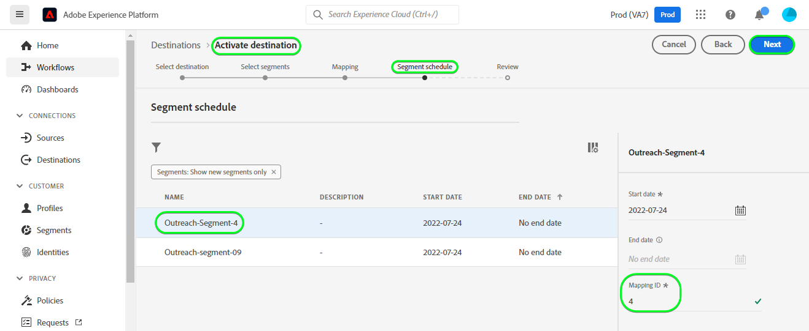

# Connexion [!DNL Outreach]

## Présentation {#overview}

[[!DNL Outreach]](https://www.outreach.io/) est une plateforme d’exécution des ventes qui possède le plus grand nombre de données d’interaction entre vendeurs et acheteurs B2B au monde et qui investit de manière significative dans des technologies d’IA propriétaires afin de traduire les données de vente en informations. [!DNL Outreach] aide les entreprises à automatiser l’engagement commercial et à agir sur la base des renseignements fournis par le chiffre d’affaires afin d’améliorer leur efficacité, leur prévisibilité et leur croissance.

Cette [!DNL Adobe Experience Platform] [destination](/help/destinations/home.md) tire parti de l’API [Outreach Update Resource](https://api.outreach.io/api/v2/docs#update-an-existing-resource), qui vous permet de mettre à jour les identités d’une audience correspondant aux prospects dans [!DNL Outreach].

[!DNL Outreach] utilise OAuth 2 avec l’octroi d’autorisation comme mécanisme d’authentification permettant de communiquer avec le [!DNL Update Resource API] [!DNL Outreach]. Les instructions vous permettant de vous authentifier sur votre instance [!DNL Outreach] sont plus loin dans la section [Authentifier à la destination](#authenticate).

## Cas d’utilisation {#use-cases}

En tant que spécialiste marketing, vous pouvez proposer des expériences personnalisées à vos prospects, en fonction des attributs de leurs profils Adobe Experience Platform. Vous pouvez créer des audiences à partir de vos données hors ligne et envoyer ces audiences à [!DNL Outreach], pour les afficher dans les flux des prospects dès que les audiences et les profils sont mis à jour dans Adobe Experience Platform.

## Conditions préalables {#prerequisites}

### Conditions préalables d’Experience Platform {#prerequisites-in-experience-platform}

Avant d’activer des données dans la destination [!DNL Outreach], vous devez avoir un [schéma](/help/xdm/schema/composition.md), un [jeu de données](https://experienceleague.adobe.com/docs/platform-learn/tutorials/data-ingestion/create-datasets-and-ingest-data.html?lang=fr), ainsi que des [segments](https://experienceleague.adobe.com/docs/platform-learn/tutorials/segments/create-segments.html?lang=fr) créés dans [!DNL Experience Platform].

Reportez-vous à la documentation d’Adobe pour le [groupe de champs de schéma Détails sur l’appartenance à une audience](/help/xdm/field-groups/profile/segmentation.md) si vous avez besoin de conseils sur les statuts de l’audience.

### Conditions préalables requises pour la diffusion {#prerequisites-destination}

Notez les conditions préalables suivantes dans [!DNL Outreach], afin d’exporter des données d’Experience Platform vers votre compte [!DNL Outreach] :

#### Vous devez disposer d’un compte d’extension {#prerequisites-account}

Accédez à la page [!DNL Outreach] [Connexion](https://accounts.outreach.io/users/sign_in) pour vous enregistrer et créer un compte, le cas échéant. Pour plus d’informations, consultez également la [page](https://support.outreach.io/hc/en-us/articles/207238607-Claim-Your-Outreach-Account) Prise en charge des [!DNL Outreach] .

Notez les éléments ci-dessous avant de vous authentifier à la destination CRM [!DNL Outreach] :

| Informations d’identification | Description |
|---|---|
| E-mail | Adresse e-mail de votre compte [!DNL Outreach] |
| Mot de passe | Votre mot de passe de compte [!DNL Outreach] |

#### Configurer des libellés de champ personnalisé {#prerequisites-custom-fields}

[!DNL Outreach] prend en charge les champs personnalisés pour les [prospects](https://support.outreach.io/hc/en-us/articles/360001557554-Outreach-Prospect-Profile-Overview). Pour plus d’informations[&#128279;](https://support.outreach.io/hc/en-us/articles/219124908-How-To-Add-a-Custom-Field-in-Outreach) voir Comment ajouter un champ personnalisé dans la portée . Pour faciliter l’identification, il est recommandé de mettre à jour manuellement les libellés avec leurs noms d’audience correspondants au lieu de conserver les valeurs par défaut. Par exemple, comme ci-dessous :

[!DNL Outreach] page des paramètres pour les prospects affichant des champs personnalisés.

[!DNL Outreach] page des paramètres pour les prospects affichant des champs personnalisés avec des libellés *conviviaux* correspondant aux noms de l’audience. Vous pouvez afficher le statut de l’audience sur la page du prospect en fonction de ces libellés.

>[!NOTE]
>
> Les noms d’étiquettes sont fournis uniquement à des fins d’identification. Ils ne sont pas utilisés lors de la mise à jour des prospects.

## Mécanismes de sécurisation

L’API [!DNL Outreach] est limitée à 10 000 requêtes par heure et par utilisateur. Si vous atteignez cette limite, vous recevrez une réponse `429` avec le message suivant : `You have exceeded your permitted rate limit of 10,000; please try again at 2017-01-01T00:00:00.`.

Si vous avez reçu ce message, vous devez mettre à jour le planning d’exportation de votre audience pour le rendre conforme au seuil de taux.

Reportez-vous à la [[!DNL Outreach] documentation](https://api.outreach.io/api/v2/docs#rate-limiting) pour plus d’informations.

## Identités prises en charge {#supported-identities}

[!DNL Outreach] prend en charge la mise à jour des identités décrites dans le tableau ci-dessous. En savoir plus sur les [identités](/help/identity-service/features/namespaces.md).

| Identité cible | Description | Considérations |
|---|---|---|
| `OutreachId` | <ul><li>Identifiant du [!DNL Outreach]. Il s’agit d’une valeur numérique correspondant au profil du prospect.</li><li>L’ID doit correspondre à l’ID dans l’URL [!DNL Outreach] pour le prospect mis à jour.</li><li>Reportez-vous à la documentation de [[!DNL Outreach] ](https://api.outreach.io/api/v2/docs#update-an-existing-resource) pour plus d’informations.</li></ul> | Obligatoire |

## Type et fréquence d’exportation {#export-type-frequency}

Reportez-vous au tableau ci-dessous pour plus d’informations sur le type et la fréquence d’exportation des destinations.

| Élément | Type | Notes |
---------|----------|---------|
| Type d’exportation | **[!UICONTROL Basé sur les profils]** | <ul><li> Vous exportez tous les membres d’un segment, ainsi que les champs de schéma souhaités, *(par exemple : adresse e-mail, numéro de téléphone, nom)*, en fonction de votre mappage de champs.</li><li> Chaque statut du segment dans [!DNL Outreach] est mis à jour avec le statut de l’audience correspondant d’Experience Platform, en fonction de la valeur [!UICONTROL Identifiant de mappage] fournie lors de l’étape [planification de l’audience](#schedule-segment-export-example).</li></ul> |
| Fréquence des exportations | **[!UICONTROL Diffusion en continu]** | <ul><li> Les destinations de diffusion en continu sont des connexions basées sur l’API « toujours actives ». Dès qu’un profil est mis à jour dans Experience Platform en fonction de l’évaluation des audiences, le connecteur envoie la mise à jour en aval vers la plateforme de destination. En savoir plus sur les [destinations de diffusion en continu](/help/destinations/destination-types.md#streaming-destinations).</li></ul> |

{style="table-layout:auto"}

## Se connecter à la destination {#connect}

>[!IMPORTANT]
> 
> Pour vous connecter à la destination, vous devez disposer de l’[autorisation de contrôle d’accès](/help/access-control/home.md#permissions) **[!UICONTROL Gérer les destinations]**. Lisez la [présentation du contrôle d’accès](/help/access-control/ui/overview.md) ou contactez votre administrateur de produit pour obtenir les autorisations requises.

Pour vous connecter à cette destination, procédez comme décrit dans le [tutoriel sur la configuration des destinations](../../ui/connect-destination.md). Dans le workflow de configuration des destinations, renseignez les champs répertoriés dans les deux sections ci-dessous.

Dans **[!UICONTROL Destinations]** > **[!UICONTROL Catalogue]**, recherchez [!DNL Outreach]. Vous pouvez également localiser cet élément dans la catégorie CRM .

### S’authentifier auprès de la destination {#authenticate}

Pour vous authentifier auprès de la destination, sélectionnez **[!UICONTROL Se connecter à la destination]**.

La page de connexion [!DNL Outreach] s’affiche. Fournissez votre adresse e-mail.

Indiquez ensuite votre mot de passe.

* **[!UICONTROL Nom d’utilisateur]** : adresse e-mail de votre compte [!DNL Outreach].
* **[!UICONTROL Mot de passe]** : mot de passe de votre compte [!DNL Outreach].

Si les détails fournis sont valides, l’interface utilisateur affiche un statut **Connecté** avec une coche verte. Vous pouvez ensuite passer à l’étape suivante.

### Renseigner les détails de la destination {#destination-details}

Pour configurer les détails de la destination, renseignez les champs obligatoires et facultatifs ci-dessous. Un astérisque situé en regard d’un champ de l’interface utilisateur indique que le champ est obligatoire.

* **[!UICONTROL Nom]** : un nom par lequel vous reconnaîtrez cette destination à l’avenir.
* **[!UICONTROL Description]** : une description qui vous aidera à identifier cette destination à l’avenir.

### Activer les alertes {#enable-alerts}

Vous pouvez activer les alertes pour recevoir des notifications sur le statut de votre flux de données vers votre destination. Sélectionnez une alerte dans la liste et abonnez-vous à des notifications concernant le statut de votre flux de données. Pour plus d’informations sur les alertes, consultez le guide sur l’[abonnement aux alertes des destinations dans l’interface utilisateur](../../ui/alerts.md).

Lorsque vous avez terminé de renseigner les détails sur votre connexion de destination, sélectionnez **[!UICONTROL Suivant]**.

## Activer des audiences vers cette destination {#activate}

>[!IMPORTANT]
> 
>* Pour activer les données, vous avez besoin des autorisations de contrôle d’accès **[!UICONTROL Afficher les destinations]**, **[!UICONTROL Activer les destinations]**, **[!UICONTROL Afficher les profils]** et **[!UICONTROL Afficher les segments]** [&#128279;](/help/access-control/home.md#permissions). Lisez la [présentation du contrôle d’accès](/help/access-control/ui/overview.md) ou contactez votre administrateur ou administratrice du produit pour obtenir les autorisations requises.
>* Pour exporter des *identités*, vous devez disposer de l’autorisation de contrôle d’accès **[!UICONTROL Afficher le graphique d’identités]** [&#128279;](/help/access-control/home.md#permissions).   {width="100" zoomable="yes"}

Consultez la section [Activer les profils et les audiences vers les destinations d’exportation d’audiences en flux continu](../../ui/activate-segment-streaming-destinations.md) pour obtenir des instructions sur l’activation des audiences vers cette destination.

### Considérations sur le mappage et exemple {#mapping-considerations-example}

Pour envoyer correctement vos données d’audience d’Adobe Experience Platform vers la destination [!DNL Outreach], vous devez passer par l’étape de mappage des champs. Le mappage consiste à créer un lien entre vos champs de schéma de modèle de données d’expérience (XDM) dans votre compte Experience Platform et leurs équivalents issus de la destination cible. Pour mapper correctement vos champs XDM vers les champs de destination [!DNL Outreach], procédez comme suit :

1. À l’étape [!UICONTROL Mappage], cliquez sur **[!UICONTROL Ajouter un nouveau mappage]**. Une nouvelle ligne de mappage s’affichera à l’écran.
   

1. Dans la fenêtre [!UICONTROL Sélectionner le champ source], choisissez la catégorie **[!UICONTROL Sélectionner un espace de noms d’identité]** et ajoutez les mappages souhaités.
   

1. Dans la fenêtre [!UICONTROL Sélectionner le champ cible], sélectionnez le type de champ cible vers lequel vous souhaitez mapper votre champ source.
   * **[!UICONTROL Sélectionner un espace de noms d’identité]** : sélectionnez cette option pour mapper votre champ source vers un espace de noms d’identité de la liste.

     

   * Ajoutez le mappage suivant entre votre schéma de profil XDM et votre instance [!DNL Outreach] :

     | Schéma de profil XDM | Instance [!DNL Outreach] | Obligatoire |
     |---|---|---|
     | `Oid` | `OutreachId` | Oui |

   * **[!UICONTROL Sélectionner des attributs personnalisés]** : sélectionnez cette option pour mapper votre champ source vers un attribut personnalisé que vous définissez dans le champ [!UICONTROL Nom de l’attribut]. Consultez la [[!DNL Outreach] documentation du prospect](https://api.outreach.io/api/v2/docs#prospect) pour obtenir une liste complète des attributs pris en charge.

     

   * Par exemple, en fonction des valeurs que vous souhaitez mettre à jour, ajoutez le mappage suivant entre votre schéma de profil XDM et votre instance [!DNL Outreach] :

     | Schéma de profil XDM | Instance [!DNL Outreach] |
     |---|---|
     | `person.name.firstName` | `firstName` |
     | `person.name.lastName` | `lastName` |

   * Un exemple d’utilisation de ces mappages est illustré ci-dessous :

     

### Planifier l’exportation de l’audience et exemple {#schedule-segment-export-example}

* Lors de l’exécution de l’étape [ Planifier l’exportation d’audiences ](../../ui/activate-segment-streaming-destinations.md), vous devez mapper manuellement les audiences Experience Platform à l’attribut de champ personnalisé dans [!DNL Outreach].

* Pour ce faire, sélectionnez chaque segment, puis saisissez la valeur numérique correspondante qui correspond au champ *Libellé `N` du champ personnalisé* à partir du [!DNL Outreach] dans le champ **[!UICONTROL Identifiant de mappage]**.

  >[!IMPORTANT]
  >
  > * La valeur numérique *(`N`)* utilisée dans l’[!UICONTROL identifiant de mappage] doit correspondre à la clé d’attribut personnalisée avec le suffixe de la valeur numérique dans [!DNL Outreach]. Exemple : *Libellé de `N` de champ personnalisé*.
  > * Il vous suffit de spécifier la valeur numérique, et non l’intégralité du libellé du champ personnalisé.
  > * [!DNL Outreach] prend en charge un maximum de 150 champs de libellé personnalisé.
  > * Voir [[!DNL Outreach] documentation du prospect](https://api.outreach.io/api/v2/docs#prospect) pour plus de détails.

   * Par exemple :

     | Champ [!DNL Outreach] | ID de mappage Experience Platform |
     |---|---|
     | Libellé de `4` de champ personnalisé | `4` |

     

## Valider l’exportation des données {#exported-data}

Pour vérifier que vous avez correctement configuré la destination, procédez comme suit :

1. Sélectionnez **[!UICONTROL Destinations]** > **[!UICONTROL Parcourir]** pour accéder à la liste des destinations.
   

1. Sélectionnez la destination et vérifiez que le statut est **[!UICONTROL activé]**.
   

1. Passez à l’onglet **[!DNL Activation data]** , puis sélectionnez un nom d’audience.
   

1. Surveillez le résumé de l’audience et assurez-vous que le nombre de profils correspond au nombre créé dans le segment.
   

1. Connectez-vous au site web [!DNL Outreach], puis accédez à la page [!DNL Apps] > [!DNL Contacts] et vérifiez si les profils de l’audience ont été ajoutés. Comme vous pouvez le constater, chaque statut d’audience dans [!DNL Outreach] a été mis à jour avec le statut d’audience correspondant d’Experience Platform, en fonction de la valeur [!UICONTROL Identifiant de mappage] fournie lors de l’étape [planification de l’audience](#schedule-segment-export-example).

## Utilisation et gouvernance des données {#data-usage-governance}

Lors de la gestion de vos données, toutes les destinations [!DNL Adobe Experience Platform] se conforment aux politiques d’utilisation des données. Pour obtenir des informations détaillées sur la manière dont [!DNL Adobe Experience Platform] applique la gouvernance des données, lisez la [présentation de la gouvernance des données](/help/data-governance/home.md).

## Erreurs et résolution des problèmes {#errors-and-troubleshooting}

Lors de la vérification d’une exécution de flux de données, le message d’erreur suivant peut s’afficher : `Bad request reported while pushing events to the destination. Please contact the administrator and try again.`

Pour corriger cette erreur, vérifiez que l’[!UICONTROL identifiant de mappage] que vous avez fourni dans Experience Platform pour votre audience [!DNL Outreach] est valide et existe dans [!DNL Outreach].

## Ressources supplémentaires {#additional-resources}

La [[!DNL Outreach] documentation](https://api.outreach.io/api/v2/docs/) contient des détails sur les [réponses d’erreur](https://api.outreach.io/api/v2/docs#error-responses) que vous pouvez utiliser pour déboguer les problèmes.
