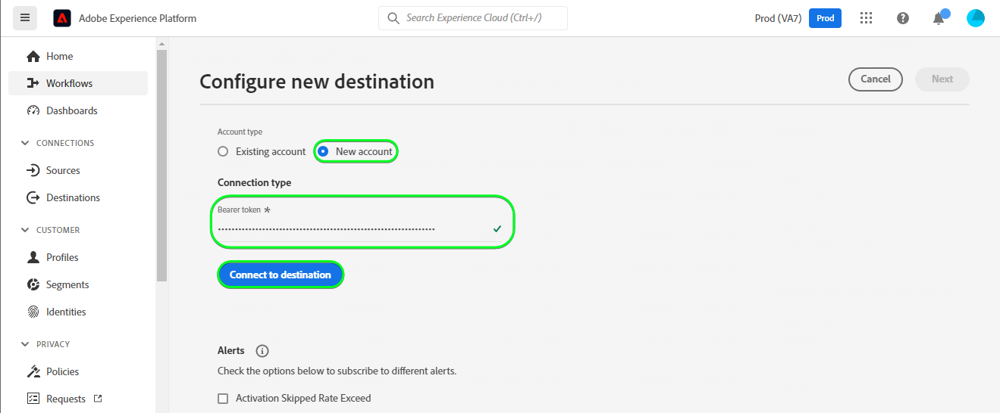
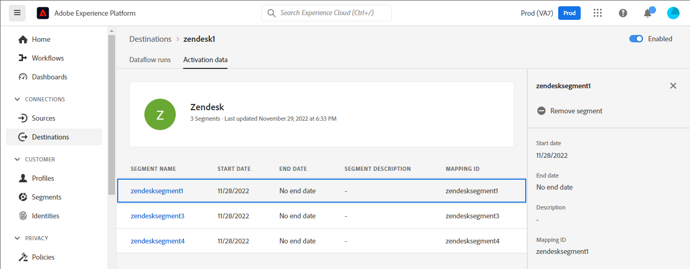

# Connexion [!DNL Zendesk]

[[!DNL Zendesk]](https://www.zendesk.fr) est une solution de service à la clientèle et un outil de vente.

Cette [!DNL Adobe Experience Platform] [destination](/help/destinations/home.md) utilise l’API [[!DNL Zendesk] Contacts](https://developer.zendesk.com/api-reference/sales-crm/resources/contacts/) pour **créer et mettre à jour des identités** au sein d’une audience en tant que contacts dans [!DNL Zendesk].

[!DNL Zendesk] utilise des jetons porteur comme mécanisme d’authentification pour communiquer avec l’API Contacts [!DNL Zendesk]. Les instructions vous permettant de vous authentifier sur votre instance [!DNL Zendesk] sont plus loin dans la section [Authentifier à la destination](#authenticate).

## Cas d’utilisation {#use-cases}

Le service client d’une plateforme B2C multicanal souhaite garantir une expérience personnalisée transparente à ses clients. Le ministère peut créer des audiences à partir de ses propres données hors ligne pour créer de nouveaux profils d&#39;utilisateurs ou mettre à jour les renseignements sur les profils existants à partir de différentes interactions (par exemple, les achats, les retours, etc.) et envoyer ces audiences de Adobe Experience Platform à [!DNL Zendesk]. La mise à jour des informations dans [!DNL Zendesk] permet à l’agent du service client de disposer immédiatement des informations récentes du client, ce qui permet des réponses et une résolution plus rapides.

## Conditions préalables {#prerequisites}

### Conditions préalables d’Experience Platform {#prerequisites-in-experience-platform}

Avant d’activer des données dans la destination [!DNL Zendesk], vous devez avoir un [schéma](/help/xdm/schema/composition.md), un [jeu de données](https://experienceleague.adobe.com/docs/platform-learn/tutorials/data-ingestion/create-datasets-and-ingest-data.html), ainsi que des [segments](https://experienceleague.adobe.com/docs/platform-learn/tutorials/segments/create-segments.html) créés dans [!DNL Experience Platform].

Reportez-vous à la documentation Experience Platform pour le [groupe de champs de schéma Détails sur l’appartenance à une audience](/help/xdm/field-groups/profile/segmentation.md) si vous avez besoin de conseils sur les statuts de l’audience.

### Conditions préalables de [!DNL Zendesk] {#prerequisites-destination}

Pour exporter des données d’Experience Platform vers votre compte [!DNL Zendesk], vous devez disposer d’un compte [!DNL Zendesk].

#### Collectez les informations d’identification de [!DNL Zendesk]. {#gather-credentials}

Notez les éléments ci-dessous avant de vous authentifier à la destination [!DNL Zendesk] :

| Informations d’identification | Description | Exemple |
| --- | --- | --- |
| `Bearer token` | Jeton d’accès que vous avez généré dans votre compte [!DNL Zendesk].   Suivez la documentation pour [générer un jeton d’accès [!DNL Zendesk] a](https://developer.zendesk.com/documentation/sales-crm/first-call/#1-generate-an-access-token) si vous n’en avez pas. | `a0b1c2d3e4...v20w21x22y23z` |

## Mécanismes de sécurisation {#guardrails}

La page [Tarifs et limites tarifaires](https://developer.zendesk.com/api-reference/sales-crm/rate-limits/#pricing) détaille les limites d’API [!DNL Zendesk] associées à votre compte. Vous devez vous assurer que vos données et votre payload sont conformes à ces contraintes.

## Identités prises en charge {#supported-identities}

[!DNL Zendesk] prend en charge la mise à jour des identités décrites dans le tableau ci-dessous. En savoir plus sur les [identités](/help/identity-service/features/namespaces.md).

| Identité cible | Exemple | Description | Obligatoire |
|---|---|---|---|
| `email` | `test@test.com` | Adresse électronique du contact. | Oui |

## Audiences prises en charge {#supported-audiences}

Cette section décrit les types d’audiences que vous pouvez exporter vers cette destination.

| Origine de l’audience | Pris en charge | Description |
|---------|----------|----------|
| [!DNL Segmentation Service] | Oui | Audiences générées via Experience Platform [Segmentation Service](../../../segmentation/home.md). |
| Toutes les autres origines d’audience | Oui | Cette catégorie inclut toutes les origines d’audience en dehors des audiences générées par le [!DNL Segmentation Service]. Découvrez les [différentes origines d’audience](/help/segmentation/ui/audience-portal.md#customize). Voici quelques exemples : <ul><li> audiences de chargement personnalisées [importées](../../../segmentation/ui/audience-portal.md#import-audience) dans Experience Platform à partir de fichiers CSV,</li><li> les audiences semblables, </li><li> les audiences fédérées, </li><li> les audiences générées dans d’autres applications Experience Platform telles que Adobe Journey Optimizer, </li><li> et plus encore. </li></ul> |

{style="table-layout:auto"}

Audiences prises en charge par type de données d’audience :

| Type de données d’audience | Pris en charge | Description | Cas d’utilisation |
|--------------------|-----------|-------------|-----------|
| [Audiences de personnes](/help/segmentation/types/people-audiences.md) | Oui | En fonction des profils client, ce qui vous permet de cibler des groupes spécifiques de personnes pour les campagnes marketing. | Acheteurs fréquents, personnes abandonnant leur panier |
| [Audiences de compte](/help/segmentation/types/account-audiences.md) | Non | Ciblez des individus au sein d’organisations spécifiques pour les stratégies marketing basées sur les comptes. | Marketing B2B |
| [Audiences de prospects &#x200B;](/help/segmentation/types/prospect-audiences.md) | Non | Ciblez les individus qui ne sont pas encore clients, mais qui partagent des caractéristiques avec votre audience cible. | Prospection à l’aide de données tierces |
| [Exportations de jeux de données](/help/catalog/datasets/overview.md) | Non | Collections de données structurées stockées dans le lac de données Adobe Experience Platform. | Rapports, workflows de science des données |

{style="table-layout:auto"}

## Type et fréquence d’exportation {#export-type-frequency}

Reportez-vous au tableau ci-dessous pour plus d’informations sur le type et la fréquence d’exportation des destinations.

| Élément | Type | Notes |
|---------|----------|---------|
| Type d’exportation | **[!UICONTROL Profile-based]** | <ul><li>Vous exportez tous les membres d’un segment, ainsi que les champs de schéma souhaités, *(par exemple : adresse e-mail, numéro de téléphone, nom)*, en fonction de votre mappage de champs.</li><li> Chaque statut de segment dans [!DNL Zendesk] est mis à jour avec le statut d’audience correspondant d’Experience Platform, en fonction de la valeur **[!UICONTROL Mapping ID]** fournie lors de l’étape [planification de l’audience](#schedule-segment-export-example).</li></ul> |
| Fréquence des exportations | **[!UICONTROL Streaming]** | <ul><li>Les destinations de diffusion en continu sont des connexions basées sur l’API « toujours actives ». Dès qu’un profil est mis à jour dans Experience Platform en fonction de l’évaluation des audiences, le connecteur envoie la mise à jour en aval vers la plateforme de destination. En savoir plus sur les [destinations de diffusion en continu](/help/destinations/destination-types.md#streaming-destinations).</li></ul> |

{style="table-layout:auto"}

## Se connecter à la destination {#connect}

>[!IMPORTANT]
>
>Pour vous connecter à la destination, vous avez besoin des **[!UICONTROL View Destinations]** et **[!UICONTROL Manage Destinations]** [autorisations de contrôle d’accès](/help/access-control/home.md#permissions). Lisez la [présentation du contrôle d’accès](/help/access-control/ui/overview.md) ou contactez votre administrateur de produit pour obtenir les autorisations requises.

Pour vous connecter à cette destination, procédez comme décrit dans le [tutoriel sur la configuration des destinations](../../ui/connect-destination.md). Dans le workflow de configuration des destinations, renseignez les champs répertoriés dans les deux sections ci-dessous.

Dans **[!UICONTROL Destinations]** > **[!UICONTROL Catalog]**, recherchez [!DNL Zendesk]. Vous pouvez également localiser cet élément dans la catégorie **[!UICONTROL CRM]** .

### S’authentifier auprès de la destination {#authenticate}

Renseignez les champs obligatoires ci-dessous. Reportez-vous à la section [Collecter [!DNL Zendesk] informations d’identification](#gather-credentials) pour obtenir des conseils.

* **[!UICONTROL Bearer Token]** : jeton d’accès que vous avez généré dans votre compte [!DNL Zendesk].

Pour vous authentifier auprès de la destination, sélectionnez **[!UICONTROL Connect to destination]**.

Si les détails fournis sont valides, l’interface utilisateur affiche un statut de **[!UICONTROL Connected]** avec une coche verte. Vous pouvez ensuite passer à l’étape suivante.

### Renseigner les détails de la destination {#destination-details}

Pour configurer les détails de la destination, renseignez les champs obligatoires et facultatifs ci-dessous. Un astérisque situé en regard d’un champ de l’interface utilisateur indique que le champ est obligatoire.

* **[!UICONTROL Name]** : nom par lequel vous reconnaîtrez cette destination à l’avenir.
* **[!UICONTROL Description]** : une description qui vous aidera à identifier cette destination à l’avenir.

### Activer les alertes {#enable-alerts}

Vous pouvez activer les alertes pour recevoir des notifications sur le statut de votre flux de données vers votre destination. Sélectionnez une alerte dans la liste et abonnez-vous à des notifications concernant le statut de votre flux de données. Pour plus d’informations sur les alertes, consultez le guide sur l’[abonnement aux alertes des destinations dans l’interface utilisateur](../../ui/alerts.md).

Lorsque vous avez terminé de renseigner les détails sur votre connexion de destination, sélectionnez **[!UICONTROL Next]**.

## Activer des audiences vers cette destination {#activate}

>[!IMPORTANT]
> 
>* Pour activer les données, vous avez besoin des autorisations de contrôle d’accès **[!UICONTROL View Destinations]**, **[!UICONTROL Activate Destinations]**, **[!UICONTROL View Profiles]** et **[!UICONTROL View Segments]** [Access control](/help/access-control/home.md#permissions). Lisez la [présentation du contrôle d’accès](/help/access-control/ui/overview.md) ou contactez votre administrateur ou administratrice du produit pour obtenir les autorisations requises.
>* Pour exporter des *identités*, vous devez disposer de l’autorisation de contrôle d’accès **[!UICONTROL View Identity Graph]**&#x200B;[&#128279;](/help/access-control/home.md#permissions).   {width="100" zoomable="yes"}

Consultez la section [Activer les profils et les audiences vers les destinations d’exportation d’audiences en flux continu](/help/destinations/ui/activate-segment-streaming-destinations.md) pour obtenir des instructions sur l’activation des audiences vers cette destination.

### Considérations sur le mappage et exemple {#mapping-considerations-example}

Pour envoyer correctement vos données d’audience d’Adobe Experience Platform vers la destination [!DNL Zendesk], vous devez passer par l’étape de mappage des champs. Le mappage consiste à créer un lien entre vos champs de schéma de modèle de données d’expérience (XDM) dans votre compte Experience Platform et leurs équivalents issus de la destination cible.

Les attributs spécifiés dans le **[!UICONTROL Target field]** doivent être nommés exactement comme décrit dans le tableau des mappages d’attributs, car ces attributs formeront le corps de la requête.

Les attributs spécifiés dans le **[!UICONTROL Source field]** ne suivent aucune restriction de ce type. Vous pouvez la mapper en fonction de vos besoins. Toutefois, si le format des données n’est pas correct lors de l’envoi à [!DNL Zendesk], une erreur se produira.

Pour mapper correctement vos champs XDM vers les champs de destination [!DNL Zendesk], procédez comme suit :

1. À l’étape **[!UICONTROL Mapping]**, sélectionnez **[!UICONTROL Add new mapping]**. Une nouvelle ligne de mappage s’affichera à l’écran.
1. Dans la fenêtre **[!UICONTROL Select source field]** , choisissez la catégorie **[!UICONTROL Select attributes]** et sélectionnez l’attribut XDM ou choisissez le **[!UICONTROL Select identity namespace]** et sélectionnez une identité.
1. Dans la fenêtre **[!UICONTROL Select target field]** , choisissez la catégorie **[!UICONTROL Select identity namespace]** et sélectionnez une identité cible, ou choisissez la catégorie **[!UICONTROL Select attributes]** et sélectionnez l’un des attributs de schéma pris en charge.

   * Répétez ces étapes pour ajouter les mappages obligatoires suivants. Vous pouvez également ajouter tout autre attribut que vous souhaitez mettre à jour entre votre schéma de profil XDM et votre instance de [!DNL Zendesk] :

     | Champ source | Champ cible | Obligatoire |
     |---|---|---|
     | `xdm: person.name.lastName` | `xdm: last_name` | Oui |
     | `IdentityMap: Email` | `Identity: email` | Oui |
     | `xdm: person.name.firstName` | `xdm: first_name` | |

   * Un exemple d’utilisation de ces mappages est illustré ci-dessous :
     

>[!IMPORTANT]
>
>Les mappings de ciblage `Attribute: last_name` et `Identity: email` sont obligatoires pour cette destination. Si ces mappages sont manquants, tous les autres mappages sont ignorés et ne sont pas envoyés à [!DNL Zendesk].

Lorsque vous avez terminé de fournir les mappages pour votre connexion de destination, sélectionnez **[!UICONTROL Next]**.

### Planifier l’exportation de l’audience et exemple {#schedule-segment-export-example}

Dans l’étape [[!UICONTROL Schedule audience export]](/help/destinations/ui/activate-segment-streaming-destinations.md#scheduling) du workflow d’activation, vous devez mapper manuellement les audiences Experience Platform vers l’attribut de champ personnalisé dans [!DNL Zendesk].

Pour ce faire, sélectionnez chaque segment, puis saisissez l’attribut de champ personnalisé correspondant à partir de [!DNL Zendesk] dans le champ **[!UICONTROL Mapping ID]** .

Un exemple est illustré ci-dessous :

## Valider l’exportation des données {#exported-data}

Pour vérifier que vous avez correctement configuré la destination, procédez comme suit :

1. Sélectionnez **[!UICONTROL Destinations]** > **[!UICONTROL Browse]** et accédez à la liste des destinations.
1. Sélectionnez ensuite la destination et passez à l’onglet **[!UICONTROL Activation data]** , puis sélectionnez un nom d’audience.
   

1. Surveillez le résumé de l’audience et assurez-vous que le nombre de profils correspond au nombre dans le segment.
   

1. Connectez-vous au site web [!DNL Zendesk], puis accédez à la page **[!UICONTROL Contacts]** pour vérifier si les profils de l’audience ont été ajoutés. Cette liste peut être configurée pour afficher des colonnes pour les champs supplémentaires créés avec les statuts audience&#x200B;**[!UICONTROL Mapping ID]** et audience .
   

1. Vous pouvez également accéder à une page de **[!UICONTROL Person]** individuelle et vérifier la section **[!UICONTROL Additional fields]** affichant le nom de l’audience et les statuts de l’audience.
   

## Utilisation et gouvernance des données {#data-usage-governance}

Lors de la gestion de vos données, toutes les destinations [!DNL Adobe Experience Platform] se conforment aux politiques d’utilisation des données. Pour obtenir des informations détaillées sur la manière dont [!DNL Adobe Experience Platform] applique la gouvernance des données, lisez la [présentation de la gouvernance des données](/help/data-governance/home.md).

## Ressources supplémentaires {#additional-resources}

Retrouvez d’autres informations utiles de la documentation [!DNL Zendesk] ci-dessous :

* [Premier appel](https://developer.zendesk.com/documentation/sales-crm/first-call/)
* [Champs personnalisés](https://developer.zendesk.com/api-reference/sales-crm/requests/#custom-fields)

### Journal des modifications

Cette section répertorie les nouvelles fonctionnalités et les mises à jour importantes de la documentation consacrée au connecteur de destination.

+++ Afficher le journal des modifications

| Mois de publication | Type de mise à jour | Description |
|---|---|---|
| Avril 2023 | Mise à jour de la documentation | <ul><li>Nous avons mis à jour la section [cas d’utilisation](#use-cases) avec un exemple plus clair du moment où les clients pourraient bénéficier de l’utilisation de cette destination.</li> <li>Nous avons mis à jour la section [mappage](#mapping-considerations-example) pour refléter les mappages requis corrects. Les mappings de ciblage `Attribute: last_name` et `Identity: email` sont obligatoires pour cette destination. Si ces mappages sont manquants, tous les autres mappages sont ignorés et ne sont pas envoyés à [!DNL Zendesk].</li> <li>Nous avons mis à jour la section [mappage](#mapping-considerations-example) avec des exemples clairs de mappages obligatoires et facultatifs.</li></ul> |
| Mars 2023 | Version initiale | Publication de la destination initiale et de la documentation. |

{style="table-layout:auto"}

+++
