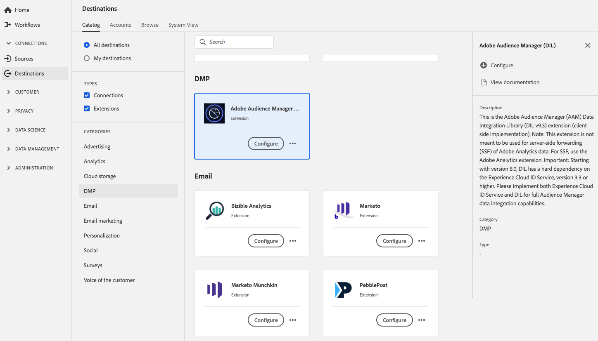

# Extension Audience Manager DIL {#aam-dil-extension}

## Vue d’ensemble {#overview}

Il s’agit de l’extension de la bibliothèque d’intégration des données (mise en œuvre côté client) d’Adobe Audience Manager. Remarque : cette extension n’est pas destinée à être utilisée pour le transfert côté serveur (SSF) des données Adobe Analytics. Pour SSF, utilisez l’extension Adobe Analytics. Important : à partir de la version 8.0, DIL dépend fortement du service [!DNL Experience Cloud] ID, version 3.3 ou supérieure. Mettez en oeuvre le service [!DNL Experience Cloud] ID et le DIL pour des fonctionnalités d’intégration de données [!DNL Audience Manager] complètes.

[!DNL Audience Manager] DIL est une extension de plateforme de gestion des données (DMP) dans Adobe Experience Platform. Pour plus d’informations sur la fonctionnalité de l’extension, consultez la [page de l’extension d’Audience Manager](../../../tags/extensions/client/audience-manager/overview.md) dans la documentation sur les balises.

Cette destination est une extension de balise. Pour plus d’informations sur le fonctionnement des extensions dans Platform, consultez la [présentation des extensions de balise](../launch-extensions/overview.md).

## Conditions préalables  {#prerequisites}

Cette extension est disponible dans le catalogue [!DNL Destinations] pour tous les clients qui ont acheté Platform.

Pour utiliser cette extension, vous devez avoir accès aux balises dans Adobe Experience Platform. Les balises sont proposées aux clients Adobe Experience Cloud en tant que fonctionnalité à valeur ajoutée incluse. Contactez l’administrateur ou l’administratrice de votre organisation pour accéder aux balises et demandez-lui de vous accorder l’autorisation **[!UICONTROL manage_properties]** afin que vous puissiez installer les extensions.

## Installation l’extension {#install-extension}

Pour installer l’extension de DIL [!DNL Audience Manager] :

Dans l’[interface de Platform](https://platform.adobe.com/), accédez à **[!UICONTROL Destinations]** > **[!UICONTROL Catalogue]**.

Sélectionnez l’extension dans le catalogue ou utilisez la barre de recherche.

Cliquez sur la destination pour la mettre en surbrillance, puis sélectionnez **[!UICONTROL Configurer]** dans le rail droit. Si la commande **[!UICONTROL Configurer]** est grisée, vous ne disposez pas de l’autorisation **[!UICONTROL manage_properties]**. Voir les [Conditions préalables](#prerequisites).

Sélectionnez la propriété dans laquelle vous souhaitez installer l’extension. Vous pouvez aussi créer une propriété. Une propriété est un ensemble de règles, d’éléments de données, d’extensions configurées, d’environnements et de bibliothèques. Découvrez les propriétés dans la [documentation sur les balises](../../../tags/ui/administration/companies-and-properties.md#properties-page).

Le workflow vous guide tout au long des étapes nécessaires pour terminer l’installation.

Pour plus d’informations sur les options de configuration de l’extension, consultez la [page de l’extension de l’Audience Manager](../../../tags/extensions/client/audience-manager/overview.md) dans la documentation des balises.

Vous pouvez également installer l’extension directement dans l’[interface utilisateur de la collecte de données](https://experience.adobe.com/#/data-collection/). Pour plus d’informations, consultez le guide sur l’ [ajout d’une nouvelle extension](../../../tags/ui/managing-resources/extensions/overview.md#add-a-new-extension) .

## Utilisation de l’extension {#how-to-use}

Une fois que vous avez installé l’extension, vous pouvez commencer à configurer des règles. Dans l’interface utilisateur de collecte de données, vous pouvez configurer des règles pour vos extensions installées afin d’envoyer des données d’événement vers la destination de l’extension uniquement dans certains cas. Pour plus d’informations sur la configuration des règles pour vos extensions, consultez la présentation des [règles](../../../tags/ui/managing-resources/rules.md) dans la documentation sur les balises.

## Configuration, mise à niveau et suppression de l’extension {#configure-upgrade-delete}

Vous pouvez configurer, mettre à niveau et supprimer des extensions dans l’interface utilisateur de collecte de données.

>[!TIP]
>
>Si l’extension est déjà installée sur l’une de vos propriétés, l’interface utilisateur affiche toujours **[!UICONTROL Install]** pour l’extension. Démarrez le workflow d’installation comme décrit dans [Installation de l’extension](#install-extension) pour configurer ou supprimer votre extension.

Pour mettre à niveau votre extension, consultez le guide sur le [processus de mise à niveau d’extension](../../../tags/ui/managing-resources/extensions/extension-upgrade.md) dans la documentation sur les balises.
