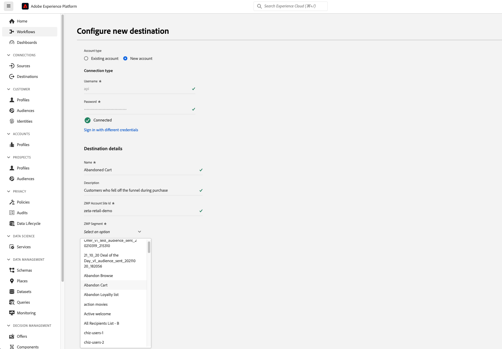

# Plateforme Marketing Zeta {#zeta-marketing-platform}

## Vue d’ensemble {#overview}

Zeta Marketing Platform (ZMP) est un système basé sur le cloud qui vous permet d&#39;acquérir, de développer et de fidéliser plus efficacement les clients, grâce à l&#39;intelligence artificielle (données propriétaires et IA). Pour plus d’informations, voir [Zeta Global](https://zetaglobal.com/).

Grâce au connecteur de plateforme marketing Zeta disponible dans Adobe Experience Platform, vous pouvez synchroniser facilement vos audiences d’Experience Platform vers le ZMP.

>[!IMPORTANT]
>
>Le connecteur de destination et la page de documentation sont créés et gérés par l’équipe *Zeta Global*. Pour toute question ou demande de mise à jour, veuillez contacter l&#39;équipe à l&#39;adresse [Nous contacter](https://zetaglobal.com/about/contact-us/).

## Cas d’utilisation {#use-cases}

### Créer des segments d’audience {#use-case-build-audiences}

Un spécialiste marketing souhaite créer des profils d’audience uniques, identifier ses segments les plus importants et les utiliser sur tous les canaux numériques pris en charge par la plateforme marketing Zeta. Ils veulent créer une véritable vue 360 d’un profil de consommateur, créer et activer des audiences significatives. Vous trouverez plus d’informations sur les canaux pris en charge par la plateforme marketing Zeta [ici](https://zetaglobal.com/platform/integrations/).

### Cibler les utilisateurs avec des publicités {#use-case-target-users}

Un annonceur vise à cibler les utilisateurs et utilisatrices avec des audiences spécifiques via Zeta Demand Side Platform (DSP), car ces utilisateurs et utilisatrices interagissent avec leurs marques. Pour plus d&#39;informations sur le DSP Zeta, cliquez [ici](https://knowledgebase.zetaglobal.com/pug/).

## Conditions préalables {#prerequisites}

### Conditions préalables requises pour la plateforme marketing Zeta

* Avant de configurer une nouvelle connexion à la destination Zeta Marketing Platform , vous devez créer une liste de clients vide dans votre compte Zeta Marketing Platform. Vous devez choisir l’une de ces listes de clients comme cible désignée pour recevoir l’audience Adobe Experience Platform que vous prévoyez d’envoyer. Vous pouvez créer une liste de clients vide dans le fichier ZMP en suivant les instructions [ici](https://knowledgebase.zetaglobal.com/kb/creating-audiences#CreatingAudiences-CreatingaCustomerList).
* Bien que le Adobe Experience Platform permette l’activation de plusieurs audiences vers une instance de destination ZMP spécifique, il est obligatoire que chaque instance de destination ZMP ne reçoive qu’une seule audience Experience Platform. Pour gérer plusieurs audiences à partir d’Experience Platform, créez des instances de destination ZMP supplémentaires pour chaque audience et sélectionnez une liste de clients différente dans la liste déroulante. Cette approche permet de s’assurer que les audiences ZMP cibles ne sont pas remplacées. Voir [Renseigner les détails de la destination](#destination-details) pour plus d’informations.
* Utilisez les informations d’identification suivantes pour configurer la destination :
   * Nom d’utilisateur : **api**
   * Mot de passe : votre clé API REST ZMP. Vous pouvez trouver votre clé API REST en vous connectant à votre compte ZMP et en accédant à la section **Paramètres** > **Intégrations** > **Clés et applications**. Pour plus d’informations[&#128279;](https://knowledgebase.zetaglobal.com/kb/integrations) consultez la  documentation ZMP .

## Identités prises en charge {#supported-identities}

[!DNL Zeta Marketing Platform] prend en charge l’activation des ID utilisateur personnalisés décrits dans le tableau ci-dessous. Pour plus d’informations, voir [identités](/help/identity-service/features/namespaces.md).

>[!IMPORTANT]
> La destination Zeta Marketing Platform nécessite que vous mappiez un espace de noms d’identité source à l’identité cible `uid` ZMP. Cela permet à la plateforme marketing Zeta de différencier de manière unique chaque profil.

| Identité cible | Description | Considérations | Notes |
---------|----------|----------|----------|
| uid | ID unique utilisé par ZMP pour différencier les profils client | Obligatoire | Choisissez l’espace de noms d’identité standard `Email` si vous souhaitez identifier des profils uniques à l’aide de leurs adresses e-mail. Vous pouvez également choisir de mapper votre espace de noms personnalisé à `uid` si les profils client ne disposent pas d’un e-mail. |
| email_md5_id | MD5 des e-mails qui représente chaque profil client | Facultatif | Choisissez cette identité cible lorsque vous souhaitez identifier de manière unique les profils client à l’aide des valeurs MD5 des e-mails. Il est essentiel que les adresses e-mail soient déjà au format MD5 dans Experience Platform, car l’Experience Platform ne convertit pas le texte brut en MD5. Dans ce scénario, définissez `uid` (obligatoire) sur les mêmes valeurs de MD5 d’e-mail ou sur un autre espace de noms d’identité approprié. |

{style="table-layout:auto"}

## Audiences prises en charge {#supported-audiences}

Cette section décrit le type d’audiences que vous pouvez exporter vers cette destination.

| Origine de l’audience | Pris en charge | Description |
|---------|----------|----------|
| [!DNL Segmentation Service] | ✓ | Audiences générées via Experience Platform [Segmentation Service](../../../segmentation/home.md). |
| Chargements personnalisés | X | Audiences [importées](../../../segmentation/ui/audience-portal.md#import-audience) dans Experience Platform à partir de fichiers CSV. |

{style="table-layout:auto"}

>[!NOTE]
> À mesure que des membres individuels sont ajoutés ou supprimés de l’audience Experience Platform, des mises à jour sont envoyées au ZMP pour s’assurer que la liste des clients de destination est synchronisée en conséquence.

## Type et fréquence d’exportation {#export-type-frequency}

Reportez-vous au tableau ci-dessous pour plus d’informations sur le type et la fréquence d’exportation des destinations.

| Élément | Type | Notes |
---------|----------|---------|
| Fréquence des exportations | **[!UICONTROL Diffusion en continu]** | Les destinations de diffusion en continu sont des connexions basées sur l’API « toujours actives ». Dès qu’un profil est mis à jour dans Experience Platform en fonction de l’évaluation des segments, le connecteur envoie la mise à jour en aval vers la plateforme de destination. En savoir plus sur les [destinations de diffusion en continu](/help/destinations/destination-types.md#streaming-destinations). |

{style="table-layout:auto"}

## Se connecter à la destination {#connect}

>[!IMPORTANT]
> 
>Pour vous connecter à la destination, vous devez disposer de l’[autorisation de contrôle d’accès](/help/access-control/home.md#permissions) **[!UICONTROL Gérer les destinations]**. Lisez la [présentation du contrôle d’accès](/help/access-control/ui/overview.md) ou contactez votre administrateur de produit pour obtenir les autorisations requises.

Pour vous connecter à cette destination, procédez comme décrit dans le [tutoriel sur la configuration des destinations](../../ui/connect-destination.md). Dans le workflow de configuration des destinations, renseignez les champs répertoriés dans les deux sections ci-dessous.

### S’authentifier auprès de la destination {#authenticate}

Pour vous authentifier à la destination, renseignez les champs requis et sélectionnez **[!UICONTROL Se connecter à la destination]**.

* **[!UICONTROL Nom d’utilisateur]** : `api`
* **[!UICONTROL Password]** : votre clé API REST ZMP. Vous pouvez trouver votre clé API REST en vous connectant à votre compte ZMP et en accédant à la section **Paramètres** > **Intégrations** > **Clés et applications**. Pour plus d’informations[&#128279;](https://knowledgebase.zetaglobal.com/kb/integrations) consultez la  documentation ZMP .

### Renseigner les détails de la destination {#destination-details}

Pour configurer les détails de la destination, renseignez les champs obligatoires et facultatifs ci-dessous. Un astérisque situé en regard d’un champ de l’interface utilisateur indique que le champ est obligatoire.

* **[!UICONTROL Nom]** : un nom par lequel vous reconnaîtrez cette destination à l’avenir.
* **[!UICONTROL Description]** : une description qui vous aidera à identifier cette destination à l’avenir.
* **[!UICONTROL Identifiant de site du compte ZMP]** : l’identifiant du site **identifiant du site** ZMP vers lequel vous souhaitez envoyer vos audiences. Vous pouvez afficher votre ID de site en accédant à la section **Paramètres** > **Intégrations** > **Clés et applications**. Vous trouverez plus d’informations [ici](https://knowledgebase.zetaglobal.com/kb/integrations).
* **[!UICONTROL Segment ZMP]** : segment de liste de clients dans votre compte d’identifiant de site ZMP que vous souhaitez mettre à jour avec l’audience Experience Platform.

### Activer les alertes {#enable-alerts}

Vous pouvez activer les alertes pour recevoir des notifications sur le statut de votre flux de données vers votre destination. Sélectionnez une alerte dans la liste et abonnez-vous à des notifications concernant le statut de votre flux de données. Pour plus d’informations sur les alertes, consultez le guide sur l’[abonnement aux alertes des destinations dans l’interface utilisateur](../../ui/alerts.md).

Lorsque vous avez terminé de renseigner les détails sur votre connexion de destination, sélectionnez **[!UICONTROL Suivant]**.

## Activer des segments vers cette destination {#activate}

>[!IMPORTANT]
> 
>* Pour activer les données, vous avez besoin des [autorisations de contrôle d’accès](/help/access-control/home.md#permissions) pour les fonctions **[!UICONTROL Gérer les destinations]**, **[!UICONTROL Activer les destinations]**, **[!UICONTROL Afficher les profils]**, et **[!UICONTROL Afficher les segments]**. Lisez la [présentation du contrôle d’accès](/help/access-control/ui/overview.md) ou contactez votre administrateur de produit pour obtenir les autorisations requises.
>* Pour exporter des *identités*, vous devez disposer de l’autorisation de contrôle d’accès **[!UICONTROL Afficher le graphique d’identités]** [&#128279;](/help/access-control/home.md#permissions).   {width="100" zoomable="yes"}

Consultez [Activer les profils et les segments vers les destinations d’exportation de segments de diffusion en continu](/help/destinations/ui/activate-segment-streaming-destinations.md) pour obtenir des instructions sur l’activation des segments d’audience vers cette destination.

### Mapper les attributs et les identités {#map}

Vous trouverez ci-dessous un exemple de mappage d’identité correct lors de l’exportation de profils vers [!DNL Zeta Marketing Platform].

Sélection des champs sources :
* Sélectionnez un espace de noms d’identité source (personnalisé ou standard, tel que `Email`) qui identifie de manière unique un profil dans Adobe Experience Platform et [!DNL Zeta Marketing Platform].
* Sélectionnez les attributs de profil source XDM qui doivent être exportés vers et mis à jour dans le [!DNL Zeta Marketing Platform].

Sélection des champs cibles :
* (Obligatoire) Sélectionnez `uid` comme identité cible à laquelle vous mappez un espace de noms d’identité source.
* (Facultatif) Sélectionnez `email_md5_id` comme identité cible à laquelle vous avez mappé l’espace de noms d’identité source qui représente les valeurs md5 des e-mails. Il est essentiel que les adresses e-mail soient déjà au format MD5 dans Experience Platform, car Experience Platform ne convertit pas le texte brut en MD5
* Sélectionnez d’autres mappings de ciblage, le cas échéant.

## Données exportées / Valider l’exportation des données {#exported-data}

Une activation réussie de l’audience d’Experience Platform vers la plateforme marketing Zeta met à jour la liste des clients cibles dans le ZMP. Le nombre et les exemples de profils dans la liste de clients cibles seront égaux au nombre d’identités activées avec succès.

Chaque membre d’audience activé à partir d’Experience Platform est également visible sous **Audiences** > **Personnes** dans le fichier ZMP. Vous pourrez également afficher le segment **Liste de clients** auquel appartient un profil dans la vue de client unique, comme illustré ci-dessous.

## Utilisation et gouvernance des données {#data-usage-governance}

Lors de la gestion de vos données, toutes les destinations [!DNL Adobe Experience Platform] se conforment aux politiques d’utilisation des données. Pour obtenir des informations détaillées sur la manière dont [!DNL Adobe Experience Platform] applique la gouvernance des données, consultez la [Présentation de la gouvernance des données](/help/data-governance/home.md).

## Ressources supplémentaires {#additional-resources}

* [&#x200B; Base de connaissances Zeta &#x200B;](https://knowledgebase.zetaglobal.com/kb/)
