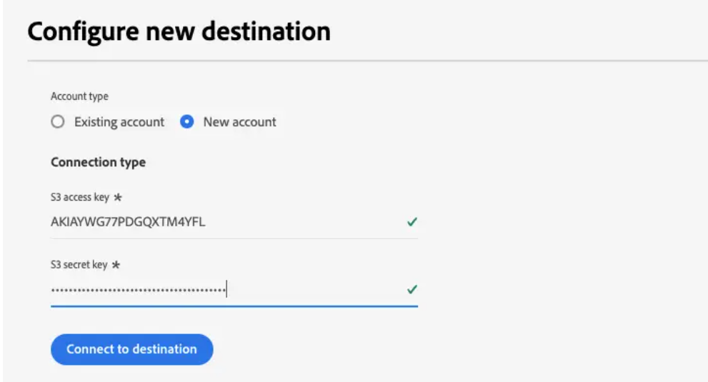
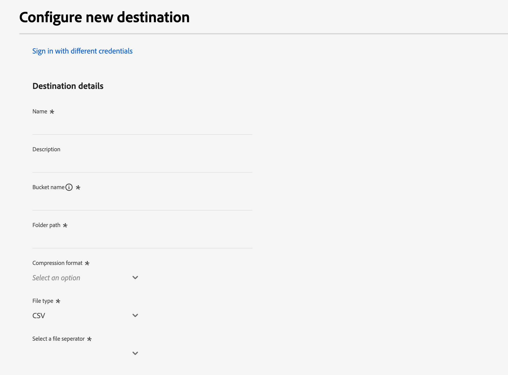

# Destination des connexions d’entreprise Merkury

>[!NOTE]
>
>Le connecteur de destination et la page de documentation sont créés et conservés par l’équipe Merkury. Pour toute demande d&#39;information ou de mise à jour, veuillez contacter votre représentant du compte Merkury.

## Vue d’ensemble

Utilisez la destination Connexions d’entreprise Merkury pour diffuser des audiences en toute sécurité à Merkury. Merkury fournit aux marketeurs une mise en correspondance et une diffusion aisées des audiences individuelles vers les chaînes de télévision/CTV, les éditeurs et les connexions ad-tech 80+ de Merkury. Merkury est doté d&#39;un graphique complet d&#39;identités de consommateurs américains adultes de plus de 268 millions d&#39;individus.

Suivez les étapes de cette page de documentation pour créer une connexion de destination Connexions Merkury et activer les audiences à l’aide de l’interface utilisateur de Adobe Experience Platform.

>[!NOTE]
>
>Si vous souhaitez activer des audiences vers des destinations multimédia avec votre compte Merkury Connect, utilisez plutôt notre destination Connexions Merkury .

## Cas d’utilisation

* **Activation de Digital Media**: mise en correspondance et diffusion aisées de vos profils d’audience vers les plus de 50 éditeurs adressables haut de gamme de Merkury et connexions ad-tech.
* **Amélioration de l’efficacité**: améliorez la portée de vos médias adressables sans cookie, améliorez l’efficacité du ciblage et réduisez le retour sur dépenses Advertising (ROAS).

## Conditions préalables

>[!IMPORTANT]
>
>* Pour vous connecter à la destination, vous avez besoin de l’événement **Affichage des destinations** et **Gestion des destinations**, **Activation des destinations**, **Afficher les profils**, et **Affichage de segments** [[autorisations de contrôle d’accès]](https://experienceleague.adobe.com/en/docs/experience-platform/access-control/home#permissions). Lisez la section [[présentation du contrôle d’accès]](https://experienceleague.adobe.com/en/docs/experience-platform/access-control/ui/overview) ou contactez votre administrateur de produit pour obtenir les autorisations requises.
>* Pour exporter *identités*, vous avez besoin de la fonction **Affichage du graphique des identités** [[autorisation de contrôle d’accès]](https://experienceleague.adobe.com/en/docs/experience-platform/access-control/home#permissions).\

## Identités prises en charge {#supported-identities}

| Identité cible | Description | Considérations |
|---|---|---|
| GAID | GOOGLE ADVERTISING ID | Sélectionnez l’identité cible GAID lorsque votre identité source est un espace de noms GAID. |
| IDFA | Identifiant Apple pour les annonceurs | Sélectionnez l’identité cible IDFA lorsque votre identité source est un espace de noms IDFA. |
| ECID | Experience Cloud ID | Espace de noms qui représente l’ECID. Cet espace de noms peut également être référencé par les alias suivants : « ID Adobe Marketing Cloud », « ID Adobe Experience Cloud », « ID Adobe Experience Platform ». Consultez le document suivant sur [ECID](/help/identity-service/features/ecid.md) pour plus d’informations. |
| phone_sha256 | Numéros de téléphone hachés avec l’algorithme SHA256 | Adobe Experience Platform prend en charge le texte brut et les numéros de téléphone hachés avec SHA256. Lorsque votre champ source contient des attributs non hachés, cochez l’option **[!UICONTROL Appliquer la transformation]** pour que [!DNL Platform] hache automatiquement les données lors de l’activation. |
| email_lc_sha256 | Adresses e-mail hachées avec l’algorithme SHA256 | Adobe Experience Platform prend en charge le texte brut et les adresses e-mail hachées avec SHA256. Lorsque votre champ source contient des attributs non hachés, cochez l’option **[!UICONTROL Appliquer la transformation]** pour que [!DNL Platform] hache automatiquement les données lors de l’activation. |
| extern_id | ID utilisateur personnalisés | Sélectionnez cette identité cible lorsque votre identité source est un espace de noms personnalisé. |

{style="table-layout:auto"}

## Audiences prises en charge

Cette section décrit le type d’audiences que vous pouvez exporter vers cette destination.

| **Audience** | **Pris en charge** | **Description de l’origine** |
|---|---|---|      
| Segmentation Service | ✓ | Audiences générées par l’Experience Platform [[Segmentation Service]](https://experienceleague.adobe.com/en/docs/experience-platform/segmentation/home). |
| Chargements personnalisés | X | Audiences [[importé]](https://experienceleague.adobe.com/en/docs/experience-platform/segmentation/ui/overview#import-audience) dans Experience Platform à partir de fichiers CSV. |

{style="table-layout:auto"}

## Type et fréquence d’exportation

Reportez-vous au tableau ci-dessous pour plus d’informations sur le type et la fréquence d’exportation des destinations.

| **Élément** | **Type** | **Notes** |
|---|---|---|  
| Type d’exportation | **Basé sur les profils** | Vous exportez tous les membres d’un segment, ainsi que les champs de schéma souhaités (par exemple : adresse email, numéro de téléphone, nom), tels qu’ils sont sélectionnés dans l’écran de sélection des attributs de profil de la variable [[workflow d’activation de destination]](https://experienceleague.adobe.com/en/docs/experience-platform/destinations/ui/activate/activate-batch-profile-destinations#select-attributes). |
| Fréquence | **Lot** | Les destinations par lots exportent des fichiers vers des plateformes en aval par incréments de trois, six, huit, douze ou vingt-quatre heures. En savoir plus sur [[destinations de fréquence basées sur des fichiers de lots]](https://experienceleague.adobe.com/en/docs/experience-platform/destinations/destination-types#file-based). |

{style="table-layout:auto"}

## Se connecter à la destination

>[!IMPORTANT]
>
>Pour vous connecter à la destination, vous avez besoin de l’événement **Affichage des destinations** et **Gestion et activation des destinations de jeu de données** [[autorisations de contrôle d’accès]](https://experienceleague.adobe.com/en/docs/experience-platform/access-control/home#permissions). Lisez la section [[présentation du contrôle d’accès]](https://experienceleague.adobe.com/en/docs/experience-platform/access-control/ui/overview) ou contactez votre administrateur de produit pour obtenir les autorisations requises.

Pour vous connecter à cette destination, procédez comme décrit dans la section [[tutoriel sur la configuration de destination]](https://experienceleague.adobe.com/en/docs/experience-platform/destinations/ui/connect-destination). Dans le workflow de configuration des destinations, renseignez les champs répertoriés dans les deux sections ci-dessous.

### S’authentifier auprès de la destination

Pour vous authentifier à la destination, renseignez les champs requis et sélectionnez **Se connecter à la destination**.

Pour accéder à votre compartiment sur Experience Platform, vous devez fournir des valeurs valides pour les informations d’identification suivantes :

| **Credential** | **Description** |
|---|---|
| Clé d’accès | Identifiant de la clé d’accès pour votre compartiment. Vous pouvez récupérer cette valeur auprès de l’équipe Merkury. |
| Clé secrète | Identifiant de clé secrète pour votre compartiment. Vous pouvez récupérer cette valeur auprès de l’équipe Merkury. |
| Nom du compartiment | Il s’agit de votre compartiment où les fichiers seront partagés. Vous pouvez récupérer cette valeur auprès de l’équipe Merkury. |

{style="table-layout:auto"}

### Renseigner les détails de la destination

Pour configurer les détails de la destination, renseignez les champs obligatoires et facultatifs ci-dessous. Un astérisque situé en regard d’un champ de l’interface utilisateur indique que le champ est obligatoire.

* **Nom (obligatoire)** : nom sous lequel la destination sera enregistrée.
* **Description** - brève explication de l’objectif de la destination
* **Nom du compartiment (obligatoire)** - Nom du compartiment Amazon S3 configuré sur S3
* **Chemin d’accès au dossier (requis)** - Si des sous-répertoires d’un compartiment sont utilisés, un chemin doit être défini ou &quot;/&quot; pour référencer le chemin racine.
* **Type de fichier** - Sélectionnez le format que l’Experience Platform doit utiliser pour les fichiers exportés. Contactez votre équipe Merkury pour connaître le type de fichier attendu pour votre compte.

>[!NOTE]
>
>Lors de la sélection de l’option CSV, les options Délimiteur, Caractère de citation, Caractère d’échappement, Valeur vide, Valeur nulle, Format de compression et Inclure le fichier manifeste sont présentées. Contactez votre équipe Merkury pour connaître les paramètres appropriés à votre compte.

### Compte existant

Les comptes déjà définis à l’aide de la destination Connexions de l’entreprise Merkury s’affichent dans une fenêtre contextuelle de liste. Lorsque cette option est sélectionnée, les détails du compte s’affichent dans le rail de droite. Affichez l’exemple dans l’interface utilisateur lorsque vous accédez à **Destinations** > **Comptes**;

## Activer les alertes

Vous pouvez activer les alertes pour recevoir des notifications sur le statut de votre flux de données vers votre destination. Sélectionnez une alerte dans la liste et abonnez-vous à des notifications concernant le statut de votre flux de données. Pour plus d’informations sur les alertes, consultez le guide sur les [abonnement aux alertes de destinations à l’aide de l’interface utilisateur](https://experienceleague.adobe.com/en/docs/experience-platform/destinations/ui/alerts).

Lorsque vous avez terminé de fournir des détails sur votre connexion de destination, sélectionnez **Suivant**.

## Activer des audiences vers cette destination

>[!IMPORTANT]
>
>* Pour activer les données, vous avez besoin des autorisations de contrôle d’accès Afficher les destinations, Activer les destinations, Afficher les profils et Afficher les segments. Lisez la présentation du contrôle d’accès ou contactez votre administrateur de produit pour obtenir les autorisations requises.
>* Pour exporter des identités, vous avez besoin de l’autorisation de contrôle d’accès Afficher le graphique d’identités .

Lecture [Activation des données d’audience vers des destinations d’exportation de profils par lots](https://experienceleague.adobe.com/en/docs/experience-platform/destinations/ui/activate/activate-batch-profile-destinations) pour obtenir des instructions sur l’activation des audiences vers cette destination.

## Suggestions de mappage

Le traitement correct des fichiers du côté Merkury nécessite des éléments de nom et d’adresse. Bien que tous les éléments ne soient pas nécessaires, fournir autant que possible contribue à une correspondance réussie.

Les suggestions de mappage sont fournies dans le tableau ci-dessous, qui répertorie les attributs de votre côté destination utilisés par le traitement Merkury vers lesquels les clients peuvent mapper des attributs de profil. Traitez ces éléments comme des suggestions, car tous les éléments ne sont pas requis et les valeurs source dépendront des besoins du compte.

| Champ cible | Description Source |
|---|---|
| identifiant | Champ d’identité à utiliser pour mapper les données de marchandisage à l’Experience Platform par le biais du connecteur Source de résolution d’identité de l’entreprise Merkury |
| Input_First_Name | La variable `person.name.firstName` dans Experience Platform. |
| Input_Last_Name | La variable `person.name.lastName` dans Experience Platform. |
| Input_Address_Line_1 | La variable `mailingAddress.street` dans Experience Platform. |
| Input_City | La variable `mailingAddress.city` dans Experience Platform. |
| Input_State_Province_Code | La variable `mailingAddress.state` dans Experience Platform. Utilisez cette option si l’état se trouve dans le formulaire de code à deux caractères. |
| Input_State_Province_Name | La variable `mailingAddress.state` dans Experience Platform. Utilisation si l’état est le nom complet de l’état |
| Input_Postal_Code | La variable `mailingAddress.postalCode` dans Experience Platform. |
| Input_Email_Address | La valeur que vous souhaitez mapper comme adresse email des profils. |
| Input_Phone | La valeur que vous souhaitez mapper comme numéro de téléphone des profils. |

{style="table-layout:auto"}

## Valider l’exportation des données

Pour vérifier si les données ont bien été exportées, vérifiez votre compartiment de stockage Amazon S3 et assurez-vous que les fichiers exportés contiennent les populations de profils attendues.

## Utilisation et gouvernance des données

Toutes les destinations Adobe Experience Platform sont conformes aux politiques d’utilisation des données lors de la gestion de vos données. Pour plus d’informations sur la manière dont Adobe Experience Platform applique la gouvernance des données, consultez la section [Présentation de la gouvernance des données](https://experienceleague.adobe.com/en/docs/experience-platform/data-governance/home).

## Étapes suivantes

En suivant ce tutoriel, vous avez créé un flux de données pour exporter des données de profil d’Experience Platform vers votre emplacement S3 géré par Merkury. Ensuite, vous devez contacter votre représentant Merkury avec le nom du compte, les noms de fichier et le chemin du compartiment afin que le traitement puisse être configuré.