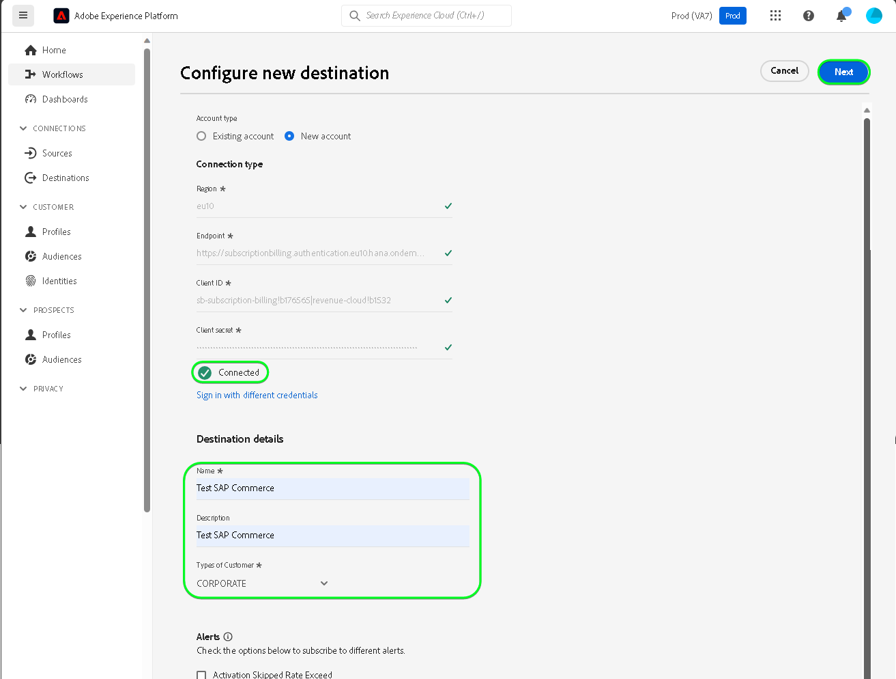

# Connexion [!DNL SAP Commerce]

[!DNL SAP Commerce], anciennement appelée [[!DNL Hybris]](https://www.sap.com/india/products/acquired-brands/what-is-hybris.html), est une solution de plateforme d’e-commerce cloud destinée aux entreprises B2B et B2C et disponible dans le cadre du portefeuille d’expériences client SAP. [[!DNL SAP] Facturation des abonnements](https://www.sap.com/products/financial-management/subscription-billing.html) est un produit du portefeuille qui permet une gestion complète du cycle de vie des abonnements avec des expériences de vente et de paiement simplifiées grâce à des intégrations normalisées.

Cette [!DNL Adobe Experience Platform] [destination](/help/destinations/home.md) utilise l’[[!DNL SAP Subscription Billing] API de gestion des clients](https://api.sap.com/api/BusinessPartner_APIs/path/PUT_customers-customerNumber) pour mettre à jour les détails de vos clients dans [!DNL SAP Commerce] à partir d’une audience Experience Platform existante après activation.

Les instructions vous permettant de vous authentifier sur votre instance [!DNL SAP Commerce] sont plus loin dans la section [Authentifier à la destination](#authenticate).

## Cas d’utilisation {#use-cases}

Pour mieux comprendre quand et comment utiliser la destination [!DNL SAP Commerce], consultez l’exemple de cas d’utilisation ci-dessous que les clientes et clients d’Adobe Experience Platform peuvent résoudre à l’aide de cette destination.

[!DNL SAP Commerce] clients stockent des informations sur les personnes ou les entités organisationnelles qui interagissent avec votre entreprise. Votre équipe utilise les clients existants dans [!DNL SAP Commerce] pour créer les audiences Experience Platform. Après avoir envoyé ces audiences à [!DNL SAP Commerce], leurs informations sont mises à jour et chaque client se voit attribuer une propriété avec sa valeur comme nom d’audience indiquant à quelle audience appartient le client.

## Conditions préalables {#prerequisites}

Reportez-vous aux sections ci-dessous pour connaître les conditions préalables à configurer dans Experience Platform et [!DNL SAP Commerce] et pour obtenir des informations que vous devez collecter avant d’utiliser la destination [!DNL SAP Commerce].

### Conditions préalables d’Experience Platform {#prerequisites-in-experience-platform}

Avant d’activer des données dans la destination [!DNL SAP Commerce], vous devez avoir créé un [schéma](/help/xdm/schema/composition.md), un [jeu de données](https://experienceleague.adobe.com/docs/platform-learn/tutorials/data-ingestion/create-datasets-and-ingest-data.html) et des [audiences](https://experienceleague.adobe.com/docs/platform-learn/tutorials/audiences/create-audiences.html) dans [!DNL Experience Platform].

Reportez-vous à la documentation Experience Platform pour le [groupe de champs de schéma Détails sur l’appartenance à une audience](/help/xdm/field-groups/profile/segmentation.md) si vous avez besoin de conseils sur les statuts de l’audience.

### Conditions préalables pour la destination [!DNL SAP Commerce] {#prerequisites-destination}

Notez les conditions préalables suivantes pour exporter des données d’Experience Platform vers votre compte [!DNL SAP Commerce] :

#### Vous devez disposer d&#39;un compte [!DNL SAP Subscription Billing] {#prerequisites-account}

Pour exporter des données d’Experience Platform vers votre compte [!DNL SAP Commerce], vous devez disposer d’un compte [!DNL SAP Subscription Billing]. Si vous ne disposez pas d’un compte de facturation valide, contactez votre gestionnaire de compte [!DNL SAP]. Reportez-vous au document [[!DNL SAP] Configuration de Platform](https://help.sap.com/doc/5fd179965d5145fbbe7f2a7aa1272338/latest/en-US/PlatformConfiguration.pdf) pour plus d’informations.

#### Générer une clé de service {#prerequisites-service-key}

* La clé de service [!DNL SAP Commerce] vous permet d’accéder à l’API [!DNL SAP Subscription Billing] via Experience Platform. Reportez-vous à la [!DNL SAP Commerce] [créer une clé de service avec l’ID client et le secret client](https://help.sap.com/docs/CLOUD_TO_CASH_OD/1216e7b79c984675b0a6f0005e351c74/87c11a0f5dc3494eaf3baa355925c030.html#create-a-service-key-with-client-id-and-client-secret) pour créer une clé de service. [!DNL SAP Commerce] requiert ce qui suit :
   * Identifiant client
   * Secret client
   * URL. Le modèle d’URL est le suivant : `https://subscriptionbilling.authentication.eu10.hana.ondemand.com`. Cette valeur sera utilisée ultérieurement pour obtenir des valeurs pour `Region` et `Endpoint`.

+++Sélectionner pour voir un exemple de clé de service

```json
{ 
    "url": "https://eu10.revenue.cloud.sap/api",
    "uaa": {
        "clientid": "XXX",
        "clientsecret": "XXX",
        "url": "https://subscriptionbilling.authentication.eu10.hana.ondemand.com",
        "identityzone": "subscriptionbilling",
        "identityzoneid": "XXX",
        "tenantid": "XXX",
        "tenantmode": "dedicated",
        "sburl": "https://internal-xsuaa.authentication.eu10.hana.ondemand.com",
        "apiurl": "https://api.authentication.eu10.hana.ondemand.com",
        "verificationkey": "XXX",
        "xsappname": "XXX",
        "subaccountid": "XXX",
        "uaadomain": "authentication.eu10.hana.ondemand.com",
        "zoneid": "XXX",
        "credential-type": "binding-secret"
    },
    "vendor": "SAP"
}
```

+++

#### Création de références personnalisées dans [!DNL SAP Subscription Billing] {#prerequisites-custom-reference}

Pour mettre à jour le statut de l’audience Experience Platform dans [!DNL SAP Subscription Billing], vous avez besoin d’un champ de référence personnalisé pour chaque audience sélectionnée dans Experience Platform.

Pour créer les références personnalisées, connectez-vous à votre compte [!DNL SAP Subscription Billing] et accédez à la page **[Données et configuration de Principal]** > **[Références personnalisées]**. Sélectionnez ensuite **[!UICONTROL Create]** pour ajouter une nouvelle référence pour chaque audience sélectionnée dans Experience Platform. Vous aurez besoin de ces noms de champ de référence à l’étape [Planifier l’exportation de l’audience et exemple](#schedule-segment-export-example) suivante.

Vous trouverez ci-dessous un exemple de création d’un **[!UICONTROL Reference Type]** personnalisé dans [!DNL SAP Subscription Billing] :


Pour plus d’informations, reportez-vous à la documentation [!DNL SAP Subscription Billing] [références personnalisées](https://help.sap.com/docs/CLOUD_TO_CASH_OD/80d121f216af43648e79664efe5595f7/85696a63c8d8453a934e86c9413a25cf.html?version=2023-11-27).

### Collecter les informations d’identification requises {#gather-credentials}

Pour connecter [!DNL SAP Commerce] à Experience Platform, vous devez fournir des valeurs pour les propriétés de connexion suivantes :

| Informations d’identification | Description |
| --- | --- |
| Identifiant client | Valeur de `clientId` à partir de la clé de service. |
| Secret client | Valeur de `clientSecret` à partir de la clé de service. |
| Point d’entrée | La valeur de `url` de la clé de service est similaire à `https://subscriptionbilling.authentication.eu10.hana.ondemand.com`. |
| Région | L’emplacement de votre centre de données. La région est présente dans le `url` et a une valeur similaire à `eu10` ou `us10`. Par exemple, si le `url` est `https://eu10.revenue.cloud.sap/api`, vous avez besoin de `eu10`. |

## Mécanismes de sécurisation {#guardrails}

Les requêtes d’API au [!DNL SAP Cloud Management service] sont soumises aux [limites de débit](https://help.sap.com/docs/btp/sap-business-technology-platform/account-administration-rate-limiting). Lorsque la limite de taux est dépassée, vous rencontrez un code de statut de réponse `HTTP 429 Too Many Requests` .

## Identités prises en charge {#supported-identities}

[!DNL SAP Commerce] prend en charge la mise à jour des identités décrites dans le tableau ci-dessous. En savoir plus sur les [identités](/help/identity-service/features/namespaces.md).

| Identité cible | Description | Considérations |
| --- | --- | --- |
| `customerNumberSAP` | Identifiant client de la personne ou de l’entreprise déjà présent dans votre compte [!DNL SAP Commerce]. | Obligatoire |

## Audiences prises en charge {#supported-audiences}

Cette section décrit toutes les audiences que vous pouvez exporter vers cette destination.

Cette destination prend en charge l’activation de toutes les audiences générées par le [Segmentation Service](../../../segmentation/home.md) d’Experience Platform.

Cette destination prend également en charge l’activation des audiences décrites dans le tableau ci-dessous.

| Type d’audience | Pris en charge | Description |
| ------------- | --------- | ----------- |
| [!DNL Segmentation Service] | Oui | Audiences générées via Experience Platform [Segmentation Service](../../../segmentation/home.md). |
| Toutes les autres origines d’audience | Oui | Cette catégorie inclut toutes les origines d’audience en dehors des audiences générées par le [!DNL Segmentation Service]. Découvrez les [différentes origines d’audience](/help/segmentation/ui/audience-portal.md#customize). Voici quelques exemples : <ul><li> audiences de chargement personnalisées [importées](../../../segmentation/ui/audience-portal.md#import-audience) dans Experience Platform à partir de fichiers CSV,</li><li> les audiences semblables, </li><li> les audiences fédérées, </li><li> les audiences générées dans d’autres applications Experience Platform telles que Adobe Journey Optimizer, </li><li> et plus encore. </li></ul> |

{style="table-layout:auto"}


Audiences prises en charge par type de données d’audience :

| Type de données d’audience | Pris en charge | Description | Cas d’utilisation |
|--------------------|-----------|-------------|-----------|
| [Audiences de personnes](/help/segmentation/types/people-audiences.md) | Oui | En fonction des profils client, ce qui vous permet de cibler des groupes spécifiques de personnes pour les campagnes marketing. | Acheteurs fréquents, personnes abandonnant leur panier |
| [Audiences de compte](/help/segmentation/types/account-audiences.md) | Non | Ciblez des individus au sein d’organisations spécifiques pour les stratégies marketing basées sur les comptes. | Marketing B2B |
| [Audiences de prospects &#x200B;](/help/segmentation/types/prospect-audiences.md) | Non | Ciblez les individus qui ne sont pas encore clients, mais qui partagent des caractéristiques avec votre audience cible. | Prospection à l’aide de données tierces |
| [Exportations de jeux de données](/help/catalog/datasets/overview.md) | Non | Collections de données structurées stockées dans le lac de données Adobe Experience Platform. | Rapports, workflows de science des données |

{style="table-layout:auto"}


## Type et fréquence d’exportation {#export-type-frequency}

Reportez-vous au tableau ci-dessous pour plus d’informations sur le type et la fréquence d’exportation des destinations.

| Élément | Type | Notes |
|---------|----------|---------|
| Type d’exportation | **[!UICONTROL Profile-based]** | <ul><li>Vous exportez tous les membres d’une audience, ainsi que les champs de schéma souhaités *(par exemple : adresse e-mail, numéro de téléphone, nom)*, en fonction de votre mappage de champs.</li><li> Pour chaque audience sélectionnée dans Experience Platform, l’attribut [!DNL SAP Commerce] supplémentaire correspondant est mis à jour avec son statut d’audience à partir d’Experience Platform.</li></ul> |
| Fréquence des exportations | **[!UICONTROL Streaming]** | <ul><li>Les destinations de diffusion en continu sont des connexions basées sur l’API « toujours actives ». Lorsqu’un profil est mis à jour dans Experience Platform en fonction de l’évaluation de l’audience, le connecteur envoie la mise à jour en aval vers la plateforme de destination. En savoir plus sur les [destinations de diffusion en continu](/help/destinations/destination-types.md#streaming-destinations).</li></ul> |

{style="table-layout:auto"}

## Se connecter à la destination {#connect}

>[!IMPORTANT]
>
>Pour vous connecter à la destination, vous devez disposer de l’autorisation de contrôle d’accès **[!UICONTROL Manage Destinations]** [Access Control](/help/access-control/home.md#permissions). Lisez la [présentation du contrôle d’accès](/help/access-control/ui/overview.md) ou contactez votre administrateur de produit pour obtenir les autorisations requises.

Pour vous connecter à cette destination, procédez comme décrit dans le [tutoriel sur la configuration des destinations](../../ui/connect-destination.md). Dans le workflow de configuration des destinations, renseignez les champs répertoriés dans les deux sections ci-dessous.

Dans **[!UICONTROL Destinations]** > **[!UICONTROL Catalog]**, recherchez [!DNL SAP Commerce]. Vous pouvez également localiser cet élément dans la catégorie **[!UICONTROL eCommerce]** .

### S’authentifier auprès de la destination {#authenticate}

Renseignez les champs obligatoires ci-dessous. Reportez-vous à la section [Générer une clé de service](#prerequisites-service-key) pour obtenir des conseils.

| Champ | Description |
| --- | --- |
| **[!UICONTROL Client ID]** | Valeur de `clientId` à partir de la clé de service. |
| **[!UICONTROL Client secret]** | Valeur de `clientSecret` à partir de la clé de service. |
| **[!UICONTROL Endpoint]** | La valeur de `url` de la clé de service est similaire à `https://subscriptionbilling.authentication.eu10.hana.ondemand.com`. |
| **[!UICONTROL Region]** | L’emplacement de votre centre de données. La région est présente dans le `url` et a une valeur similaire à `eu10` ou `us10`. Par exemple, si le `url` est `https://eu10.revenue.cloud.sap/api`, vous avez besoin de `eu10`. |

Pour vous authentifier auprès de la destination, sélectionnez **[!UICONTROL Connect to destination]**.


Si les détails fournis sont valides, l’interface utilisateur affiche un statut de **[!UICONTROL Connected]** avec une coche verte. Vous pouvez ensuite passer à l’étape suivante.

### Renseigner les détails de la destination {#destination-details}

Pour configurer les détails de la destination, renseignez les champs obligatoires et facultatifs ci-dessous. Un astérisque situé en regard d’un champ de l’interface utilisateur indique que le champ est obligatoire.


* **[!UICONTROL Name]** : nom par lequel vous reconnaîtrez cette destination à l’avenir.
* **[!UICONTROL Description]** : une description qui vous aidera à identifier cette destination à l’avenir.
* **[!UICONTROL Type of Customer]** : sélectionnez ***Individuel*** ou ***Entreprise*** selon les entités de votre audience. Le [!DNL SAP Subscription Billing] [schéma](https://api.sap.com/api/BusinessPartner_APIs/schema) change les champs obligatoires en fonction de cette sélection mappée à l’attribut `customerType`. Si la sélection est ***Entreprise***, les mappages obligatoires tels que `firstName` et `lastName` requis pour un client individuel seront ignorés et `company` deviendront obligatoires et vice versa.

### Activer les alertes {#enable-alerts}

Vous pouvez activer les alertes pour recevoir des notifications sur le statut de votre flux de données vers votre destination. Sélectionnez une alerte dans la liste et abonnez-vous à des notifications concernant le statut de votre flux de données. Pour plus d’informations sur les alertes, consultez le guide sur l’[abonnement aux alertes des destinations dans l’interface utilisateur](../../ui/alerts.md).

Lorsque vous avez terminé de renseigner les détails sur votre connexion de destination, sélectionnez **[!UICONTROL Next]**.

## Activer des audiences vers cette destination {#activate}

>[!IMPORTANT]
> 
>* Pour activer les données, vous avez besoin des autorisations de contrôle d’accès **[!UICONTROL View Destinations]**, **[!UICONTROL Activate Destinations]**, **[!UICONTROL View Profiles]** et **[!UICONTROL View Segments]** [Access control](/help/access-control/home.md#permissions). Lisez la [présentation du contrôle d’accès](/help/access-control/ui/overview.md) ou contactez votre administrateur ou administratrice du produit pour obtenir les autorisations requises.
>* Pour exporter des *identités*, vous devez disposer de l’autorisation de contrôle d’accès **[!UICONTROL View Identity Graph]**&#x200B;[&#128279;](/help/access-control/home.md#permissions). <br> {width="100" zoomable="yes"}

Consultez la section [Activer les profils et les audiences vers les destinations d’exportation d’audiences en flux continu](/help/destinations/ui/activate-segment-streaming-destinations.md) pour obtenir des instructions sur l’activation des audiences vers cette destination.

### Mapper les attributs et les identités {#map}

Pour envoyer correctement vos données d’audience de Adobe Experience Platform vers la destination [!DNL SAP Commerce], vous devez passer par l’étape de mappage des champs. Le mappage consiste à créer un lien entre vos champs de schéma de modèle de données d’expérience (XDM) dans votre compte Experience Platform et leurs équivalents issus de la destination cible. Pour mapper correctement vos champs XDM vers les champs de destination [!DNL SAP Commerce], procédez comme suit :

#### Mapper l’identité `customerNumberSAP`

L’identité `customerNumberSAP` est un mappage obligatoire pour cette destination. Suivez les étapes ci-dessous pour le mapper :

1. À l’étape **[!UICONTROL Mapping]**, sélectionnez **[!UICONTROL Add new mapping]**. Une nouvelle ligne de mappage s’affiche désormais à l’écran.
   
1. Dans la fenêtre de **[!UICONTROL Select source field]**, choisissez le **[!UICONTROL Select identity namespace]** et sélectionnez `customerNumberSAP`.
   
1. Dans la fenêtre de **[!UICONTROL Select target field]**, choisissez le **[!UICONTROL Select identity namespace]** et sélectionnez l’identité `customerNumber`.
   

| Champ source | Champ cible | Obligatoire |
| --- | --- | --- |
| `IdentityMap: customerNumberSAP` | `Identity: customerNumber` | Oui |

Un exemple avec le mappage d’identité est illustré ci-dessous :


#### Attributs de mappage

Pour ajouter d’autres attributs à mettre à jour entre votre schéma de profil XDM et votre compte [!DNL SAP Subscription Billing], répétez les étapes ci-dessous :

1. À l’étape **[!UICONTROL Mapping]**, sélectionnez **[!UICONTROL Add new mapping]**. Une nouvelle ligne de mappage s’affiche désormais à l’écran.
   
1. Dans la fenêtre **[!UICONTROL Select source field]** , choisissez la catégorie **[!UICONTROL Select attributes]** et sélectionnez l’attribut XDM .
   
1. Dans la fenêtre de **[!UICONTROL Select target field]**, choisissez **[!UICONTROL Select custom attributes]** catégorie et saisissez le nom de l’attribut [!DNL SAP Subscription Billing] dans la liste des attributs du client [schéma](https://api.sap.com/api/BusinessPartner_APIs/schema).
   

>[!IMPORTANT]
>
> Les noms des champs cibles sont sensibles à la casse et doivent correspondre aux noms des attributs [!DNL SAP Subscription Billing]. La seule exception à cette règle est `country`’emplacement où vous devez utiliser `countryCode` à la place. [!DNL SAP Subscription Billing] prend en charge les codes de pays alpha-2 (ISO 3166). La valeur respecte la casse et doit comporter entre 0 et 3 caractères. Veillez donc à indiquer exactement comme défini, faute de quoi vous rencontrerez des erreurs : `The country code {} does not exist` ou `size must be between 0 and 3`.

#### Mapper les attributs de `mandatory` pour le type de client sélectionné

Les mappages d’attributs obligatoires dépendent du **[!UICONTROL Type of Customer]** que vous avez sélectionné. Pour mapper les attributs obligatoires, sélectionnez l’un des éléments suivants :

>[!BEGINTABS]

>[!TAB Client individuel]

| Champ source | Champ cible | Obligatoire |
| --- | --- | --- |
| `xdm: person.lastName` | `Attribute: lastName` | Oui |
| `xdm: workAddress.countryCode` | `Attribute: countryCode` | Oui |

>[!TAB Client d’entreprise]

| Champ source | Champ cible | Obligatoire |
| --- | --- | --- |
| `xdm: b2b.companyName` | `Attribute: company` | Oui |
| `xdm: workAddress.countryCode` | `Attribute: countryCode` | Oui |

>[!ENDTABS]

#### Mappage d’attributs supplémentaires

Vous pouvez ensuite ajouter d’autres mappages entre votre schéma de profil XDM et les attributs [!DNL SAP Subscription Billing] [schema](https://api.sap.com/api/BusinessPartner_APIs/schema) pour un client, comme illustré ci-dessous :

>[!BEGINTABS]

>[!TAB Client individuel]

| Champ source | Champ cible | Obligatoire |
| --- | --- | --- |
| `xdm: person.name.firstName` | `Attribute: firstName` | Non |
| `xdm: workAddress.street1` | `Attribute: street` | Non |
| `xdm: workAddress.city` | `Attribute: city` | Non |

Un exemple avec des mappages d’attributs obligatoires et facultatifs où le client est une personne est illustré ci-dessous :


>[!TAB Client d’entreprise]

| Champ source | Champ cible | Obligatoire |
| --- | --- | --- |
| `xdm: workAddress.street1` | `Attribute: street` | Non |
| `xdm: workAddress.city` | `Attribute: city` | Non |

Un exemple avec des mappages d’attributs obligatoires et facultatifs où le client est une entreprise est illustré ci-dessous :


>[!ENDTABS]

Lorsque vous avez terminé de fournir les mappages pour votre connexion de destination, sélectionnez **[!UICONTROL Next]**.

### Planifier l’exportation de l’audience et exemple {#schedule-segment-export-example}

Lors de l’exécution de l’étape [&#x200B; Planifier l’exportation d’audience &#x200B;](/help/destinations/ui/activate-segment-streaming-destinations.md#scheduling), vous devez mapper manuellement les audiences Experience Platform aux [&#x200B; attributs &#x200B;](#prerequisites-attribute) dans [!DNL SAP Subscription Billing].

Un exemple de l’étape Planifier l’exportation de l’audience, avec l’emplacement du [!DNL SAP Commerce] de **[!UICONTROL Mapping ID]** en surbrillance, est illustré ci-dessous :


Pour ce faire, sélectionnez chaque segment, puis saisissez le nom de la référence personnalisée à partir de [!DNL SAP Subscription Billing] dans le champ Connecteur de destination [!DNL SAP Commerce] **[!UICONTROL Mapping ID]** . Pour plus d’informations sur la création de références personnalisées, reportez-vous à la section [Créer des références personnalisées dans [!DNL SAP Subscription Billing]](#prerequisites-custom-reference).

>[!IMPORTANT]
>
> N’utilisez pas le libellé de référence personnalisé comme valeur.
>

Par exemple, si l’audience Experience Platform sélectionnée est `sap_audience1` et que vous souhaitez que son statut soit mis à jour dans le [!DNL SAP Subscription Billing] de référence personnalisé `SAP_1`, spécifiez cette valeur dans le champ [!DNL SAP_Commerce] **[!UICONTROL Mapping ID]** .

Un exemple **[!UICONTROL Reference Type]** de [!DNL SAP Subscription Billing] est illustré ci-dessous :


Un exemple de l’étape Planifier l’exportation de l’audience, avec une audience sélectionnée et son [!DNL SAP Commerce] correspondant **[!UICONTROL Mapping ID]** mis en surbrillance, est illustré ci-dessous :


Comme indiqué, la valeur dans le champ **[!UICONTROL Mapping ID]** doit correspondre exactement à la valeur de [!DNL SAP Subscription Billing] **[!UICONTROL Reference Type]** .

Répétez cette section pour chaque audience Experience Platform activée.

En fonction de l’image ci-dessus dans laquelle vous avez sélectionné deux audiences, le mappage serait le suivant :

| [!DNL SAP Commerce] le nom de l’audience | [!DNL SAP Subscription Billing] **[!UICONTROL Reference Type]** | [!DNL SAP Commerce] valeur **[!UICONTROL Mapping ID]** |
| --- | --- | --- |
| sap_audience1 | `SAP_1` | `SAP_1` |
| SAP Audience2 | `SAP_2` | `SAP_2` |

## Valider l’exportation des données {#exported-data}

Pour vérifier que vous avez correctement configuré la destination, procédez comme suit :

Connectez-vous au compte [!DNL SAP Subscription Billing], puis accédez à la page **[!UICONTROL Contacts]** pour vérifier les statuts de l’audience. La liste peut être configurée pour afficher des colonnes pour les références personnalisées et afficher les statuts d’audience correspondants.


## Utilisation et gouvernance des données {#data-usage-governance}

Lors de la gestion de vos données, toutes les destinations [!DNL Adobe Experience Platform] se conforment aux politiques d’utilisation des données. Pour obtenir des informations détaillées sur la manière dont [!DNL Adobe Experience Platform] applique la gouvernance des données, lisez la [présentation de la gouvernance des données](/help/data-governance/home.md).

## Erreurs et résolution des problèmes {#errors-and-troubleshooting}

Reportez-vous à la page de documentation [[!DNL SAP Subscription Billing] Types d’erreur](https://help.sap.com/docs/CLOUD_TO_CASH_OD/987aec876092428f88162e438acf80d6/1a6a0dd6129c48e8b235190a1b5409fa.html) pour obtenir une liste des types d’erreur possibles et leurs codes de réponse.

## Ressources supplémentaires {#additional-resources}

Retrouvez d’autres informations utiles de la documentation [!DNL SAP] ci-dessous :

* [Facturation des abonnements SAP intégrés](https://help.sap.com/docs/CLOUD_TO_CASH_OD/1216e7b79c984675b0a6f0005e351c74/e4b8badf7d124026991e4ab6b57d2a33.html)

### Journal des modifications

Cette section répertorie les nouvelles fonctionnalités et les mises à jour importantes de la documentation consacrée au connecteur de destination.

+++ Afficher le journal des modifications

| Mois de publication | Type de mise à jour | Description |
|---|---|---|
| Janvier 2024 | Version initiale | Publication de la destination initiale et de la documentation. |

{style="table-layout:auto"}

+++
