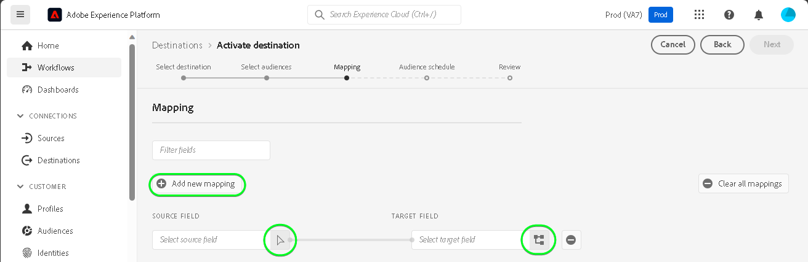

# Connexion [!DNL SAP Commerce]

[!DNL SAP Commerce], anciennement connu sous le nom de [[!DNL Hybris]](https://www.sap.com/india/products/acquired-brands/what-is-hybris.html), est une solution de plateforme de commerce électronique basée sur le cloud pour les entreprises B2B et B2C, disponible dans le cadre du portefeuille d’expérience client SAP. [[!DNL SAP] Facturation d’abonnement](https://www.sap.com/products/financial-management/subscription-billing.html) est un produit appartenant au portefeuille qui permet une gestion complète du cycle de vie des abonnements avec des expériences de vente et de paiement simplifiées grâce à des intégrations normalisées.

Ceci [!DNL Adobe Experience Platform] [destination](/help/destinations/home.md) utilise la variable [[!DNL SAP Subscription Billing] API de gestion des clients](https://api.sap.com/api/BusinessPartner_APIs/path/PUT_customers-customerNumber), pour mettre à jour les détails de votre client dans [!DNL SAP Commerce] d’une audience Experience Platform existante après activation.

Les instructions vous permettant de vous authentifier sur votre instance [!DNL SAP Commerce] sont plus loin dans la section [Authentifier à la destination](#authenticate).

## Cas d’utilisation {#use-cases}

Pour mieux comprendre quand et comment utiliser la destination [!DNL SAP Commerce], consultez l’exemple de cas d’utilisation ci-dessous que les clientes et clients d’Adobe Experience Platform peuvent résoudre à l’aide de cette destination.

[!DNL SAP Commerce] Les clients stockent des informations sur les individus ou les entités organisationnelles qui interagissent avec votre entreprise. Votre équipe utilise les clients existants dans [!DNL SAP Commerce] pour créer les audiences Experience Platform. Après avoir envoyé ces audiences à [!DNL SAP Commerce], leurs informations sont mises à jour et chaque client se voit attribuer une propriété avec sa valeur comme nom d’audience indiquant à quelle audience appartient le client.

## Conditions préalables {#prerequisites}

Reportez-vous aux sections ci-dessous pour connaître les conditions préalables à configurer dans Experience Platform et [!DNL SAP Commerce] et pour les informations que vous devez rassembler avant de travailler avec la variable [!DNL SAP Commerce] destination.

### Conditions préalables d’Experience Platform {#prerequisites-in-experience-platform}

Avant d’activer des données dans [!DNL SAP Commerce] destination, vous devez avoir une [schema](/help/xdm/schema/composition.md), un [dataset](https://experienceleague.adobe.com/docs/platform-learn/tutorials/data-ingestion/create-datasets-and-ingest-data.html), et [audiences](https://experienceleague.adobe.com/docs/platform-learn/tutorials/audiences/create-audiences.html) créé dans [!DNL Experience Platform].

Reportez-vous à la documentation Experience Platform pour [Groupe de champs Détails de l’appartenance à une audience](/help/xdm/field-groups/profile/segmentation.md) si vous avez besoin de conseils sur les états d’audience.

### Conditions préalables pour l’ [!DNL SAP Commerce] destination {#prerequisites-destination}

Notez les conditions préalables suivantes pour exporter des données de Platform vers votre [!DNL SAP Commerce] compte :

#### Vous devez disposer d’un [!DNL SAP Subscription Billing] account {#prerequisites-account}

Pour exporter des données de Platform vers votre [!DNL SAP Commerce] , vous devez disposer d’un [!DNL SAP Subscription Billing] compte . Si vous ne disposez pas d’un compte de facturation valide, contactez votre [!DNL SAP] gestionnaire de compte. Voir [[!DNL SAP] Configuration de la plateforme](https://help.sap.com/doc/5fd179965d5145fbbe7f2a7aa1272338/latest/en-US/PlatformConfiguration.pdf) pour plus de détails.

#### Générer une clé de service {#prerequisites-service-key}

* La variable [!DNL SAP Commerce] la clé de service vous permet d’accéder à la [!DNL SAP Subscription Billing] API via Experience Platform. Voir [!DNL SAP Commerce] [créer une clé de service avec un identifiant client et un secret client ;](https://help.sap.com/docs/CLOUD_TO_CASH_OD/1216e7b79c984675b0a6f0005e351c74/87c11a0f5dc3494eaf3baa355925c030.html#create-a-service-key-with-client-id-and-client-secret) pour créer une clé de service. [!DNL SAP Commerce] requiert ce qui suit :
   * Identifiant client
   * Secret client
   * URL. Le modèle d’URL est le suivant : `https://subscriptionbilling.authentication.eu10.hana.ondemand.com`. Cette valeur sera utilisée ultérieurement pour obtenir des valeurs pour `Region` et `Endpoint`.

+++Sélectionnez cette option pour afficher un exemple de clé de service.

```json
{ 
    "url": "https://eu10.revenue.cloud.sap/api",
    "uaa": {
        "clientid": "XXX",
        "clientsecret": "XXX",
        "url": "https://subscriptionbilling.authentication.eu10.hana.ondemand.com",
        "identityzone": "subscriptionbilling",
        "identityzoneid": "XXX",
        "tenantid": "XXX",
        "tenantmode": "dedicated",
        "sburl": "https://internal-xsuaa.authentication.eu10.hana.ondemand.com",
        "apiurl": "https://api.authentication.eu10.hana.ondemand.com",
        "verificationkey": "XXX",
        "xsappname": "XXX",
        "subaccountid": "XXX",
        "uaadomain": "authentication.eu10.hana.ondemand.com",
        "zoneid": "XXX",
        "credential-type": "binding-secret"
    },
    "vendor": "SAP"
}
```

+++

#### Création de références personnalisées dans [!DNL SAP Subscription Billing] {#prerequisites-custom-reference}

Pour mettre à jour l’état de l’audience Experience Platform dans [!DNL SAP Subscription Billing], vous avez besoin d’un champ de référence personnalisé pour chaque audience sélectionnée dans Platform.

Pour créer des références personnalisées, connectez-vous à [!DNL SAP Subscription Billing] et accédez au **[Données et configuration du Principal]** > **[Références personnalisées]** page. Ensuite, sélectionnez **[!UICONTROL Créer]** pour ajouter une nouvelle référence pour chaque audience sélectionnée dans Platform. Vous aurez besoin de ces noms de champ de référence dans les [Planification de l’export d’audience et exemple](#schedule-segment-export-example) étape .

Exemple de création d’une **[!UICONTROL Type de référence]** dans [!DNL SAP Subscription Billing] est illustré ci-dessous :


Pour plus d’informations, reportez-vous au [!DNL SAP Subscription Billing] [références personnalisées](https://help.sap.com/docs/CLOUD_TO_CASH_OD/80d121f216af43648e79664efe5595f7/85696a63c8d8453a934e86c9413a25cf.html?version=2023-11-27) la documentation.

### Collecter les informations d’identification requises {#gather-credentials}

Pour se connecter [!DNL SAP Commerce] pour Experience Platform, vous devez fournir des valeurs pour les propriétés de connexion suivantes :

| Informations d’identification | Description |
| --- | --- |
| Identifiant client | La valeur de `clientId` à partir de la clé de service. |
| Secret client | La valeur de `clientSecret` à partir de la clé de service. |
| Point d’entrée | La valeur de `url` à partir de la clé de service, la variable `https://subscriptionbilling.authentication.eu10.hana.ondemand.com`. |
| Région | Emplacement de votre centre de données. La région est présente dans la variable `url` et a une valeur similaire à `eu10` ou `us10`. Par exemple, si la variable `url` is `https://eu10.revenue.cloud.sap/api` besoin `eu10`. |

## Mécanismes de sécurisation {#guardrails}

Demandes d’API à la fonction [!DNL SAP Cloud Management service] sont soumises à [Limites de taux](https://help.sap.com/docs/btp/sap-business-technology-platform/account-administration-rate-limiting). Lorsque la limite de taux est dépassée, un événement `HTTP 429 Too Many Requests` code d’état de réponse .

## Identités prises en charge {#supported-identities}

[!DNL SAP Commerce] prend en charge la mise à jour des identités décrites dans le tableau ci-dessous. En savoir plus sur les [identités](/help/identity-service/features/namespaces.md).

| Identité cible | Description | Considérations |
| --- | --- | --- |
| `customerNumberSAP` | Identifiant du client individuel ou d’entreprise déjà présent dans votre [!DNL SAP Commerce] compte . | Obligatoire |

## Audiences prises en charge {#supported-audiences}

Cette section décrit toutes les audiences que vous pouvez exporter vers cette destination.

Cette destination prend en charge l’activation de toutes les audiences générées par le [Segmentation Service](../../../segmentation/home.md) d’Experience Platform.

Cette destination prend également en charge l’activation des audiences décrites dans le tableau ci-dessous.

| Type d’audience | Pris en charge | Description |
| ------------- | --------- | ----------- |
| [!DNL Segmentation Service] | ✓ | Audiences générées par l’Experience Platform [Segmentation Service](../../../segmentation/home.md). |
| Chargements personnalisés | ✓ | Audiences [importées](../../../segmentation/ui/audience-portal.md#import-audience) dans Experience Platform à partir de fichiers CSV. |

{style="table-layout:auto"}

## Type et fréquence d’exportation {#export-type-frequency}

Reportez-vous au tableau ci-dessous pour plus d’informations sur le type et la fréquence d’exportation des destinations.

| Élément | Type | Notes |
---------|----------|---------|
| Type d’exportation | **[!UICONTROL Basé sur les profils]** | <ul><li>Vous exportez tous les membres d’une audience, ainsi que les champs de schéma souhaités. *(par exemple : adresse électronique, numéro de téléphone, nom)*, en fonction de votre mappage de champs.</li><li> Pour chaque audience sélectionnée dans Platform, la valeur [!DNL SAP Commerce] un attribut supplémentaire est mis à jour avec son état d’audience de Platform.</li></ul> |
| Fréquence des exportations | **[!UICONTROL Diffusion en continu]** | <ul><li>Les destinations de diffusion en continu sont des connexions basées sur l’API « toujours actives ». Lorsqu’un profil est mis à jour en Experience Platform en fonction de l’évaluation de l’audience, le connecteur envoie la mise à jour en aval vers la plateforme de destination. En savoir plus sur les [destinations de diffusion en continu](/help/destinations/destination-types.md#streaming-destinations).</li></ul> |

{style="table-layout:auto"}

## Se connecter à la destination {#connect}

>[!IMPORTANT]
>
>Pour vous connecter à la destination, vous devez disposer de l’[autorisation de contrôle d’accès](/help/access-control/home.md#permissions) **[!UICONTROL Gérer les destinations]**. Lisez la [présentation du contrôle d’accès](/help/access-control/ui/overview.md) ou contactez votre administrateur de produit pour obtenir les autorisations requises.

Pour vous connecter à cette destination, procédez comme décrit dans le [tutoriel sur la configuration des destinations](../../ui/connect-destination.md). Dans le workflow de configuration des destinations, renseignez les champs répertoriés dans les deux sections ci-dessous.

Within **[!UICONTROL Destinations]** > **[!UICONTROL Catalogue]**, recherchez [!DNL SAP Commerce]. Vous pouvez également la localiser sous le **[!UICONTROL eCommerce]** catégorie.

### S’authentifier auprès de la destination {#authenticate}

Renseignez les champs obligatoires ci-dessous. Voir [Générer une clé de service](#prerequisites-service-key) pour obtenir des conseils.

| Champ | Description |
| --- | --- |
| **[!UICONTROL Identifiant du client]** | La valeur de `clientId` à partir de la clé de service. |
| **[!UICONTROL Secret client]** | La valeur de `clientSecret` à partir de la clé de service. |
| **[!UICONTROL Point d’entrée]** | La valeur de `url` à partir de la clé de service, la variable `https://subscriptionbilling.authentication.eu10.hana.ondemand.com`. |
| **[!UICONTROL Région]** | Emplacement de votre centre de données. La région est présente dans la variable `url` et a une valeur similaire à `eu10` ou `us10`. Par exemple, si la variable `url` is `https://eu10.revenue.cloud.sap/api` besoin `eu10`. |

Pour vous authentifier auprès de la destination, sélectionnez **[!UICONTROL Se connecter à la destination]**.


Si les détails fournis sont valides, l’interface utilisateur affiche un statut **[!UICONTROL Connecté]** avec une coche verte. Vous pouvez ensuite passer à l’étape suivante.

### Renseigner les détails de la destination {#destination-details}

Pour configurer les détails de la destination, renseignez les champs obligatoires et facultatifs ci-dessous. Un astérisque situé en regard d’un champ de l’interface utilisateur indique que le champ est obligatoire.


* **[!UICONTROL Nom]** : un nom par lequel vous reconnaîtrez cette destination à l’avenir.
* **[!UICONTROL Description]** : une description qui vous aidera à identifier cette destination à l’avenir.
* **[!UICONTROL Type de client]**: sélectionnez ***Individuel*** ou ***Entreprise*** selon les entités de votre audience. La variable [!DNL SAP Subscription Billing] [schema](https://api.sap.com/api/BusinessPartner_APIs/schema) bascule les champs obligatoires en fonction de cette sélection mappée à la propriété `customerType` attribut. Si la sélection est ***Entreprise***, puis les mappages obligatoires comme `firstName` et `lastName` requis pour un client individuel sera ignoré et `company` devient obligatoire et inversement.

### Activer les alertes {#enable-alerts}

Vous pouvez activer les alertes pour recevoir des notifications sur le statut de votre flux de données vers votre destination. Sélectionnez une alerte dans la liste et abonnez-vous à des notifications concernant le statut de votre flux de données. Pour plus d’informations sur les alertes, consultez le guide sur l’[abonnement aux alertes des destinations dans l’interface utilisateur](../../ui/alerts.md).

Lorsque vous avez terminé de renseigner les détails sur votre connexion de destination, sélectionnez **[!UICONTROL Suivant]**.

## Activer des audiences vers cette destination {#activate}

>[!IMPORTANT]
> 
>* Pour activer les données, vous avez besoin de l’événement **[!UICONTROL Affichage des destinations]**, **[!UICONTROL Activation des destinations]**, **[!UICONTROL Afficher les profils]**, et **[!UICONTROL Affichage de segments]** [autorisations de contrôle d’accès](/help/access-control/home.md#permissions). Lisez la [présentation du contrôle d’accès](/help/access-control/ui/overview.md) ou contactez votre administrateur ou administratrice du produit pour obtenir les autorisations requises.
>* Pour exporter *identités*, vous avez besoin de la fonction **[!UICONTROL Affichage du graphique des identités]** [autorisation de contrôle d’accès](/help/access-control/home.md#permissions). <br> {width="100" zoomable="yes"}

Consultez la section [Activer les profils et les audiences vers les destinations d’exportation d’audiences en flux continu](/help/destinations/ui/activate-segment-streaming-destinations.md) pour obtenir des instructions sur l’activation des audiences vers cette destination.

### Mapper les attributs et les identités {#map}

Pour envoyer correctement vos données d’audience de Adobe Experience Platform vers le [!DNL SAP Commerce] destination, vous devez passer par l’étape de mappage des champs. Le mappage consiste à créer un lien entre vos champs de schéma de modèle de données d’expérience (XDM) dans votre compte Platform et leurs équivalents issus de la destination cible. Pour mapper correctement vos champs XDM à [!DNL SAP Commerce] pour les champs de destination, procédez comme suit :

#### Faites correspondre la variable `customerNumberSAP` identité

La variable `customerNumberSAP` l’identité est un mappage obligatoire pour cette destination. Suivez les étapes ci-dessous pour le mapper :
1. Dans l’étape **[!UICONTROL Mappage]**, sélectionnez **[!UICONTROL Ajouter un nouveau mappage]**. Vous pouvez désormais voir une nouvelle ligne de mappage sur l’écran.
   
1. Dans le **[!UICONTROL Sélectionner le champ source]** , choisissez la **[!UICONTROL Sélectionner un espace de noms d’identité]** et sélectionnez `customerNumberSAP`.
   
1. Dans le **[!UICONTROL Sélectionner le champ cible]** , choisissez la **[!UICONTROL Sélectionner un espace de noms d’identité]** et sélectionnez la variable `customerNumber` identité.
   

| Champ source | Champ cible | Obligatoire |
| --- | --- | --- |
| `IdentityMap: customerNumberSAP` | `Identity: customerNumber` | Oui |

Un exemple de mappage d’identité est illustré ci-dessous :


#### Mappage des attributs

Pour ajouter d’autres attributs à mettre à jour entre votre schéma de profil XDM et votre [!DNL SAP Subscription Billing] , répétez les étapes ci-dessous :
1. Dans l’étape **[!UICONTROL Mappage]**, sélectionnez **[!UICONTROL Ajouter un nouveau mappage]**. Vous pouvez désormais voir une nouvelle ligne de mappage sur l’écran.
   
1. Dans le **[!UICONTROL Sélectionner le champ source]** , choisissez la **[!UICONTROL Sélectionner des attributs]** et sélectionnez l’attribut XDM.
   
1. Dans le **[!UICONTROL Sélectionner le champ cible]** fenêtre, choisissez **[!UICONTROL Sélectionner des attributs personnalisés]** et saisissez le nom du champ [!DNL SAP Subscription Billing] de la liste des clients [schema](https://api.sap.com/api/BusinessPartner_APIs/schema) attributs.
   

>[!IMPORTANT]
>
> Les noms des champs cibles sont sensibles à la casse et doivent correspondre à la variable [!DNL SAP Subscription Billing] noms d’attributs. La seule exception à cette règle est : `country` où vous devez utiliser `countryCode` au lieu de . [!DNL SAP Subscription Billing] prend en charge les codes pays alpha-2 (ISO 3166). La valeur est sensible à la casse et doit être comprise entre 0 et 3 caractères. Veillez donc à fournir exactement la valeur définie, sinon vous risquez de rencontrer des erreurs : `The country code {} does not exist` ou `size must be between 0 and 3`.

#### Carte `mandatory` attributs pour le type de client sélectionné

Les mappages d’attributs obligatoires dépendent de **[!UICONTROL Type de client]** que vous aviez choisi. Pour mapper les attributs obligatoires, sélectionnez dans l’une des options suivantes :

>[!BEGINTABS]

>[!TAB Client individuel]

| Champ source | Champ cible | Obligatoire |
| --- | --- | --- |
| `xdm: person.lastName` | `Attribute: lastName` | Oui |
| `xdm: workAddress.countryCode` | `Attribute: countryCode` | Oui |

>[!TAB Client d’entreprise]

| Champ source | Champ cible | Obligatoire |
| --- | --- | --- |
| `xdm: b2b.companyName` | `Attribute: company` | Oui |
| `xdm: workAddress.countryCode` | `Attribute: countryCode` | Oui |

>[!ENDTABS]

#### Mappage d’attributs supplémentaires

Vous pouvez ensuite ajouter d’autres mappages entre votre schéma de profil XDM et le [!DNL SAP Subscription Billing] [schema](https://api.sap.com/api/BusinessPartner_APIs/schema) attributs pour un client, comme illustré ci-dessous :

>[!BEGINTABS]

>[!TAB Client individuel]

| Champ source | Champ cible | Obligatoire |
| --- | --- | --- |
| `xdm: person.name.firstName` | `Attribute: firstName` | Non |
| `xdm: workAddress.street1` | `Attribute: street` | Non |
| `xdm: workAddress.city` | `Attribute: city` | Non |

Voici un exemple avec des mappages d’attributs obligatoires et facultatifs où le client est un individu :


>[!TAB Client d’entreprise]

| Champ source | Champ cible | Obligatoire |
| --- | --- | --- |
| `xdm: workAddress.street1` | `Attribute: street` | Non |
| `xdm: workAddress.city` | `Attribute: city` | Non |

Voici un exemple avec des mappages d’attributs obligatoires et facultatifs où le client est une entreprise :


>[!ENDTABS]

Lorsque vous avez terminé de fournir les mappages pour votre connexion de destination, sélectionnez **[!UICONTROL Suivant]**.

### Planification de l’export d’audience et exemple {#schedule-segment-export-example}

Lors de l’exécution du [Planification de l’exportation des audiences](/help/destinations/ui/activate-segment-streaming-destinations.md#scheduling) , vous devez mapper manuellement les audiences de Platform à la variable [Attributs](#prerequisites-attribute) in [!DNL SAP Subscription Billing].

Exemple de l’étape Planifier l’exportation de l’audience , avec l’emplacement du [!DNL SAP Commerce] **[!UICONTROL ID de mappage]** mise en surbrillance, est illustré ci-dessous :


Pour ce faire, sélectionnez chaque segment, puis saisissez le nom de la référence personnalisée depuis [!DNL SAP Subscription Billing] dans le [!DNL SAP Commerce] **[!UICONTROL ID de mappage]** champ connecteur de destination . Pour plus d’informations sur la création de références personnalisées, reportez-vous au [Création de références personnalisées dans [!DNL SAP Subscription Billing]](#prerequisites-custom-reference) .

>[!IMPORTANT]
>
> N’utilisez pas le libellé de référence personnalisé comme valeur.
>

Par exemple, si l’audience Experience Platform sélectionnée est `sap_audience1` et vous souhaitez que son état soit mis à jour dans le [!DNL SAP Subscription Billing] référence personnalisée `SAP_1`, indiquez cette valeur dans la variable [!DNL SAP_Commerce] **[!UICONTROL ID de mappage]** champ .

Exemple **[!UICONTROL Type de référence]** de [!DNL SAP Subscription Billing] est illustré ci-dessous :


Exemple de l’étape Planifier l’export de l’audience , avec une audience sélectionnée et son [!DNL SAP Commerce] **[!UICONTROL ID de mappage]** mise en surbrillance, est illustré ci-dessous :


Comme indiqué dans la variable **[!UICONTROL ID de mappage]** doit correspondre exactement au champ [!DNL SAP Subscription Billing] **[!UICONTROL Type de référence]** value .

Répétez cette section pour chaque audience Platform activée.

En fonction de l’image affichée ci-dessus, où vous avez sélectionné deux audiences, le mappage serait le suivant : | [!DNL SAP Commerce] nom de l&#39;audience | [!DNL SAP Subscription Billing] **[!UICONTROL Type de référence]** | [!DNL SAP Commerce] **[!UICONTROL ID de mappage]** value | | — | — | — | | sap_audience1 | `SAP_1` | `SAP_1` | | SAP Audience2 | `SAP_2` | `SAP_2` |

## Valider l’exportation des données {#exported-data}

Pour vérifier que vous avez correctement configuré la destination, procédez comme suit :

Connectez-vous au [!DNL SAP Subscription Billing] , puis accédez à la **[!UICONTROL Contacts]** pour vérifier les états de l’audience. La liste peut être configurée pour afficher les colonnes des références personnalisées et afficher les statuts d’audience correspondants.


## Utilisation et gouvernance des données {#data-usage-governance}

Lors de la gestion de vos données, toutes les destinations [!DNL Adobe Experience Platform] se conforment aux politiques d’utilisation des données. Pour obtenir des informations détaillées sur la manière dont [!DNL Adobe Experience Platform] applique la gouvernance des données, lisez la [présentation de la gouvernance des données](/help/data-governance/home.md).

## Erreurs et résolution des problèmes {#errors-and-troubleshooting}

Voir [[!DNL SAP Subscription Billing] Types d’erreur](https://help.sap.com/docs/CLOUD_TO_CASH_OD/987aec876092428f88162e438acf80d6/1a6a0dd6129c48e8b235190a1b5409fa.html) page de documentation pour une liste des types d’erreur possibles et leurs codes de réponse.

## Ressources supplémentaires {#additional-resources}

Informations utiles supplémentaires de la section [!DNL SAP] la documentation est la suivante :
* [Facturation d’abonnement SAP intégrée](https://help.sap.com/docs/CLOUD_TO_CASH_OD/1216e7b79c984675b0a6f0005e351c74/e4b8badf7d124026991e4ab6b57d2a33.html)

### Journal des modifications

Cette section répertorie les nouvelles fonctionnalités et les mises à jour importantes de la documentation consacrée au connecteur de destination.

+++ Afficher le journal des modifications

| Mois de publication | Type de mise à jour | Description |
|---|---|---|
| Janvier 2024 | Version initiale | Version initiale de la destination et publication de la documentation. |

{style="table-layout:auto"}

+++
