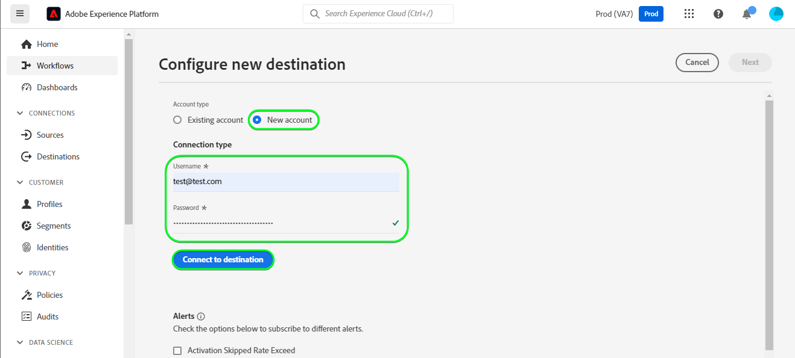

# Connexion [!DNL Mailchimp Interest Categories]

[[!DNL Mailchimp]](https://mailchimp.com) est une plateforme d’automatisation du marketing et un service de marketing par e-mail utilisé par les entreprises pour gérer et communiquer avec des contacts *(clients ou autres parties intéressées)* à l’aide de listes de diffusion et de campagnes de marketing par e-mail. Utilisez ce connecteur pour trier vos contacts en fonction de leurs centres d’intérêt et de leurs préférences.

[!DNL Mailchimp Interest Categories] utilise les *[audiences](https://mailchimp.com/help/getting-started-audience/), [groupes](https://mailchimp.com/help/getting-started-with-groups/) et catégories d’intérêt (également appelées noms de groupe ou titres de groupe)*. Chaque groupe de [!DNL Mailchimp] est une liste de catégories d’intérêt. Les contacts sont associés à une catégorie d’intérêt lorsqu’ils s’abonnent à une ou plusieurs catégories d’intérêt par le biais d’un formulaire d’inscription sur votre site web. Au sein d’une audience, vous pouvez également organiser les contacts en groupes et les associer à des catégories d’intérêt, qui pourront ensuite être utilisées pour créer des segments. Vous pouvez utiliser ces audiences pour diffuser des e-mails de campagne ciblés aux contacts abonnés.

<!--
Compared to [!DNL Mailchimp Tags] which you would use for internal classification, [!DNL Mailchimp Interest Categories] is meant to manage subscriptions to topics of interest that your contacts might be interested in. *Note, Experience Platform also has a connection for [!DNL Mailchimp Tags], you can check it out on the [[!DNL Mailchimp Tags]](/help/destinations/catalog/email-marketing/mailchimp-tags.md) page.*
-->

Cette [!DNL Adobe Experience Platform] [destination](/help/destinations/home.md) utilise l’API [[!DNL Mailchimp batch subscribe or unsubscribe API]](https://mailchimp.com/developer/marketing/api/lists/batch-subscribe-or-unsubscribe/) pour créer des [catégories d’intérêt](https://mailchimp.com/developer/marketing/api/interest-categories/) puis ajouter des contacts de chacune des audiences Experience Platform sélectionnées dans une catégorie d’intérêt correspondante. Vous pouvez **ajouter de nouveaux contacts** ou **mettre à jour les informations des contacts [!DNL Mailchimp] existants**, puis **ajouter ou supprimer ces contacts de leurs groupes souhaités** dans une audience [!DNL Mailchimp] existante après les avoir activés dans un nouveau segment. [!DNL Mailchimp Interest Groups] utilise les noms d’audience sélectionnés dans Experience Platform en tant que catégories d’intérêt dans [!DNL Mailchimp].

## Cas d’utilisation {#use-cases}

Pour mieux comprendre quand et comment utiliser la destination [!DNL Mailchimp Interest Categories], consultez l’exemple de cas d’utilisation ci-dessous que les clientes et clients d’Adobe Experience Platform peuvent résoudre à l’aide de cette destination.

### Envoyer des e-mails aux contacts pour les campagnes marketing {#use-case-send-emails}

Le service commercial d’un site web d’articles de sport souhaite diffuser une campagne marketing par e-mail à une liste de contacts qui se sont auto-identifiés comme étant intéressés par le football. Les listes de contacts sont séparées sous forme de lots dans l’exportation des données reçues de l’équipe de développement du site web et doivent donc être suivies. L’équipe identifie une audience [!DNL Mailchimp] existante et commence à créer les audiences Experience Platform dans lesquelles les contacts de chaque liste sont ajoutés. Après avoir envoyé ces audiences à [!DNL Mailchimp Interest Categories], si des contacts n’existent pas dans l’audience [!DNL Mailchimp] sélectionnée, ils sont ajoutés à un groupe avec le nom d’audience auquel le contact appartient. Si des contacts existent déjà dans l’audience ou le groupe [!DNL Mailchimp], leurs informations sont mises à jour. Une fois les données envoyées à [!DNL Mailchimp Interest Categories], l’équipe des ventes peut sélectionner et envoyer l’e-mail de campagne marketing au groupe d’intérêt football de l’audience [!DNL Mailchimp].

## Conditions préalables {#prerequisites}

Reportez-vous aux sections ci-dessous pour connaître les conditions préalables à configurer dans Experience Platform et [!DNL Mailchimp] et pour obtenir des informations que vous devez rassembler avant d’utiliser la destination [!DNL Mailchimp Interest Categories].

### Conditions préalables dans Experience Platform {#prerequisites-in-experience-platform}

Avant d’activer des données dans la destination [!DNL Mailchimp Interest Categories], vous devez avoir un [schéma](/help/xdm/schema/composition.md), un [jeu de données](https://experienceleague.adobe.com/docs/platform-learn/tutorials/data-ingestion/create-datasets-and-ingest-data.html?lang=fr), ainsi que des [segments](https://experienceleague.adobe.com/docs/platform-learn/tutorials/segments/create-segments.html?lang=fr) créés dans [!DNL Experience Platform].

### Conditions préalables pour la destination [!DNL Mailchimp Interest Categories] {#prerequisites-destination}

Notez les conditions préalables suivantes pour exporter des données d’Experience Platform vers votre compte [!DNL Mailchimp] :

#### Vous devez disposer d&#39;un compte [!DNL Mailchimp] {#prerequisites-account}

Avant de pouvoir créer une destination [!DNL Mailchimp Interest Categories], vous devez d’abord vous assurer que vous disposez d’un compte [!DNL Mailchimp]. Si vous n’en avez pas encore, rendez-vous sur la [[!DNL Mailchimp] page d’inscription](https://login.mailchimp.com/signup/) pour vous inscrire et créer votre compte.

#### Collecter la clé API [!DNL Mailchimp] {#gather-credentials}

Vous avez besoin de votre [!DNL Mailchimp] **clé API** pour authentifier la destination [!DNL Mailchimp Interest Categories] sur votre compte [!DNL Mailchimp]. La **clé API** sert de **mot de passe** lorsque vous [authentifiez la destination](#authenticate).

Si vous ne disposez pas de votre **clé API**, connectez-vous à votre compte et reportez-vous à la documentation [[!DNL Mailchimp] Générer votre clé API](https://mailchimp.com/developer/marketing/guides/quick-start/#generate-your-api-key) pour en créer une.

Un exemple de clé API est `0123456789abcdef0123456789abcde-us14`.

>[!IMPORTANT]
>
>Si vous générez la **clé API**, notez-la car vous ne pourrez plus y accéder après la génération.

#### Identification [!DNL Mailchimp] centre de données {#identify-data-center}

Ensuite, vous devez identifier votre centre de données [!DNL Mailchimp]. Pour ce faire, connectez-vous à votre compte [!DNL Mailchimp] et accédez à la section **Clés API** de votre compte.

La valeur est la première partie de l’URL que vous voyez dans votre navigateur. Si l’URL est *https://`us14`.mailchimp.com/account/api/*, le centre de données est `us14`.

Elle est également ajoutée à votre clé API sous la forme *key-dc* ; si votre clé API est `0123456789abcdef0123456789abcde-us14`, le centre de données est `us14`.

Notez la valeur du centre de données *(`us14` dans cet exemple)* vous avez besoin de cette valeur lorsque vous [renseignez les détails de la destination](#destination-details).

Si vous avez besoin de conseils supplémentaires, consultez la [[!DNL Mailchimp] documentation sur les principes de base](https://mailchimp.com/developer/marketing/docs/fundamentals/#api-structure).

### Mécanismes de sécurisation {#guardrails}

Chacune de vos audiences [!DNL Mailchimp] peut contenir jusqu’à 60 noms de groupe (ou catégories d’intérêt) dans un seul groupe ou dans plusieurs groupes au sein d’une même audience. Voir [!DNL Mailchimp] [groupes](https://mailchimp.com/help/getting-started-with-groups/) pour toute clarification requise. Lorsque vous atteignez cette limite, vous obtenez un message d’`400 BAD_REQUEST Cannot have more than 60 interests per list (Across all categories)` en tant que réponse d’erreur de l’API [!DNL Mailchimp].

En outre, reportez-vous à la [!DNL Mailchimp] [limites de débit](https://mailchimp.com/developer/marketing/docs/fundamentals/#api-limits) pour plus d’informations sur les limites imposées par l’API [!DNL Mailchimp].

## Identités prises en charge {#supported-identities}

[!DNL Mailchimp] prend en charge l’activation des identités décrites dans le tableau ci-dessous. En savoir plus sur les [identités](/help/identity-service/features/namespaces.md).

| Identité cible | Description | Considérations |
|---|---|---|
| E-mail | Adresse e-mail du contact | Obligatoire |

{style="table-layout:auto"}

## Type et fréquence d’exportation {#export-type-frequency}

Reportez-vous au tableau ci-dessous pour plus d’informations sur le type et la fréquence d’exportation des destinations.

| Élément | Type | Notes |
---------|----------|---------|
| Type d’exportation | **[!UICONTROL Basé sur les profils]** | <ul><li>Vous exportez tous les membres d’un segment, ainsi que les champs de schéma souhaités, *(par exemple : adresse e-mail, numéro de téléphone, nom)*, en fonction de votre mappage de champs.</li><li> Pour chaque audience sélectionnée dans Experience Platform, le statut du segment [!DNL Mailchimp Interest Categories] correspondant est mis à jour avec son statut d’audience à partir d’Experience Platform.</li></ul> |
| Fréquence des exportations | **[!UICONTROL Diffusion en continu]** | Les destinations de diffusion en continu sont des connexions basées sur l’API « toujours actives ». Lorsqu’un profil est mis à jour dans Experience Platform en fonction de l’évaluation de l’audience, le connecteur envoie la mise à jour en aval vers la plateforme de destination. En savoir plus sur les [destinations de diffusion en continu](/help/destinations/destination-types.md#streaming-destinations). |

{style="table-layout:auto"}

## Se connecter à la destination {#connect}

>[!IMPORTANT]
>
>Pour vous connecter à la destination, vous avez besoin des autorisations de contrôle d’accès **[!UICONTROL Afficher les destinations]** et **[!UICONTROL Gérer les destinations]** [&#128279;](/help/access-control/home.md#permissions). Lisez la [présentation du contrôle d’accès](/help/access-control/ui/overview.md) ou contactez votre administrateur de produit pour obtenir les autorisations requises.

Pour vous connecter à cette destination, procédez comme décrit dans le [tutoriel sur la configuration des destinations](../../ui/connect-destination.md). Dans le workflow de configuration des destinations, renseignez les champs répertoriés dans les deux sections ci-dessous.

Dans **[!UICONTROL Destinations]** > **[!UICONTROL Catalogue]**, recherchez [!DNL Mailchimp Interest Categories]. Vous pouvez également localiser cet élément dans la catégorie **[!UICONTROL Marketing par e-mail]**.

### S’authentifier auprès de la destination {#authenticate}

Pour vous authentifier auprès de la destination, renseignez les champs obligatoires ci-dessous et sélectionnez **[!UICONTROL Se connecter à la destination]**.

| Champ | Description |
| --- | --- |
| **[!UICONTROL Nom d’utilisateur]** | Votre nom d’utilisateur [!DNL Mailchimp Interest Categories]. |
| **[!UICONTROL Mot de passe]** | Votre [!DNL Mailchimp] **clé API**, que vous avez notée dans la section [Collecter [!DNL Mailchimp] informations d’identification](#gather-credentials).  Votre clé API se présente sous la forme d’`{KEY}-{DC}`, où la partie `{KEY}` fait référence à la valeur indiquée dans la section [[!DNL Mailchimp] Clé API](#gather-credentials) et la partie `{DC}` fait référence au [[!DNL Mailchimp] centre de données](#identify-data-center).  Vous pouvez fournir la partie `{KEY}` ou l’intégralité du formulaire.  Par exemple, si votre clé API est  *`0123456789abcdef0123456789abcde-us14`*  vous pouvez fournir *`0123456789abcdef0123456789abcde`*ou *`0123456789abcdef0123456789abcde-us14`*comme valeur. |

{style="table-layout:auto"}

Si les détails fournis sont valides, l’interface utilisateur affiche un statut **[!UICONTROL Connecté]** avec une coche verte. Vous pouvez ensuite passer à l’étape suivante.

### Renseigner les détails de la destination {#destination-details}

Pour configurer les détails de la destination, renseignez les champs obligatoires et facultatifs ci-dessous. Un astérisque situé en regard d’un champ de l’interface utilisateur indique que le champ est obligatoire.

| Champ | Description |
| --- | --- |
| **[!UICONTROL Nom]** | Nom par lequel vous reconnaîtrez cette destination à l’avenir. |
| **[!UICONTROL Description]** | Une description qui vous aidera à identifier cette destination à l’avenir. |
| **[!UICONTROL Centre de données]** | Votre compte [!DNL Mailchimp] est `data center`. Reportez-vous à la section [Identifier [!DNL Mailchimp] centre de données](#identify-data-center) pour obtenir des conseils. |
| **[!UICONTROL Nom de l’audience (veuillez d’abord sélectionner le centre de données)]** | Une fois que vous avez sélectionné votre **[!UICONTROL centre de données]**, cette liste déroulante est automatiquement renseignée avec les noms des audiences de votre compte [!DNL Mailchimp]. Sélectionnez l’audience à mettre à jour avec les données d’Experience Platform. |
| **[!UICONTROL Catégorie d’intérêt (veuillez d’abord sélectionner le centre de données et le nom de l’audience)]** | Une fois que vous avez sélectionné votre **[!UICONTROL Nom de l’audience]**, cette liste déroulante est automatiquement renseignée avec les noms des catégories de groupes d’intérêt de votre compte [!DNL Mailchimp]. Sélectionnez le nom de la catégorie à mettre à jour avec les données d’Experience Platform. |

{style="table-layout:auto"}

>[!TIP]
>
> Si la clé API fournie dans le champ **[!UICONTROL Mot de passe]** ou la valeur **[!UICONTROL Centre de données]** est incorrecte, l’interface utilisateur affiche une réponse d’erreur d’API [!DNL Mailchimp] : *`No options are available. Please verify the values selected for the following dependent fields: dataCenter`* comme illustré ci-dessous. Dans ce cas, vous ne pouvez pas sélectionner de valeur dans le champ **[!UICONTROL Nom de l’audience (veuillez d’abord sélectionner Centre de données)]**. Pour corriger cette erreur, indiquez les valeurs correctes.

### Activer les alertes {#enable-alerts}

Vous pouvez activer les alertes pour recevoir des notifications sur le statut de votre flux de données vers votre destination. Sélectionnez une alerte dans la liste et abonnez-vous à des notifications concernant le statut de votre flux de données. Pour plus d’informations sur les alertes, consultez le guide sur l’[abonnement aux alertes des destinations dans l’interface utilisateur](../../ui/alerts.md).

Lorsque vous avez terminé de renseigner les détails sur votre connexion de destination, sélectionnez **[!UICONTROL Suivant]**.

## Activer des audiences vers cette destination {#activate}

>[!IMPORTANT]
> 
>* Pour activer les données, vous avez besoin des autorisations de contrôle d’accès **[!UICONTROL Afficher les destinations]**, **[!UICONTROL Activer les destinations]**, **[!UICONTROL Afficher les profils]** et **[!UICONTROL Afficher les segments]** [&#128279;](/help/access-control/home.md#permissions). Lisez la [présentation du contrôle d’accès](/help/access-control/ui/overview.md) ou contactez votre administrateur ou administratrice du produit pour obtenir les autorisations requises.
>* Pour exporter des *identités*, vous devez disposer de l’autorisation de contrôle d’accès **[!UICONTROL Afficher le graphique d’identités]** [&#128279;](/help/access-control/home.md#permissions).   {width="100" zoomable="yes"}

Consultez la section [Activer les profils et les audiences vers les destinations d’exportation d’audiences en flux continu](/help/destinations/ui/activate-segment-streaming-destinations.md) pour obtenir des instructions sur l’activation des audiences vers cette destination.

### Considérations sur le mappage et exemple {#mapping-considerations-example}

Pour envoyer correctement vos données d’audience de Adobe Experience Platform vers la destination [!DNL Mailchimp Interest Categories], vous devez passer par l’étape de mappage des champs. Le mappage consiste à créer un lien entre vos champs de schéma de modèle de données d’expérience (XDM) dans votre compte Experience Platform et leurs équivalents issus de la destination cible.

Pour mapper correctement vos champs XDM vers les champs de destination [!DNL Mailchimp Interest Categories], procédez comme suit :

1. Dans l’étape **[!UICONTROL Mappage]**, sélectionnez **[!UICONTROL Ajouter un nouveau mappage]**. Une nouvelle ligne de mappage s’affiche désormais à l’écran.
1. Dans la fenêtre **[!UICONTROL Sélectionner le champ source]**, choisissez la catégorie **[!UICONTROL Sélectionner les attributs]** et sélectionnez l’attribut XDM ou choisissez l’espace de noms d’identité **[!UICONTROL Sélectionner]** et sélectionnez une identité.
1. Dans la fenêtre **[!UICONTROL Sélectionner le champ cible]**, choisissez la catégorie **[!UICONTROL Sélectionner un espace de noms d’identité]** et sélectionnez une identité ou choisissez **[!UICONTROL Sélectionner des attributs]** et sélectionnez dans la liste des attributs renseignée à partir de l’API [!DNL Mailchimp]. *Tous les attributs personnalisés que vous avez ajoutés à l’audience [!DNL Mailchimp] sélectionnée pourront également être sélectionnés en tant que champs cibles.*

   Les mappages disponibles entre votre schéma de profil XDM et [!DNL Mailchimp Interest Categories] sont les suivants :

   | Champ source | Champ cible | Notes |
   | --- | --- | --- |
   | `IdentityMap: Email` | `Identity: email` | Obligatoire : Oui |
   | `xdm: person.name.firstName` | `Attribute: FNAME` | |
   | `xdm: person.name.lastName` | `Attribute: LNAME` | |
   | `xdm: person.birthDayAndMonth` | `Attribute: BIRTHDAY` | |

   En outre, `ADDRESS` est un champ cible spécial appelé `merge field` au sein de votre audience [!DNL Mailchimp]. La [[!DNL Mailchimp] documentation](https://mailchimp.com/developer/marketing/docs/merge-fields/) définit les clés requises comme `addr1`, `city`, `state` et `zip`, ainsi que les clés facultatives `addr2` et `country`. Les valeurs de ces champs doivent être des chaînes. Si l’un des mappages de champs `ADDRESS` est présent, la destination transmet l’objet `ADDRESS` à l’API [!DNL Mailchimp] pour mise à jour. La valeur par défaut de tous les champs de `ADDRESS` non mappés est `NULL`, à l’exception du pays qui est défini par défaut sur `US`.

   Les mappages disponibles pour le champ `ADDRESS` sont les suivants :

   | Champ source | Champ cible |
   | --- | --- |
   | `xdm: workAddress.street1` | `Attribute: ADDRESS.addr1` |
   | `xdm: workAddress.street2` | `Attribute: ADDRESS.addr2` |
   | `xdm: workAddress.city` | `Attribute: ADDRESS.city` |
   | `xdm: workAddress.state` | `Attribute: ADDRESS.state` |
   | `xdm: workAddress.postalCode` | `Attribute: ADDRESS.zip` |
   | `xdm: workAddress.country` | `Attribute: ADDRESS.country` |

   Par exemple, vous souhaitez mettre à jour la valeur de `country` avec les valeurs de champ d’adresse existantes du contact `addr1`, `city`, `state` et `zip` comme `132, My Street, Kingston`, `New York`, `New York` et `12401`. Pour mettre à jour la `country`, vous devez transmettre les valeurs existantes avec les modifications *(le cas échéant)* et la nouvelle valeur pour le pays. Les valeurs de votre jeu de données doivent donc être `132, My Street, Kingston`, `New York`, `New York`, `12401` et `US`. En résumé, si vous transmettez uniquement des `country` et ne fournissez pas de valeurs pour `addr1`, `city`, `state` et `zip`, elles seront remplacées par `NULL`.

   Un exemple avec les mappages terminés est illustré ci-dessous :
   

Lorsque vous avez terminé de fournir les mappages pour votre connexion de destination, sélectionnez **[!UICONTROL Suivant]**.

## Valider l’exportation des données {#exported-data}

Pour vérifier que vous avez correctement configuré la destination, procédez comme suit :

* Connectez-vous à votre compte [[!DNL Mailchimp]](https://login.mailchimp.com/). Accédez ensuite à la page **[!DNL Audience]** . Développez ensuite le menu **[!DNL Manage Contacts]** et sélectionnez **[!DNL Groups]**.

* Sélectionnez le groupe et vérifiez si les audiences sélectionnées sont créées sous la forme de catégories avec le nom de l’audience d’Experience Platform, qui peut être suivi d’un suffixe généré automatiquement.
   * Cette destination utilise les noms des segments sélectionnés pour créer la catégorie d’intérêt à l’aide de l’API [[!DNL Mailchimp]  Ajouter une catégorie d’intérêt &#x200B;](https://mailchimp.com/developer/marketing/api/interest-categories/add-interest-category/). Si vous créez une nouvelle destination et activez à nouveau les mêmes audiences, [!DNL Mailchimp] ajoute un suffixe pour distinguer les segments existants des nouveaux segments.
* Les contacts dont les e-mails n’existaient pas dans le groupe sont ajoutés à la catégorie nouvellement créée.
* Pour les contacts qui existent déjà dans le groupe, les données du champ d’attribut sont mises à jour et le contact est ajouté à la catégorie nouvellement créée.

## Utilisation et gouvernance des données {#data-usage-governance}

Lors de la gestion de vos données, toutes les destinations [!DNL Adobe Experience Platform] se conforment aux politiques d’utilisation des données. Pour obtenir des informations détaillées sur la manière dont [!DNL Adobe Experience Platform] applique la gouvernance des données, lisez la [présentation de la gouvernance des données](/help/data-governance/home.md).

## Erreurs et résolution des problèmes {#errors-and-troubleshooting}

### Erreur rencontrée si les valeurs de [!DNL Mailchimp] clé API ou du centre de données sont incorrectes {#incorrect-credentials-error}

Si la clé API fournie dans le champ **[!UICONTROL Mot de passe]** ou la valeur **[!UICONTROL Centre de données]** est incorrecte, l’interface utilisateur affiche une réponse d’erreur d’API [!DNL Mailchimp] : *`No options are available. Please verify the values selected for the following dependent fields: dataCenter`* comme illustré ci-dessous. Dans ce cas, vous ne pouvez pas sélectionner de valeur dans le champ **[!UICONTROL Nom de l’audience (veuillez d’abord sélectionner Centre de données)]**.

Pour corriger cette erreur et passer à l’étape suivante, vous devez fournir les valeurs correctes. Reportez-vous au [Identifier [!DNL Mailchimp] centre de données](#identify-data-center) et
Sections [Rassembler [!DNL Mailchimp] Clé API](#gather-credentials) si vous avez besoin de conseils.

### Erreur rencontrée si [!DNL Mailchimp] limite de nom de groupe est dépassée {#group-name-limits-error}

Pendant la création de la destination, vous pouvez recevoir les messages d’erreur suivants : *`Cannot have more than 60 interests per list (Across all categories)`* ou *`400 BAD_REQUEST`*. Cela se produit lorsque vous dépassez les 60 noms de groupe (ou catégories d’intérêt) dans un seul groupe ou dans plusieurs groupes au sein de la même limite d’audience, comme décrit dans la section [&#x200B; Mécanismes de sécurisation &#x200B;](#guardrails). Pour corriger cette erreur, veillez à ne pas dépasser la limite de noms de groupe dans [!DNL Mailchimp].

### Statut de [!DNL Mailchimp] et codes d’erreur

Reportez-vous à la [[!DNL Mailchimp] page Erreurs](https://mailchimp.com/developer/marketing/docs/errors/) pour une liste complète des statuts et des codes d’erreur avec des explications.

## Ressources supplémentaires {#additional-resources}

Retrouvez d’autres informations utiles de la documentation [!DNL Mailchimp] ci-dessous :
* [Prise en main de  [!DNL Mailchimp]](https://mailchimp.com/help/getting-started-with-mailchimp/)
* [Prise en main des audiences](https://mailchimp.com/help/getting-started-audience/)
* [Créer une audience](https://mailchimp.com/help/create-audience/)
* [Prise en main des groupes](https://mailchimp.com/help/getting-started-with-groups/)
* [Créer un groupe d’audiences](https://mailchimp.com/help/create-new-audience-group/)
* [Catégories d’intérêt](https://mailchimp.com/developer/marketing/api/interest-categories/)
* [&#x200B; API marketing &#x200B;](https://mailchimp.com/developer/marketing/api/)
