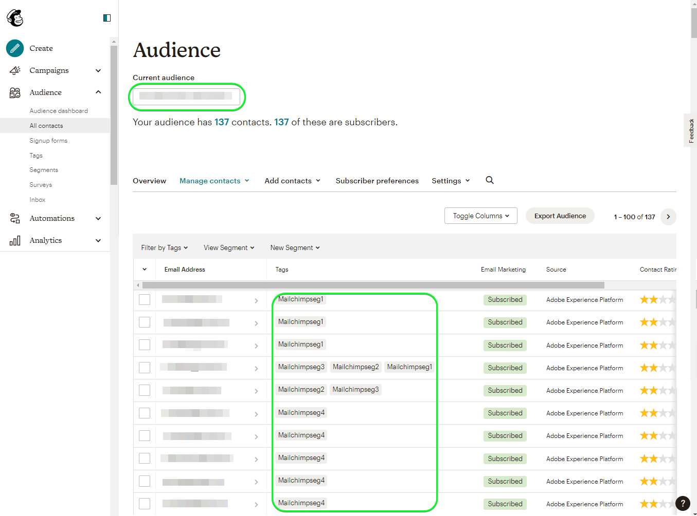

# Connexion [!DNL Mailchimp Tags]

[[!DNL Mailchimp]](https://mailchimp.com) *(également appelé [!DNL Intuit Mailchimp])* est une plateforme d’automatisation du marketing et un service de marketing par e-mail très populaire, utilisés par les entreprises pour gérer et contacter les contacts *(clients, clients ou autres parties intéressées)* à l’aide de listes de diffusion et de campagnes de marketing par e-mail.

[!DNL Mailchimp Tags] utilise [audiences](https://mailchimp.com/help/getting-started-audience/) et [balises](https://mailchimp.com/help/getting-started-tags/) pour gérer vos informations de contact. Les balises sont des libellés à l’aide desquels vous pouvez organiser vos contacts et les étiqueter pour votre catégorisation interne dans [!DNL Mailchimp].

Par rapport à [!DNL Mailchimp Interest Categories] que vous utiliseriez pour trier vos contacts en fonction de leurs centres d’intérêt et de leurs préférences, [!DNL Mailchimp Tags] est destiné à gérer les abonnements à des sujets d’intérêt susceptibles d’intéresser vos contacts. *Remarque : l&#39;Experience Platform a également une connexion pour [!DNL Mailchimp Interest Categories]. Vous pouvez l&#39;extraire sur la page [[!DNL Mailchimp Interest Categories]](/help/destinations/catalog/email-marketing/mailchimp-interest-categories.md).*

Cette [!DNL Adobe Experience Platform] [destination](/help/destinations/home.md) exploite le point d’entrée [[!DNL Mailchimp batch subscribe or unsubscribe API]](https://mailchimp.com/developer/marketing/api/lists/batch-subscribe-or-unsubscribe/). Vous pouvez **ajouter de nouveaux contacts** ou **mettre à jour des balises de [!DNL Mailchimp] contacts** existants dans une audience [!DNL Mailchimp] existante après les avoir activées dans une nouvelle audience. [!DNL Mailchimp Tags] utilise les noms d’audience sélectionnés de Platform comme noms de balise dans [!DNL Mailchimp].

## Cas d’utilisation {#use-cases}

Pour mieux comprendre quand et comment utiliser la destination [!DNL Mailchimp Tags], consultez l’exemple de cas d’utilisation ci-dessous que les clientes et clients d’Adobe Experience Platform peuvent résoudre à l’aide de cette destination.

### Envoyer des emails aux contacts pour les campagnes marketing {#use-case-send-emails}

Le service commercial d’une organisation souhaite diffuser une campagne marketing par e-mail vers une liste organisée de contacts. Les listes de contacts sont reçues par lots de différentes sources hors ligne et doivent donc être suivies. L’équipe identifie une audience [!DNL Mailchimp] existante et commence à créer les audiences Experience Platform dans lesquelles les contacts de chaque liste sont ajoutés. Après l’envoi de ces audiences à [!DNL Mailchimp Tags], si des contacts n’existent pas dans l’audience sélectionnée [!DNL Mailchimp], ils sont ajoutés avec une balise associée qui inclut le nom de l’audience auquel le contact appartient. Si des contacts existent déjà dans l’audience [!DNL Mailchimp], une nouvelle balise avec le nom de l’audience est ajoutée. Comme les étiquettes sont visibles dans [!DNL Mailchimp], les sources hors ligne sont facilement identifiables. Une fois les données envoyées à [!DNL Mailchimp], ils envoient l’e-mail de la campagne marketing à l’audience.

## Conditions préalables {#prerequisites}

Reportez-vous aux sections ci-dessous pour connaître les conditions préalables à configurer dans Experience Platform et [!DNL Mailchimp], ainsi que pour obtenir des informations que vous devez rassembler avant de travailler avec la destination [!DNL Mailchimp Tags].

### Conditions préalables dans Experience Platform {#prerequisites-in-experience-platform}

Avant d’activer des données vers la destination [!DNL Mailchimp Tags], vous devez avoir un [schéma](/help/xdm/schema/composition.md), un [jeu de données](https://experienceleague.adobe.com/docs/platform-learn/tutorials/data-ingestion/create-datasets-and-ingest-data.html?lang=fr) et des [audiences](https://experienceleague.adobe.com/docs/platform-learn/tutorials/audiences/create-audiences.html) créés dans [!DNL Experience Platform].

### Conditions préalables pour la destination [!DNL Mailchimp Tags] {#prerequisites-destination}

Notez les conditions préalables suivantes pour exporter des données de Platform vers votre compte [!DNL Mailchimp Tags] :

#### Vous devez avoir un compte [!DNL Mailchimp]. {#prerequisites-account}

Avant de pouvoir créer une destination [!DNL Mailchimp Tags], vous devez vous assurer d’avoir un compte [!DNL Mailchimp]. Si vous n’en avez pas déjà un, rendez-vous sur la [[!DNL Mailchimp] page d’inscription](https://login.mailchimp.com/signup/) pour vous enregistrer et créer votre compte.

#### Collecte de la clé d’API [!DNL Mailchimp] {#gather-credentials}

Vous avez besoin de votre [!DNL Mailchimp] **clé API** pour authentifier la destination [!DNL Mailchimp Interest Categories] sur votre compte [!DNL Mailchimp]. La **clé API** sert de **mot de passe** lorsque vous [authentifiez la destination](#authenticate).

Si vous ne disposez pas de votre **clé d&#39;API**, connectez-vous à votre compte [!DNL Mailchimp] et reportez-vous à la documentation [!DNL Mailchimp] sur [la manière de générer votre clé d&#39;API](https://mailchimp.com/developer/marketing/guides/quick-start/#generate-your-api-key).

`0123456789abcdef0123456789abcde-us14` est un exemple de clé API.

>[!IMPORTANT]
>
>Si vous générez la **clé API**, écrivez-la car vous ne pourrez pas y accéder après la génération.

#### Identification de votre centre de données [!DNL Mailchimp] {#identify-data-center}

Ensuite, vous devez identifier votre centre de données [!DNL Mailchimp]. Pour ce faire, connectez-vous à votre compte [!DNL Mailchimp] et accédez à la **section Clés API** de votre compte.

L’identifiant du centre de données est la première section de l’URL qui s’affiche dans votre navigateur. Si l’URL est *https://`us14`.mailchimp.com/account/api/*, le centre de données est `us14`.

L’identifiant du centre de données est également ajouté à votre clé API sous la forme *key-dc*. Par exemple, si votre clé API est `0123456789abcdef0123456789abcde-us14`, le centre de données est `us14`.

Notez la valeur du centre de données *(`us14` dans cet exemple)*. Vous aurez besoin de cette valeur lorsque vous [renseignerez les détails de destination](#destination-details).

Si vous avez besoin d’autres conseils, reportez-vous à la [[!DNL Mailchimp] documentation de base](https://mailchimp.com/developer/marketing/docs/fundamentals/#api-structure).

### Mécanismes de sécurisation {#guardrails}

Reportez-vous aux [!DNL Mailchimp] [limites de taux](https://mailchimp.com/developer/marketing/docs/fundamentals/#api-limits) pour obtenir des informations détaillées sur les limites imposées par l’API [!DNL Mailchimp].

## Identités prises en charge {#supported-identities}

[!DNL Mailchimp] prend en charge l’activation des identités décrites dans le tableau ci-dessous. En savoir plus sur les [identités](/help/identity-service/features/namespaces.md).

| Identité cible | Description | Considérations |
|---|---|---|
| E-mail | Adresse électronique du contact. | Obligatoire |

{style="table-layout:auto"}

## Audiences prises en charge {#supported-audiences}

Cette section décrit le type d’audiences que vous pouvez exporter vers cette destination.

| Origine de l’audience | Pris en charge | Description |
|---------|----------|----------|
| [!DNL Segmentation Service] | ✓ | Audiences générées par l’Experience Platform [Segmentation Service](../../../segmentation/home.md). |
| Chargements personnalisés | ✓ | Audiences [importées](../../../segmentation/ui/audience-portal.md#import-audience) dans Experience Platform à partir de fichiers CSV. |

{style="table-layout:auto"}

## Type et fréquence d’exportation {#export-type-frequency}

Reportez-vous au tableau ci-dessous pour plus d’informations sur le type et la fréquence d’exportation des destinations.

| Élément | Type | Notes |
---------|----------|---------|
| Type d’exportation | **[!UICONTROL Basé sur les profils]** | <ul><li>Vous exportez tous les membres d’une audience, ainsi que les champs de schéma souhaités *(par exemple : adresse email, numéro de téléphone, nom)*, en fonction de votre mappage de champs.</li><li> Pour chaque audience sélectionnée dans Platform, l’état du segment [!DNL Mailchimp Tags] correspondant est mis à jour avec l’état de l’audience de Platform.</li></ul> |
| Fréquence des exportations | **[!UICONTROL Diffusion en continu]** | Les destinations de diffusion en continu sont des connexions basées sur l’API « toujours actives ». Dès qu’un profil est mis à jour dans Experience Platform en fonction de l’évaluation des audiences, le connecteur envoie la mise à jour en aval vers la plateforme de destination. En savoir plus sur les [destinations de diffusion en continu](/help/destinations/destination-types.md#streaming-destinations). |

{style="table-layout:auto"}

## Se connecter à la destination {#connect}

>[!IMPORTANT]
>
>Pour vous connecter à la destination, vous devez disposer de l’[autorisation de contrôle d’accès](/help/access-control/home.md#permissions) **[!UICONTROL Gérer les destinations]**. Lisez la [présentation du contrôle d’accès](/help/access-control/ui/overview.md) ou contactez votre administrateur de produit pour obtenir les autorisations requises.

Pour vous connecter à cette destination, procédez comme décrit dans le [tutoriel sur la configuration des destinations](../../ui/connect-destination.md). Dans le workflow de configuration des destinations, renseignez les champs répertoriés dans les deux sections ci-dessous.

Dans **[!UICONTROL Destinations]** > **[!UICONTROL Catalogue]**, recherchez [!DNL Mailchimp Tags]. Vous pouvez également la localiser sous la catégorie **[!UICONTROL Marketing par e-mail]**.

### S’authentifier auprès de la destination {#authenticate}

Pour vous authentifier à la destination, remplissez les champs requis ci-dessous et sélectionnez **[!UICONTROL Se connecter à la destination]**.

| Champ | Description |
| --- | --- |
| **[!UICONTROL Nom d’utilisateur]** | Votre nom d’utilisateur [!DNL Mailchimp]. |
| **[!UICONTROL Mot de passe]** | Votre [!DNL Mailchimp] **clé d&#39;API**, que vous avez noté dans la section [Rassembler [!DNL Mailchimp] informations d&#39;identification](#gather-credentials).  Votre clé API prend la forme `{KEY}-{DC}`, où la partie `{KEY}` fait référence à la valeur indiquée dans la section [[!DNL Mailchimp] clé API](#gather-credentials) et la partie `{DC}` fait référence au [[!DNL Mailchimp] centre de données](#identify-data-center).  Vous pouvez fournir la partie `{KEY}` ou l’intégralité du formulaire.  Par exemple, si votre clé API est  *`0123456789abcdef0123456789abcde-us14`*, , vous pouvez fournir *`0123456789abcdef0123456789abcde`*ou *`0123456789abcdef0123456789abcde-us14`*comme valeur. |

{style="table-layout:auto"}

Si les détails fournis sont valides, l’interface utilisateur affiche un statut **[!UICONTROL Connecté]** avec une coche verte. Vous pouvez ensuite passer à l’étape suivante.

### Renseigner les détails de la destination {#destination-details}

Pour configurer les détails de la destination, renseignez les champs obligatoires et facultatifs ci-dessous. Un astérisque situé en regard d’un champ de l’interface utilisateur indique que le champ est obligatoire.

| Champ | Description |
| --- | --- |
| **[!UICONTROL Nom]** | Un nom par lequel vous reconnaîtrez cette destination à l’avenir. |
| **[!UICONTROL Description]** | Description qui vous aidera à identifier cette destination ultérieurement. |
| **[!UICONTROL Centre de données]** | Votre compte [!DNL Mailchimp] `data center`. Pour obtenir des conseils, reportez-vous à la section [Identifier [!DNL Mailchimp] le centre de données](#identify-data-center) . |
| **[!UICONTROL Nom de l’audience (veuillez commencer par le centre de données)]** | Une fois que vous avez entré votre **[!UICONTROL centre de données]**, cette liste déroulante est automatiquement remplie avec les noms d’audience de votre compte [!DNL Mailchimp]. Sélectionnez l’audience que vous souhaitez mettre à jour avec les données de Platform. |

{style="table-layout:auto"}

### Activer les alertes {#enable-alerts}

Vous pouvez activer les alertes pour recevoir des notifications sur le statut de votre flux de données vers votre destination. Sélectionnez une alerte dans la liste et abonnez-vous à des notifications concernant le statut de votre flux de données. Pour plus d’informations sur les alertes, consultez le guide sur l’[abonnement aux alertes des destinations dans l’interface utilisateur](../../ui/alerts.md).

Lorsque vous avez terminé de renseigner les détails sur votre connexion de destination, sélectionnez **[!UICONTROL Suivant]**.

## Activer des audiences vers cette destination {#activate}

>[!IMPORTANT]
> 
>* Pour activer les données, vous avez besoin des ****, **[!UICONTROL Activer les destinations]**, **** et **** [  autorisations de contrôle d’accès](/help/access-control/home.md#permissions). Lisez la [présentation du contrôle d’accès](/help/access-control/ui/overview.md) ou contactez votre administrateur ou administratrice du produit pour obtenir les autorisations requises.
>* Pour exporter des *identités*, vous avez besoin de l&#39;autorisation **[!UICONTROL Afficher le graphique d&#39;identités]** .   {width="100" zoomable="yes"}

Lisez [Activer les audiences vers les destinations de diffusion en continu](/help/destinations/ui/activate-segment-streaming-destinations.md) pour obtenir des instructions sur l’activation des audiences vers cette destination.

### Considérations sur le mappage et exemple {#mapping-considerations-example}

Pour envoyer correctement vos données d’audience d’Adobe Experience Platform vers la destination [!DNL Mailchimp Tags], vous devez passer par l’étape de mappage des champs. Le mappage consiste à créer un lien entre vos champs de schéma de modèle de données d’expérience (XDM) dans votre compte Platform et leurs équivalents de la destination cible.

Pour mapper correctement vos champs XDM aux champs de destination [!DNL Mailchimp Tags], procédez comme suit :

1. Dans l’étape **[!UICONTROL Mappage]**, sélectionnez **[!UICONTROL Ajouter un nouveau mappage]**. Une nouvelle ligne de mappage s’affichera à l’écran.
1. Dans la fenêtre **[!UICONTROL Sélectionner le champ source]** , choisissez **[!UICONTROL Sélectionner l’espace de noms d’identité]** et sélectionnez l’espace de noms d’identité `Email`.

   

1. Dans la fenêtre **[!UICONTROL Sélectionner le champ cible]** , choisissez **[!UICONTROL Sélectionner l’espace de noms d’identité]** et sélectionnez l’espace de noms d’identité `Email`.

   

   Les mappages entre votre schéma de profil XDM et [!DNL Mailchimp Tags] seront les suivants :
| Champ Source | Champ cible | Obligatoire |
| — | — | — |
|`IdentityMap: Email`|`Identity: Email`| Oui |

   Un exemple avec les mappages terminés est illustré ci-dessous :
   

Lorsque vous avez terminé de fournir les mappages pour votre connexion de destination, sélectionnez **[!UICONTROL Suivant]**.

## Valider l’exportation des données {#exported-data}

Pour vérifier que vous avez correctement configuré la destination, procédez comme suit :

1. Connectez-vous à votre compte [[!DNL Mailchimp]](https://login.mailchimp.com/). Accédez ensuite à la page **[!DNL Audience]** > **[!DNL All Contacts]** et vérifiez si les contacts de l’audience ont été ajoutés et si les contacts de l’audience ont été mis à jour avec le nom de l’audience.
   

## Utilisation et gouvernance des données {#data-usage-governance}

Lors de la gestion de vos données, toutes les destinations [!DNL Adobe Experience Platform] se conforment aux politiques d’utilisation des données. Pour obtenir des informations détaillées sur la manière dont [!DNL Adobe Experience Platform] applique la gouvernance des données, lisez la [présentation de la gouvernance des données](/help/data-governance/home.md).

## Erreurs et résolution des problèmes {#errors-and-troubleshooting}

Consultez la [[!DNL Mailchimp] page erreurs](https://mailchimp.com/developer/marketing/docs/errors/) pour obtenir une liste complète des codes d’état et d’erreur avec des explications.

## Ressources supplémentaires {#additional-resources}

Vous trouverez ci-dessous d’autres informations utiles à partir de la documentation [!DNL Mailchimp] :
* [Prise en main de [!DNL Mailchimp]](https://mailchimp.com/help/getting-started-with-mailchimp/)
* [Prise en main des audiences](https://mailchimp.com/help/getting-started-audience/)
* [Créer une audience](https://mailchimp.com/help/create-audience/)
* [Prise en main des balises](https://mailchimp.com/help/getting-started-tags/)
* [API marketing](https://mailchimp.com/developer/marketing/api/)
