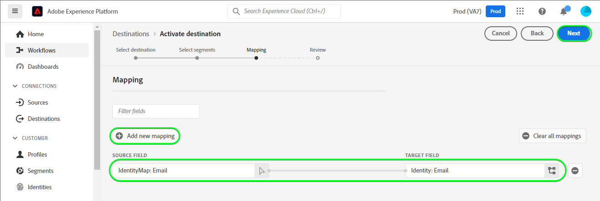

# Connexion [!DNL Mailchimp Tags]

[[!DNL Mailchimp]](https://mailchimp.com) *(également appelé [!DNL Intuit Mailchimp])* est une plateforme d’automatisation du marketing et un service de marketing par e-mail utilisé par les entreprises pour gérer et communiquer avec des contacts *(clients ou autres parties intéressées)* à l’aide de listes de diffusion et de campagnes de marketing par e-mail.

[!DNL Mailchimp Tags] utilise [audiences](https://mailchimp.com/help/getting-started-audience/) et [balises](https://mailchimp.com/help/getting-started-tags/) pour gérer vos coordonnées. Les balises sont des libellés à l’aide desquels vous pouvez organiser vos contacts et les étiqueter pour votre catégorisation interne dans [!DNL Mailchimp].

Par rapport aux [!DNL Mailchimp Interest Categories] que vous utiliseriez pour trier vos contacts en fonction de leurs centres d’intérêt et de leurs préférences, [!DNL Mailchimp Tags] est destiné à gérer les abonnements à des sujets d’intérêt susceptibles d’intéresser vos contacts. *Notez qu’Experience Platform dispose également d’une connexion pour [!DNL Mailchimp Interest Categories]. Vous pouvez l’extraire sur la page [[!DNL Mailchimp Interest Categories]](/help/destinations/catalog/email-marketing/mailchimp-interest-categories.md).*

Cette [!DNL Adobe Experience Platform] [destination](/help/destinations/home.md) tire parti du point d’entrée [[!DNL Mailchimp batch subscribe or unsubscribe API]](https://mailchimp.com/developer/marketing/api/lists/batch-subscribe-or-unsubscribe/). Vous pouvez **ajouter de nouveaux contacts** ou **mettre à jour les balises des contacts [!DNL Mailchimp] existants** dans une audience [!DNL Mailchimp] existante après les avoir activés dans une nouvelle audience. [!DNL Mailchimp Tags] utilise les noms d’audience sélectionnés dans Experience Platform comme noms de balise dans [!DNL Mailchimp].

## Cas d’utilisation {#use-cases}

Pour mieux comprendre quand et comment utiliser la destination [!DNL Mailchimp Tags], consultez l’exemple de cas d’utilisation ci-dessous que les clientes et clients d’Adobe Experience Platform peuvent résoudre à l’aide de cette destination.

### Envoyer des e-mails aux contacts pour les campagnes marketing {#use-case-send-emails}

Le service commercial d’une organisation souhaite diffuser une campagne marketing par e-mail à une liste de contacts sélectionnée. Les listes de contacts sont reçues par lots de différentes sources hors ligne et doivent donc faire l’objet d’un suivi. L’équipe identifie une audience [!DNL Mailchimp] existante et commence à créer les audiences Experience Platform dans lesquelles les contacts de chaque liste sont ajoutés. Après avoir envoyé ces audiences à [!DNL Mailchimp Tags], si des contacts n’existent pas dans l’audience [!DNL Mailchimp] sélectionnée, ils sont ajoutés avec une balise associée qui inclut le nom de l’audience à laquelle le contact appartient. Si des contacts existent déjà dans l’audience [!DNL Mailchimp], une nouvelle balise portant le nom de l’audience est ajoutée. Comme les libellés sont visibles dans [!DNL Mailchimp], les sources hors ligne sont facilement identifiables. Une fois les données envoyées à [!DNL Mailchimp], ils envoient l’e-mail de campagne marketing à l’audience.

## Conditions préalables {#prerequisites}

Reportez-vous aux sections ci-dessous pour connaître les conditions préalables à configurer dans Experience Platform et [!DNL Mailchimp] et pour obtenir des informations à rassembler avant d’utiliser la destination [!DNL Mailchimp Tags].

### Conditions préalables dans Experience Platform {#prerequisites-in-experience-platform}

Avant d’activer des données dans la destination [!DNL Mailchimp Tags], vous devez avoir créé un [schéma](/help/xdm/schema/composition.md), un [jeu de données](https://experienceleague.adobe.com/docs/platform-learn/tutorials/data-ingestion/create-datasets-and-ingest-data.html?lang=fr) et des [audiences](https://experienceleague.adobe.com/docs/platform-learn/tutorials/audiences/create-audiences.html) dans [!DNL Experience Platform].

### Conditions préalables pour la destination [!DNL Mailchimp Tags] {#prerequisites-destination}

Notez les conditions préalables suivantes pour exporter des données d’Experience Platform vers votre compte [!DNL Mailchimp Tags] :

#### Vous devez avoir un compte [!DNL Mailchimp]. {#prerequisites-account}

Avant de pouvoir créer une destination [!DNL Mailchimp Tags], vous devez d’abord vous assurer que vous disposez d’un compte [!DNL Mailchimp]. Si vous n’en avez pas déjà un, visitez la [[!DNL Mailchimp] page d’inscription](https://login.mailchimp.com/signup/) pour vous inscrire et créer votre compte.

#### Collecter la clé API [!DNL Mailchimp] {#gather-credentials}

Vous avez besoin de votre [!DNL Mailchimp] **clé API** pour authentifier la destination [!DNL Mailchimp Interest Categories] sur votre compte [!DNL Mailchimp]. La **clé API** sert de **mot de passe** lorsque vous [authentifiez la destination](#authenticate).

Si vous ne disposez pas de votre **clé API**, connectez-vous à votre compte [!DNL Mailchimp] et reportez-vous à la documentation [!DNL Mailchimp] sur [comment générer votre clé API](https://mailchimp.com/developer/marketing/guides/quick-start/#generate-your-api-key).

Un exemple de clé API est `0123456789abcdef0123456789abcde-us14`.

>[!IMPORTANT]
>
>Si vous générez la **clé API**, notez-la car vous ne pourrez plus y accéder après la génération.

#### Identification de votre centre de données [!DNL Mailchimp] {#identify-data-center}

Ensuite, vous devez identifier votre centre de données [!DNL Mailchimp]. Pour ce faire, connectez-vous à votre compte [!DNL Mailchimp] et accédez à la section **Clés API** de votre compte.

L’identifiant du centre de données est la première section de l’URL qui s’affiche dans votre navigateur. Si l’URL est *https://`us14`.mailchimp.com/account/api/*, le centre de données est `us14`.

L’identifiant du centre de données est également ajouté à votre clé API sous la forme *key-dc* ; par exemple, si votre clé API est `0123456789abcdef0123456789abcde-us14`, le centre de données est `us14`.

Notez la valeur du centre de données *(`us14` dans cet exemple)*. Vous aurez besoin de cette valeur lorsque vous [renseignez les détails de la destination](#destination-details).

Si vous avez besoin de conseils supplémentaires, consultez la [[!DNL Mailchimp] documentation sur les principes de base](https://mailchimp.com/developer/marketing/docs/fundamentals/#api-structure).

### Mécanismes de sécurisation {#guardrails}

Reportez-vous à la section [!DNL Mailchimp] [limites de débit](https://mailchimp.com/developer/marketing/docs/fundamentals/#api-limits) pour plus d’informations sur les limites imposées par l’API [!DNL Mailchimp].

## Identités prises en charge {#supported-identities}

[!DNL Mailchimp] prend en charge l’activation des identités décrites dans le tableau ci-dessous. En savoir plus sur les [identités](/help/identity-service/features/namespaces.md).

| Identité cible | Description | Considérations |
|---|---|---|
| E-mail | Adresse électronique du contact. | Obligatoire |

{style="table-layout:auto"}

## Audiences prises en charge {#supported-audiences}

Cette section décrit le type d’audiences que vous pouvez exporter vers cette destination.

| Origine de l’audience | Pris en charge | Description |
|---------|----------|----------|
| [!DNL Segmentation Service] | Oui | Audiences générées via Experience Platform [Segmentation Service](../../../segmentation/home.md). |
| Toutes les autres origines d’audience | Oui | Cette catégorie inclut toutes les origines d’audience en dehors des audiences générées par le [!DNL Segmentation Service]. Découvrez les [différentes origines d’audience](/help/segmentation/ui/audience-portal.md#customize). Voici quelques exemples : <ul><li> audiences de chargement personnalisées [importées](../../../segmentation/ui/audience-portal.md#import-audience) dans Experience Platform à partir de fichiers CSV,</li><li> les audiences semblables, </li><li> les audiences fédérées, </li><li> les audiences générées dans d’autres applications Experience Platform telles que Adobe Journey Optimizer, </li><li> et plus encore. </li></ul> |

{style="table-layout:auto"}

Audiences prises en charge par type de données d’audience :

| Type de données d’audience | Pris en charge | Description | Cas d’utilisation |
|--------------------|-----------|-------------|-----------|
| [Audiences de personnes](/help/segmentation/types/people-audiences.md) | Oui | En fonction des profils client, ce qui vous permet de cibler des groupes spécifiques de personnes pour les campagnes marketing. | Acheteurs fréquents, personnes abandonnant leur panier |
| [Audiences de compte](/help/segmentation/types/account-audiences.md) | Non | Ciblez des individus au sein d’organisations spécifiques pour les stratégies marketing basées sur les comptes. | Marketing B2B |
| [Audiences de prospects ](/help/segmentation/types/prospect-audiences.md) | Non | Ciblez les individus qui ne sont pas encore clients, mais qui partagent des caractéristiques avec votre audience cible. | Prospection à l’aide de données tierces |
| [Exportations de jeux de données](/help/catalog/datasets/overview.md) | Non | Collections de données structurées stockées dans le lac de données Adobe Experience Platform. | Rapports, workflows de science des données |

{style="table-layout:auto"}

## Type et fréquence d’exportation {#export-type-frequency}

Reportez-vous au tableau ci-dessous pour plus d’informations sur le type et la fréquence d’exportation des destinations.

| Élément | Type | Notes |
|---------|----------|---------|
| Type d’exportation | **[!UICONTROL Profile-based]** | <ul><li>Vous exportez tous les membres d’une audience, ainsi que les champs de schéma souhaités *(par exemple : adresse e-mail, numéro de téléphone, nom)*, en fonction de votre mappage de champs.</li><li> Pour chaque audience sélectionnée dans Experience Platform, le statut du segment [!DNL Mailchimp Tags] correspondant est mis à jour avec le statut de l’audience d’Experience Platform.</li></ul> |
| Fréquence des exportations | **[!UICONTROL Streaming]** | Les destinations de diffusion en continu sont des connexions basées sur l’API « toujours actives ». Dès qu’un profil est mis à jour dans Experience Platform en fonction de l’évaluation des audiences, le connecteur envoie la mise à jour en aval vers la plateforme de destination. En savoir plus sur les [destinations de diffusion en continu](/help/destinations/destination-types.md#streaming-destinations). |

{style="table-layout:auto"}

## Se connecter à la destination {#connect}

>[!IMPORTANT]
>
>Pour vous connecter à la destination, vous devez disposer de l’autorisation de contrôle d’accès **[!UICONTROL Manage Destinations]** [Access Control](/help/access-control/home.md#permissions). Lisez la [présentation du contrôle d’accès](/help/access-control/ui/overview.md) ou contactez votre administrateur de produit pour obtenir les autorisations requises.

Pour vous connecter à cette destination, procédez comme décrit dans le [tutoriel sur la configuration des destinations](../../ui/connect-destination.md). Dans le workflow de configuration des destinations, renseignez les champs répertoriés dans les deux sections ci-dessous.

Dans **[!UICONTROL Destinations]** > **[!UICONTROL Catalog]**, recherchez [!DNL Mailchimp Tags]. Vous pouvez également localiser cet élément dans la catégorie **[!UICONTROL Email marketing]** .

### S’authentifier auprès de la destination {#authenticate}

Pour vous authentifier auprès de la destination, renseignez les champs obligatoires ci-dessous et sélectionnez **[!UICONTROL Connect to destination]**.

| Champ | Description |
| --- | --- |
| **[!UICONTROL Username]** | Votre nom d’utilisateur [!DNL Mailchimp]. |
| **[!UICONTROL Password]** | Votre [!DNL Mailchimp] **clé API**, que vous avez notée dans la section [Collecter [!DNL Mailchimp] informations d’identification](#gather-credentials).  Votre clé API se présente sous la forme d’`{KEY}-{DC}`, où la partie `{KEY}` fait référence à la valeur indiquée dans la section [[!DNL Mailchimp] Clé API](#gather-credentials) et la partie `{DC}` fait référence au [[!DNL Mailchimp] centre de données](#identify-data-center).  Vous pouvez fournir la partie `{KEY}` ou l’intégralité du formulaire.  Par exemple, si votre clé API est  *`0123456789abcdef0123456789abcde-us14`*  vous pouvez fournir *`0123456789abcdef0123456789abcde`*ou *`0123456789abcdef0123456789abcde-us14`*comme valeur. |

{style="table-layout:auto"}

Si les détails fournis sont valides, l’interface utilisateur affiche un statut de **[!UICONTROL Connected]** avec une coche verte. Vous pouvez ensuite passer à l’étape suivante.

### Renseigner les détails de la destination {#destination-details}

Pour configurer les détails de la destination, renseignez les champs obligatoires et facultatifs ci-dessous. Un astérisque situé en regard d’un champ de l’interface utilisateur indique que le champ est obligatoire.

| Champ | Description |
| --- | --- |
| **[!UICONTROL Name]** | Nom par lequel vous reconnaîtrez cette destination à l’avenir. |
| **[!UICONTROL Description]** | Une description qui vous aidera à identifier cette destination à l’avenir. |
| **[!UICONTROL Data center]** | Votre compte [!DNL Mailchimp] est `data center`. Reportez-vous à la section [Identifier [!DNL Mailchimp] centre de données](#identify-data-center) pour obtenir des conseils. |
| **[!UICONTROL Audience Name (Please enter Data center first)]** | Une fois que vous avez saisi votre **[!UICONTROL Data center]**, cette liste déroulante est automatiquement renseignée avec les noms des audiences de votre compte [!DNL Mailchimp]. Sélectionnez l’audience à mettre à jour avec les données d’Experience Platform. |

{style="table-layout:auto"}

### Activer les alertes {#enable-alerts}

Vous pouvez activer les alertes pour recevoir des notifications sur le statut de votre flux de données vers votre destination. Sélectionnez une alerte dans la liste et abonnez-vous à des notifications concernant le statut de votre flux de données. Pour plus d’informations sur les alertes, consultez le guide sur l’[abonnement aux alertes des destinations dans l’interface utilisateur](../../ui/alerts.md).

Lorsque vous avez terminé de renseigner les détails sur votre connexion de destination, sélectionnez **[!UICONTROL Next]**.

## Activer des audiences vers cette destination {#activate}

>[!IMPORTANT]
> 
>* Pour activer les données, vous avez besoin des autorisations de contrôle d’accès **[!UICONTROL View Destinations]**, **[!UICONTROL Activate Destinations]**, **[!UICONTROL View Profiles]** et **[!UICONTROL View Segments]** [Access control](/help/access-control/home.md#permissions). Lisez la [présentation du contrôle d’accès](/help/access-control/ui/overview.md) ou contactez votre administrateur ou administratrice du produit pour obtenir les autorisations requises.
>* Pour exporter des *identités*, vous devez disposer de l’autorisation de contrôle d’accès **[!UICONTROL View Identity Graph]**.   {width="100" zoomable="yes"}

Lisez [Activer des audiences vers des destinations de diffusion en streaming](/help/destinations/ui/activate-segment-streaming-destinations.md) pour obtenir des instructions sur l’activation des audiences vers cette destination.

### Considérations sur le mappage et exemple {#mapping-considerations-example}

Pour envoyer correctement vos données d’audience d’Adobe Experience Platform vers la destination [!DNL Mailchimp Tags], vous devez passer par l’étape de mappage des champs. Le mappage consiste à créer un lien entre vos champs de schéma de modèle de données d’expérience (XDM) dans votre compte Experience Platform et leurs équivalents issus de la destination cible.

Pour mapper correctement vos champs XDM vers les champs de destination [!DNL Mailchimp Tags], procédez comme suit :

1. À l’étape **[!UICONTROL Mapping]**, sélectionnez **[!UICONTROL Add new mapping]**. Une nouvelle ligne de mappage s’affichera à l’écran.
1. Dans la fenêtre **[!UICONTROL Select source field]** , choisissez **[!UICONTROL Select identity namespace]** et sélectionnez l’espace de noms d’identité `Email`.

   

1. Dans la fenêtre **[!UICONTROL Select target field]** , choisissez **[!UICONTROL Select identity namespace]** et sélectionnez l’espace de noms d’identité `Email`.

   

   Les mappages entre votre schéma de profil XDM et [!DNL Mailchimp Tags] sont les suivants :

   | Champ source | Champ cible | Obligatoire |
   | --- | --- | --- |
   | `IdentityMap: Email` | `Identity: Email` | Oui |

   Un exemple avec les mappages terminés est illustré ci-dessous :
   

Lorsque vous avez terminé de fournir les mappages pour votre connexion de destination, sélectionnez **[!UICONTROL Next]**.

## Valider l’exportation des données {#exported-data}

Pour vérifier que vous avez correctement configuré la destination, procédez comme suit :

1. Connectez-vous à votre compte [[!DNL Mailchimp]](https://login.mailchimp.com/). Accédez ensuite à la page **[!DNL Audience]** > **[!DNL All Contacts]** et vérifiez si les contacts de l’audience ont été ajoutés et si les contacts de l’audience ont été mis à jour avec le nom de l’audience.
   

## Utilisation et gouvernance des données {#data-usage-governance}

Lors de la gestion de vos données, toutes les destinations [!DNL Adobe Experience Platform] se conforment aux politiques d’utilisation des données. Pour obtenir des informations détaillées sur la manière dont [!DNL Adobe Experience Platform] applique la gouvernance des données, lisez la [présentation de la gouvernance des données](/help/data-governance/home.md).

## Erreurs et résolution des problèmes {#errors-and-troubleshooting}

Reportez-vous à la [[!DNL Mailchimp] page Erreurs](https://mailchimp.com/developer/marketing/docs/errors/) pour une liste complète des statuts et des codes d’erreur avec des explications.

## Ressources supplémentaires {#additional-resources}

Retrouvez d’autres informations utiles de la documentation [!DNL Mailchimp] ci-dessous :

* [Prise en main de  [!DNL Mailchimp]](https://mailchimp.com/help/getting-started-with-mailchimp/)
* [Prise en main des audiences](https://mailchimp.com/help/getting-started-audience/)
* [Création d’un audience](https://mailchimp.com/help/create-audience/)
* [Prise en main des balises](https://mailchimp.com/help/getting-started-tags/)
* [ API marketing ](https://mailchimp.com/developer/marketing/api/)
