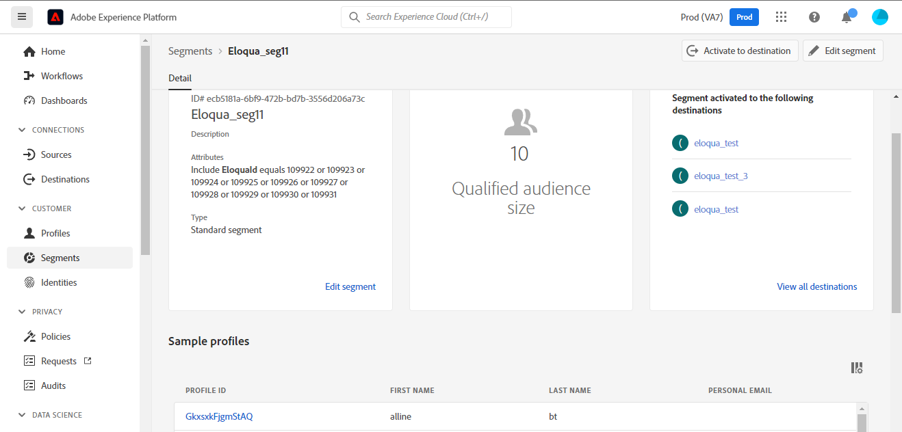

# Connexion [!DNL (API) Oracle Eloqua]

[[!DNL Oracle Eloqua]](https://www.oracle.com/cx/marketing/automation/) permet aux spécialistes marketing de planifier et d’exécuter des campagnes tout en offrant une expérience client personnalisée à leurs prospects. Grâce à la gestion de piste intégrée et à la création facile de campagnes, il permet aux marketeurs d’impliquer la bonne audience au bon moment dans le parcours de leur acheteur et se dimensionne de manière élégante pour atteindre les audiences sur l’ensemble des canaux, y compris les e-mails, la recherche d’affichage, les vidéos et les appareils mobiles. Les équipes commerciales peuvent conclure plus d’offres plus rapidement, ce qui accroît le retour sur investissement marketing grâce à insight en temps réel.

Cette [!DNL Adobe Experience Platform] [destination](/help/destinations/home.md) tire parti de l’opération [Mettre à jour un contact](https://docs.oracle.com/en/cloud/saas/marketing/eloqua-rest-api/op-api-rest-1.0-data-contact-id-put.html) de l’API [!DNL Oracle Eloqua] REST, qui vous permet de **mettre à jour les identités** d’une audience dans [!DNL Oracle Eloqua].

[!DNL Oracle Eloqua] utilise l’[authentification de base](https://docs.oracle.com/en/cloud/saas/marketing/eloqua-rest-api/Authentication_Basic.html) pour communiquer avec l’API REST [!DNL Oracle Eloqua]. Les instructions vous permettant de vous authentifier sur votre instance [!DNL Oracle Eloqua] sont plus loin dans la section [Authentifier à la destination](#authenticate).

## Cas d’utilisation {#use-cases}

Le service marketing d’une plateforme en ligne souhaite diffuser une campagne marketing par e-mail à une audience de prospects organisée. L’équipe marketing de la plateforme peut mettre à jour les informations de prospect existantes par l’intermédiaire de Adobe Experience Platform, créer des audiences à partir de leurs propres données hors ligne et envoyer ces audiences à [!DNL Oracle Eloqua], qui peut ensuite être utilisée pour envoyer l’e-mail de campagne marketing.

## Conditions préalables {#prerequisites}

### Conditions préalables d’Experience Platform {#prerequisites-in-experience-platform}

Avant d’activer des données dans la destination [!DNL Oracle Eloqua], vous devez avoir un [schéma](/help/xdm/schema/composition.md), un [jeu de données](https://experienceleague.adobe.com/docs/platform-learn/tutorials/data-ingestion/create-datasets-and-ingest-data.html), ainsi que des [segments](https://experienceleague.adobe.com/docs/platform-learn/tutorials/segments/create-segments.html) créés dans [!DNL Experience Platform].

Reportez-vous à la documentation Experience Platform pour le groupe de champs de schéma [Détails sur l’appartenance à une audience](/help/xdm/field-groups/profile/segmentation.md) si vous avez besoin de conseils sur les statuts de l’audience.

### Conditions préalables de [!DNL Oracle Eloqua] {#prerequisites-destination}

Pour exporter des données d’Experience Platform vers votre compte [!DNL Oracle Eloqua], vous devez disposer d’un compte [!DNL Oracle Eloqua].

En outre, vous avez besoin, au minimum, de la *« Utilisateurs avancés - Autorisations marketing »* pour votre instance [!DNL Oracle Eloqua]. Reportez-vous à la section *« Groupes de sécurité »* sur la page [Accès utilisateur sécurisé](https://docs.oracle.com/en/cloud/saas/marketing/eloqua-user/Help/SecurityOverview/SecuredUserAccess.htm) pour obtenir des conseils. L’accès est requis par la destination pour [déterminer votre URL de base](https://docs.oracle.com/en/cloud/saas/marketing/eloqua-rest-api/DeterminingBaseURL.html) par programmation lors de l’appel de l’API [!DNL Oracle Eloqua].

#### Collectez les informations d’identification de [!DNL Oracle Eloqua]. {#gather-credentials}

Notez les éléments ci-dessous avant de vous authentifier à la destination [!DNL Oracle Eloqua] :

| Informations d’identification | Description |
| --- | --- |
| `Company Name` | Nom de la société associée à votre compte [!DNL Oracle Eloqua]. <br>Vous utiliserez ultérieurement les `Username` `Company Name` et [!DNL Oracle Eloqua] comme chaîne concaténée à utiliser comme **[!UICONTROL Nom d’utilisateur]** lors de l’[authentification à la destination](#authenticate). |
| `Username` | Nom d’utilisateur de votre compte [!DNL Oracle Eloqua]. |
| `Password` | Mot de passe de votre compte [!DNL Oracle Eloqua]. |
| `Pod` | [!DNL Oracle Eloqua] prend en charge plusieurs centres de données, chacun disposant d’un nom de domaine unique. [!DNL Oracle Eloqua] les appelle « gousses », il y en a actuellement sept au total - p01, p02, p03, p04, p06, p07 et p08. Pour savoir sur quel POD vous vous trouvez, connectez-vous à [!DNL Oracle Eloqua] et notez l’URL dans votre navigateur après vous être connecté. Par exemple, si l’URL de votre navigateur est `secure.p01.eloqua.com`, votre `pod` est `p01`. Reportez-vous à la page [Définition de votre POD](https://community.oracle.com/topliners/discussion/4470225/determining-your-pod-number-for-oracle-eloqua) pour obtenir des conseils supplémentaires. |

Reportez-vous à la section [Connexion à [!DNL Oracle Eloqua]](https://docs.oracle.com/en/cloud/saas/marketing/eloqua-user/Help/Administration/Tasks/SigningInToEloqua.htm#Signing) pour obtenir des conseils.

## Mécanismes de sécurisation {#guardrails}

>[!NOTE]
>
>* [!DNL Oracle Eloqua] champs de contact personnalisés sont automatiquement créés à l’aide des noms des audiences sélectionnées lors de l’étape **[!UICONTROL Sélectionner des segments]**.

* [!DNL Oracle Eloqua] a une limite maximale de 250 champs de contact personnalisés.
* Avant d’exporter de nouvelles audiences, assurez-vous que le nombre d’audiences Experience Platform et le nombre d’audiences existantes dans [!DNL Oracle Eloqua] ne dépassent pas cette limite.
* Si cette limite est dépassée, vous rencontrerez une erreur dans Experience Platform. Cela est dû au fait que l’API [!DNL Oracle Eloqua] ne parvient pas à valider la requête et répond par un - *400: Une erreur de validation s’est produite* - message d’erreur décrivant le problème.
* Si vous avez atteint la limite spécifiée ci-dessus, vous devez supprimer les mappages existants de la destination et supprimer les champs de contact personnalisés correspondants dans votre compte [!DNL Oracle Eloqua] avant de pouvoir exporter d’autres segments.

* Reportez-vous à la page [[!DNL Oracle Eloqua] Création de champs de contact](https://docs.oracle.com/en/cloud/saas/marketing/eloqua-user/Help/ContactFields/Tasks/CreatingContactFields.htm) pour plus d’informations sur les limites supplémentaires.

## Identités prises en charge {#supported-identities}

[!DNL Oracle Eloqua] prend en charge la mise à jour des identités décrites dans le tableau ci-dessous. En savoir plus sur les [identités](/help/identity-service/features/namespaces.md).

| Identité cible | Description | Obligatoire |
|---|---|---|
| `EloquaId` | Identifiant unique du contact. | Oui |

## Type et fréquence d’exportation {#export-type-frequency}

Reportez-vous au tableau ci-dessous pour plus d’informations sur le type et la fréquence d’exportation des destinations.

| Élément | Type | Notes |
---------|----------|---------|
| Type d’exportation | **[!UICONTROL Basé sur les profils]** | <ul><li>Vous exportez tous les membres d’un segment, ainsi que les champs de schéma souhaités, *(par exemple : adresse e-mail, numéro de téléphone, nom)*, en fonction de votre mappage de champs.</li><li> Pour chaque audience sélectionnée dans Experience Platform, le statut du segment [!DNL Oracle Eloqua] correspondant est mis à jour avec son statut d’audience à partir d’Experience Platform.</li></ul> |
| Fréquence des exportations | **[!UICONTROL Diffusion en continu]** | <ul><li>Les destinations de diffusion en continu sont des connexions basées sur l’API « toujours actives ». Dès qu’un profil est mis à jour dans Experience Platform en fonction de l’évaluation des audiences, le connecteur envoie la mise à jour en aval vers la plateforme de destination. En savoir plus sur les [destinations de diffusion en continu](/help/destinations/destination-types.md#streaming-destinations).</li></ul> |

{style="table-layout:auto"}

## Se connecter à la destination {#connect}

>[!IMPORTANT]
>
>Pour vous connecter à la destination, vous avez besoin des autorisations de contrôle d’accès **[!UICONTROL Afficher les destinations]** et **[!UICONTROL Gérer les destinations]** [](/help/access-control/home.md#permissions). Lisez la [présentation du contrôle d’accès](/help/access-control/ui/overview.md) ou contactez votre administrateur de produit pour obtenir les autorisations requises.

Pour vous connecter à cette destination, procédez comme décrit dans le [tutoriel sur la configuration des destinations](../../ui/connect-destination.md). Dans le workflow de configuration des destinations, renseignez les champs répertoriés dans les deux sections ci-dessous.

Dans **[!UICONTROL Destinations]** > **[!UICONTROL Catalogue]**, recherchez [!DNL (API) Oracle Eloqua]. Vous pouvez également localiser cet élément dans la catégorie **[!UICONTROL Marketing par e-mail]**.

### S’authentifier auprès de la destination {#authenticate}

>[!CONTEXTUALHELP]
>id="platform_destinations_apioracleeloqua_companyname_username"
>title="Nom de la société\Nom d’utilisateur"
>abstract="Inscrivez dans ce champ le nom de votre société et le nom d’utilisateur d’Oracle Eloqua (formulaire `{COMPANY_NAME}\{USERNAME}`)"

Renseignez les champs obligatoires ci-dessous. Reportez-vous à la section [Collecter [!DNL Oracle Eloqua] informations d’identification](#gather-credentials) pour obtenir des conseils.
* **[!UICONTROL Mot de passe]** : mot de passe de votre compte [!DNL Oracle Eloqua].
* **[!UICONTROL Nom d’utilisateur]** : chaîne concaténée composée du nom de votre société [!DNL Oracle Eloqua] et du nom d’utilisateur [!DNL Oracle Eloqua].<br>La valeur concaténée prend la forme d’`{COMPANY_NAME}\{USERNAME}`.<br> Remarque, n’utilisez pas d’accolades ni d’espaces et conservez les `\`. <br>Par exemple, si le nom de votre société [!DNL Oracle Eloqua] est `MyCompany` et [!DNL Oracle Eloqua] nom d’utilisateur est `Username`, la valeur concaténée que vous utiliserez dans le champ **[!UICONTROL Nom d’utilisateur]** est `MyCompany\Username`.

Pour vous authentifier auprès de la destination, sélectionnez **[!UICONTROL Se connecter à la destination]**.


Si les détails fournis sont valides, l’interface utilisateur affiche un statut **[!UICONTROL Connecté]** avec une coche verte. Vous pouvez ensuite passer à l’étape suivante.

### Renseigner les détails de la destination {#destination-details}

>[!CONTEXTUALHELP]
>id="platform_destinations_apioracleeloqua_pod"
>title="Pod"
>abstract="Pour trouver votre numéro de pod, connectez-vous à Oracle Eloqua. Notez l’URL de votre navigateur dès la connexion effectuée. "

<!-- >additional-url="https://support.oracle.com/knowledge/Oracle%20Cloud/2307176_1.html" text="Oracle Knowledge base - find out your Pod number" -->

Pour configurer les détails de la destination, renseignez les champs obligatoires et facultatifs ci-dessous. Un astérisque situé en regard d’un champ de l’interface utilisateur indique que le champ est obligatoire.


* **[!UICONTROL Nom]** : un nom par lequel vous reconnaîtrez cette destination à l’avenir.
* **[!UICONTROL Description]** : une description qui vous aidera à identifier cette destination à l’avenir.
* **[!UICONTROL Pod]** : Pour savoir sur quel `pod` vous vous connectez, connectez-vous à [!DNL Oracle Eloqua] et notez l&#39;URL dans votre navigateur une fois que vous êtes connecté. Par exemple, si l’URL de votre navigateur est `secure.p01.eloqua.com`, la valeur `pod` que vous devez sélectionner est `p01`. Reportez-vous à la section [Collecter [!DNL Oracle Eloqua] informations d’identification](#gather-credentials) pour plus d’informations.

### Activer les alertes {#enable-alerts}

Vous pouvez activer les alertes pour recevoir des notifications sur le statut de votre flux de données vers votre destination. Sélectionnez une alerte dans la liste et abonnez-vous à des notifications concernant le statut de votre flux de données. Pour plus d’informations sur les alertes, consultez le guide sur l’[abonnement aux alertes des destinations dans l’interface utilisateur](../../ui/alerts.md).

Lorsque vous avez terminé de renseigner les détails sur votre connexion de destination, sélectionnez **[!UICONTROL Suivant]**.

## Activer des audiences vers cette destination {#activate}

>[!IMPORTANT]
> 
>* Pour activer les données, vous avez besoin des autorisations de contrôle d’accès **[!UICONTROL Afficher les destinations]**, **[!UICONTROL Activer les destinations]**, **[!UICONTROL Afficher les profils]** et **[!UICONTROL Afficher les segments]** [](/help/access-control/home.md#permissions). Lisez la [présentation du contrôle d’accès](/help/access-control/ui/overview.md) ou contactez votre administrateur ou administratrice du produit pour obtenir les autorisations requises.
>* Pour exporter des *identités*, vous devez disposer de l’autorisation de contrôle d’accès **[!UICONTROL Afficher le graphique d’identités]** [](/help/access-control/home.md#permissions). <br> {width="100" zoomable="yes"}

Consultez la section [Activer les profils et les audiences vers les destinations d’exportation d’audiences en flux continu](/help/destinations/ui/activate-segment-streaming-destinations.md) pour obtenir des instructions sur l’activation des audiences vers cette destination.

### Considérations sur le mappage et exemple {#mapping-considerations-example}

Pour envoyer correctement vos données d’audience d’Adobe Experience Platform vers la destination [!DNL Oracle Eloqua], vous devez passer par l’étape de mappage des champs. Le mappage consiste à créer un lien entre vos champs de schéma de modèle de données d’expérience (XDM) dans votre compte Experience Platform et leurs équivalents issus de la destination cible.

Pour mapper vos champs XDM aux champs de destination [!DNL Oracle Eloqua], procédez comme suit :

1. Dans l’étape **[!UICONTROL Mappage]**, sélectionnez **[!UICONTROL Ajouter un nouveau mappage]**. Une nouvelle ligne de mappage s’affichera à l’écran.
1. Dans la fenêtre **[!UICONTROL Sélectionner le champ source]**, choisissez la catégorie **[!UICONTROL Sélectionner les attributs]** et sélectionnez l’attribut XDM ou choisissez l’espace de noms d’identité **[!UICONTROL Sélectionner]** et sélectionnez une identité.
1. Dans la fenêtre **[!UICONTROL Sélectionner le champ cible]**, choisissez **[!UICONTROL Sélectionner un espace de noms d’identité]** et sélectionnez une identité, ou choisissez **[!UICONTROL Sélectionner des attributs personnalisés]** et saisissez le nom d’attribut souhaité dans le champ **[!UICONTROL Nom de l’attribut]**. Le nom d’attribut que vous fournissez doit correspondre à un attribut de contact existant dans [!DNL Oracle Eloqua]. Voir [[!DNL create a contact]](https://docs.oracle.com/en/cloud/saas/marketing/eloqua-rest-api/op-api-rest-1.0-data-contact-post.html) pour connaître les noms d’attributs exacts que vous pouvez utiliser dans [!DNL Oracle Eloqua].

   * Répétez ces étapes pour ajouter les mappages d’attributs obligatoires et souhaités entre votre schéma de profil XDM et [!DNL Oracle Eloqua] :

     | Champ source | Champ cible | Obligatoire |
     |---|---|---|
     | `IdentityMap: Eid` | `Identity: EloquaId` | Oui |
     | `xdm: personalEmail.address` | `Attribute: emailAddress` | Oui |
     | `xdm: personName.firstName` | `Attribute: firstName` | |
     | `xdm: personName.lastName` | `Attribute: lastName` | |
     | `xdm: workAddress.street1` | `Attribute: address1` | |
     | `xdm: workAddress.street2` | `Attribute: address2` | |
     | `xdm: workAddress.street3` | `Attribute: address3` | |
     | `xdm: workAddress.postalCode` | `Attribute: postalCode` | |
     | `xdm: workAddress.country` | `Attribute: country` | |
     | `xdm: workAddress.city` | `Attribute: city` | |

   * Un exemple avec les mappages ci-dessus est illustré ci-dessous :
     

>[!IMPORTANT]
>
>* Les attributs spécifiés dans le **[!UICONTROL champ cible]** doivent être nommés exactement comme spécifié dans le [[!DNL Create a contact]](https://docs.oracle.com/en/cloud/saas/marketing/eloqua-rest-api/op-api-rest-1.0-data-contact-post.html), car ces attributs formeront le corps de la requête.
>* Les attributs spécifiés dans le champ **[!UICONTROL Source]** ne respectent aucune restriction de ce type. Vous pouvez la mapper en fonction de vos besoins. Toutefois, si le format des données n’est pas correct lors de l’envoi à [!DNL Oracle Eloqua], une erreur se produira. Par exemple, vous pouvez mapper le champ **[!UICONTROL Source]** l’espace de noms d’identité `contact key`, `ABC ID`, etc. à **[!UICONTROL Champ cible]** : `EloquaId` après vous être assuré que les valeurs des identifiants correspondent au format accepté par [!DNL Oracle Eloqua].
>* Le mappage `EloquaID` est obligatoire pour mettre à jour les attributs correspondant à l’identité.
>* Le mappage `emailAddress` est obligatoire. Sans cela, l’API renvoie une erreur comme illustré ci-dessous :
>
>```json
>{
>     "type":"ObjectValidationError",
>     "container":{
>           "type":"ObjectKey",
>           "objectType":"Contact"
>     },
>     "property":"emailAddress",
>     "requirement":{
>           "type":"EmailAddressRequirement"
>     },
>     "value":"<null>"
>}
>```

Lorsque vous avez terminé de fournir les mappages pour votre connexion de destination, sélectionnez **[!UICONTROL Suivant]**.

>[!NOTE]
>
>La destination ajoute automatiquement un identifiant unique aux noms d’audience sélectionnés à chaque exécution lors de l’envoi des informations du champ de contact à [!DNL Oracle Eloqua]. Cela permet de s’assurer que les noms des champs de contact correspondant aux noms de votre audience ne se chevauchent pas. Reportez-vous à l’exemple de capture d’écran de la section [Valider l’exportation des données](#exported-data) d’une page de détails de contact [!DNL Oracle Eloqua] avec un champ de contact personnalisé créé à l’aide des noms d’audience.

## Valider l’exportation des données {#exported-data}

Pour vérifier que vous avez correctement configuré la destination, procédez comme suit :

1. Sélectionnez **[!UICONTROL Destinations]** > **[!UICONTROL Parcourir]** et accédez à la liste des destinations.
1. Sélectionnez ensuite la destination et passez à l’onglet **[!UICONTROL Données d’activation]**, puis sélectionnez un nom d’audience.
   

1. Surveillez le résumé de l’audience et assurez-vous que le nombre de profils correspond au nombre dans le segment.
   

1. Connectez-vous au site web [!DNL Oracle Eloqua], puis accédez à la page **[!UICONTROL Présentation des contacts]** pour vérifier si les profils de l’audience ont été ajoutés. Pour afficher le statut de l’audience, accédez à une page **[!UICONTROL Détails du contact]** et vérifiez si le champ de contact avec le nom d’audience sélectionné comme préfixe a été créé.


## Utilisation et gouvernance des données {#data-usage-governance}

Lors de la gestion de vos données, toutes les destinations [!DNL Adobe Experience Platform] se conforment aux politiques d’utilisation des données. Pour obtenir des informations détaillées sur la manière dont [!DNL Adobe Experience Platform] applique la gouvernance des données, lisez la [présentation de la gouvernance des données](/help/data-governance/home.md).

## Erreurs et résolution des problèmes {#errors-and-troubleshooting}

Pendant la création de la destination, vous pouvez recevoir l’un des messages d’erreur suivants : `400: There was a validation error` ou `400 BAD_REQUEST`. Cela se produit lorsque vous dépassez la limite de 250 champs de contact personnalisés, comme décrit dans la section [mécanismes de sécurisation](#guardrails). Pour corriger cette erreur, veillez à ne pas dépasser la limite de champ de contact personnalisé dans [!DNL Oracle Eloqua].


Consultez les pages [[!DNL Oracle Eloqua] Codes d’état HTTP](https://docs.oracle.com/en/cloud/saas/marketing/eloqua-rest-api/APIRequests_HTTPStatusCodes.html) et [[!DNL Oracle Eloqua] Erreurs de validation](https://docs.oracle.com/en/cloud/saas/marketing/eloqua-rest-api/APIRequests_HTTPValidationErrors.html) pour obtenir une liste complète des codes d’état et d’erreur avec des explications.

## Ressources supplémentaires {#additional-resources}

Pour plus d’informations, consultez la documentation [!DNL Oracle Eloqua] :

* [Automatisation Du Marketing Oracle Eloqua](https://docs.oracle.com/en/cloud/saas/marketing/eloqua.html)
* [API REST pour le service Oracle Eloqua Marketing Cloud](https://docs.oracle.com/en/cloud/saas/marketing/eloqua-rest-api/rest-endpoints.html)

### Journal des modifications

Cette section répertorie les nouvelles fonctionnalités et les mises à jour importantes de la documentation consacrée au connecteur de destination.

+++ Afficher le journal des modifications

| Mois de publication | Type de mise à jour | Description |
|---|---|---|
| Avril 2023 | Mise à jour de la documentation | <ul><li>Nous avons mis à jour la section [cas d’utilisation](#use-cases) avec un exemple plus clair du moment où les clients pourraient bénéficier de l’utilisation de cette destination.</li> <li>Nous avons mis à jour la section [mappage](#mapping-considerations-example) avec des exemples clairs de mappages obligatoires et facultatifs.</li> <li>Mise à jour de la section [Se connecter à la destination](#connect) avec un exemple sur la construction de la valeur concaténée pour le champ **[!UICONTROL Nom d’utilisateur]** à l’aide du nom de société [!DNL Oracle Eloqua] et du nom d’utilisateur [!DNL Oracle Eloqua]. (PLATIR-28343)</li><li>Nous avons mis à jour les sections [Rassembler [!DNL Oracle Eloqua] les informations d’identification](#gather-credentials) et [Remplir les détails de la destination](#destination-details) avec des conseils sur [!DNL Oracle Eloqua] sélection **[!UICONTROL Capsule]**. La valeur *« Pod »* est utilisée par la destination pour construire l’URL de base des appels API. Mise à jour de la section [[!DNL Oracle Eloqua] conditions préalables](#prerequisites-destination) avec des conseils sur l’attribution de *« Utilisateurs avancés - Autorisations marketing »* en tant que *obligatoire « Groupes de sécurité »* pour votre instance [!DNL Oracle Eloqua].</li></ul> |
| Mars 2023 | Version initiale | Publication de la destination initiale et de la documentation. |

{style="table-layout:auto"}

+++