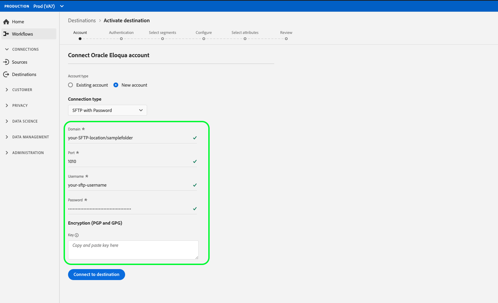

# [!DNL Oracle Eloqua]

## Présentation

[[!DNL Oracle Eloqua]](https://www.oracle.com/marketingcloud/products/marketing-automation/)[!DNL Oracle] est une plateforme de logiciel en tant que service (SaaS, Software as a service) pour l’automatisation du marketing proposée par , qui vise à aider les spécialistes marketing et les entreprises B2B à gérer les campagnes marketing et la génération de pistes commerciales.

To send segment data to [!DNL Oracle Eloqua], you must first [connect the destination](#connect-destination) in Real-time Customer Data Platform, and then [set up a data import](#import-data-into-eloqua) from your storage location into [!DNL Oracle Eloqua].

## Type d’exportation {#export-type}

**Basé sur** le profil : vous exportez tous les membres d’un segment, ainsi que les champs de schéma de votre choix (par exemple : adresse électronique, numéro de téléphone, nom de famille), tel que choisi dans l’écran de sélection des attributs du processus [d’activation de](../../ui/activate-destinations.md#select-attributes)destination.

## Se connecter à la destination {#connect-destination}

In **[!UICONTROL Connections]** > **[!UICONTROL Destinations]**, select [!DNL Oracle Eloqua], then select **[!UICONTROL Connect destination]**.

[Se connecter à Eloqua](../../assets/catalog/email-marketing/oracle-eloqua/catalog.png)

À l’étape **[!UICONTROL Authentification]**, si vous avez auparavant configuré une connexion à votre destination de stockage dans le cloud, sélectionnez **[!UICONTROL Compte existant]**, puis l’une de vos connexions existantes. Vous pouvez aussi sélectionner **[!UICONTROL Nouveau compte]** pour configurer une nouvelle connexion. Renseignez les informations d’authentification de votre compte et sélectionnez **[!UICONTROL Se connecter à la destination]**. For [!DNL Oracle Eloqua], you can select between **[!UICONTROL SFTP with Password]** and **[!UICONTROL SFTP with SSH Key]**. Renseignez les informations ci-dessous en fonction du type de connexion, puis sélectionnez **[!UICONTROL Se connecter à la destination]**.

Pour les connexions **[!UICONTROL SFTP avec mot de passe]**, vous devez fournir le domaine, le port, le nom d’utilisateur et le mot de passe.
Pour les connexions **[!UICONTROL SFTP avec clé SSH]**, vous devez fournir le domaine, le port, le nom d’utilisateur et la clé SSH.

À l’étape **[!UICONTROL Configuration]**, renseignez les informations pertinentes pour votre destination, comme illustré ci-dessous :
- **[!UICONTROL Nom]** : choisissez un nom pertinent pour votre destination.
- **[!UICONTROL Description]** : saisissez une description pour votre destination.
- **[!UICONTROL Chemin d’accès au dossier]** : indiquez le chemin d’accès dans l’emplacement de stockage où la plateforme de données clients en temps réel dépose vos données d’exportation sous forme de fichiers CSV ou séparés par des tabulations.
- **[!UICONTROL Format du fichier]** : **CSV** ou **séparé par des tabulations**. Sélectionnez le format du fichier à exporter vers l’emplacement de stockage.

Cliquez sur **[!UICONTROL Créer la destination]** après avoir renseigné les champs ci-dessus. Votre destination est maintenant créée et vous pouvez [activer des segments](../../ui/activate-destinations.md) vers la destination.

## Activation des segments {#activate-segments}

Pour obtenir des informations sur le processus d’activation des segments, voir [Activer les profils et les segments à une destination](../../ui/activate-destinations.md).

## Attributs de destination {#destination-attributes}

Lors de l’[activation de segments](../../ui/activate-destinations.md)[!DNL Oracle Eloqua] vers la destination , il est conseillé de sélectionner un identifiant unique à partir de votre [schéma d’union](../../../profile/home.md#profile-fragments-and-union-schemas). Sélectionnez l’identifiant unique et tout autre champ XDM que vous souhaitez exporter vers la destination. Pour plus d’informations, consultez [Sélectionner les champs de schéma à utiliser comme attributs de destination dans vos fichiers exportés](./overview.md#destination-attributes) dans les destinations de marketing par e-mail.

## Données exportées {#exported-data}

For [!DNL Oracle Eloqua] destinations, Real-time CDP creates a tab-delimited `.txt` or `.csv` file in the storage location that you provided. Pour plus d’informations sur les fichiers, reportez-vous à la section Destinations du marketing par [courrier électronique et Destinations](../../ui/activate-destinations.md#esp-and-cloud-storage) d’enregistrement Cloud dans le didacticiel sur l’activation des segments.

## Set up data import into [!DNL Oracle Eloqua] {#import-data-into-eloqua}

Après la connexion de la plateforme de données clients en temps réel au stockage Amazon S3 ou SFTP, vous devez configurer l’importation des données depuis l’emplacement de stockage vers [!DNL Oracle Eloqua]. To learn how to accomplish this, see [Importing contacts or accounts](https://docs.oracle.com/cloud/latest/marketingcs_gs/OMCAA/Help/DataImportExport/Tasks/ImportingContactsOrAccounts.htm) in the [!DNL Oracle Eloqua Help Center].