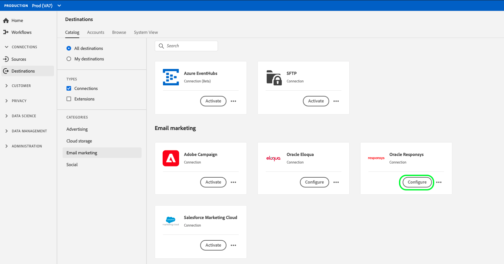

# [!DNL Oracle Responsys] connexion

## Présentation {#overview}

[Responsys](https://www.oracle.com/marketingcloud/products/cross-channel-orchestration/)[!DNL Oracle] est un outil de marketing par e-mail d’entreprise proposé par dans le cadre de campagnes marketing sur plusieurs canaux. Il permet de personnaliser les interactions entre e-mails, terminaux mobiles, écrans et réseaux sociaux.

Pour envoyer des données de segment à [!DNL Oracle Responsys], vous devez d&#39;abord [vous connecter à la destination](#connect-destination) dans Adobe Experience Platform, puis [configurer une importation de données](#import-data-into-responsys) à partir de votre emplacement d&#39;enregistrement dans [!DNL Oracle Responsys].

## Type d&#39;exportation {#export-type}

**Basé sur**  le profil : vous exportez tous les membres d’un segment, ainsi que les champs de schéma de votre choix (par exemple : adresse électronique, numéro de téléphone, nom de famille), tel que choisi dans l’écran de sélection des attributs du processus [ d’activation de ](../../ui/activate-destinations.md#select-attributes)destination.

## Connexion à la destination {#connect-destination}

Dans **[!UICONTROL Connexions]** > **[!UICONTROL Destinations]**, sélectionnez [!DNL Oracle Responsys], puis **[!UICONTROL Connecter la destination]**.

À l’étape **[!UICONTROL Authentification]**, si vous avez auparavant configuré une connexion à votre destination de stockage dans le cloud, sélectionnez **[!UICONTROL Compte existant]**, puis l’une de vos connexions existantes. Vous pouvez aussi sélectionner **[!UICONTROL Nouveau compte]** pour configurer une nouvelle connexion. Renseignez les informations d’authentification de votre compte et sélectionnez **[!UICONTROL Se connecter à la destination]**. Pour [!DNL Oracle Responsys], vous pouvez choisir entre **[!UICONTROL SFTP avec mot de passe]** et **[!UICONTROL SFTP avec clé SSH]**. Renseignez les informations ci-dessous en fonction du type de connexion, puis sélectionnez **[!UICONTROL Se connecter à la destination]**.

Pour les connexions **[!UICONTROL SFTP avec mot de passe]**, vous devez fournir le domaine, le port, le nom d’utilisateur et le mot de passe.

Pour les connexions **[!UICONTROL SFTP avec clé SSH]**, vous devez fournir le domaine, le port, le nom d’utilisateur et la clé SSH.

À l’étape **[!UICONTROL Configuration]**, renseignez les informations pertinentes pour votre destination, comme illustré ci-dessous :
- **[!UICONTROL Nom]** : choisissez un nom pertinent pour votre destination.
- **[!UICONTROL Description]** : saisissez une description pour votre destination.
- **[!UICONTROL Nom]** du compartiment : Votre compartiment Amazon S3, où Platform dépose l’exportation des données. Votre saisie doit comporter entre 3 et 63 caractères. Doit commencer et se terminer par une lettre ou un numéro. Ne doit contenir que des lettres minuscules, des chiffres ou des tirets ( - ). Ne doit pas être formaté en tant qu’adresse IP (par exemple, 192.100.1.1).
- **[!UICONTROL Chemin]** du dossier : Indiquez le chemin d’accès à l’emplacement de votre enregistrement où Platform déposera vos données d’exportation au format CSV ou tabulé.
- **[!UICONTROL Format du fichier]** : **CSV** ou **séparé par des tabulations**. Sélectionnez le format du fichier à exporter vers l’emplacement de stockage.
- **[!UICONTROL Actions]** marketing : Les actions marketing indiquent l’intention d’exporter les données vers la destination. Vous pouvez choisir parmi des actions marketing définies par Adobe ou créer votre propre action marketing. Pour plus d’informations sur les actions marketing, voir la page [Gouvernance des données dans Adobe Experience Platform](../../../data-governance/policies/overview.md). Pour plus d&#39;informations sur les actions marketing définies par l&#39;Adobe, consultez la [Présentation des stratégies d&#39;utilisation des données](../../../data-governance/policies/overview.md).

Cliquez sur **[!UICONTROL Créer la destination]** après avoir renseigné les champs ci-dessus. Votre destination est maintenant connectée et vous pouvez [activer des segments](../../ui/activate-destinations.md) vers la destination.

## Activation des segments {#activate-segments}

Pour obtenir des informations sur le processus d’activation des segments, voir [Activer les profils et les segments à une destination](../../ui/activate-destinations.md).

## Attributs de destination {#destination-attributes}

Lors de l’[activation de segments](../../ui/activate-destinations.md)[!DNL Oracle Responsys] vers la destination , il est conseillé de sélectionner un identifiant unique à partir de votre [schéma d’union](../../../profile/home.md#profile-fragments-and-union-schemas). Sélectionnez l’identifiant unique et tout autre champ XDM que vous souhaitez exporter vers la destination. Pour plus d’informations, consultez [Sélectionner les champs de schéma à utiliser comme attributs de destination dans vos fichiers exportés](./overview.md#destination-attributes) dans les destinations de marketing par e-mail.

## Données exportées {#exported-data}

Pour les destinations [!DNL Oracle Responsys], Platform crée un fichier délimité par des tabulations `.txt` ou `.csv` à l&#39;emplacement de l&#39;enregistrement que vous avez fourni. Pour plus d’informations sur les fichiers, voir [Destinations du marketing par courriel et Destinations de l’enregistrement Cloud](../../ui/activate-destinations.md#esp-and-cloud-storage) dans le didacticiel sur l’activation des segments.

## Configurez l&#39;importation des données dans [!DNL Oracle Responsys] {#import-data-into-responsys}

Après avoir connecté Platform à votre enregistrement [!DNL Amazon S3] ou SFTP, vous devez configurer l&#39;importation des données à partir de votre emplacement d&#39;enregistrement dans [!DNL Oracle Responsys]. Pour savoir comment y parvenir, voir [Importation de contacts ou de comptes](https://docs.oracle.com/cloud/latest/marketingcs_gs/OMCEA/Connect_WizardUpload.htm) dans le [!DNL Oracle Responsys Help Center].