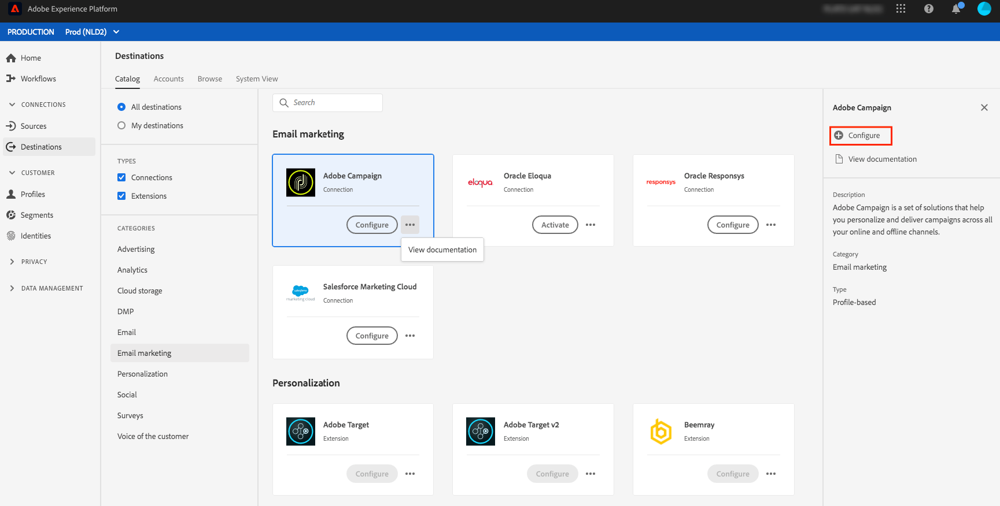

# Présentation des destinations du marketing par email {#email-marketing-destinations}

Les fournisseurs de service de messagerie électronique (ESP, Email Service Providers) vous permettent de gérer vos activités de marketing par e-mail, comme l’envoi de campagnes promotionnelles par e-mail. Adobe Experience Platform s’intègre aux services de messagerie instantanée en vous permettant d’activer des segments vers des destinations de marketing par courrier électronique.

Pour envoyer des segments aux destinations de marketing par courriel pour vos campagnes, la plateforme doit d’abord se connecter à la destination.

La connexion aux destinations de marketing par e-mail est un processus en trois étapes. Chaque étape est décrite plus loin dans cette page.

Dans le flux de connexion à la destination, décrit dans la section ci-dessous, connectez-vous à Amazon S3 ou SFTP. La plate-forme exporte vos segments sous la forme de fichiers `.csv` ou `.txt` et les diffuse à l’emplacement souhaité. Planifiez l’importation de vos données dans votre plateforme de marketing par courrier électronique à partir de l’emplacement d’enregistrement activé dans la plate-forme. Le processus d’importation des données varie pour chaque partenaire. Pour plus d’informations, consultez les articles de destinations individuelles.

## Configurer la destination {#connect-destination}

Dans **[!UICONTROL Connexions]** > **[!UICONTROL Destinations]**, sélectionnez la destination marketing par courriel à laquelle vous souhaitez vous connecter, puis **[!UICONTROL Configurer]**.

À l’étape **[!UICONTROL Authentification]**, si vous aviez précédemment configuré une connexion à votre destination marketing par courriel, sélectionnez **[!UICONTROL Compte existant]** et sélectionnez votre connexion existante. Vous pouvez également sélectionner **[!UICONTROL Nouveau compte]** pour configurer une nouvelle connexion à votre destination marketing par courrier électronique. Dans le sélecteur **[!UICONTROL Type de connexion]**, vous pouvez choisir entre Amazon S3, SFTP avec mot de passe ou SFTP avec clé SSH. Renseignez les informations ci-dessous, en fonction du type de connexion, puis sélectionnez **[!UICONTROL Se connecter]**.

- Pour les connexions **S3**, vous devez fournir votre identifiant de clé d&#39;accès Amazon et votre clé d&#39;accès secret.
- Pour les connexions **SFTP avec mot de passe**, vous devez fournir le domaine, le port, le nom d’utilisateur et le mot de passe pour votre serveur SFTP.
- Pour les connexions **SFTP avec la clé SSH**, vous devez fournir le domaine, le port, le nom d&#39;utilisateur et la clé SSH pour votre serveur SFTP.

Vous pouvez éventuellement joindre votre clé publique au format RSA pour ajouter un chiffrement à vos fichiers exportés sous la section **[!UICONTROL Clé]**. Notez que cette clé publique **doit** être écrite en tant que chaîne codée Base64.

À l&#39;étape **[!UICONTROL Configuration]**, entrez un nom et une description pour votre nouvelle destination, ainsi que le format de fichier des fichiers exportés.

Si vous avez sélectionné Amazon S3 en tant qu’option d’enregistrement à l’étape précédente, insérez le nom du compartiment et le chemin d’accès au dossier dans la destination de l’enregistrement cloud où les fichiers seront distribués. Pour l’option enregistrement SFTP, insérez le chemin d’accès au dossier dans lequel les fichiers seront distribués.

Cette étape vous permet également de sélectionner toute action marketing à appliquer à cette destination. Les actions marketing indiquent l’intention d’exporter les données vers la destination. Vous pouvez choisir parmi des actions marketing définies par Adobe ou créer votre propre action marketing. Pour plus d&#39;informations sur les actions marketing, consultez la [Présentation des stratégies d&#39;utilisation des données](../../../data-governance/policies/overview.md).

## Sélectionnez les membres de segment à inclure dans vos exportations de destination {#select-segments}

Sur la page **[!UICONTROL Sélectionner segments]**, sélectionnez les segments à envoyer à la destination. Pour en savoir plus sur les champs des sections ci-dessous.

## Configuration des noms de fichier

Pour plus d&#39;informations sur les options de modification de la planification des segments et du nom de fichier, consultez l&#39;étape [Configurer](../../ui/activate-destinations.md#configure) du didacticiel Activer les destinations.

## Sélectionner des attributs : sélectionnez les champs de schéma à utiliser comme attributs de destination dans vos fichiers exportés {#destination-attributes}

Au cours de cette étape, vous sélectionnez les champs à exporter vers les destinations marketing par courriel, ainsi que le marquage des champs obligatoires.

Pour plus d&#39;informations sur cette étape, consultez l&#39;étape [Sélectionner des attributs](../../ui/activate-destinations.md#select-attributes) du didacticiel Activer les destinations.

## Identité {#identity}

Nous vous recommandons de sélectionner un identifiant unique dans votre [schéma d’union](../../../profile/home.md#profile-fragments-and-union-schemas). Il s’agit du champ dans lequel les identités de vos utilisateurs sont déclenchées. Généralement, ce champ correspond à l’adresse électronique, mais il peut également s’agir d’un identifiant du programme de fidélité ou d’un numéro de téléphone. Consultez le tableau ci-dessous pour connaître les identifiants uniques les plus courants et leur champ XDM dans le schéma.

| Identifiant unique | Champ XDM dans le schéma unifié |
----------------- | ---------------------------
| Adresse électronique | `personalEmail.address` |
| Téléphone | `mobilePhone.number` |
| Identifiant du programme de fidélité | `Customer-defined XDM field` |

## Autres attributs de destination

Dans le sélecteur de champ Schéma, choisissez les autres champs à exporter vers la destination de courriel. Voici quelques options recommandées :

| Schéma | Champ XDM |
------ | ---------
| Prénom | `person.name.firstName` |
| Nom | `person.name.lastName` |
| Téléphone | `mobilePhone.number` |
| Ville de l’adresse | `homeAddress.city` |
| État de l’adresse | `homeAddress.stateProvince` |
| Code postal de l’adresse | `homeAddress.postalCode` |
| Date de naissance | `person.birthDayAndMonth` |
| Appartenance à un segment | `segmentMembership.status` |

## Importer des données depuis l&#39;emplacement de votre enregistrement vers la destination

Consultez les articles de destination de marketing par e-mail individuelle pour découvrir comment importer des données de l’emplacement de stockage vers les destinations :

- [Adobe Campaign](./adobe-campaign.md#import-data-into-campaign)
- [Oracle Eloqua](./oracle-eloqua.md#import-data-into-eloqua)
- [Oracle Responsys](./oracle-responsys.md#import-data-into-responsys)
- [Salesforce Marketing Cloud](./salesforce-marketing-cloud.md#import-data-into-salesforce)

## Activer les segments vers les destinations de marketing par e-mail

Pour plus d’informations sur l’activation des segments vers les destinations de marketing par e-mail, consultez [Activation des données vers des destinations](../../ui/activate-destinations.md).

## Ressources supplémentaires

- [Activer les données vers les destinations](../../ui/activate-destinations.md)
- [Créez des destinations de marketing par courrier électronique et activez les données à l’aide de l’API du service de flux.](../../api/email-marketing.md)