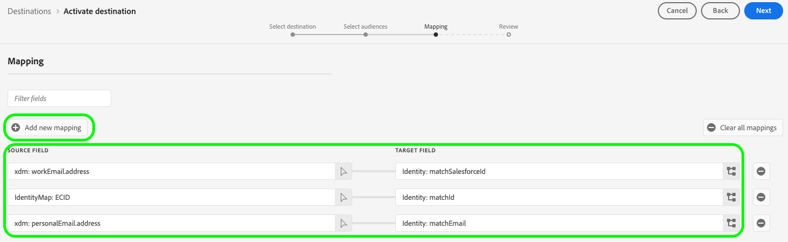

# Connexion [!DNL (V2) Salesforce Marketing Cloud Account Engagement]

La destination [[!DNL Salesforce Marketing Cloud Account Engagement]](https://www.salesforce.com/products/marketing-cloud/marketing-automation/) (anciennement appelée [!DNL Pardot]) vous permet d’exporter vos données de profil Adobe Experience Platform vers la plateforme d’automatisation du marketing B2B de Salesforce.

Cette intégration permet une synchronisation transparente des données entre les profils client dans Adobe Experience Platform et vos campagnes marketing dans [!DNL Salesforce Marketing Cloud Account Engagement].

Cette destination utilise le [[!DNL Salesforce Import API v5]](https://developer.salesforce.com/docs/marketing/pardot/guide/import-v5.html) pour traiter efficacement les exportations de données par lots.

>[!IMPORTANT]
> 
> Il s’agit de la version V2 de la destination [Engagement du compte Salesforce Marketing Cloud](help/destinations/catalog/email-marketing/salesforce-marketing-cloud-account-engagement.md). Cette version remplace la destination précédente et se trouve actuellement dans la version Alpha.
> &#x200B;>  
> &#x200B;> Si vous utilisez actuellement la version précédente de la destination [Engagement du compte Salesforce Marketing Cloud](help/destinations/catalog/email-marketing/salesforce-marketing-cloud-account-engagement.md), vous devez migrer vers cette version V2 avant **janvier 2026**. Après janvier 2026, Adobe désactivera la version précédente et elle ne sera plus disponible.

## Cas d’utilisation {#use-cases}

Pour mieux comprendre quand et comment utiliser la destination [!DNL (V2) Marketing Cloud Account Engagement], consultez les exemples de cas d’utilisation ci-dessous que la clientèle de Adobe Experience Platform peut résoudre.

### Gestion des leads B2B {#use-case-lead-management}

Synchronisez les données de lead de Adobe Experience Platform vers [!DNL Salesforce Marketing Cloud Account Engagement] pour une valorisation et une notation complètes des leads. Votre équipe marketing peut créer des profils d’audience riches dans Experience Platform et les exporter vers [!DNL Salesforce Marketing Cloud Account Engagement] pour des campagnes marketing B2B automatisées.

### Automatisation des campagnes {#use-case-campaign-automation}

Vous pouvez déclencher des campagnes marketing dans [!DNL Salesforce Marketing Cloud Account Engagement] à l’aide des audiences que vous définissez dans Adobe Experience Platform. Après avoir exporté vos audiences ciblées vers [!DNL Salesforce], vous pouvez les utiliser pour exécuter des campagnes par e-mail et gérer vos prospects par le biais de la formation, de la notation et de la segmentation de campagne.

### Enrichissement du profil {#use-case-profile-enrichment}

Améliorez vos profils de prospects [!DNL Salesforce Marketing Cloud Account Engagement] avec des données client riches issues de Adobe Experience Platform. Exportez des attributs de profil complets pour créer des enregistrements de prospect plus détaillés [!DNL Salesforce Marketing Cloud Account Engagement] d’améliorer le ciblage et la personnalisation.

## Conditions préalables {#prerequisites}

Reportez-vous aux sections ci-dessous pour connaître les conditions préalables à configurer dans Experience Platform et [!DNL Salesforce] et pour obtenir des informations à rassembler avant d’utiliser la destination [!DNL (V2) Marketing Cloud Account Engagement].

### Conditions préalables d’Experience Platform {#prerequisites-in-experience-platform}

Avant d’activer des données dans la destination [!DNL (V2) Marketing Cloud Account Engagement], vous devez avoir créé un [schéma](/help/xdm/schema/composition.md), un [jeu de données](../../../catalog/datasets/overview.md) et des [audiences](../../../segmentation/types/overview.md) dans [!DNL Experience Platform].

### Conditions préalables de [!DNL Salesforce Marketing Cloud Account Engagement] {#prerequisites-destination}

Notez les conditions préalables suivantes pour exporter des données d’Experience Platform vers votre compte [!DNL Marketing Cloud Account Engagement] :

#### Vous devez avoir un compte [!DNL Marketing Cloud Account Engagement]. {#prerequisites-account}

Un compte [!DNL Marketing Cloud Account Engagement] avec un abonnement au produit [Engagement du compte Marketing Cloud](https://www.salesforce.com/products/marketing-cloud/marketing-automation/) est obligatoire pour continuer.

#### Collectez les informations d’identification de [!DNL Marketing Cloud Account Engagement]. {#gather-credentials}

Notez les éléments ci-dessous avant de vous authentifier à la destination [!DNL (V2) Marketing Cloud Account Engagement].

| Informations d’identification | Description |
| --- | --- |
| **[!UICONTROL ID d’unité opérationnelle de l’engagement de compte]** | Identifiant de l’unité opérationnelle de l’engagement du compte [!DNL Salesforce]. Reportez-vous à la [documentation](https://help.salesforce.com/s/articleView?id=000381973&type=1) de Salesforce pour savoir comment trouver l’identifiant. |

{style="table-layout:auto"}

## Identités prises en charge {#supported-identities}

[!DNL (V2) Marketing Cloud Account Engagement] prend en charge l’activation des identités décrites dans le tableau ci-dessous. En savoir plus sur les [identités](/help/identity-service/features/namespaces.md).

Si une correspondance est trouvée à l’aide de l’un de ces identifiants, l’enregistrement de prospect Engagement de compte existant est mis à jour avec les données de Adobe Experience Platform. Si aucune correspondance n’est trouvée, un nouvel enregistrement de prospect est créé dans l’engagement du compte.

| Identité cible | Description | Considérations |
|---|---|---|
| `matchId` | ID de prospect dans l’engagement du compte | Au moins une de ces trois identités est requise |
| `matchSalesforceId` | ID de lead/contact Salesforce du prospect | Au moins une de ces trois identités est requise |
| `matchEmail` | Adresse e-mail du prospect | Au moins une de ces trois identités est requise |

{style="table-layout:auto"}

## Type et fréquence d’exportation {#export-type-frequency}

Reportez-vous au tableau ci-dessous pour plus d’informations sur le type et la fréquence d’exportation des destinations.

| Élément | Type | Notes |
---------|----------|---------|
| Type d’exportation | **[!UICONTROL Basé sur les profils]** | <ul><li>Vous exportez tous les membres d’une audience, ainsi que les champs de schéma souhaités *(par exemple : adresse e-mail, numéro de téléphone, nom)*, en fonction de votre mappage de champs.</li><li>Cette destination prend en charge l’exportation par lots des données de profil à l’aide de l’API d’importation Salesforce v5.</li></ul> |
| Fréquence des exportations | **[!UICONTROL Lot]** | <ul><li>**Exportation initiale** : exportation complète immédiatement après le mappage</li><li>**Exportations suivantes** : exportations incrémentielles toutes les 3 heures</li><li>Cette planification est fixe et ne peut pas être personnalisée dans Alpha</li></ul> |

{style="table-layout:auto"}

## Se connecter à la destination {#connect}

>[!IMPORTANT]
>
>Pour vous connecter à la destination, vous avez besoin des autorisations de contrôle d’accès **[!UICONTROL Afficher les destinations]** et **[!UICONTROL Gérer les destinations]** [&#128279;](/help/access-control/home.md#permissions). Lisez la [présentation du contrôle d’accès](/help/access-control/ui/overview.md) ou contactez votre administrateur de produit pour obtenir les autorisations requises.

Pour vous connecter à cette destination, procédez comme décrit dans le [tutoriel sur la configuration des destinations](../../ui/connect-destination.md). Dans le workflow de configuration des destinations, renseignez les champs répertoriés dans les deux sections ci-dessous.

### S’authentifier auprès de la destination {#authenticate}

Pour vous authentifier auprès de la destination, sélectionnez **[!UICONTROL Se connecter à la destination]**.

Vous serez redirigé vers la page de connexion de [!DNL Salesforce]. Saisissez les informations d’identification de votre compte [!DNL Marketing Cloud Account Engagement] et sélectionnez **[!UICONTROL Connexion]**.

Sélectionnez ensuite **[!UICONTROL Autoriser]** pour accorder des autorisations à l’application **Adobe Experience Platform** afin d’accéder à votre compte [!DNL Salesforce Marketing Cloud Account Engagement]. *Vous ne devez effectuer cette opération qu’une seule fois*.

Fenêtre contextuelle de confirmation de capture d’écran de l’application Salesforce 

Si les détails fournis sont valides, l’interface utilisateur affiche un message : *Vous vous êtes connecté avec succès au compte d’engagement de compte Marketing Cloud de Salesforce (V2)* et un statut **[!UICONTROL Connecté]** avec une coche verte.

### Renseigner les détails de la destination {#destination-details}

Pour configurer les détails de la destination, renseignez les champs obligatoires et facultatifs ci-dessous. Un astérisque situé en regard d’un champ de l’interface utilisateur indique que le champ est obligatoire.

* **[!UICONTROL Nom]** : un nom par lequel vous reconnaîtrez cette destination à l’avenir.
* **[!UICONTROL Description]** : une description qui vous aidera à identifier cette destination à l’avenir.
* **[!UICONTROL ID d’unité opérationnelle de l’engagement du compte]** : votre [!DNL Salesforce] `Account Engagement Business Unit ID`.
* **[!UICONTROL API d’engagement de compte]** : indiquez si vous souhaitez utiliser les points d’entrée de production (`https://pi.pardot.com`) ou de démonstration (`https://pi.demo.pardot.com`) de l’API d’engagement de compte.
* **[!UICONTROL ID de campagne d’engagement du compte]** : chaque prospect [!DNL Account Engagement] doit être associé à une campagne. Si vous ne définissez pas d’identifiant de campagne, l’engagement du compte tentera d’en attribuer automatiquement un, si un identifiant par défaut existe dans votre compte Salesforce.

### Activer les alertes {#enable-alerts}

Vous pouvez activer les alertes pour recevoir des notifications sur le statut de votre flux de données vers votre destination. Sélectionnez une alerte dans la liste et abonnez-vous à des notifications concernant le statut de votre flux de données. Pour plus d’informations sur les alertes, consultez le guide sur l’[abonnement aux alertes des destinations dans l’interface utilisateur](../../ui/alerts.md).

Lorsque vous avez terminé de renseigner les détails sur votre connexion de destination, sélectionnez **[!UICONTROL Suivant]**.

## Activer des audiences vers cette destination {#activate}

>[!IMPORTANT]
> 
>* Pour activer les données, vous avez besoin des autorisations de contrôle d’accès **[!UICONTROL Afficher les destinations]**, **[!UICONTROL Activer les destinations]**, **[!UICONTROL Afficher les profils]** et **[!UICONTROL Afficher les segments]** [&#128279;](/help/access-control/home.md#permissions). Lisez la [présentation du contrôle d’accès](/help/access-control/ui/overview.md) ou contactez votre administrateur ou administratrice du produit pour obtenir les autorisations requises.
>* Pour exporter des *identités*, vous devez disposer de l’autorisation de contrôle d’accès **[!UICONTROL Afficher le graphique d’identités]** [&#128279;](/help/access-control/home.md#permissions).   {width="100" zoomable="yes"}

Consultez la section [Activer des données d’audience vers des destinations d’exportation de profils par lots](/help/destinations/ui/activate-batch-profile-destinations.md) pour obtenir des instructions sur l’activation des audience vers cette destination.

### Considérations sur le mappage et exemple {#mapping-considerations-example}

Pour envoyer des données d’audience de Adobe Experience Platform vers la destination [!DNL (V2) Marketing Cloud Account Engagement], vous devez mapper vos champs de schéma de modèle de données d’expérience (XDM) aux champs correspondants dans la destination.

Consultez la documentation de l’[API Salesforce Prospect v5](https://developer.salesforce.com/docs/marketing/pardot/guide/prospect-v5.html) pour obtenir la liste complète des champs pris en charge. Notez que les [champs personnalisés](https://developer.salesforce.com/docs/marketing/pardot/guide/custom-field-v5.html) ne sont pas pris en charge dans la version Alpha.

#### Attributs pris en charge {#supported-attributes}

La destination Engagement du compte Salesforce Marketing Cloud prend en charge les attributs cibles décrits dans le tableau ci-dessous.

| Attribut | Type | Description |
|---------|----------|----------|
| `salesforceId` | Chaîne | Identifiant Salesforce du prospect |
| `salesforceOwnerId` | Nombre entier | ID utilisateur Salesforce du propriétaire du prospect |
| `salutation` | Chaîne | Formule de salutation du prospect (par exemple, M., Mme, Dr) |
| `score` | Nombre entier | Score du prospect dans l’engagement du compte |
| `source` | Chaîne | Source de l’enregistrement du prospect |
| `state` | Chaîne | Département/province du prospect |
| `territory` | Chaîne | Territoire attribué au prospect |
| `userId` | Nombre entier | ID utilisateur associé au prospect |
| `website` | Chaîne | URL du site web du prospect |
| `yearsInBusiness` | Chaîne | Nombre d’années pendant lesquelles le prospect a été en activité |
| `zip` | Chaîne | Code postal du prospect |

#### Mappages obligatoires {#required-mappings}

Avant de commencer à mapper vos données, passez en revue les mappages de champs obligatoires ci-dessous.

| Champ cible | Type | Obligatoire | Quand les utiliser ? |
|---|---|---|---|
| `email` | Attribut | Toujours obligatoire | Adresse e-mail du prospect. Il s’agit de l’identifiant principal pour la recherche et la mise en correspondance des enregistrements de prospect dans l’engagement de compte lorsque vous ne disposez pas d’un `matchId` ou d’un `matchSalesforceId`.   **Remarque :** avec la fonctionnalité « Autoriser plusieurs prospects avec la même adresse e-mail » de Account Engagement, se fier uniquement aux e-mails peut entraîner une ambiguïté s’il existe plusieurs prospects avec le même e-mail. Dans de tels cas, Account Engagement met généralement à jour le prospect par défaut avec l’activité la plus récente. |
| `matchId` | Identité | Au moins une de ces trois identités est requise | Identifiant unique généré par l’engagement du compte pour chaque enregistrement de prospect individuel. Utilisez cette option lorsque vous disposez déjà de l’identifiant du prospect Engagement du compte et que vous souhaitez vous assurer que les mises à jour sont appliquées au bon prospect, en particulier lorsque plusieurs prospects partagent la même adresse e-mail. |
| `matchSalesforceId` | Identité | Au moins une de ces trois identités est requise | Identifiant Salesforce d’un prospect ou d’un contact dans Salesforce. Utilisez cette option lorsqu’un prospect est déjà synchronisé avec Salesforce afin de maintenir la cohérence des données entre l’engagement du compte et Salesforce. |
| `matchEmail` | Identité | Au moins une de ces trois identités est requise | Adresse e-mail du prospect utilisée pour la correspondance. Utilisez-le comme identifiant alternatif lorsque vous ne disposez pas de l’identifiant de prospect d’engagement de compte ou de l’identifiant Salesforce spécifique. Remarque : si plusieurs prospects partagent la même adresse e-mail, l’engagement du compte consiste généralement à mettre à jour le prospect avec l’activité la plus récente. |

Suivez les étapes ci-dessous pour mapper les champs corrects.

1. Dans l’étape **[!UICONTROL Mappage]**, sélectionnez **[!UICONTROL Ajouter un nouveau mappage]**. Une nouvelle ligne de mappage s’affichera à l’écran.
1. Dans la fenêtre **[!UICONTROL Sélectionner le champ source]**, choisissez la catégorie **[!UICONTROL Sélectionner les attributs]** et sélectionnez l’attribut XDM ou choisissez l’espace de noms d’identité **[!UICONTROL Sélectionner]** et sélectionnez une identité.
1. Dans la fenêtre **[!UICONTROL Sélectionner le champ cible]**, choisissez la catégorie **[!UICONTROL Sélectionner un espace de noms d’identité]** et sélectionnez une identité ou choisissez **[!UICONTROL Sélectionner des attributs personnalisés]** et spécifiez dans la liste des champs de prospects standard Engagement du compte.

## Valider l’exportation des données {#exported-data}

Pour vérifier que vous avez correctement configuré la destination, procédez comme suit :

1. Accédez à l’une des audiences que vous avez sélectionnées. Sélectionnez l’onglet **[!DNL Activation data]** . La colonne **[!UICONTROL ID de mappage]** affiche le nom du champ personnalisé généré dans la page [!DNL Marketing Cloud Account Engagement Prospects].
   

1. Connectez-vous au site Web [[!DNL Salesforce]](https://login.salesforce.com/). Accédez ensuite à la page **[!DNL Account Engagement]** > **[!DNL Prospects]** > **[!DNL Pardot Prospects]** et vérifiez si les prospects de l’audience ont été ajoutés/mis à jour. Vous pouvez également accéder à [[!DNL Account Engagement]](https://pi.pardot.com/) et à la page **[!DNL Prospects]**.
   

1. Pour vérifier si les prospects ont été mis à jour, sélectionnez un prospect et vérifiez si le champ du prospect personnalisé a été mis à jour avec le statut de l’audience Experience Platform.
   

## Utilisation et gouvernance des données {#data-usage-governance}

Lors de la gestion de vos données, toutes les destinations [!DNL Adobe Experience Platform] se conforment aux politiques d’utilisation des données. Pour obtenir des informations détaillées sur la manière dont [!DNL Adobe Experience Platform] applique la gouvernance des données, lisez la [présentation de la gouvernance des données](/help/data-governance/home.md).

## Ressources supplémentaires {#additional-resources}

* [!DNL Marketing Cloud Account Engagement] [documentation API](https://developer.salesforce.com/docs/marketing/pardot/guide/overview.html)
* [Documentation de l’API d’importation Salesforce v5](https://developer.salesforce.com/docs/marketing/pardot/guide/import-v5.html)
* [Documentation de l’API Salesforce Prospect v5](https://developer.salesforce.com/docs/marketing/pardot/guide/prospect-v5.html)