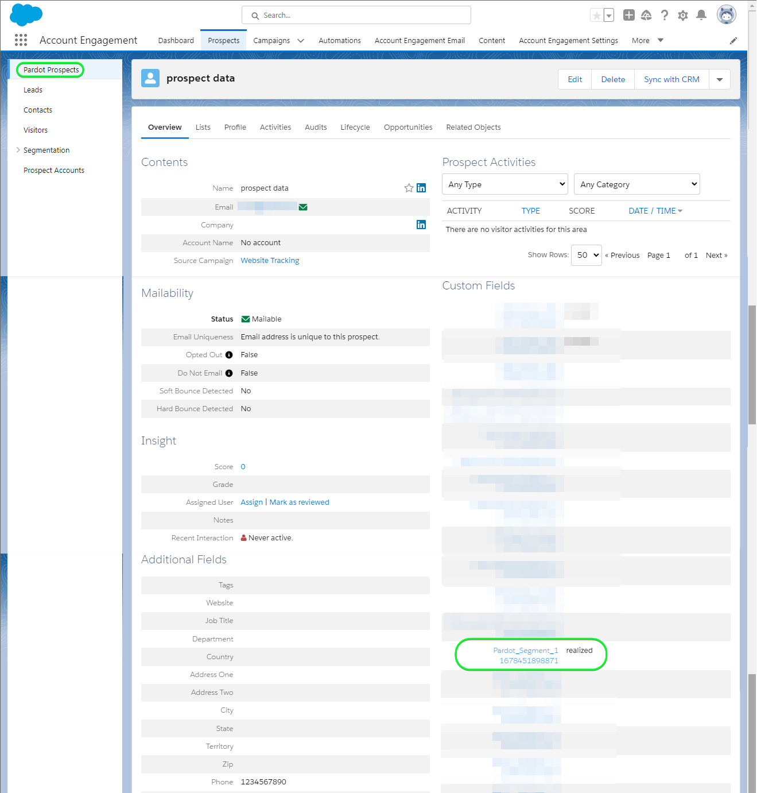

# Connexion [!DNL Salesforce Marketing Cloud Account Engagement]

Utilisez la variable [[!DNL Salesforce Marketing Cloud Account Engagement]](https://www.salesforce.com/products/marketing-cloud/marketing-automation/) *(anciennement connu sous le nom de [!DNL Pardot])* destination pour capturer, suivre, noter et évaluer des pistes. Vous pouvez également concevoir des suivis de piste pour toutes les étapes du pipeline pour les audiences de marché et les groupes de clients ciblés par le biais de campagnes gouttes d’emails et de la gestion des pistes grâce à la nutrition, la notation et la segmentation des campagnes.

Comparé à [!DNL Salesforce Marketing Cloud Engagement] qui sont plus orientées vers **B2C** marketing, [!DNL Marketing Cloud Account Engagement] est idéal pour **B2B** les cas d’utilisation impliquant plusieurs ministères et décideurs qui nécessitent des cycles de vente et de décision plus longs. En outre, vous maintenez une proximité et une intégration plus étroites avec votre CRM afin de prendre des décisions de vente et de marketing appropriées. *Remarque : Experience Platform dispose également de connexions pour [!DNL Salesforce Marketing Cloud Engagement], vous pouvez les vérifier sur la page [[!DNL Salesforce Marketing Cloud]](/help/destinations/catalog/email-marketing/salesforce-marketing-cloud.md) et [[!DNL (API) Salesforce Marketing Cloud]](/help/destinations/catalog/email-marketing/salesforce-marketing-cloud-exact-target.md) pages.*

Ceci [!DNL Adobe Experience Platform] [destination](/help/destinations/home.md) tire parti de [[!DNL Salesforce Account Engagement API > Prospect Upsert by Email]](https://developer.salesforce.com/docs/marketing/pardot/guide/prospect-v5.html#prospect-upsert-by-email) point de fin, à **ajouter ou mettre à jour vos pistes** après les avoir activés dans une nouvelle [!DNL Marketing Cloud Account Engagement] segment.

[!DNL Marketing Cloud Account Engagement] utilise OAuth 2 avec le protocole Code d’autorisation pour s’authentifier auprès du [!DNL Account Engagement] API. Les instructions vous permettant de vous authentifier sur votre instance [!DNL Marketing Cloud Account Engagement] sont plus loin dans la section [Authentifier à la destination](#authenticate).

## Cas d’utilisation {#use-cases}

Pour mieux comprendre quand et comment utiliser la destination [!DNL Marketing Cloud Account Engagement], consultez l’exemple de cas d’utilisation ci-dessous que les clientes et clients d’Adobe Experience Platform peuvent résoudre à l’aide de cette destination.

### Envoyer des emails aux contacts pour les campagnes marketing {#use-case-send-emails}

Le service marketing d’une plate-forme en ligne souhaite diffuser une campagne marketing par e-mail à une audience organisée de pistes B2B. L’équipe marketing de la plateforme peut ajouter de nouvelles pistes ou mettre à jour des informations de piste existantes via Adobe Experience Platform, créer des audiences à partir de leurs propres données hors ligne et envoyer ces audiences à [!DNL Marketing Cloud Account Engagement], qui peut ensuite être utilisé pour envoyer l’email de la campagne marketing.

## Conditions préalables {#prerequisites}

Reportez-vous aux sections ci-dessous pour connaître les conditions préalables à configurer dans Experience Platform et [!DNL Salesforce] et pour les informations que vous devez rassembler avant de travailler avec la variable [!DNL Marketing Cloud Account Engagement] destination.

### Conditions préalables dans Experience Platform {#prerequisites-in-experience-platform}

Avant d’activer des données dans la destination [!DNL Marketing Cloud Account Engagement], vous devez avoir un [schéma](/help/xdm/schema/composition.md), un [jeu de données](https://experienceleague.adobe.com/docs/platform-learn/tutorials/data-ingestion/create-datasets-and-ingest-data.html?lang=fr), ainsi que des [segments](https://experienceleague.adobe.com/docs/platform-learn/tutorials/segments/create-segments.html?lang=fr) créés dans [!DNL Experience Platform].

### Conditions préalables dans [!DNL Marketing Cloud Account Engagement] {#prerequisites-destination}

Notez les conditions préalables suivantes pour exporter des données de Platform vers votre [!DNL Marketing Cloud Account Engagement] compte :

#### Vous devez avoir un compte [!DNL Marketing Cloud Account Engagement]. {#prerequisites-account}

A [!DNL Marketing Cloud Account Engagement] avec un abonnement au [Engagement du compte Marketing Cloud](https://www.salesforce.com/products/marketing-cloud/marketing-automation/) est obligatoire pour continuer.

Votre [!DNL Salesforce] doit avoir la variable [!DNL Salesforce] `Account Engagement Administrator role`. Cette opération est requise pour [créer des champs de prospect personnalisés ;](https://help.salesforce.com/s/articleView?id=sf.pardot_fields_create_custom_field.htm&amp;type=5).

Enfin, votre compte doit également pouvoir accéder au [[!DNL Account Engagement Lightning App]](https://help.salesforce.com/s/articleView?id=sf.pardot_lightning_enable.htm&amp;type=5).

Contacter pour [[!DNL Salesforce] Assistance](https://www.salesforce.com/company/contact-us/?d=cta-glob-footer-10) ou [!DNL Salesforce] administrateur de compte si vous ne disposez pas d’un compte ou si le compte manque la variable [!DNL Marketing Cloud Account Engagement] ou le [!DNL Account Engagement Administrator role].

#### Collectez les informations d’identification de [!DNL Marketing Cloud Account Engagement]. {#gather-credentials}

Notez les éléments ci-dessous avant de vous authentifier à la variable [!DNL Marketing Cloud Account Engagement] destination.

| Informations d’identification | Description |
| --- | --- |
| `Username` | Votre [!DNL Marketing Cloud Account Engagement] nom d’utilisateur du compte. |
| `Password` | Votre [!DNL Marketing Cloud Account Engagement] mot de passe du compte. |
| `Account Engagement Business Unit ID` | Pour trouver l’identifiant de l’unité opérationnelle chargée de l’engagement du compte, utilisez Configuration dans [!DNL Salesforce]. Dans Configuration, saisissez *Configuration de l’unité opérationnelle* dans la zone Recherche rapide . Votre identifiant de l’unité opérationnelle chargée de l’engagement du compte commence par `0Uv` et comporte 18 caractères. Si vous ne pouvez pas accéder aux informations de configuration de l’unité opérationnelle, contactez votre [!DNL Salesforce] L’administrateur du compte vous fournit les `Account Engagement Business Unit ID`. Si vous avez besoin d’autres conseils, reportez-vous à la section [[!DNL Salesforce] Authentification](https://developer.salesforce.com/docs/marketing/pardot/guide/authentication) page guide. |

{style="table-layout:auto"}

### Mécanismes de sécurisation {#guardrails}

Reportez-vous à la section [!DNL Marketing Cloud Account Engagement] [limites de taux](https://developer.salesforce.com/docs/marketing/pardot/guide/overview.html#rate-limits) qui détaille les limites imposées par votre plan et s&#39;appliquerait également aux exécutions Experience Platform.

>[!IMPORTANT]
>
>Si votre [!DNL Salesforce] l’administrateur de compte a un accès limité aux plages d’adresses IP de confiance. Vous devez les contacter pour obtenir [IP Experience Platform](/help/destinations/catalog/streaming/ip-address-allow-list.md) placé sur la liste autorisée. Reportez-vous à la section [!DNL Salesforce] [Limitation de l’accès aux plages d’adresses IP approuvées pour une application connectée](https://help.salesforce.com/s/articleView?id=sf.connected_app_edit_ip_ranges.htm&amp;type=5) si vous avez besoin de conseils supplémentaires.

## Identités prises en charge {#supported-identities}

[!DNL Marketing Cloud Account Engagement] prend en charge l’activation des identités décrites dans le tableau ci-dessous. En savoir plus sur les [identités](/help/identity-service/namespaces.md).

| Identité cible | Description | Considérations |
|---|---|---|
| E-mail | Prospect Email Address | Obligatoire |

{style="table-layout:auto"}

## Type et fréquence d’exportation {#export-type-frequency}

Reportez-vous au tableau ci-dessous pour plus d’informations sur le type et la fréquence d’exportation des destinations.

| Élément | Type | Notes |
---------|----------|---------|
| Type d’exportation | **[!UICONTROL Basé sur les profils]** | <ul><li>Vous exportez tous les membres d’un segment, ainsi que les champs de schéma souhaités, *(par exemple : adresse e-mail, numéro de téléphone, nom)*, en fonction de votre mappage de champs.</li><li> Pour chaque audience sélectionnée dans Platform, la valeur [!DNL Salesforce Marketing Cloud Account Engagement] l’état du segment est mis à jour avec son état d’audience de Platform.</li></ul> |
| Fréquence des exportations | **[!UICONTROL Diffusion en continu]** | Les destinations de diffusion en continu sont des connexions basées sur l’API « toujours actives ». Dès qu&#39;un profil est mis à jour en Experience Platform en fonction de l&#39;évaluation de l&#39;audience, le connecteur envoie la mise à jour en aval vers la plateforme de destination. En savoir plus sur les [destinations de diffusion en continu](/help/destinations/destination-types.md#streaming-destinations). |

{style="table-layout:auto"}

## Se connecter à la destination {#connect}

>[!IMPORTANT]
>
>Pour vous connecter à la destination, vous devez disposer de l’[autorisation de contrôle d’accès](/help/access-control/home.md#permissions) **[!UICONTROL Gérer les destinations]**. Lisez la [présentation du contrôle d’accès](/help/access-control/ui/overview.md) ou contactez votre administrateur de produit pour obtenir les autorisations requises.

Pour vous connecter à cette destination, procédez comme décrit dans le [tutoriel sur la configuration des destinations](../../ui/connect-destination.md). Dans le workflow de configuration des destinations, renseignez les champs répertoriés dans les deux sections ci-dessous.

Within **[!UICONTROL Destinations]** > **[!UICONTROL Catalogue]**, recherchez [!DNL Salesforce Marketing Cloud Account Engagement]. Vous pouvez également la localiser sous le **[!UICONTROL Marketing par e-mail]** catégorie.

### S’authentifier auprès de la destination {#authenticate}

Pour vous authentifier auprès de la destination, sélectionnez **[!UICONTROL Se connecter à la destination]**. Vous accédez au [!DNL Salesforce] page de connexion. Saisissez votre [!DNL Marketing Cloud Account Engagement] informations d’identification du compte et sélectionnez [!DNL Log In].

Suivant, sélectionnez [!UICONTROL Autoriser] dans la fenêtre suivante pour accorder des autorisations au **Adobe Experience Platform** pour accéder à votre [!DNL Salesforce Marketing Cloud Account Engagement] compte . *Vous n’aurez besoin de le faire qu’une seule fois.*.

Si les détails fournis sont valides, l’interface utilisateur affiche un message : *Vous êtes correctement connecté au compte d’engagement du compte de Marketing Cloud Salesforce* et un **[!UICONTROL Connecté]** avec une coche verte, vous pouvez ensuite passer à l’étape suivante.

### Renseigner les détails de la destination {#destination-details}

Pour configurer les détails de la destination, renseignez les champs obligatoires et facultatifs ci-dessous. Un astérisque situé en regard d’un champ de l’interface utilisateur indique que le champ est obligatoire. Reportez-vous à la section [ [!DNL Marketing Cloud Account Engagement] Collecter des informations d’identification ](#gather-credentials) pour obtenir des conseils.

| Champ | Description |
| --- | --- |
| **[!UICONTROL Nom]** | Un nom par lequel vous reconnaîtrez cette destination à l’avenir. |
| **[!UICONTROL Description]** | Description qui vous aidera à identifier cette destination ultérieurement. |
| **[!UICONTROL Identifiant de l’unité opérationnelle d’engagement de compte]** | Votre [!DNL Salesforce] `Account Engagement Business Unit ID`. |

{style="table-layout:auto"}

### Activer les alertes {#enable-alerts}

Vous pouvez activer les alertes pour recevoir des notifications sur le statut de votre flux de données vers votre destination. Sélectionnez une alerte dans la liste et abonnez-vous à des notifications concernant le statut de votre flux de données. Pour plus d’informations sur les alertes, consultez le guide sur l’[abonnement aux alertes des destinations dans l’interface utilisateur](../../ui/alerts.md).

Lorsque vous avez terminé de renseigner les détails sur votre connexion de destination, sélectionnez **[!UICONTROL Suivant]**.

## Activer les audiences vers cette destination {#activate}

>[!IMPORTANT]
>
>Pour activer les données, vous avez besoin des [autorisations de contrôle d’accès](/help/access-control/home.md#permissions) pour les fonctions **[!UICONTROL Gérer les destinations]**, **[!UICONTROL Activer les destinations]**, **[!UICONTROL Afficher les profils]**, et **[!UICONTROL Afficher les segments]**. Lisez la [présentation du contrôle d’accès](/help/access-control/ui/overview.md) ou contactez votre administrateur de produit pour obtenir les autorisations requises.

Lecture [Activation des profils et des audiences vers les destinations d’exportation d’audiences par flux](/help/destinations/ui/activate-segment-streaming-destinations.md) pour obtenir des instructions sur l’activation des audiences vers cette destination.

### Considérations sur le mappage et exemple {#mapping-considerations-example}

Pour envoyer correctement vos données d’audience d’Adobe Experience Platform vers la destination [!DNL Marketing Cloud Account Engagement], vous devez passer par l’étape de mappage des champs. Le mappage consiste à créer un lien entre vos champs de schéma de modèle de données d’expérience (XDM) dans votre compte Platform et leurs équivalents issus de la destination cible.

Pour mapper correctement vos champs XDM à [!DNL Marketing Cloud Account Engagement] pour les champs de destination, procédez comme suit.

1. Dans l’étape **[!UICONTROL Mappage]**, sélectionnez **[!UICONTROL Ajouter un nouveau mappage]**. Une nouvelle ligne de mappage s’affichera à l’écran.
1. Dans le **[!UICONTROL Sélectionner le champ source]** , choisissez la **[!UICONTROL Sélectionner des attributs]** et sélectionnez l’attribut XDM ou choisissez l’option **[!UICONTROL Sélectionner un espace de noms d’identité]** et sélectionnez une identité.
1. Dans le **[!UICONTROL Sélectionner le champ cible]** , choisissez la **[!UICONTROL Sélectionner un espace de noms d’identité]** et sélectionnez une identité ou choisissez **[!UICONTROL Sélectionner des attributs personnalisés]** et indiquez dans la liste de [[!DNL Prospect API fields]](https://developer.salesforce.com/docs/marketing/pardot/guide/prospect-v5.html#fields) du schéma disponible.

   * Répétez ces étapes pour ajouter des mappages entre votre schéma de profil XDM et [!DNL Marketing Cloud Account Engagement]: | Champ source | Champ cible | Obligatoire | | — | — | — | |`IdentityMap: Email`|`Identity: email`| Oui | |`xdm: MailingAddress.city`|`xdm: city`| | |`xdm: person.name.firstName`|`Attribute: firstName`| |

   * Un exemple avec les mappages ci-dessus est illustré ci-dessous :
     

Une fois les mappages fournis pour la connexion à la destination, sélectionnez **[!UICONTROL Suivant]**.

## Valider l’exportation des données {#exported-data}

Pour vérifier que vous avez correctement configuré la destination, procédez comme suit :

1. Accédez à l’une des audiences que vous avez sélectionnées. Sélectionnez la **[!DNL Activation data]** . Le **[!UICONTROL ID de mappage]** affiche le nom du champ personnalisé généré dans la variable [!DNL Marketing Cloud Account Engagement Prospects] page.
   

1. Connectez-vous au [[!DNL Salesforce]](https://login.salesforce.com/) site web. Accédez ensuite à la **[!DNL Account Engagement]** > **[!DNL Prospects]** > **[!DNL Pardot Prospects]** et vérifier si les prospects de l’audience ont été ajoutés/mis à jour. Vous pouvez également accéder à [[!DNL Salesforce Pardot]](https://pi.pardot.com/) et accédez au **[!DNL Prospects]** page.
   

1. Pour vérifier si les prospects ont été mis à jour, sélectionnez un prospect et vérifiez si le champ de prospect personnalisé a été mis à jour avec le statut de l&#39;audience Experience Platform.
   

## Utilisation et gouvernance des données {#data-usage-governance}

Lors de la gestion de vos données, toutes les destinations [!DNL Adobe Experience Platform] se conforment aux politiques d’utilisation des données. Pour obtenir des informations détaillées sur la manière dont [!DNL Adobe Experience Platform] applique la gouvernance des données, lisez la [présentation de la gouvernance des données](/help/data-governance/home.md).

## Ressources supplémentaires {#additional-resources}

* [!DNL Marketing Cloud Account Engagement] [Documentation des API](https://developer.salesforce.com/docs/marketing/pardot/guide/overview.html).
