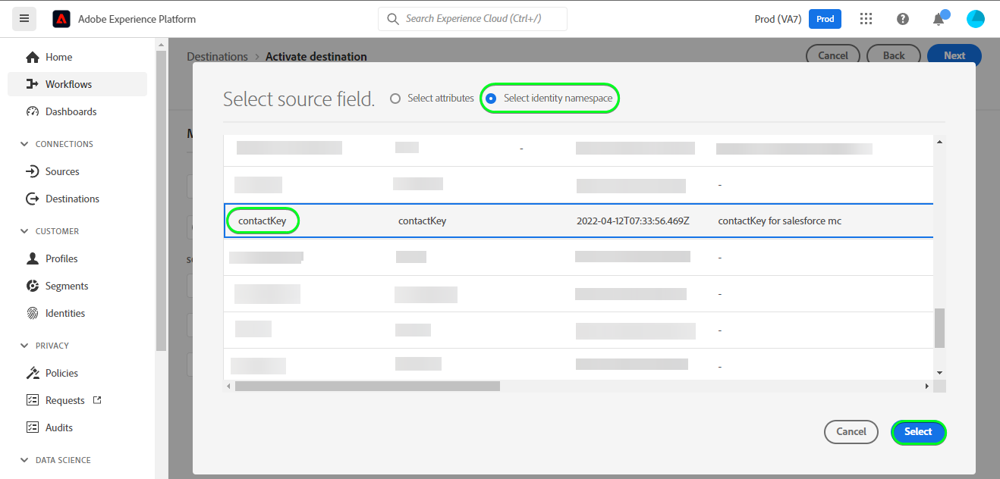

# Connexion [!DNL (API) Salesforce Marketing Cloud]

## Présentation {#overview}

[[!DNL Salesforce Marketing Cloud]](https://www.salesforce.com/products/marketing-cloud/overview/) (anciennement connu sous le nom de [!DNL ExactTarget]) est une suite de marketing numérique qui vous permet de créer et de personnaliser des parcours pour que les visiteurs et les clients puissent personnaliser leur expérience.

>[!IMPORTANT]
>
>Notez la différence entre cette connexion et l’autre [[!DNL Salesforce Marketing Cloud] connection](/help/destinations/catalog/email-marketing/salesforce-marketing-cloud.md) qui se trouve dans la section Catalogue des emails . L’autre connexion au Marketing Cloud Salesforce vous permet d’exporter des fichiers vers un emplacement de stockage spécifié, alors qu’il s’agit d’une connexion en continu basée sur l’API.

Ceci [!DNL Adobe Experience Platform] [destination](/help/destinations/home.md) tire parti de [!DNL Salesforce Marketing Cloud] [mettre à jour les contacts](https://developer.salesforce.com/docs/marketing/marketing-cloud/guide/updateContacts.html) API qui vous permet d’ajouter des contacts/de mettre à jour les données de contact pour vos besoins professionnels après les avoir activés dans une nouvelle [!DNL Salesforce Marketing Cloud] segment.

[!DNL Salesforce Marketing Cloud] utilise OAuth 2 avec les informations d’identification du client comme mécanisme d’authentification pour communiquer avec le [!DNL Salesforce Marketing Cloud] API. Instructions pour vous authentifier à votre [!DNL Salesforce Marketing Cloud] sont plus loin, dans la section [Authentification à la destination](#authenticate) .

## Cas d&#39;utilisation {#use-cases}

Pour vous aider à mieux comprendre comment et à quel moment utiliser la variable [!DNL Salesforce Marketing Cloud] destination, voici un exemple de cas d’utilisation que les clients Adobe Experience Platform peuvent résoudre en utilisant cette destination.

### Envoyer des emails aux contacts pour les campagnes marketing {#use-case-send-emails}

Le service des ventes d’une plateforme de location de maisons souhaite diffuser un email marketing à un public client ciblé. L’équipe marketing de la plateforme peut ajouter de nouveaux contacts/mettre à jour des contacts existants *(et leurs adresses électroniques)* via Adobe Experience Platform, créez des segments à partir de leurs propres données hors ligne et envoyez ces segments à [!DNL Salesforce Marketing Cloud], qui peut ensuite être utilisé pour envoyer l’email de la campagne marketing.

## Conditions préalables {#prerequisites}

### Conditions préalables dans Experience Platform {#prerequisites-in-experience-platform}

Avant d’activer des données dans la variable [!DNL Salesforce Marketing Cloud] destination, vous devez avoir une [schema](/help/xdm/schema/composition.md), un [dataset](https://experienceleague.adobe.com/docs/platform-learn/tutorials/data-ingestion/create-datasets-and-ingest-data.html?lang=en), et [segments](https://experienceleague.adobe.com/docs/platform-learn/tutorials/segments/create-segments.html?lang=en) créé dans [!DNL Experience Platform].

### Conditions préalables dans [!DNL Salesforce Marketing Cloud] {#prerequisites-destination}

Notez les conditions préalables suivantes pour exporter des données de Platform vers votre [!DNL Salesforce Marketing Cloud] compte :

#### Vous devez avoir une [!DNL Salesforce Marketing Cloud] account {#prerequisites-account}

Contactez votre [!DNL Salesforce Account Executive] pour vous abonner au [!DNL Salesforce Marketing Cloud Account Engagement] produit si vous ne l’avez pas déjà.

#### Créer un champ personnalisé dans [!DNL Salesforce Marketing Cloud] {#prerequisites-custom-field}

Vous devez créer un attribut personnalisé de type `Text Area Long`, que l’Experience Platform utilisera pour mettre à jour l’état du segment dans [!DNL Salesforce Marketing Cloud]. Dans le workflow d’ activation des segments vers la destination, dans la variable **[Planification du segment](#schedule-segment-export-example)** , vous utiliserez l’attribut personnalisé comme **[!UICONTROL ID de mappage]** pour chaque segment que vous activez.

Reportez-vous à la section [!DNL Salesforce Marketing Cloud] documentation à [créer des champs personnalisés](https://help.salesforce.com/s/articleView?id=mc_cab_create_an_attribute.htm&amp;type=5&amp;language=en_US) si vous avez besoin de conseils supplémentaires.

>[!IMPORTANT]
>
> Veillez à créer l’attribut personnalisé sous le `Email Demographics` attribute-set dans votre [!DNL Salesforce Marketing Cloud] compte .

Reportez-vous à la documentation Adobe Experience Platform pour [Groupe de champs Détails de l’appartenance à un segment](/help/xdm/field-groups/profile/segmentation.md) si vous avez besoin d’instructions sur les états de segment.

#### Collecte des informations d’identification Salesforce {#gather-credentials}

Notez les éléments ci-dessous avant de vous authentifier à la variable [!DNL Salesforce Marketing Cloud] destination.

| Informations d’identification | Description | Exemple |
| --- | --- | --- |
| <ul><li>[!DNL Salesforce Marketing Cloud] préfixe</li></ul> | Voir [[!DNL Salesforce Marketing Cloud domain prefix]](https://developer.salesforce.com/docs/marketing/marketing-cloud/guide/your-subdomain-tenant-specific-endpoints.html) pour plus d’informations. | <ul><li>Si votre domaine est tel que ci-dessous, vous avez besoin de la valeur mise en surbrillance.  <i>`mcq4jrssqdlyc4lph19nnqgzzs84`.login.accuracy.target.com</i></li></ul> |
| <ul><li>Identifiant client</li><li>Secret client</li></ul> | Reportez-vous à la section [!DNL Salesforce Marketing Cloud] [documentation](https://developer.salesforce.com/docs/marketing/marketing-cloud/guide/access-token-s2s.html) si vous avez besoin de conseils supplémentaires. | <ul><li>r23kxxxxxxxxxx0z05xxxxxx</li><li>ipxxxxxxxxxxT4xxxxxxxxxx</li></ul> |

{style=&quot;table-layout:auto&quot;}

## Limites dans [!DNL Salesforce Marketing Cloud] {#limits}

* Salesforce impose certains [limites de taux](https://developer.salesforce.com/docs/marketing/marketing-cloud/guide/rate-limiting.html).
   * Reportez-vous à la section [!DNL Salesforce Marketing Cloud] [documentation](https://developer.salesforce.com/docs/marketing/marketing-cloud/guide/rate-limiting-errors.html) pour résoudre toutes les limites probables que vous pourriez rencontrer et réduire les erreurs lors de l’exécution.
   * Reportez-vous à la section [[!DNL Salesforce Marketing Cloud] Prix de l&#39;engagement](https://www.salesforce.com/editions-pricing/marketing-cloud/email/) page à *Téléchargement du graphique de comparaison de l’édition complète* en pdf qui détaille les limites imposées par votre plan.
   * Le [Présentation des API](https://developer.salesforce.com/docs/marketing/marketing-cloud/guide/apis-overview.html) détails de la page des limites supplémentaires.
   * Voir [here](https://salesforce.stackexchange.com/questions/205898/marketing-cloud-api-limits) pour une page qui rassemble ces détails.
* Le nombre de *champs personnalisés autorisés par objet* varie en fonction de votre édition Salesforce.
   * Reportez-vous à la section [!DNL Salesforce] [documentation](https://help.salesforce.com/s/articleView?id=sf.custom_field_allocations.htm&amp;type=5) pour plus d’informations.
   * Si vous avez atteint la limite définie pour *champs personnalisés autorisés par objet* dans [!DNL Salesforce Marketing Cloud] vous devrez
      * Supprimer les anciens champs personnalisés avant d’ajouter de nouveaux champs personnalisés dans [!DNL Salesforce Marketing Cloud].
      * Mettez à jour ou supprimez toutes les destinations dans Platform qui utilisent ces anciens noms de champ personnalisés comme valeur fournie pour **[!UICONTROL ID de mappage]** pendant la [planification des segments](#schedule-segment-export-example) étape .

## Identités prises en charge {#supported-identities}

[!DNL Salesforce Marketing Cloud] prend en charge l’activation des identités décrites dans le tableau ci-dessous. En savoir plus sur [identités](/help/identity-service/namespaces.md).

| Identité cible | Description | Considérations |
|---|---|---|
| contactKey | [!DNL Salesforce Marketing Cloud] Clé de contact. Reportez-vous à la section [!DNL Salesforce Marketing Cloud] [documentation](https://help.salesforce.com/s/articleView?id=sf.mc_cab_contact_builder_best_practices.htm&amp;type=5) si vous avez besoin de conseils supplémentaires. | Obligatoire |

## Type et fréquence d&#39;export {#export-type-frequency}

Reportez-vous au tableau ci-dessous pour plus d’informations sur le type et la fréquence d’exportation des destinations.

| Élément | Type | Notes |
---------|----------|---------|
| Type d’exportation | **[!UICONTROL Basé sur les profils]** | <ul><li>Vous exportez tous les membres d’un segment, ainsi que les champs de schéma souhaités. *(par exemple : adresse email, numéro de téléphone, nom)*, en fonction de votre mappage de champs.</li><li> Chaque état de segment dans [!DNL Salesforce Marketing Cloud] est mis à jour avec l’état du segment correspondant de Platform, en fonction de la variable **[!UICONTROL ID de mappage]** valeur fournie pendant la [planification des segments](#schedule-segment-export-example) étape .</li></ul> |
| Fréquence des exports | **[!UICONTROL Diffusion en continu]** | Les destinations de diffusion en continu sont &quot;toujours sur&quot; des connexions basées sur l’API. Dès qu’un profil est mis à jour dans Experience Platform en fonction de l’évaluation des segments, le connecteur envoie la mise à jour en aval vers la plateforme de destination. En savoir plus sur [destinations de diffusion en continu](/help/destinations/destination-types.md#streaming-destinations). |

{style=&quot;table-layout:auto&quot;}

## Se connecter à la destination {#connect}

>[!IMPORTANT]
>
>Pour vous connecter à la destination, vous avez besoin de l’événement **[!UICONTROL Gestion des destinations]** [autorisation de contrôle d’accès](/help/access-control/home.md#permissions). Lisez le [présentation du contrôle d’accès](/help/access-control/ui/overview.md) ou contactez votre administrateur de produit pour obtenir les autorisations requises.

Pour vous connecter à cette destination, procédez comme décrit dans le [tutoriel sur la configuration des destinations](../../ui/connect-destination.md). Dans le workflow de configuration des destinations, renseignez les champs répertoriés dans les deux sections ci-dessous.

Within **[!UICONTROL Destinations]** > **[!UICONTROL Catalogue]**, recherchez [!DNL (API) Salesforce Marketing Cloud]. Vous pouvez également la localiser sous le **[!UICONTROL Marketing par e-mail]** catégorie.

### Authentification à la destination {#authenticate}

Pour vous authentifier à la destination, renseignez les champs requis et sélectionnez **[!UICONTROL Se connecter à la destination]**.

* **[!UICONTROL Subdomain]**: Votre [!DNL Salesforce Marketing Cloud] préfixe de domaine. Par exemple, si votre domaine est *`mcq4jrssqdlyc4lph19nnqgzzs84`.login.accuracy.target.com*, vous avez besoin de la valeur mise en surbrillance.
* **[!UICONTROL ID client]**: Votre [!DNL Salesforce Marketing Cloud] ID client.
* **[!UICONTROL Secret du client]**: Votre [!DNL Salesforce Marketing Cloud] Secret du client.

Si les détails fournis sont valides, l’interface utilisateur affiche une **[!UICONTROL Connecté]** avec une coche verte, vous pouvez ensuite passer à l’étape suivante.

### Renseignement des détails de destination {#destination-details}

Pour configurer les détails de la destination, renseignez les champs obligatoires et facultatifs ci-dessous. Un astérisque situé en regard d’un champ de l’interface utilisateur indique que le champ est obligatoire.

* **[!UICONTROL Nom]**: Un nom par lequel vous reconnaîtrez cette destination à l’avenir.
* **[!UICONTROL Description]**: Description qui vous aidera à identifier cette destination ultérieurement.

### Activer les alertes {#enable-alerts}

Vous pouvez activer les alertes pour recevoir des notifications sur l’état du flux de données vers votre destination. Sélectionnez une alerte dans la liste et abonnez-vous à des notifications concernant le statut de votre flux de données. Pour plus d’informations sur les alertes, consultez le guide sur les [abonnement aux alertes de destinations à l’aide de l’interface utilisateur](../../ui/alerts.md).

Lorsque vous avez terminé de fournir des détails sur votre connexion de destination, sélectionnez **[!UICONTROL Suivant]**.

## Activer des segments vers cette destination {#activate}

>[!IMPORTANT]
>
>Pour activer les données, vous avez besoin de l’événement **[!UICONTROL Gestion des destinations]**, **[!UICONTROL Activation des destinations]**, **[!UICONTROL Afficher les profils]**, et **[!UICONTROL Affichage de segments]** [autorisations de contrôle d’accès](/help/access-control/home.md#permissions). Lisez le [présentation du contrôle d’accès](/help/access-control/ui/overview.md) ou contactez votre administrateur de produit pour obtenir les autorisations requises.

Lecture [Activation des profils et des segments vers des destinations d’exportation de segments en continu](/help/destinations/ui/activate-segment-streaming-destinations.md) pour obtenir des instructions sur l’activation des segments d’audience vers cette destination.

### Considérations sur le mappage et exemple {#mapping-considerations-example}

Pour envoyer correctement vos données d’audience de Adobe Experience Platform vers le [!DNL Salesforce Marketing Cloud] destination, vous devez passer par l’étape de mappage des champs. Le mappage consiste à créer un lien entre vos champs de schéma de modèle de données d’expérience (XDM) dans votre compte Platform et leurs équivalents de la destination cible. Pour mapper correctement vos champs XDM à [!DNL Salesforce Marketing Cloud] pour les champs de destination, procédez comme suit.

>[!IMPORTANT]
>
>Bien que vos noms d’attribut soient conformes à [!DNL Salesforce Marketing Cloud] , les mappages des deux `contactKey` et `personalEmail.address` sont obligatoires.

1. Dans le **[!UICONTROL Mappage]** étape, sélectionnez **[!UICONTROL Ajouter un nouveau mappage]**. Une nouvelle ligne de mappage s’affiche à l’écran.
   

1. Dans le **[!UICONTROL Sélectionner le champ source]** , choisissez la **[!UICONTROL Sélectionner des attributs]** catégorie et sélectionnez `contactKey`.
   

1. Dans le **[!UICONTROL Sélectionner le champ cible]** sélectionnez le type de champ cible vers lequel vous souhaitez mapper votre champ source.
   * **[!UICONTROL Sélectionner un espace de noms d’identité]**: sélectionnez cette option pour mapper votre champ source à un espace de noms d’identité de la liste.
      

   * Ajoutez le mappage suivant entre votre schéma de profil XDM et votre [!DNL Salesforce Marketing Cloud] instance : |Schéma de profil XDM|[!DNL Salesforce Marketing Cloud] Instance| Obligatoire| |—|—|—| |`contactKey`|`salesforceContactKey`| Oui |

   * **[!UICONTROL Sélectionner des attributs personnalisés]**: sélectionnez cette option pour mapper votre champ source à un attribut personnalisé que vous définissez dans la variable **[!UICONTROL Nom de l’attribut]** champ . Voir [!DNL Salesforce Marketing Cloud] [documentation](https://developer.salesforce.com/docs/marketing/marketing-cloud/guide/updateContacts.html) pour obtenir une liste des attributs pris en charge. Notez également que la destination utilise la variable [API REST des définitions d’ensemble d’attributs de recherche Salesforce](https://developer.salesforce.com/docs/marketing/marketing-cloud/guide/retrieveAttributeSetDefinitions.html) pour récupérer les attributs définis dans Salesforce pour vos contacts et spécifiques à votre compte.
      

   * Par exemple, en fonction des valeurs que vous souhaitez mettre à jour, ajoutez le mappage suivant entre votre schéma de profil XDM et votre [!DNL Salesforce Marketing Cloud] instance : |Schéma de profil XDM|[!DNL Salesforce Marketing Cloud] Instance| |—|—| |`person.name.firstName`|`Email Demographics.First Name`| |`personalEmail.address`|`Email Addresses.Email Address`|

   * Un exemple d’utilisation de ces mappages est illustré ci-dessous :
      

### Planification de l’exportation de segments et exemple {#schedule-segment-export-example}

Lors de l’exécution de la variable [Planification de l’exportation de segments](/help/destinations/ui/activate-segment-streaming-destinations.md#scheduling) , vous devez mapper manuellement les segments Platform à la variable [attribut personnalisé](#prerequisites-custom-field) dans Salesforce.

Pour ce faire, sélectionnez chaque segment, puis saisissez l’attribut personnalisé correspondant à partir de Salesforce dans la variable **[!UICONTROL ID de mappage]** champ .

>[!IMPORTANT]
>
>La valeur utilisée pour l’ID de mappage doit correspondre exactement au nom de l’attribut personnalisé créé dans Salesforce sous le jeu d’attributs &quot;Démographie des emails&quot;.

Voici un exemple :

## Validation de l’exportation des données {#exported-data}

Pour vérifier que vous avez correctement configuré la destination, procédez comme suit :

1. Sélectionner **[!UICONTROL Destinations]** > **[!UICONTROL Parcourir]** pour accéder à la liste des destinations.
   

1. Sélectionnez la destination et vérifiez que l’état est **[!UICONTROL enabled]**.
   

1. Basculez vers le **[!DNL Activation data]** , puis sélectionnez un nom de segment.
   

1. Surveillez le résumé du segment et assurez-vous que le nombre de profils correspond au nombre créé dans le segment.
   

1. Connectez-vous au [[!DNL Salesforce Marketing Cloud]](https://mc.exacttarget.com/) site web. Accédez ensuite à la **[!DNL Audience Builder]** > **[!DNL Contact Builder]** > **[!DNL All contacts]** > **[!DNL Email]** et vérifiez si les profils du segment ont été ajoutés.
   

1. Pour vérifier si des profils ont été mis à jour, accédez au **[!UICONTROL Email]** et vérifiez si les valeurs d’attribut du profil du segment ont été mises à jour. En cas de réussite, vous pouvez voir que chaque état de segment dans [!DNL Salesforce Marketing Cloud] a été mis à jour avec l’état du segment correspondant de Platform, en fonction de la variable **[!UICONTROL ID de mappage]** valeur fournie dans la variable [planification des segments](#schedule-segment-export-example) étape .
   

## Utilisation et gouvernance des données {#data-usage-governance}

Lors de la gestion de vos données, toutes les destinations [!DNL Adobe Experience Platform] se conforment aux stratégies d’utilisation des données. Pour obtenir des informations détaillées sur la manière dont [!DNL Adobe Experience Platform] applique la gouvernance des données, voir [Présentation de la gouvernance des données](/help/data-governance/home.md).

## Erreurs et résolution des problèmes {#errors-and-troubleshooting}

### Erreurs inconnues rencontrées lors de la publication d’événements vers le Marketing Cloud Salesforce {#unknown-errors}

Lors de la vérification d’une exécution de flux de données, vous pouvez rencontrer le message d’erreur suivant : `Unknown errors encountered while pushing events to the destination. Please contact the administrator and try again.`

Pour corriger cette erreur, vérifiez que la variable **[!UICONTROL ID de mappage]** que vous avez fourni dans [!DNL Salesforce Marketing Cloud] pour votre segment Platform valide et existe dans [!DNL Salesforce Marketing Cloud].

## Ressources supplémentaires {#additional-resources}

* [[!DNL Salesforce Marketing Cloud] API](https://developer.salesforce.com/docs/marketing/marketing-cloud/guide/apis-overview.html)
