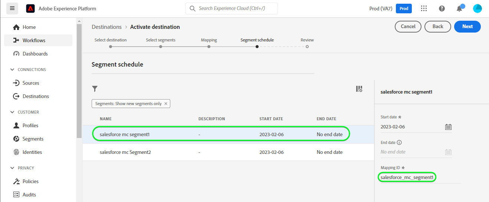

# Connexion [!DNL (API) Salesforce Marketing Cloud]

## Présentation {#overview}

[[!DNL (API) Salesforce Marketing Cloud]](https://www.salesforce.com/products/marketing-cloud/engagement/) (anciennement connu sous le nom [!DNL ExactTarget]) est une suite de marketing numérique qui vous permet de créer et de personnaliser des parcours pour que les visiteurs et les clients puissent personnaliser leur expérience.

>[!IMPORTANT]
>
> Notez la différence entre cette connexion et l’autre [[!DNL Salesforce Marketing Cloud] connection](/help/destinations/catalog/email-marketing/salesforce-marketing-cloud.md) qui se trouve dans la section Catalogue des emails . L’autre connexion au Marketing Cloud Salesforce vous permet d’exporter des fichiers vers un emplacement de stockage spécifié, alors qu’il s’agit d’une connexion en continu basée sur l’API.

Comparé à [!DNL Salesforce Marketing Cloud Account Engagement] qui sont plus orientées vers **B2B** marketing, la variable [!DNL (API) Salesforce Marketing Cloud] destination est idéale pour **B2C** cas d’utilisation avec des cycles de décision transactionnels plus courts. Vous pouvez consolider des jeux de données plus volumineux représentant le comportement de votre audience cible afin d’ajuster et d’améliorer les campagnes marketing en hiérarchisant et en segmentant les contacts, en particulier à partir de jeux de données externes. [!DNL Salesforce]. *Remarque : Experience Platform dispose également d’une connexion pour la variable [[!DNL Salesforce Marketing Cloud Account Engagement]](/help/destinations/catalog/email-marketing/salesforce-marketing-cloud-account-engagement.md).*

Ceci [!DNL Adobe Experience Platform] [destination](/help/destinations/home.md) utilise la variable [!DNL Salesforce Marketing Cloud] [mettre à jour les contacts](https://developer.salesforce.com/docs/marketing/marketing-cloud/guide/updateContacts.html) API qui vous permet de **ajouter des contacts et mettre à jour les données de contact ;** pour répondre aux besoins de votre entreprise après les avoir activés dans une nouvelle [!DNL Salesforce Marketing Cloud] segment.

[!DNL Salesforce Marketing Cloud] utilise OAuth 2 avec les informations d’identification du client comme mécanisme d’authentification pour communiquer avec le [!DNL Salesforce Marketing Cloud] API. Les instructions vous permettant de vous authentifier sur votre instance [!DNL Salesforce Marketing Cloud] sont plus loin dans la section [Authentifier à la destination](#authenticate).

## Cas d’utilisation {#use-cases}

Pour mieux comprendre quand et comment utiliser la destination [!DNL (API) Salesforce Marketing Cloud], consultez l’exemple de cas d’utilisation ci-dessous que les clientes et clients d’Adobe Experience Platform peuvent résoudre à l’aide de cette destination.

### Envoyer des emails aux contacts pour les campagnes marketing {#use-case-send-emails}

Le service des ventes d’une plateforme de location de maisons souhaite diffuser un email marketing à un public client ciblé. L’équipe marketing de la plateforme peut ajouter de nouveaux contacts/mettre à jour des contacts existants *(et leurs adresses électroniques)* via Adobe Experience Platform, créez des audiences à partir de leurs propres données hors ligne et envoyez ces audiences à [!DNL Salesforce Marketing Cloud], qui peut ensuite être utilisé pour envoyer l’email de la campagne marketing.

## Conditions préalables {#prerequisites}

### Conditions préalables dans Experience Platform {#prerequisites-in-experience-platform}

Avant d’activer des données dans la destination [!DNL (API) Salesforce Marketing Cloud], vous devez avoir un [schéma](/help/xdm/schema/composition.md), un [jeu de données](https://experienceleague.adobe.com/docs/platform-learn/tutorials/data-ingestion/create-datasets-and-ingest-data.html), ainsi que des [segments](https://experienceleague.adobe.com/docs/platform-learn/tutorials/segments/create-segments.html) créés dans [!DNL Experience Platform].

### Conditions préalables dans [!DNL (API) Salesforce Marketing Cloud] {#prerequisites-destination}

Notez les conditions préalables suivantes pour exporter des données de Platform vers votre [!DNL Salesforce Marketing Cloud] compte :

#### Vous devez avoir un compte [!DNL Salesforce Marketing Cloud]. {#prerequisites-account}

A [!DNL Salesforce Marketing Cloud] avec un abonnement au [[!DNL Marketing Cloud Engagement]](https://www.salesforce.com/products/marketing-cloud/engagement/) est obligatoire pour continuer.

Contacter pour [[!DNL Salesforce] Assistance](https://www.salesforce.com/company/contact-us/?d=cta-glob-footer-10) si vous n’avez pas de [!DNL Salesforce Marketing Cloud] ou votre compte ne contient pas le [!DNL Marketing Cloud Engagement] abonnement au produit.

#### Création d’attributs dans [!DNL Salesforce Marketing Cloud] {#prerequisites-attribute}

Lors de l’activation d’audiences dans la variable [!DNL (API) Salesforce Marketing Cloud] destination, vous devez saisir une valeur dans la variable **[!UICONTROL ID de mappage]** pour chaque audience activée, dans la variable **[Planification de l’audience](#schedule-segment-export-example)** étape .

[!DNL Salesforce] nécessite cette valeur pour lire et interpréter correctement les audiences provenant d’un Experience Platform et pour mettre à jour leur état d’audience dans [!DNL Salesforce Marketing Cloud]. Reportez-vous à la documentation Experience Platform pour [Groupe de champs Détails de l’appartenance à une audience](/help/xdm/field-groups/profile/segmentation.md) si vous avez besoin de conseils sur les états d’audience.

Pour chaque audience que vous activez de Platform à [!DNL Salesforce], vous devez avoir un attribut de type `Text` lié à la variable [!DNL Email Demographics] extension de données dans [!DNL Salesforce Marketing Cloud]. Utilisez la variable [!DNL Salesforce Marketing Cloud] [!DNL Contact Builder] pour créer des attributs. Voir [!DNL Salesforce Marketing Cloud] documentation à [créer des attributs](https://help.salesforce.com/s/articleView?id=mc_cab_create_an_attribute.htm&amp;type=5&amp;language=en_US) si vous avez besoin de conseils sur la création d’attributs.

Les noms des champs d’attribut sont utilisés pour la variable [!DNL (API) Salesforce Marketing Cloud] champ cible pendant la **[!UICONTROL Mappage]** étape . Vous pouvez définir le caractère du champ avec un maximum de 4 000 caractères, en fonction des besoins de votre entreprise. Voir [!DNL Salesforce Marketing Cloud] [Types de données des extensions de données](https://help.salesforce.com/s/articleView?id=sf.mc_es_data_extension_data_types.htm&amp;type=5) page de documentation pour plus d’informations sur les types d’attributs.

Exemple de l’écran du concepteur de données dans [!DNL Salesforce Marketing Cloud], dans lequel vous allez ajouter l’attribut est illustré ci-dessous :

Une vue [!DNL Salesforce Marketing Cloud] [!DNL Email Data] groupe d’attributs avec des attributs correspondant au statut de l’audience dans la variable [!DNL Email Demographics] l’extension de données est illustrée ci-dessous :

La variable [!DNL (API) Salesforce Marketing Cloud] destination utilise la variable [!DNL Salesforce Marketing Cloud] [!DNL Search Attribute-Set Definitions REST] [API](https://developer.salesforce.com/docs/marketing/marketing-cloud/guide/retrieveAttributeSetDefinitions.html) pour récupérer dynamiquement les extensions de données et leurs attributs liés définis dans [!DNL Salesforce Marketing Cloud].

Elles s’affichent dans la **[!UICONTROL Champ cible]** de la fenêtre de sélection lors de la configuration de [mapping](#mapping-considerations-example) dans le workflow de [activation des audiences vers la destination](#activate).

>[!IMPORTANT]
>
> Within [!DNL Salesforce Marketing Cloud], vous devez créer des attributs avec un **[!UICONTROL NOM DU CHAMP]** qui correspond exactement à la valeur spécifiée dans **[!UICONTROL ID de mappage]** pour chaque segment Platform activé. Par exemple, la capture d’écran ci-dessous montre un attribut nommé `salesforce_mc_segment_1`. Lorsque vous activez une audience sur cette destination, ajoutez `salesforce_mc_segment_1` as **[!UICONTROL ID de mappage]** pour renseigner les audiences d’audience d’Experience Platform dans cet attribut.

Exemple de création d’attributs dans [!DNL Salesforce Marketing Cloud], est illustré ci-dessous :

>[!TIP]
>
> * Lors de la création de l’attribut, n’incluez pas d’espace dans le nom du champ. Utilisez plutôt le trait de soulignement. `(_)` comme séparateur.
> * Pour distinguer les attributs utilisés pour les audiences Platform des autres attributs dans [!DNL Salesforce Marketing Cloud], vous pouvez inclure un préfixe ou un suffixe reconnaissable pour les attributs utilisés pour les segments d’Adobe. Par exemple, au lieu de `test_segment`, utilisez `Adobe_test_segment` ou `test_segment_Adobe`.
> * Si d’autres attributs sont déjà créés dans [!DNL Salesforce Marketing Cloud], vous pouvez utiliser le même nom que le segment Platform pour identifier facilement l’audience dans [!DNL Salesforce Marketing Cloud].

#### Attribution de rôles utilisateur et d’autorisations dans [!DNL Salesforce Marketing Cloud] {#prerequisites-roles-permissions}

As [!DNL Salesforce Marketing Cloud] prend en charge les rôles personnalisés en fonction de votre cas d’utilisation. Les rôles appropriés doivent être attribués à votre utilisateur pour mettre à jour vos attributs dans [!DNL Salesforce Marketing Cloud]. Vous trouverez ci-dessous un exemple de rôles attribués à un utilisateur :

Selon les rôles [!DNL Salesforce Marketing Cloud] a été affecté, vous devez également attribuer des autorisations au [!DNL Salesforce Marketing Cloud] extension des données liées aux champs que vous souhaitez mettre à jour.

Comme cette destination nécessite l’accès à la variable `[!DNL data extension]`, vous devez les autoriser. Par exemple, pour la variable `Email` [!DNL data extension] vous devez autoriser, comme illustré ci-dessous :

Pour restreindre le niveau d’accès, vous pouvez également remplacer l’accès individuel à l’aide de privilèges granulaires.

Voir [[!DNL Marketing Cloud Roles]](https://help.salesforce.com/s/articleView?language=en_US&amp;id=sf.mc_overview_marketing_cloud_roles.htm&amp;type=5) et [[!DNL Marketing Cloud Roles and Permissions]](https://help.salesforce.com/s/articleView?language=en_US&amp;id=sf.mc_overview_roles.htm&amp;type=5) pour obtenir des conseils détaillés.

#### Collectez les informations d’identification de [!DNL Salesforce Marketing Cloud]. {#gather-credentials}

Notez les éléments ci-dessous avant de vous authentifier à la variable [!DNL (API) Salesforce Marketing Cloud] destination.

| Informations d’identification | Description | Exemple |
| --- | --- | --- |
| Sous-domaine | Voir [[!DNL Salesforce Marketing Cloud domain prefix]](https://developer.salesforce.com/docs/marketing/marketing-cloud/guide/your-subdomain-tenant-specific-endpoints.html) pour savoir comment obtenir cette valeur de la fonction [!DNL Salesforce Marketing Cloud] . | Si votre [!DNL Salesforce Marketing Cloud] domain est  *`mcq4jrssqdlyc4lph19nnqgzzs84`.login.exacttarget.com*,  vous devez fournir `mcq4jrssqdlyc4lph19nnqgzzs84` comme valeur. |
| Identifiant client | Voir [!DNL Salesforce Marketing Cloud] [documentation](https://developer.salesforce.com/docs/marketing/marketing-cloud/guide/access-token-s2s.html) pour savoir comment obtenir cette valeur de la fonction [!DNL Salesforce Marketing Cloud] . | r23kxxxxxxxxxx0z05xxxxxx |
| Secret client | Voir [!DNL Salesforce Marketing Cloud] [documentation](https://developer.salesforce.com/docs/marketing/marketing-cloud/guide/access-token-s2s.html) pour savoir comment obtenir cette valeur de la fonction [!DNL Salesforce Marketing Cloud] . | ipxxxxxxxxxxT4xxxxxxxxxx |

{style="table-layout:auto"}

### Mécanismes de sécurisation {#guardrails}

* Salesforce impose certains [limites de taux](https://developer.salesforce.com/docs/marketing/marketing-cloud/guide/rate-limiting.html).
   * Voir [!DNL Salesforce Marketing Cloud] [documentation](https://developer.salesforce.com/docs/marketing/marketing-cloud/guide/rate-limiting-errors.html) pour résoudre toutes les limites probables que vous pourriez rencontrer et réduire les erreurs lors de l’exécution.
   * Voir [[!DNL Salesforce Marketing Cloud] Prix de l&#39;engagement](https://www.salesforce.com/editions-pricing/marketing-cloud/email/) page à *Téléchargement du graphique de comparaison de l’édition complète* en pdf qui détaille les limites imposées par votre plan.
   * La variable [Présentation des API](https://developer.salesforce.com/docs/marketing/marketing-cloud/guide/apis-overview.html) détails de la page des limites supplémentaires.
   * Voir [here](https://salesforce.stackexchange.com/questions/205898/marketing-cloud-api-limits) pour une page qui rassemble ces détails.
* Le nombre de *champs personnalisés autorisés par objet* varie en fonction de votre édition Salesforce.
   * Voir [!DNL Salesforce] [documentation](https://help.salesforce.com/s/articleView?id=sf.custom_field_allocations.htm&amp;type=5) pour plus d’informations.
   * Si vous avez atteint la limite définie pour *champs personnalisés autorisés par objet* dans [!DNL Salesforce Marketing Cloud] vous devrez
      * Supprimer les anciens attributs avant d’ajouter de nouveaux attributs dans [!DNL Salesforce Marketing Cloud].
      * Mettez à jour ou supprimez toute audience activée dans les destinations Platform qui utilisent ces anciens noms d’attribut comme valeur fournie pour **[!UICONTROL ID de mappage]** pendant la [planification des audiences](#schedule-segment-export-example) étape .

## Identités prises en charge {#supported-identities}

[!DNL (API) Salesforce Marketing Cloud] prend en charge l’activation des identités décrites dans le tableau ci-dessous. En savoir plus sur les [identités](/help/identity-service/features/namespaces.md).

| Identité cible | Description | Considérations |
|---|---|---|
| contactKey | [!DNL Salesforce Marketing Cloud] Clé contact. Voir [!DNL Salesforce Marketing Cloud] [documentation](https://help.salesforce.com/s/articleView?id=sf.mc_cab_contact_builder_best_practices.htm&amp;type=5) si vous avez besoin de conseils supplémentaires. | Obligatoire |

## Audiences prises en charge {#supported-audiences}

Cette section décrit les types d’audiences que vous pouvez exporter vers cette destination.

| Origine de l’audience | Pris en charge | Description |
|---------|----------|----------|
| [!DNL Segmentation Service] | ✓ | Audiences générées par l’Experience Platform [Segmentation Service](../../../segmentation/home.md). |
| Chargements personnalisés | X | Audiences [importées](../../../segmentation/ui/audience-portal.md#import-audience) dans Experience Platform à partir de fichiers CSV. |

{style="table-layout:auto"}

## Type et fréquence d’exportation {#export-type-frequency}

Reportez-vous au tableau ci-dessous pour plus d’informations sur le type et la fréquence d’exportation des destinations.

| Élément | Type | Notes |
---------|----------|---------|
| Type d’exportation | **[!UICONTROL Basé sur les profils]** | <ul><li>Vous exportez tous les membres d’un segment, ainsi que les champs de schéma souhaités, *(par exemple : adresse e-mail, numéro de téléphone, nom)*, en fonction de votre mappage de champs.</li><li> Chaque état de segment dans [!DNL Salesforce Marketing Cloud] est mis à jour avec l’état d’audience correspondant de Platform, en fonction de la variable **[!UICONTROL ID de mappage]** valeur fournie pendant la [planification des audiences](#schedule-segment-export-example) étape .</li></ul> |
| Fréquence des exportations | **[!UICONTROL Diffusion en continu]** | Les destinations de diffusion en continu sont des connexions basées sur l’API « toujours actives ». Dès qu’un profil est mis à jour dans Experience Platform en fonction de l’évaluation des audiences, le connecteur envoie la mise à jour en aval vers la plateforme de destination. En savoir plus sur les [destinations de diffusion en continu](/help/destinations/destination-types.md#streaming-destinations). |

{style="table-layout:auto"}

## Se connecter à la destination {#connect}

>[!IMPORTANT]
>
> Pour vous connecter à la destination, vous devez disposer de l’[autorisation de contrôle d’accès](/help/access-control/home.md#permissions) **[!UICONTROL Gérer les destinations]**. Lisez la [présentation du contrôle d’accès](/help/access-control/ui/overview.md) ou contactez votre administrateur de produit pour obtenir les autorisations requises.

Pour vous connecter à cette destination, procédez comme décrit dans le [tutoriel sur la configuration des destinations](../../ui/connect-destination.md). Dans le workflow de configuration des destinations, renseignez les champs répertoriés dans les deux sections ci-dessous.

Within **[!UICONTROL Destinations]** > **[!UICONTROL Catalogue]**, recherchez [!DNL (API) Salesforce Marketing Cloud]. Vous pouvez également la localiser sous le **[!UICONTROL Marketing par e-mail]** catégorie.

### S’authentifier auprès de la destination {#authenticate}

Pour vous authentifier à la destination, renseignez les champs obligatoires ci-dessous et sélectionnez **[!UICONTROL Se connecter à la destination]**. Voir [Collecte [!DNL Salesforce Marketing Cloud] informations](#gather-credentials) pour obtenir des conseils.

| [!DNL (API) Salesforce Marketing Cloud] destination | [!DNL Salesforce Marketing Cloud] |
| --- | --- |
| **[!UICONTROL Subdomain]** | Votre [!DNL Salesforce Marketing Cloud] préfixe de domaine.  Par exemple, si votre domaine est   *`mcq4jrssqdlyc4lph19nnqgzzs84`.login.exacttarget.com*,   vous devez fournir `mcq4jrssqdlyc4lph19nnqgzzs84` comme valeur. |
| **[!UICONTROL Identifiant du client]** | Votre [!DNL Salesforce Marketing Cloud] `Client ID`. |
| **[!UICONTROL Secret du client]** | Votre [!DNL Salesforce Marketing Cloud] `Client Secret`. |

Si les détails fournis sont valides, l’interface utilisateur affiche une **[!UICONTROL Connecté]** avec une coche verte, vous pouvez ensuite passer à l’étape suivante.

### Renseigner les détails de la destination {#destination-details}

Pour configurer les détails de la destination, renseignez les champs obligatoires et facultatifs ci-dessous. Un astérisque situé en regard d’un champ de l’interface utilisateur indique que le champ est obligatoire.

* **[!UICONTROL Nom]** : un nom par lequel vous reconnaîtrez cette destination à l’avenir.
* **[!UICONTROL Description]** : une description qui vous aidera à identifier cette destination à l’avenir.

### Activer les alertes {#enable-alerts}

Vous pouvez activer les alertes pour recevoir des notifications sur le statut de votre flux de données vers votre destination. Sélectionnez une alerte dans la liste et abonnez-vous à des notifications concernant le statut de votre flux de données. Pour plus d’informations sur les alertes, consultez le guide sur l’[abonnement aux alertes des destinations dans l’interface utilisateur](../../ui/alerts.md).

Lorsque vous avez terminé de renseigner les détails sur votre connexion de destination, sélectionnez **[!UICONTROL Suivant]**.

## Activer des audiences vers cette destination {#activate}

>[!IMPORTANT]
> 
> * Pour activer les données, vous avez besoin de l’événement **[!UICONTROL Affichage des destinations]**, **[!UICONTROL Activation des destinations]**, **[!UICONTROL Afficher les profils]**, et **[!UICONTROL Affichage de segments]** [autorisations de contrôle d’accès](/help/access-control/home.md#permissions). Lisez la [présentation du contrôle d’accès](/help/access-control/ui/overview.md) ou contactez votre administrateur ou administratrice du produit pour obtenir les autorisations requises.
> * Pour exporter *identités*, vous avez besoin de la fonction **[!UICONTROL Affichage du graphique des identités]** [autorisation de contrôle d’accès](/help/access-control/home.md#permissions).   {width="100" zoomable="yes"}

Consultez la section [Activer les profils et les audiences vers les destinations d’exportation d’audiences en flux continu](/help/destinations/ui/activate-segment-streaming-destinations.md) pour obtenir des instructions sur l’activation des audiences vers cette destination.

### Considérations sur le mappage et exemple {#mapping-considerations-example}

Pour envoyer correctement vos données d’audience d’Adobe Experience Platform vers la destination [!DNL (API) Salesforce Marketing Cloud], vous devez passer par l’étape de mappage des champs. Le mappage consiste à créer un lien entre vos champs de schéma de modèle de données d’expérience (XDM) dans votre compte Platform et leurs équivalents de la destination cible.

Pour mapper correctement vos champs XDM à [!DNL (API) Salesforce Marketing Cloud] pour les champs de destination, suivez les étapes ci-dessous.

>[!IMPORTANT]
>
> * Bien que vos noms d’attribut soient conformes à [!DNL Salesforce Marketing Cloud] , les mappages des deux `contactKey` et `personalEmail.address` sont obligatoires.
>
> * L’intégration à la variable [!DNL Salesforce Marketing Cloud] L’API est soumise à une limite de pagination du nombre d’attributs qu’un Experience Platform peut récupérer de Salesforce. Cela signifie que pendant la **[!UICONTROL Mappage]** , le schéma de champ cible peut afficher un maximum de 2 000 attributs à partir de votre compte Salesforce.

1. Dans l’étape **[!UICONTROL Mappage]**, sélectionnez **[!UICONTROL Ajouter un nouveau mappage]**. Une nouvelle ligne de mappage s’affichera à l’écran.
   
1. Dans le **[!UICONTROL Sélectionner le champ source]** , choisissez la **[!UICONTROL Sélectionner des attributs]** et sélectionnez l’attribut XDM ou choisissez l’option **[!UICONTROL Sélectionner un espace de noms d’identité]** et sélectionnez une identité.
1. Dans le **[!UICONTROL Sélectionner le champ cible]** , choisissez la **[!UICONTROL Sélectionner un espace de noms d’identité]** et sélectionnez une identité ou choisissez **[!UICONTROL Sélectionner des attributs]** et sélectionnez un attribut parmi les extensions de données affichées selon vos besoins. La variable [!DNL (API) Salesforce Marketing Cloud] destination utilise la variable [!DNL Salesforce Marketing Cloud] [!DNL Search Attribute-Set Definitions REST] [API](https://developer.salesforce.com/docs/marketing/marketing-cloud/guide/retrieveAttributeSetDefinitions.html) pour récupérer dynamiquement les extensions de données et leurs attributs liés définis dans [!DNL Salesforce Marketing Cloud]. Elles s’affichent dans la **[!UICONTROL Champ cible]** lorsque vous configurez la variable [mapping](#mapping-considerations-example) dans le [workflow Activation des audiences](#activate).

   * Répétez ces étapes pour ajouter les mappages suivants entre votre schéma de profil XDM et [!DNL (API) Salesforce Marketing Cloud]:

     | Champ source | Champ cible | Obligatoire |
     |---|---|---|
     | `IdentityMap: contactKey` | `Identity: salesforceContactKey` | `Mandatory` |
     | `xdm: personalEmail.address` | `Attribute: Email Address` de la [!DNL Salesforce Marketing Cloud] [!DNL Email Addresses] extension de données. | `Mandatory`, lors de l’ajout de nouveaux contacts. |
     | `xdm: person.name.firstName` | `Attribute: First Name` de la [!DNL Salesforce Marketing Cloud] extension de données. | - |

   * Un exemple d’utilisation de ces mappages est illustré ci-dessous :
     

Une fois les mappages fournis pour la connexion à la destination, sélectionnez **[!UICONTROL Suivant]**.

### Planification de l’export d’audience et exemple {#schedule-segment-export-example}

Lors de l’exécution du [Planification de l’exportation des audiences](/help/destinations/ui/activate-segment-streaming-destinations.md#scheduling) , vous devez mapper manuellement les audiences de Platform à la variable [Attributs](#prerequisites-attribute) in [!DNL Salesforce Marketing Cloud].

Pour ce faire, sélectionnez chaque segment, puis saisissez le nom de l’attribut depuis [!DNL Salesforce Marketing Cloud] dans le [!DNL (API) Salesforce Marketing Cloud] **[!UICONTROL ID de mappage]** champ . Voir [Création d’un attribut dans [!DNL Salesforce Marketing Cloud]](#prerequisites-custom-field) pour obtenir des conseils sur la création d’attributs dans [!DNL Salesforce Marketing Cloud].

Par exemple, si la variable [!DNL Salesforce Marketing Cloud] attribute is `salesforce_mc_segment_1`, indiquez cette valeur dans la variable [!DNL (API) Salesforce Marketing Cloud] **[!UICONTROL ID de mappage]** pour renseigner les audiences d’audience d’Experience Platform dans cet attribut.

Un exemple d’attribut de [!DNL Salesforce Marketing Cloud] est illustré ci-dessous :

Un exemple indiquant l’emplacement de la variable [!DNL (API) Salesforce Marketing Cloud] **[!UICONTROL ID de mappage]** est illustré ci-dessous :

Comme illustré [!DNL (API) Salesforce Marketing Cloud] **[!UICONTROL ID de mappage]** doit correspondre exactement à la valeur spécifiée dans [!DNL Salesforce Marketing Cloud] **[!UICONTROL NOM DU CHAMP]**.

Répétez cette section pour chaque segment Platform activé.

Un exemple type basé sur l’image illustrée ci-dessus peut être.
| [!DNL (API) Salesforce Marketing Cloud] nom du segment | [!DNL Salesforce Marketing Cloud] **[!UICONTROL NOM DU CHAMP]** | [!DNL (API) Salesforce Marketing Cloud] **[!UICONTROL ID de mappage]** | | — | — | — | | audience mc Salesforce 1 | `salesforce_mc_segment_1` | `salesforce_mc_segment_1` | | audience mc Salesforce 2 | `salesforce_mc_segment_2` | `salesforce_mc_segment_2` |

## Valider l’exportation des données {#exported-data}

Pour vérifier que vous avez correctement configuré la destination, procédez comme suit :

1. Sélectionnez **[!UICONTROL Destinations]** > **[!UICONTROL Parcourir]** pour accéder à la liste des destinations.
   

1. Sélectionnez la destination et vérifiez que le statut est **[!UICONTROL activé]**.
   

1. Basculez vers le **[!DNL Activation data]** , puis sélectionnez un nom d’audience.
   

1. Surveillez la synthèse de l’audience et assurez-vous que le nombre de profils correspond au nombre créé dans le segment.
   

1. Connectez-vous au [[!DNL Salesforce Marketing Cloud]](https://mc.exacttarget.com/) site web. Accédez ensuite à la **[!DNL Audience Builder]** > **[!DNL Contact Builder]** > **[!DNL All contacts]** > **[!DNL Email]** et vérifiez si les profils de l’audience ont été ajoutés.
   

1. Pour vérifier si des profils ont été mis à jour, accédez au **[!UICONTROL Email]** et vérifiez si les valeurs d’attribut du profil de l’audience ont été mises à jour. En cas de réussite, vous pouvez voir que chaque état d’audience dans [!DNL Salesforce Marketing Cloud] a été mis à jour avec l’état d’audience correspondant de Platform, en fonction de la variable **[!UICONTROL ID de mappage]** de la variable [planification des audiences](#schedule-segment-export-example) étape .
   

## Utilisation et gouvernance des données {#data-usage-governance}

Lors de la gestion de vos données, toutes les destinations [!DNL Adobe Experience Platform] se conforment aux politiques d’utilisation des données. Pour obtenir des informations détaillées sur la manière dont [!DNL Adobe Experience Platform] applique la gouvernance des données, lisez la [présentation de la gouvernance des données](/help/data-governance/home.md).

## Erreurs et résolution des problèmes {#errors-and-troubleshooting}

### Erreurs inconnues rencontrées lors de la publication d’événements vers le Marketing Cloud Salesforce {#unknown-errors}

* Lors de la vérification d’une exécution de flux de données, vous pouvez rencontrer le message d’erreur suivant : `Unknown errors encountered while pushing events to the destination. Please contact the administrator and try again.`
  

   * Pour corriger cette erreur, vérifiez que la variable **[!UICONTROL ID de mappage]** que vous avez fourni dans le workflow d’activation au [!DNL (API) Salesforce Marketing Cloud] destination correspond exactement au nom de l’attribut créé dans [!DNL Salesforce Marketing Cloud]. Voir [Création d’un attribut dans [!DNL Salesforce Marketing Cloud]](#prerequisites-custom-field) pour plus d’informations.

* Lors de l’activation d’un segment, un message d’erreur peut s’afficher : `The client's IP address is unauthorized for this account. Allowlist the client's IP address...`
   * Pour corriger cette erreur, contactez votre [!DNL Salesforce Marketing Cloud] administrateur de compte à ajouter [Adresses IP Experience Platform](/help/destinations/catalog/streaming/ip-address-allow-list.md) à votre [!DNL Salesforce Marketing Cloud] plages d’adresses IP de confiance des comptes. Voir [!DNL Salesforce Marketing Cloud] [Adresses IP à inclure sur les Listes autorisées en Marketing Cloud](https://help.salesforce.com/s/articleView?id=sf.mc_es_ip_addresses_for_inclusion.htm&amp;type=5) si vous avez besoin de conseils supplémentaires.

## Ressources supplémentaires {#additional-resources}

* [!DNL Salesforce Marketing Cloud] [API](https://developer.salesforce.com/docs/marketing/marketing-cloud/guide/apis-overview.html)
* [!DNL Salesforce Marketing Cloud] [documentation](https://developer.salesforce.com/docs/marketing/marketing-cloud/guide/updateContacts.html) expliquant comment les contacts sont mis à jour avec les informations spécifiées.

### Journal des modifications {#changelog}

Cette section répertorie les nouvelles fonctionnalités et les mises à jour importantes de la documentation consacrée au connecteur de destination.

+++ Afficher le journal des modifications

| Mois de publication | Type de mise à jour | Description |
|---|---|---|
| Octobre 2023 | Mise à jour de la documentation | <ul><li>Nous avons mis à jour la variable [Conditions préalables dans le Marketing Cloud Salesforce (API)](#prerequisites-destination) et, en général, supprimé les références inutiles aux groupes d’attributs dans le document.</li> <li>Mise à jour de la documentation pour indiquer que les attributs des états d’audience doivent être créés dans [!DNL Salesforce Marketing Cloud] dans la variable [!DNL Email Demographics] extension de données uniquement.</li> <li>Nous avons mis à jour la table de mappage dans la variable [Considérations sur le mappage et exemple](#mapping-considerations-example) , mappage pour la section `Email Address` dans l’attribut `Email Addresses` L’extension de données est marquée comme obligatoire, cette exigence a été mentionnée dans la légende marquée IMPORTANT, mais a été omise dans le tableau.</li></ul> |
| Avril 2023 | Mise à jour de la documentation | <ul><li>Nous avons corrigé une instruction et un lien de référence dans la variable [Conditions préalables dans le Marketing Cloud Salesforce (API)](#prerequisites-destination) pour indiquer que [!DNL Salesforce Marketing Cloud Engagement] est un abonnement obligatoire pour utiliser cette destination. La section précédente mentionnait par erreur que les utilisateurs ont besoin d’un abonnement au Marketing Cloud **Compte** Engagement à poursuivre.</li> <li>Nous avons ajouté une section sous [conditions préalables](#prerequisites) pour [rôles et autorisations](#prerequisites-roles-permissions) à affecter à la variable [!DNL Salesforce] pour que cette destination fonctionne. (PLATIR-26299)</li></ul> |
| Février 2023 | Mise à jour de la documentation | Nous avons mis à jour la variable [Conditions préalables dans le Marketing Cloud Salesforce (API)](#prerequisites-destination) pour inclure un lien de référence indiquant que [!DNL Salesforce Marketing Cloud Engagement] est un abonnement obligatoire pour utiliser cette destination. |
| Février 2023 | Mise à jour des fonctionnalités | Correction d’un problème en raison duquel une configuration incorrecte dans la destination provoquait l’envoi d’un JSON incorrect à Salesforce. Cela entraînait l’échec de certains utilisateurs qui voyaient un grand nombre d’identités lors de l’activation. (PLATIR-26299) |
| Janvier 2023 | Mise à jour de la documentation | <ul><li>Nous avons mis à jour la variable [Conditions préalables dans [!DNL Salesforce]](#prerequisites-destination) pour indiquer que les attributs doivent être créés sur la variable [!DNL Salesforce] côté. Cette section comprend désormais des instructions détaillées sur la manière de procéder et des bonnes pratiques concernant l’attribution de noms aux attributs dans la section [!DNL Salesforce]. (PLATIR-25602)</li><li>Nous avons ajouté des instructions claires sur l’utilisation de l’ID de mappage pour chaque audience activée dans la variable [planification des audiences](#schedule-segment-export-example) étape . (PLATIR-25602)</li></ul> |
| Octobre 2022 | Version initiale | Version initiale de la destination et publication de la documentation. |

{style="table-layout:auto"}

+++
