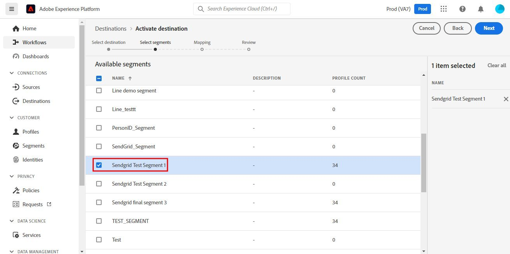
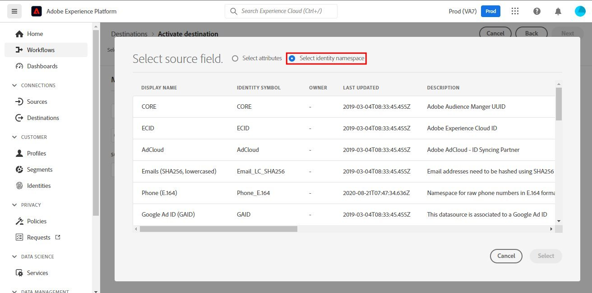

# Connexion [!DNL SendGrid]

## Présentation {#overview}

[SendGrid](https://www.sendgrid.com) est une plateforme de communication client populaire pour les e-mails transactionnels et marketing.

Cette [!DNL Adobe Experience Platform] [destination](/help/destinations/home.md) exploite le [[!DNL SendGrid Marketing Contacts API]](https://api.sendgrid.com/v3/marketing/contacts), ce qui vous permet d’exporter vos profils d’e-mail propriétaires et de les activer dans une nouvelle audience SendGrid adaptée aux besoins de votre entreprise.

SendGrid utilise des jetons du porteur d&#39;API comme mécanisme d&#39;authentification pour communiquer avec l&#39;API SendGrid.

## Conditions préalables {#prerequisites}

Les éléments suivants sont requis avant de commencer la configuration de la destination.

1. Vous devez disposer d&#39;un compte SendGrid.
   * Accédez à la page SendGrid [signup](https://signup.sendgrid.com/) pour vous enregistrer et créer un compte SendGrid, si ce n&#39;est pas déjà fait.
1. Après vous être connecté au portail SendGrid, vous devez également générer un jeton API.
1. Accédez au site web SendGrid et à la page **[!DNL Settings]** > **[!DNL API Keys]** . Reportez-vous également à la documentation [SendGrid](https://app.sendgrid.com/settings/api_keys) pour accéder à la section appropriée dans l’application SendGrid.
1. Enfin, sélectionnez le bouton **[!DNL Create API Key]** .
   * Reportez-vous à la [documentation SendGrid](https://docs.sendgrid.com/ui/account-and-settings/api-keys#creating-an-api-key), si vous avez besoin de conseils sur les actions à effectuer.
   * Si vous souhaitez générer votre clé API par programmation, reportez-vous à la documentation [SendGrid](https://docs.sendgrid.com/api-reference/api-keys/create-api-keys).

Avant d’activer des données vers la destination SendGrid, vous devez avoir créé un [schéma](https://experienceleague.adobe.com/docs/experience-platform/xdm/schema/composition.html?lang=fr), un [jeu de données](https://experienceleague.adobe.com/docs/platform-learn/tutorials/data-ingestion/create-datasets-and-ingest-data.html?lang=fr) et des [segments](https://experienceleague.adobe.com/docs/platform-learn/tutorials/segments/create-segments.html?lang=fr) dans [!DNL Experience Platform]. Reportez-vous également à la section [limites](#limits) plus bas sur cette page.

>[!IMPORTANT]
>
>* L’API SendGrid utilisée pour créer la liste de diffusion à partir des profils d’e-mail nécessite que des adresses e-mail uniques soient fournies dans chaque profil. Et ce, qu’elle soit utilisée comme valeur pour *e-mail* ou *e-mail secondaire*. Comme la connexion SendGrid prend en charge les mappages pour les valeurs d’e-mail et d’e-mail secondaire, assurez-vous que toutes les adresses e-mail utilisées sont uniques dans chaque profil du *jeu de données*. Dans le cas contraire, lorsque les profils de messagerie seront envoyés à SendGrid, une erreur se produira et ce profil de messagerie ne sera pas présent dans l&#39;exportation des données.
>
>* Actuellement, aucune fonctionnalité n’est en place pour supprimer des profils d’SendGrid lorsqu’ils sont supprimés des audiences dans Experience Platform.

## Identités prises en charge {#supported-identities}

SendGrid prend en charge l’activation des identités décrites dans le tableau ci-dessous. En savoir plus sur les [identités](/help/identity-service/features/namespaces.md).

| Identité cible | Description | Considérations |
|---|---|---|
| E-mail | Adresse e-mail | Notez que le texte brut et les adresses e-mail hachées SHA256 sont pris en charge par [!DNL Adobe Experience Platform]. Si le champ source Experience Platform contient des attributs non hachés, cochez l’option **[!UICONTROL Appliquer la transformation]** pour que [!DNL Experience Platform] hache automatiquement les données lors de l’activation.   Notez que **SendGrid** ne prend pas en charge les adresses e-mail hachées. Par conséquent, seules les données en texte brut sans transformation sont envoyées à la destination. |

{style="table-layout:auto"}

## Type et fréquence d’exportation {#export-type-frequency}

Reportez-vous au tableau ci-dessous pour plus d’informations sur le type et la fréquence d’exportation des destinations.

| Élément | Type | Notes |
---------|----------|---------|
| Type d’exportation | **[!UICONTROL Basé sur les profils]** | Vous exportez tous les membres d’un segment, ainsi que les champs de schéma de votre choix (par exemple : adresse électronique, numéro de téléphone, nom), tel que sélectionné dans l’écran de sélection des attributs de profil du [workflow d’activation de destination](/help/destinations/ui/activate-batch-profile-destinations.md#select-attributes). |
| Fréquence des exportations | **[!UICONTROL Diffusion en continu]** | Les destinations de diffusion en continu sont des connexions basées sur l’API « toujours actives ». Dès qu’un profil est mis à jour dans Experience Platform en fonction de l’évaluation des audiences, le connecteur envoie la mise à jour en aval vers la plateforme de destination. En savoir plus sur les [destinations de diffusion en continu](/help/destinations/destination-types.md#streaming-destinations). |

{style="table-layout:auto"}

## Cas d’utilisation {#use-cases}

Pour mieux comprendre quand et comment utiliser la destination SendGrid, consultez les exemples de cas d’utilisation ci-dessous que [!DNL Experience Platform] clients peuvent résoudre à l’aide de cette destination.

### Création d’une liste marketing pour plusieurs activités marketing

Les équipes marketing qui utilisent SendGrid peuvent créer une liste de diffusion dans SendGrid et la remplir d’adresses e-mail. La liste de diffusion maintenant créée dans SendGrid peut ensuite être utilisée pour plusieurs activités marketing.

## Se connecter à la destination {#connect}

>[!IMPORTANT]
> 
>Pour vous connecter à la destination, vous avez besoin des autorisations de contrôle d’accès **[!UICONTROL Afficher les destinations]** et **[!UICONTROL Gérer les destinations]** [&#128279;](/help/access-control/home.md#permissions). Lisez la [présentation du contrôle d’accès](/help/access-control/ui/overview.md) ou contactez votre administrateur de produit pour obtenir les autorisations requises.

Pour vous connecter à cette destination, procédez comme décrit dans le [tutoriel sur la configuration des destinations](../../ui/connect-destination.md). Dans le workflow de configuration des destinations, renseignez les champs répertoriés dans les deux sections ci-dessous.

### S’authentifier auprès de la destination {#authenticate}

1. Dans la console [!DNL Adobe Experience Platform], accédez à **Destinations**.

1. Sélectionnez l’onglet **Catalogue** et recherchez *SendGrid*. Sélectionnez ensuite **Configurer**. Une fois que vous avez établi une connexion à la destination, le libellé de l’interface utilisateur devient **Activer des segments**.
   

1. Un assistant s’affiche pour vous aider à configurer la destination SendGrid. Créez la nouvelle destination en sélectionnant **Configurer une nouvelle destination**.
   

1. Sélectionnez l’option **Nouveau compte** et renseignez la valeur **Jeton du porteur**. Il s’agit de la valeur SendGrid *clé API* mentionnée précédemment dans la section [conditions préalables](#prerequisites).
   

1. Sélectionnez **Se connecter à la destination**. Si la *clé API* SendGrid fournie est valide, l’interface utilisateur affiche un statut **Connecté** avec une coche verte, vous pouvez passer à l’étape suivante pour remplir des champs d’informations supplémentaires.

### Renseigner les détails de la destination {#destination-details}

Pendant la [configuration](https://experienceleague.adobe.com/docs/experience-platform/destinations/ui/connect-destination.html?lang=fr) de cette destination, vous devez fournir les informations suivantes :

* **[!UICONTROL Nom]** : le nom par lequel vous reconnaîtrez cette destination à l’avenir.
* **[!UICONTROL Description]** : description facultative qui vous aidera à identifier cette destination à l’avenir.

### Activer les alertes {#enable-alerts}

Vous pouvez activer les alertes pour recevoir des notifications sur le statut de votre flux de données vers votre destination. Sélectionnez une alerte dans la liste et abonnez-vous à des notifications concernant le statut de votre flux de données. Pour plus d’informations sur les alertes, consultez le guide sur l’[abonnement aux alertes des destinations dans l’interface utilisateur](../../ui/alerts.md).

Lorsque vous avez terminé de renseigner les détails sur votre connexion de destination, sélectionnez **[!UICONTROL Suivant]**.

## Activer des audiences vers cette destination {#activate}

>[!IMPORTANT]
> 
>* Pour activer les données, vous avez besoin des autorisations de contrôle d’accès **[!UICONTROL Afficher les destinations]**, **[!UICONTROL Activer les destinations]**, **[!UICONTROL Afficher les profils]** et **[!UICONTROL Afficher les segments]** [&#128279;](/help/access-control/home.md#permissions). Lisez la [présentation du contrôle d’accès](/help/access-control/ui/overview.md) ou contactez votre administrateur ou administratrice du produit pour obtenir les autorisations requises.
>* Pour exporter des *identités*, vous devez disposer de l’autorisation de contrôle d’accès **[!UICONTROL Afficher le graphique d’identités]** [&#128279;](/help/access-control/home.md#permissions).   {width="100" zoomable="yes"}

Consultez la section [Activer les profils et les audiences vers les destinations d’exportation d’audiences en flux continu](/help/destinations/ui/activate-segment-streaming-destinations.md) pour obtenir des instructions sur l’activation des audiences vers cette destination.

Reportez-vous aux images ci-dessous pour plus d’informations spécifiques à cette destination.

1. Sélectionnez une ou plusieurs audiences à exporter vers SendGrid.
   

1. À l’étape **[!UICONTROL Mappage]**, après avoir sélectionné **[!UICONTROL Ajouter un nouveau mappage]**, la page de mappage qui vous permet de mapper les champs XDM sources aux champs cibles de l’API SendGrid s’affiche. Les images ci-dessous montrent comment mapper des espaces de noms d’identité entre Experience Platform et SendGrid. Assurez-vous que le champ **[!UICONTROL Source]** *E-mail* doit être mappé au **[!UICONTROL champ cible]** *external_id* comme illustré ci-dessous.
   
   
   
   

1. De même, mappez les attributs de [!DNL Adobe Experience Platform] souhaités que vous souhaitez exporter vers la destination SendGrid.
   
   

1. Une fois les mappages terminés, sélectionnez **[!UICONTROL Suivant]** pour accéder à l’écran de révision.
   

1. Sélectionnez **[!UICONTROL Terminer]** pour terminer la configuration.
   

Vous trouverez ci-dessous la liste complète des mappages d’attributs pris en charge qui peuvent être configurés pour l’API [SendGrid Marketing Contacts > Ajouter ou mettre à jour un contact](https://docs.sendgrid.com/api-reference/contacts/add-or-update-a-contact).

| Champ source | Champ cible | Type | Description | Limites |
|---|---|---|---|---|
| xdm:  homeAddress.street1 | xdm:  address_line_1 | Chaîne | Première ligne de l’adresse. | Longueur maximale :   100 caractères |
| xdm:  homeAddress.street2 | xdm:  address_line_2 | Chaîne | Deuxième ligne facultative pour l’adresse. | Longueur maximale :   100 caractères |
| xdm:  _extconndev.alternative_emails | xdm:  alterner_emails | Tableau de chaînes | E-mails supplémentaires associés au contact. | <ul><li>Maximum : 5 éléments</li><li>Min. : 0 élément</li></ul> |
| xdm:  homeAddress.city | xdm:  city | Chaîne | La ville du contact. | Longueur maximale :   60 caractères |
| xdm:  homeAddress.country | xdm:  pays | Chaîne | Le pays du contact. Il peut s’agir d’un nom complet ou d’une abréviation. | Longueur maximale :   50 caractères |
| identityMap:  Email | Identité :   external_id | Chaîne | Adresse électronique principale du contact. Ceci est requis pour être un e-mail valide. | Longueur maximale :   254 caractères |
| xdm:  person.name.firstName | xdm:  first_name | Chaîne | Nom du contact | Longueur maximale :   50 caractères |
| xdm:  person.name.lastName | xdm:  nom_de_famille | Chaîne | Nom du contact | Longueur maximale :   50 caractères |
| xdm:  homeAddress.postalCode | xdm:  code_postal | Chaîne | Code postal du contact. | |
| xdm:  homeAddress.stateProvince | xdm:  state_province_region | Chaîne | État, province ou région du contact. | Longueur maximale :   50 caractères |

## Valider l’exportation des données dans SendGrid {#validate}

Pour vérifier que vous avez correctement configuré la destination, procédez comme suit :

1. Sélectionnez **[!UICONTROL Destinations]** > **[!UICONTROL Parcourir]** pour accéder à la liste des destinations.
   

1. Sélectionnez la destination et vérifiez que le statut est **[!UICONTROL activé]**.
   

1. Passez à l’onglet **[!DNL Activation data]** , puis sélectionnez un nom d’audience.
   

1. Surveillez le résumé de l’audience et vérifiez que le nombre de profils correspond au nombre créé dans le jeu de données.
   

1. L’API [SendGrid Marketing Lists > Create List](https://docs.sendgrid.com/api-reference/lists/create-list) est utilisée pour créer des listes de contacts uniques dans SendGrid en joignant la valeur de l’attribut *list_name* et l’horodatage de l’exportation des données. Accédez au site SendGrid et vérifiez si la nouvelle liste de contacts conforme au modèle de nom est créée.
   
   

1. Sélectionnez la liste de contacts que vous venez de créer et vérifiez si le nouvel enregistrement d’e-mail du jeu de données que vous avez créé est renseigné dans la nouvelle liste de contacts.

1. Vérifiez également quelques e-mails pour vérifier si le mappage des champs est correct.
   
   

## Utilisation et gouvernance des données {#data-usage-governance}

Lors de la gestion de vos données, toutes les destinations [!DNL Adobe Experience Platform] se conforment aux politiques d’utilisation des données. Pour obtenir des informations détaillées sur la manière dont [!DNL Adobe Experience Platform] applique la gouvernance des données, lisez la [présentation de la gouvernance des données](/help/data-governance/home.md).

## Ressources supplémentaires {#additional-resources}

Cette destination SendGrid utilise les API suivantes :
* [Envoyer des listes marketing Grid > API Créer une liste](https://docs.sendgrid.com/api-reference/lists/create-list)
* [EnvoyerGrid Contacts marketing > Ajouter ou mettre à jour l’API de contact](https://docs.sendgrid.com/api-reference/contacts/add-or-update-a-contact)

### Limites {#limits}

* L’API [EnvoyerGrille des contacts marketing > Ajouter ou mettre à jour des contacts](https://api.sendgrid.com/v3/marketing/contacts) peut accepter 30 000 contacts ou 6 Mo de données, la valeur la plus faible étant retenue.
