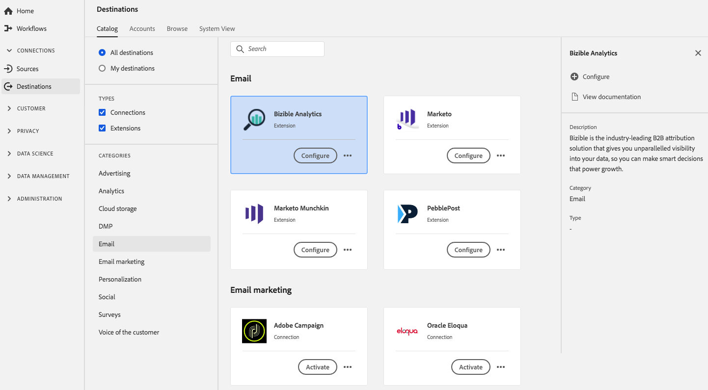

# Extension [!DNL Bizible] {#bizible-extension}

## Vue d’ensemble {#overview}

[!DNL Bizible] est la solution d’attribution B2B de pointe qui vous offre une visibilité inégalée sur vos données afin que vous puissiez prendre des décisions intelligentes qui alimentent la croissance.

[!DNL Bizible] est une extension d’e-mail dans Adobe Experience Platform. Pour plus d’informations sur Bizible, lisez [Attribution marketing](https://experienceleague.adobe.com/docs/bizible/using/introduction-to-bizible/overview-resources/marketing-attribution.html) dans les ressources de présentation de Bizible.

Cette destination est une extension de balise. Pour plus d’informations sur le fonctionnement des extensions de balises dans Experience Platform, consultez la [ présentation des extensions de balises](../launch-extensions/overview.md).

## Conditions préalables {#prerequisites}

Cette extension est disponible dans le catalogue [!DNL Destinations] pour tous les clients qui ont acheté Experience Platform.

Pour utiliser cette extension, vous devez avoir accès aux balises dans Adobe Experience Platform. Les balises sont proposées aux clients Adobe Experience Cloud en tant que fonctionnalité à valeur ajoutée incluse. Contactez l’administrateur ou l’administratrice de votre organisation pour accéder aux balises et demandez-lui de vous accorder l’autorisation **[!UICONTROL manage_properties]** afin que vous puissiez installer des extensions.

## Installation l’extension {#install-extension}

Pour installer l’extension [!DNL Bizible], procédez comme suit :

Dans l’interface d’[Experience Platform](https://platform.adobe.com/), accédez à **[!UICONTROL Destinations]** > **[!UICONTROL Catalog]**.

Sélectionnez l’extension dans le catalogue ou utilisez la barre de recherche.

Sélectionnez la destination, puis sélectionnez **[!UICONTROL Configure]** dans le rail de droite. Si le contrôle **[!UICONTROL Configure]** est grisé, vous ne disposez pas de l’autorisation **[!UICONTROL manage_properties]**. Voir les [Conditions préalables](#prerequisites).

Sélectionnez la propriété de balise dans laquelle vous souhaitez installer l’extension. Vous pouvez aussi créer une propriété. Une propriété est un ensemble de règles, d’éléments de données, d’extensions configurées, d’environnements et de bibliothèques. Pour en savoir plus sur les propriétés, consultez la [documentation sur les balises](../../../tags/ui/administration/companies-and-properties.md).

Le workflow vous mène à l’interface utilisateur de la collecte de données pour terminer l’installation.

Vous pouvez également installer l’extension directement dans l’[interface utilisateur de la collecte de données](https://experience.adobe.com/#/data-collection/). Pour plus d’informations, consultez le guide sur [l’ajout d’une nouvelle extension](../../../tags/ui/managing-resources/extensions/overview.md#add-a-new-extension).

## Utilisation de l’extension {#how-to-use}

Une fois l’extension installée, vous pouvez commencer à configurer des règles. Dans l’interface utilisateur de la collecte de données, vous pouvez configurer des règles pour vos extensions installées afin d’envoyer des données d’événement vers la destination de l’extension uniquement dans certains cas. Pour plus d’informations sur la configuration de règles pour vos extensions, consultez la présentation de [rules](../../../tags/ui/managing-resources/rules.md) dans la documentation sur les balises.

## Configuration, mise à niveau et suppression de l’extension {#configure-upgrade-delete}

Vous pouvez configurer, mettre à niveau et supprimer des extensions dans l’interface utilisateur de collecte de données.

>[!TIP]
>
>Si l’extension est déjà installée sur l’une de vos propriétés, l’interface utilisateur affiche toujours **[!UICONTROL Install]** pour cette extension. Démarrez le workflow d’installation comme décrit dans [Installation de l’extension](#install-extension) pour configurer ou supprimer votre extension.

Pour mettre à niveau votre extension, consultez le guide sur le [processus de mise à niveau d’extension](../../../tags/ui/managing-resources/extensions/extension-upgrade.md) dans la documentation sur les balises.
