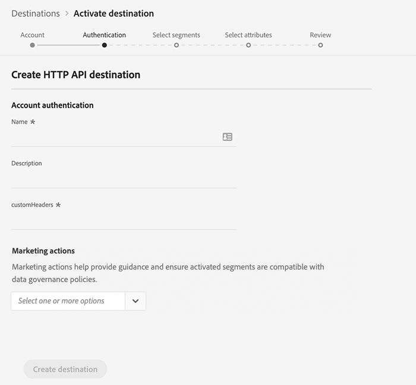

# (Alpha) [!DNL HTTP] connexion

>[!IMPORTANT]
>
>La destination [!DNL HTTP] dans Platform est actuellement en alpha. La documentation et les fonctionnalités peuvent changer.

## Présentation {#overview}

La destination [!DNL HTTP] est une destination de diffusion en flux continu [!DNL Adobe Experience Platform] qui vous permet d’envoyer des données de profil à des points de terminaison tiers [!DNL HTTP].

Pour envoyer des données de profil aux points de terminaison [!DNL HTTP], vous devez d&#39;abord vous connecter à la destination dans [[!DNL Adobe Experience Platform]](#connect-destination).

## Cas d’utilisation {#use-cases}

La destination [!DNL HTTP] est destinée aux clients qui doivent exporter des données de profil XDM et des segments d&#39;audience vers des points de terminaison génériques [!DNL HTTP].

[!DNL HTTP] les points de terminaison peuvent être des systèmes propres aux clients ou des solutions tierces.

## Se connecter à la destination {#connect-destination}

Dans **[!UICONTROL Connexions]** > **[!UICONTROL Destinations]**, sélectionnez [!DNL HTTP API], puis **[!UICONTROL Configurer]**.


Si une connexion avec cette destination existe déjà, vous pouvez voir un bouton **[!UICONTROL Activer]** sur la carte de destination. Pour plus d&#39;informations sur la différence entre **[!UICONTROL Activer]** et **[!UICONTROL Configurer]**, consultez la section [Catalogue](../ui/destinations-workspace.md#catalog) de la documentation de l&#39;espace de travail de destination.


À l’étape [!UICONTROL Compte], vous devez définir les détails de la connexion du point de terminaison HTTP. Sélectionnez **[!UICONTROL Nouveau compte]** et saisissez les détails de la connexion pour le point de terminaison HTTP auquel vous souhaitez vous connecter.
- **[!UICONTROL httpEndpoint]** : la fin complète  [!DNL URL] du point de terminaison HTTP auquel vous souhaitez envoyer les données du profil.
   - Vous pouvez éventuellement ajouter des paramètres de requête à [!UICONTROL httpEndpoint] [!DNL URL].
- **[!UICONTROL authEndpoint]** : la fin complète  [!DNL URL] du point de terminaison HTTP utilisé pour  [!DNL OAuth2] l’authentification.
- **[!UICONTROL ID]** client : le  [!DNL clientID] paramètre utilisé dans les informations d’identification du  [!DNL OAuth2] client.
- **[!UICONTROL Secret]** client : le  [!DNL clientSecret] paramètre utilisé dans les informations d’identification du  [!DNL OAuth2] client.

>[!NOTE]
>
>Seules les informations d’identification de client [!DNL OAuth2] sont actuellement prises en charge.


Cliquez sur **[!UICONTROL Se connecter à destination]**. Une fois la connexion établie, cliquez sur **[!UICONTROL Suivant]**.

À l’étape [!UICONTROL Authentification], saisissez les informations d’identification d’authentification du compte :
- **[!UICONTROL Nom]** : entrez un nom qui vous permettra de reconnaître cette destination à l&#39;avenir.
- **[!UICONTROL Description]** : entrez une description qui vous aidera à identifier cette destination dans le futur.
- **[!UICONTROL En-têtes]** personnalisés : saisissez les en-têtes personnalisés à inclure dans les appels de destination, selon le format suivant :  `header1:value1,header2:value2,...headerN:valueN`.
- **[!UICONTROL Actions]** marketing : Les actions marketing indiquent l’intention d’exporter les données vers la destination. Vous pouvez choisir parmi des actions marketing définies par Adobe ou créer votre propre action marketing. Pour plus d’informations sur les actions marketing, voir la page [Gouvernance des données dans Adobe Experience Platform](/help/data-governance/policies/overview.md). Pour plus d&#39;informations sur les actions marketing définies par l&#39;Adobe, consultez la [Présentation des stratégies d&#39;utilisation des données](/help/data-governance/policies/overview.md).

>[!IMPORTANT]
>
>L’implémentation actuelle requiert au moins un en-tête personnalisé. Cette limitation sera résolue dans une prochaine mise à jour.



**[!UICONTROL Action]** marketing : Les actions marketing indiquent l’intention d’exporter les données vers la destination. Vous pouvez choisir parmi des actions marketing définies par Adobe ou créer votre propre action marketing. Pour plus d&#39;informations sur les actions marketing, consultez la [Présentation des stratégies d&#39;utilisation des données](../../data-governance/policies/overview.md).

Cliquez sur **[!UICONTROL Créer une destination]**.

## Activer les segments

Pour obtenir des informations sur le processus d’activation des segments, voir [Activer les profils et les segments à une destination](../ui/activate-destinations.md#select-attributes).

## Attributs de destination

Au cours de l&#39;étape [[!UICONTROL Sélectionner des attributs]](../ui/activate-destinations.md#select-attributes), lorsque [l&#39;activation de segments](../ui/activate-destinations.md) vers une destination [!DNL HTTP], nous vous recommandons de sélectionner un identifiant unique dans votre [schéma d&#39;union](../../profile/home.md#profile-fragments-and-union-schemas). Sélectionnez l’identifiant unique et tout autre champ XDM que vous souhaitez exporter vers la destination.

## Données exportées {#exported-data}

Vos données [!DNL Experience Platform] exportées atterrissent dans votre destination [!DNL HTTP] au format JSON. Par exemple, le événement ci-dessous contient l’attribut profil d’adresse électronique d’une audience qui s’est qualifiée pour un certain segment et a quitté un autre segment. Les identités de cette prospect sont [!DNL ECID] et e-mail.

```json
{
  "person": {
    "email": "yourstruly@adobe.con"
  },
  "segmentMembership": {
    "ups": {
      "7841ba61-23c1-4bb3-a495-00d3g5fe1e93": {
        "lastQualificationTime": "2020-05-25T21:24:39Z",
        "status": "exited"
      },
      "59bd2fkd-3c48-4b18-bf56-4f5c5e6967ae": {
        "lastQualificationTime": "2020-05-25T23:37:33Z",
        "status": "existing"
      }
    }
  },
  "identityMap": {
    "ecid": [
      {
        "id": "14575006536349286404619648085736425115"
      },
      {
        "id": "66478888669296734530114754794777368480"
      }
    ],
    "email_lc_sha256": [
      {
        "id": "655332b5fa2aea4498bf7a290cff017cb4"
      },
      {
        "id": "66baf76ef9de8b42df8903f00e0e3dc0b7"
      }
    ]
  }
}
```
