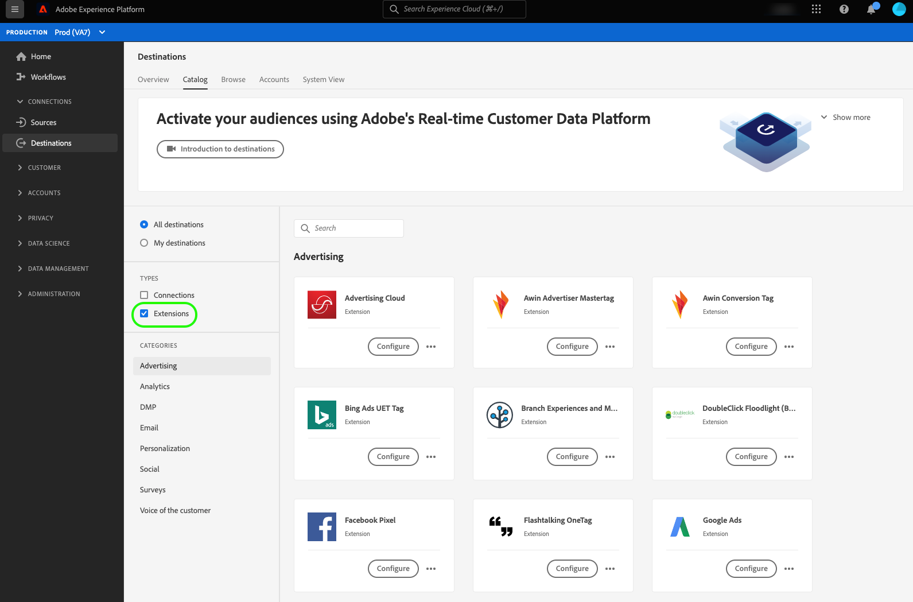

# Extensions de balises dans Adobe Experience Platform

Adobe Experience Platform offre la nouvelle génération de fonctionnalités de gestion des balises d’Adobe. Experience Platform vous offre un moyen simple de déployer et de gérer toutes les balises d’analyse, de marketing et de publicité nécessaires pour offrir des expériences client pertinentes. Les balises sont proposées aux clients Adobe Experience Cloud en tant que fonctionnalité à valeur ajoutée incluse.

Pour une présentation des balises, reportez-vous aux ressources ci-dessous :

- [Présentation des balises](../../../tags/home.md)
- [Guide de démarrage rapide](../../../tags/quick-start/quick-start.md)

## Comment trouver des extensions de balises dans l’interface d’Experience Platform {#how-to-find-extensions-in-interface}

Pour trouver les extensions dans l’interface d’Experience Platform, accédez à **[!UICONTROL Destinations]** > **[!UICONTROL Catalogue]** et sélectionnez **[!UICONTROL Extensions]** dans le filtre **[!UICONTROL Types]**.

## Fonctionnement des extensions de balises {#how-extensions-work}

Une [extension de balise](../../../tags/home.md#extensions) est un package de code qui améliore les fonctionnalités d’un site web ou d’une application mobile. Il peut s’agir de l’envoi de données d’événement brutes vers une destination telle que [Google Analytics](/help/destinations/catalog/analytics/google-universal-analytics.md) mais elles peuvent également servir à d’autres fonctions.

Il est important de faire la distinction entre les extensions de transfert de balises et d’événements. Les extensions affichées dans l’interface utilisateur des destinations Experience Platform sont des *extensions de balise*. Reportez-vous à la présentation du transfert d’événement pour plus d’informations sur les [différences entre les balises et le transfert d’événement](/help/tags/ui/event-forwarding/overview.md#differences-between-event-forwarding-and-tags).

<!--

Extensions forward raw event data to several types of destinations. Think of extensions as an **Event Forwarding** type of destination. This is a simpler type of integration with destination platforms, which only forwards raw event data. Examples of those are the [Gainsight personalization extension](../personalization/gainsight.md) or the [Confirmit Voice of the Customer extension](../voice/confirmit-digital-feedback.md).

**Profile/Segment Export** destinations in Adobe Experience Platform capture event data, combine it with other data sources, apply segmentation, and export audiences and qualified profiles to destinations. Examples of those are the [Amazon S3 cloud storage destination](../cloud-storage/amazon-s3.md) or the [Google Display & Video 360 advertising destination](../advertising/google-dv360.md).

-->

## Avantages de l’utilisation des extensions de balises {#extensions-benefits}

Les fonctionnalités de balises Experience Platform sont gratuites pour les clients Experience Cloud existants. Le système simplifie le déploiement des balises sur votre site web au moyen d’extensions conviviales que vous pouvez installer, configurer, mettre à jour et supprimer. Les balises laissent une petite empreinte sur votre site web et vous permettent de charger rapidement vos pages.

Bien que vous ne puissiez pas activer les audiences pour les extensions de balises, vous pouvez configurer des règles pour ne transférer les données d’événement que dans certains cas. Cette puissante fonctionnalité vous permet de transférer les données d’événement uniquement dans certaines situations, plutôt que d’envoyer les données d’événement à chaque interaction. Pour plus d’informations, consultez la section consacrée aux règles dans la [documentation sur les balises](../../../tags/ui/managing-resources/rules.md).

## Exemples de cas d’utilisation d’extensions {#extensions-use-cases}

Les extensions vous permettent de répondre à divers cas d’utilisation client. Voici quelques exemples de cas d’utilisation des extensions :

- Vous pouvez envoyer des données de site web ou d’application native par le biais de l’extension pour Facebook Pixel. Facebook Pixel vous indique les parties du site web ou de l’application qu’un utilisateur a consultées, transfère ces informations à Facebook et vous permet ainsi de recibler cet utilisateur via Facebook.
- Vous pouvez transférer les données d’événement de vos sites web et de vos applications à Google Analytics afin d’analyser ces données et de prendre des décisions en fonction de celles-ci.
- Vous pouvez activer une application de boîte de conversation côté client au bon moment en fonction de la manière dont vos utilisateurs interagissent avec vos pages, selon les règles que vous avez configurées.

## Catégories d’extensions {#extension-categories}

Les extensions peuvent appartenir aux catégories suivantes dans Experience Platform :

- [Advertising](../advertising/overview.md)
- [Analytics](../analytics/overview.md)
- [Plateforme de gestion des données](../data-management/overview.md)
- [Destinations de marketing par e-mail &#x200B;](../email-marketing/overview.md)
- [Personnalisation](../personalization/overview.md)
- [Questionnaires](../survey/overview.md)
- [Voix du client](../voice/overview.md)
