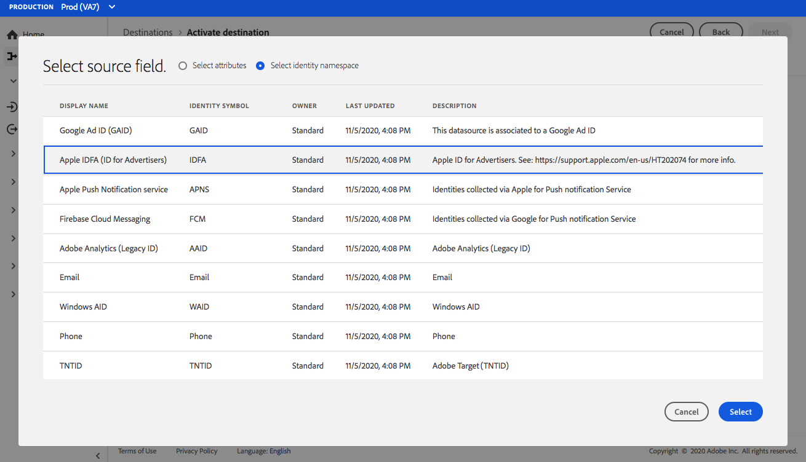

# Connexion [!DNL Airship Attributes] {#airship-attributes-destination}

>[!IMPORTANT]
>
>* À compter du 25 mars 2025, vous pourrez voir deux cartes [!DNL Airship Attributes] côte à côte dans le catalogue des destinations. Cela est dû à une mise à niveau interne vers le service de destinations. Le connecteur de destination [!DNL Airship Attributes] existant a été renommé **[!UICONTROL (obsolète) Attributs Airship]** et une nouvelle carte portant le nom **[!UICONTROL Attributs Airship]** est désormais disponible.
>* Utilisez la connexion **[!UICONTROL Attributs Airship]** dans le catalogue pour les nouveaux flux de données d’activation. Si vous disposez de flux de données actifs vers la destination **[!UICONTROL (Obsolète) Attributs Airship]**, ils seront mis à jour automatiquement. Aucune action n’est donc requise de votre part.
>* Si vous créez des flux de données par le biais de l’[API Flow Service](https://developer.adobe.com/experience-platform-apis/references/destinations/), vous devez mettre à jour vos [!DNL flow spec ID] et [!DNL connection spec ID] aux valeurs suivantes :
>   * ID de spécification de flux : `a862e0be-966e-4e5a-80d3-1bb566461986`
>   * ID de spécification de connexion : `594bc002-4a47-49b7-8a98-ac0d21045502`

## Vue d’ensemble {#overview}

[!DNL Airship] est le principal Experience Platform d’engagement des clients. Il vous permet de fournir à vos utilisateurs des messages omnicanal pertinents et personnalisés à chaque étape du cycle de vie du client.

Cette intégration transmet les données de profil Adobe dans [!DNL Airship] en tant qu’[attributs](https://docs.airship.com/guides/audience/attributes/) pour le ciblage ou le déclenchement.

Pour en savoir plus sur [!DNL Airship], consultez les [documents relatifs aux dirigeables](https://docs.airship.com).

>[!TIP]
>
>Ce connecteur de destination et cette page de documentation sont créés et gérés par l’équipe [!DNL Airship]. Pour toute demande ou information, contactez directement l&#39;équipe d&#39;assistance technique [support.airship.com](https://support.airship.com/).

## Conditions préalables {#prerequisites}

Avant d’envoyer vos audiences à [!DNL Airship], vous devez :

* Activez les attributs dans votre projet [!DNL Airship].
* Générez un jeton porteur pour l’authentification.

>[!TIP]
>
>Créez un compte [!DNL Airship] via [ce lien d’inscription](https://go.airship.eu/accounts/register/plan/starter/) si ce n’est pas déjà fait.

## Audiences prises en charge {#supported-audiences}

Cette section décrit les types d’audiences que vous pouvez exporter vers cette destination.

| Origine de l’audience | Pris en charge | Description |
|---------|----------|----------|
| [!DNL Segmentation Service] | ✓ | Audiences générées via Experience Platform [Segmentation Service](../../../segmentation/home.md). |
| Chargements personnalisés | ✓ | Audiences [importées](../../../segmentation/ui/audience-portal.md#import-audience) dans Experience Platform à partir de fichiers CSV. |

{style="table-layout:auto"}

## Type et fréquence d’exportation {#export-type-frequency}

Reportez-vous au tableau ci-dessous pour plus d’informations sur le type et la fréquence d’exportation des destinations.

| Élément | Type | Notes |
---------|----------|---------|
| Type d’exportation | **[!UICONTROL Basé sur les profils]** | Vous exportez tous les membres d’un segment, ainsi que les champs de schéma souhaités (par exemple : adresse e-mail, numéro de téléphone, nom) et/ou les identités, en fonction de votre mappage de champs. |
| Fréquence des exportations | **[!UICONTROL Diffusion en continu]** | Les destinations de diffusion en continu sont des connexions basées sur l’API « toujours actives ». Dès qu’un profil est mis à jour dans Experience Platform en fonction de l’évaluation des audiences, le connecteur envoie la mise à jour en aval vers la plateforme de destination. En savoir plus sur les [destinations de diffusion en continu](/help/destinations/destination-types.md#streaming-destinations). |

{style="table-layout:auto"}

## Activer les attributs {#enable-attributes}

les attributs de profil Adobe Experience Platform sont similaires aux attributs [!DNL Airship] et peuvent être facilement mappés les uns aux autres dans Experience Platform à l’aide de l’outil de mappage illustré plus bas sur cette page.

[!DNL Airship] projets ont plusieurs attributs prédéfinis et par défaut. Si vous disposez d’un attribut personnalisé, vous devez d’abord le définir dans [!DNL Airship]. Voir [Configurer et gérer les attributs](https://docs.airship.com/tutorials/audience/attributes/) pour plus d’informations.

## Générer un jeton du porteur {#bearer-token}

Accédez à **[!UICONTROL Paramètres]** » **[!UICONTROL API et intégrations]** dans le tableau de bord [Airship](https://go.airship.com) et sélectionnez **[!UICONTROL Jetons]** dans le menu de gauche.

Cliquez sur **[!UICONTROL Créer un jeton]**.

Attribuez un nom convivial à votre jeton, par exemple « Destination des attributs Adobe », puis sélectionnez « Tous les accès » pour le rôle.

Cliquez sur **[!UICONTROL Créer un jeton]** et enregistrez les détails comme confidentiels.

## Cas d’utilisation {#use-cases}

Pour mieux comprendre quand et comment utiliser la destination [!DNL Airship Attributes], consultez les exemples de cas d’utilisation ci-dessous que la clientèle de Adobe Experience Platform peut résoudre.

### Cas d’utilisation #1

Tirez parti des données de profil collectées dans Adobe Experience Platform pour la personnalisation du message et du contenu riche dans l’un des canaux de [!DNL Airship]. Par exemple, utilisez les données de profil [!DNL Experience Platform] pour définir les attributs d’emplacement dans [!DNL Airship]. Cela permettra à une marque d’hôtel d’afficher une image de l’emplacement de l’hôtel le plus proche pour chaque utilisateur.

### Cas d’utilisation #2

Tirez parti des attributs de Adobe Experience Platform pour enrichir davantage les profils de [!DNL Airship] et les combiner avec des données prédictives SDK ou [!DNL Airship]. Par exemple, un retailer peut créer une audience avec des données de statut de fidélité et d’emplacement (attributs d’Experience Platform) et [!DNL Airship] prédites pour l’attrition des données afin d’envoyer des messages très ciblés aux utilisateurs avec le statut de fidélité Gold qui vivent à Las Vegas, NV et qui ont une forte probabilité d’attrition.

## Se connecter à la destination {#connect}

>[!IMPORTANT]
> 
>Pour vous connecter à la destination, vous avez besoin des autorisations de contrôle d’accès **[!UICONTROL Afficher les destinations]** et **[!UICONTROL Gérer les destinations]** . Lisez la [présentation du contrôle d’accès](/help/access-control/ui/overview.md) ou contactez votre administrateur de produit pour obtenir les autorisations requises.

Pour vous connecter à cette destination, procédez comme décrit dans le [tutoriel sur la configuration des destinations](../../ui/connect-destination.md). Dans le workflow de configuration des destinations, renseignez les champs répertoriés dans les deux sections ci-dessous.

### S’authentifier auprès de la destination {#authenticate}

Pour vous authentifier à la destination, renseignez les champs requis et sélectionnez **[!UICONTROL Se connecter à la destination]**.

* **[!UICONTROL Jeton porteur]** : jeton porteur que vous avez généré depuis le tableau de bord de la [!DNL Airship].

### Renseigner les détails de la destination {#destination-details}

Pour configurer les détails de la destination, renseignez les champs obligatoires et facultatifs ci-dessous. Un astérisque situé en regard d’un champ de l’interface utilisateur indique que le champ est obligatoire.

* **[!UICONTROL Nom]** : saisissez un nom qui vous aidera à identifier cette destination.
* **[!UICONTROL Description]** : saisissez une description pour cette destination.
* **[!UICONTROL Domaine]** : sélectionnez un centre de données des États-Unis ou de l’UE, selon le centre de données [!DNL Airship] qui s’applique à cette destination.

### Activer les alertes {#enable-alerts}

Vous pouvez activer les alertes pour recevoir des notifications sur le statut de votre flux de données vers votre destination. Sélectionnez une alerte dans la liste et abonnez-vous à des notifications concernant le statut de votre flux de données. Pour plus d’informations sur les alertes, consultez le guide sur l’[abonnement aux alertes des destinations dans l’interface utilisateur](../../ui/alerts.md).

Lorsque vous avez terminé de renseigner les détails sur votre connexion de destination, sélectionnez **[!UICONTROL Suivant]**.

## Activer des audiences vers cette destination {#activate}

>[!IMPORTANT]
> 
>* Pour activer les données, vous avez besoin des autorisations de contrôle d’accès **[!UICONTROL Afficher les destinations]**, **[!UICONTROL Activer les destinations]**, **[!UICONTROL Afficher les profils]** et **[!UICONTROL Afficher les segments]** . Lisez la [présentation du contrôle d’accès](/help/access-control/ui/overview.md) ou contactez votre administrateur ou administratrice du produit pour obtenir les autorisations requises.
>* Pour exporter des *identités*, vous devez disposer de l’autorisation de contrôle d’accès **[!UICONTROL Afficher le graphique d’identités]** .   {width="100" zoomable="yes"}

Voir [Activer les données d’audience vers des destinations d’export d’audiences en flux continu](../../ui/activate-segment-streaming-destinations.md) pour obtenir des instructions sur l’activation des audience vers cette destination.

## Considérations relatives au mappage {#mapping-considerations}

[!DNL Airship] attributs peuvent être définis sur un canal, qui représente l’instance de l’appareil, par exemple iPhone, ou sur un utilisateur nommé, qui mappe tous les appareils d’un utilisateur à un identifiant commun, tel qu’un identifiant client. Si votre schéma comporte des adresses e-mail en texte brut (non hachées) comme identité principale, sélectionnez le champ e-mail dans vos **[!UICONTROL Attributs Source]** et mappez-les à l’utilisateur [!DNL Airship] nommé dans la colonne de droite sous **[!UICONTROL Identités cibles]**, comme illustré ci-dessous.

Pour les identifiants qui doivent être mappés à un canal, c’est-à-dire un appareil, mappez-le au canal approprié en fonction de la source. Les images suivantes montrent la création de deux mappages :

* Identifiant iOS Advertising IDFA vers un canal iOS [!DNL Airship]
* Attribut Adobe `fullName` à [!DNL Airship] attribut « Nom complet »

>[!NOTE]
>
>Utilisez le nom convivial qui s’affiche dans le tableau de bord [!DNL Airship] lors de la sélection du champ cible pour votre mappage d’attributs.

**Mapper l’identité**

Sélectionnez le champ source :

Sélectionner le champ cible :

**Attribut Map**

Sélectionnez l’attribut source :

Sélectionner l’attribut cible :

Vérifier le mappage :

## Utilisation et gouvernance des données {#data-usage-governance}

Lors de la gestion de vos données, toutes les destinations [!DNL Adobe Experience Platform] se conforment aux politiques d’utilisation des données. Pour obtenir des informations détaillées sur la manière dont [!DNL Adobe Experience Platform] applique la gouvernance des données, lisez la [présentation de la gouvernance des données](../../../data-governance/home.md).
