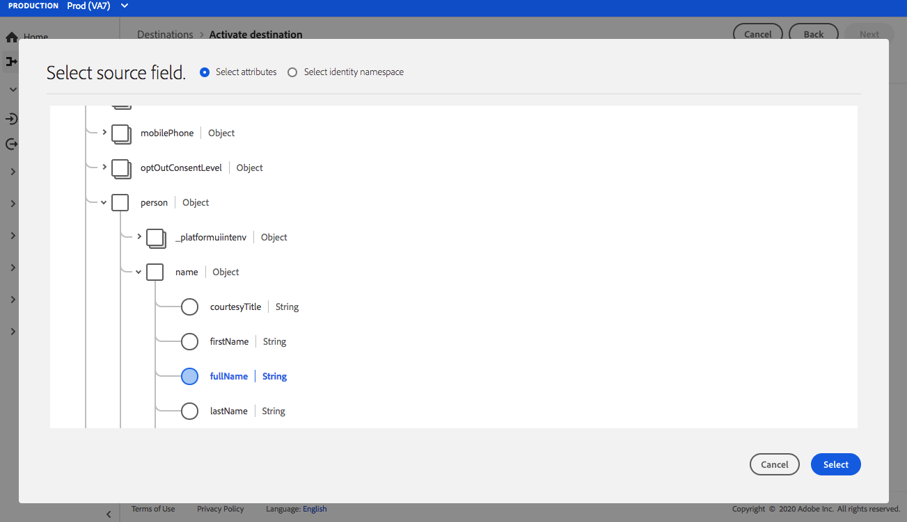

# Connexion [!DNL Airship Attributes] {#airship-attributes-destination}

## Présentation {#overview}

[!DNL Airship] est la principale plateforme d’engagement client, qui vous aide à diffuser des messages omnicanaux personnalisés et pertinents à vos utilisateurs à chaque étape du cycle de vie des clients.

Cette intégration transmet les données de profil d’Adobe dans [!DNL Airship] as [Attributs](https://docs.airship.com/guides/audience/attributes/) pour le ciblage ou le déclenchement.

Pour en savoir plus sur [!DNL Airship], voir [Documents de navigation](https://docs.airship.com).

>[!TIP]
>
>Cette page de documentation et de connecteur de destination est créée et conservée par [!DNL Airship] l&#39;équipe. Pour toute demande d’information ou de mise à jour, contactez-les directement à l’adresse [support.airship.com](https://support.airship.com/).

## Conditions préalables {#prerequisites}

Avant d’envoyer vos audiences à [!DNL Airship], vous devez :

* Activez les attributs dans votre [!DNL Airship] projet.
* Générez un jeton porteur pour l’authentification.

>[!TIP]
>
>Créez un [!DNL Airship] Compte via [ce lien d’inscription](https://go.airship.eu/accounts/register/plan/starter/) si vous ne l&#39;avez pas déjà fait.

## Audiences prises en charge {#supported-audiences}

Cette section décrit les types d’audiences que vous pouvez exporter vers cette destination.

| Origine de l’audience | Pris en charge | Description |
|---------|----------|----------|
| [!DNL Segmentation Service] | ✓ | Audiences générées par l’Experience Platform [Segmentation Service](../../../segmentation/home.md). |
| Chargements personnalisés | ✓ | Audiences [importées](../../../segmentation/ui/audience-portal.md#import-audience) dans Experience Platform à partir de fichiers CSV. |

{style="table-layout:auto"}

## Type et fréquence d’exportation {#export-type-frequency}

Reportez-vous au tableau ci-dessous pour plus d’informations sur le type et la fréquence d’exportation des destinations.

| Élément | Type | Notes |
---------|----------|---------|
| Type d’exportation | **[!UICONTROL Basé sur les profils]** | Vous exportez tous les membres d’un segment, ainsi que les champs de schéma souhaités (par exemple : adresse email, numéro de téléphone, nom) et/ou les identités, en fonction du mapping de vos champs. |
| Fréquence des exportations | **[!UICONTROL Diffusion en continu]** | Les destinations de diffusion en continu sont des connexions basées sur l’API « toujours actives ». Dès qu’un profil est mis à jour dans Experience Platform en fonction de l’évaluation des audiences, le connecteur envoie la mise à jour en aval vers la plateforme de destination. En savoir plus sur les [destinations de diffusion en continu](/help/destinations/destination-types.md#streaming-destinations). |

{style="table-layout:auto"}

## Activation des attributs {#enable-attributes}

Les attributs de profil Adobe Experience Platform sont similaires aux [!DNL Airship] Attributs et peuvent être facilement mappés les uns aux autres dans Platform à l’aide de l’outil de mappage présenté ci-dessous sur cette page.

[!DNL Airship] les projets comportent plusieurs attributs prédéfinis et par défaut. Si vous disposez d’un attribut personnalisé, vous devez le définir dans [!DNL Airship] en premier. Voir [Configuration et gestion des attributs](https://docs.airship.com/tutorials/audience/attributes/) pour plus d’informations.

## Générer un jeton porteur {#bearer-token}

Accédez à **[!UICONTROL Paramètres]** &quot; **[!UICONTROL API et intégrations]** dans le [Tableau de bord des appareils](https://go.airship.com) et sélectionnez **[!UICONTROL Jetons]** dans le menu de gauche.

Cliquez sur **[!UICONTROL Créer un jeton]**.

Attribuez un nom convivial à votre jeton, par exemple &quot;Destination des attributs d’Adobe&quot;, puis sélectionnez &quot;Accès complet&quot; pour le rôle.

Cliquez sur **[!UICONTROL Créer un jeton]** et enregistrez les informations comme confidentielles.

## Cas d’utilisation {#use-cases}

Pour mieux comprendre comment et à quel moment utiliser la variable [!DNL Airship Attributes] destination, voici des exemples de cas d’utilisation que les clients Adobe Experience Platform peuvent résoudre à l’aide de cette destination.

### Cas d’utilisation #1

Tirez parti des données de profil collectées dans Adobe Experience Platform pour personnaliser le message et enrichir le contenu de l’un des éléments [!DNL Airship]Canaux de . Par exemple, l’effet de levier [!DNL Experience Platform] données de profil pour définir les attributs d’emplacement dans [!DNL Airship]. Cela permet à une marque d’hôtel d’afficher une image pour l’emplacement d’hôtel le plus proche pour chaque utilisateur.

### Cas d’utilisation #2

Utilisation des attributs de Adobe Experience Platform pour enrichir davantage [!DNL Airship] profils et les combiner à l’aide du SDK ou [!DNL Airship] données prédictives. Par exemple, un détaillant peut créer une audience avec l’état de fidélité et des données de localisation (attributs de Platform) et [!DNL Airship] prédit d’envoyer des données pour envoyer des messages très ciblés aux utilisateurs ayant le statut de fidélité à l’or qui vivent à Las Vegas, NV, et ont une forte probabilité d’attrition.

## Se connecter à la destination {#connect}

>[!IMPORTANT]
> 
>Pour vous connecter à la destination, vous avez besoin de l’événement **[!UICONTROL Affichage des destinations]** et **[!UICONTROL Gestion des destinations]** [autorisations de contrôle d’accès](/help/access-control/home.md#permissions). Lisez la [présentation du contrôle d’accès](/help/access-control/ui/overview.md) ou contactez votre administrateur de produit pour obtenir les autorisations requises.

Pour vous connecter à cette destination, procédez comme décrit dans le [tutoriel sur la configuration des destinations](../../ui/connect-destination.md). Dans le workflow de configuration des destinations, renseignez les champs répertoriés dans les deux sections ci-dessous.

### S’authentifier auprès de la destination {#authenticate}

Pour vous authentifier à la destination, renseignez les champs requis et sélectionnez **[!UICONTROL Se connecter à la destination]**.

* **[!UICONTROL Jeton de porteur]**: le jeton porteur que vous avez généré à partir du [!DNL Airship] tableau de bord.

### Renseigner les détails de la destination {#destination-details}

Pour configurer les détails de la destination, renseignez les champs obligatoires et facultatifs ci-dessous. Un astérisque situé en regard d’un champ de l’interface utilisateur indique que le champ est obligatoire.

* **[!UICONTROL Nom]** : saisissez un nom qui vous aidera à identifier cette destination.
* **[!UICONTROL Description]**: saisissez une description pour cette destination.
* **[!UICONTROL Domaine]**: sélectionnez un centre de données des États-Unis ou de l’UE, selon lequel [!DNL Airship] le centre de données s’applique à cette destination.

### Activer les alertes {#enable-alerts}

Vous pouvez activer les alertes pour recevoir des notifications sur le statut de votre flux de données vers votre destination. Sélectionnez une alerte dans la liste et abonnez-vous à des notifications concernant le statut de votre flux de données. Pour plus d’informations sur les alertes, consultez le guide sur l’[abonnement aux alertes des destinations dans l’interface utilisateur](../../ui/alerts.md).

Lorsque vous avez terminé de renseigner les détails sur votre connexion de destination, sélectionnez **[!UICONTROL Suivant]**.

## Activer des audiences vers cette destination {#activate}

>[!IMPORTANT]
> 
>* Pour activer les données, vous avez besoin de l’événement **[!UICONTROL Affichage des destinations]**, **[!UICONTROL Activation des destinations]**, **[!UICONTROL Afficher les profils]**, et **[!UICONTROL Affichage de segments]** [autorisations de contrôle d’accès](/help/access-control/home.md#permissions). Lisez la [présentation du contrôle d’accès](/help/access-control/ui/overview.md) ou contactez votre administrateur ou administratrice du produit pour obtenir les autorisations requises.
>* Pour exporter *identités*, vous avez besoin de la fonction **[!UICONTROL Affichage du graphique des identités]** [autorisation de contrôle d’accès](/help/access-control/home.md#permissions).   {width="100" zoomable="yes"}

Voir [Activer les données d’audience vers des destinations d’export d’audiences en flux continu](../../ui/activate-segment-streaming-destinations.md) pour obtenir des instructions sur l’activation des audience vers cette destination.

## Considérations relatives au mappage {#mapping-considerations}

[!DNL Airship] Les attributs peuvent être définis sur un canal, qui représente l’instance de l’appareil, par exemple iPhone, ou un utilisateur nommé, qui mappe tous les appareils d’un utilisateur à un identifiant commun, tel qu’un ID de client. Si votre schéma contient des adresses électroniques en texte brut (non hachées) comme identité principale, sélectionnez le champ d’adresse électronique dans votre **[!UICONTROL Attributs Source]** et mappez sur le [!DNL Airship] utilisateur nommé dans la colonne de droite sous **[!UICONTROL Identités cibles]**, comme illustré ci-dessous.

Pour les identifiants qui doivent être mappés à un canal, c’est-à-dire un appareil, mappez-les au canal approprié en fonction de la source. Les images suivantes montrent comment deux mappages sont créés :

* IDFA iOS Advertising ID en un [!DNL Airship] Canal iOS
* Adobe `fullName` Attribuer à [!DNL Airship] Attribut &quot;Nom complet&quot;

>[!NOTE]
>
>Utilisez le nom convivial qui apparaît dans la variable [!DNL Airship] tableau de bord lors de la sélection du champ cible pour votre mapping d’attributs.

**Mappage d’identité**

Sélectionner le champ source :

Sélectionnez le champ cible :

**Attribut de carte**

Sélectionner l’attribut source :

Sélectionnez l’attribut cible :

Vérification du mappage :

## Utilisation et gouvernance des données {#data-usage-governance}

Lors de la gestion de vos données, toutes les destinations [!DNL Adobe Experience Platform] se conforment aux politiques d’utilisation des données. Pour obtenir des informations détaillées sur la manière dont [!DNL Adobe Experience Platform] applique la gouvernance des données, lisez la [présentation de la gouvernance des données](../../../data-governance/home.md).
