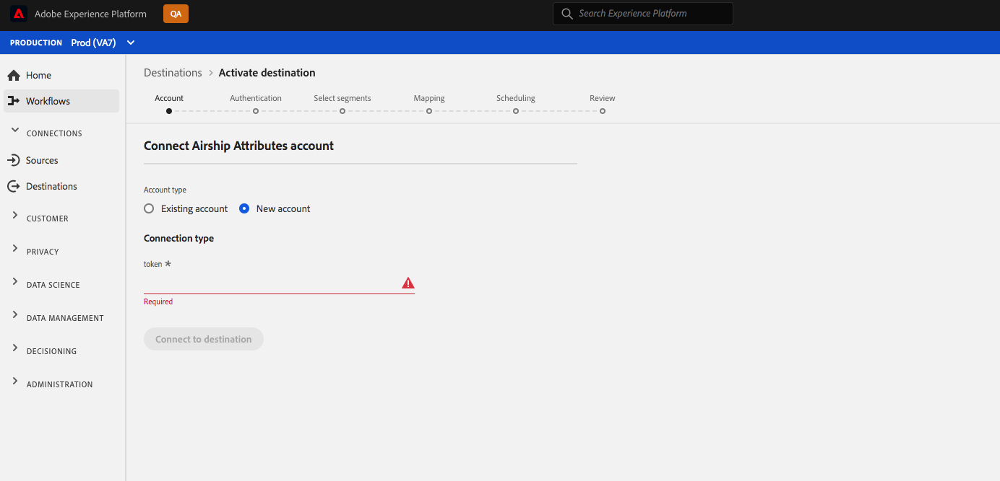
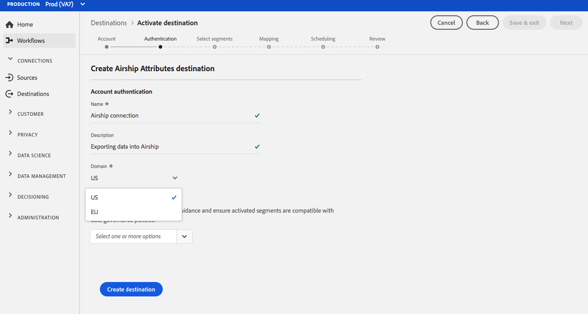

# (Bêta) [!DNL Airship Attributes] connexion {#airship-attributes-destination}

>[!IMPORTANT]
>
>La destination [!DNL Airship Attributes] de Adobe Experience Platform est actuellement en version bêta. La documentation et les fonctionnalités peuvent changer.

## Présentation {#overview}

[!DNL Airship] est la principale plate-forme d’engagement des clients, qui vous aide à fournir à vos utilisateurs un message personnalisé et significatif à chaque étape du cycle de vie des clients.

Cette intégration transmet les données de profil d’Adobe dans [!DNL Airship] en tant que [attributs](https://docs.airship.com/guides/audience/attributes/) pour le ciblage ou le déclenchement.

Pour en savoir plus sur [!DNL Airship], consultez les [Aéronefs Docs](https://docs.airship.com).

>[!TIP]
>
>Cette page de documentation a été créée par l&#39;équipe [!DNL Airship]. Pour toute demande de renseignements ou de mise à jour, contactez-les directement à [support.airship.com](https://support.airship.com/).

## Conditions préalables {#prerequisites}

Avant de pouvoir envoyer vos segments d&#39;audience à [!DNL Airship], vous devez :

* Activez les attributs dans votre projet [!DNL Airship].
* Générez un jeton porteur pour l’authentification.

>[!TIP]
>
>Créez un compte [!DNL Airship] via [ce lien d&#39;inscription](https://go.airship.eu/accounts/register/plan/starter/) si vous n&#39;en avez pas déjà créé.

## Activer les attributs {#enable-attributes}

Les attributs de profil Adobe Experience Platform sont similaires aux attributs [!DNL Airship] et peuvent être facilement mappés les uns aux autres dans Platform à l&#39;aide de l&#39;outil de mappage présenté plus loin dans cette page.

[!DNL Airship] les projets comportent plusieurs attributs prédéfinis et par défaut. Si vous disposez d’un attribut personnalisé, vous devez d’abord le définir dans [!DNL Airship]. Voir [Configuration et gestion des attributs](https://docs.airship.com/tutorials/audience/attributes/) pour plus d’informations.

## Générer un jeton porteur {#bearer-token}

Accédez à **[!UICONTROL Paramètres]**&quot; **[!UICONTROL APIs &amp; Integrations]** dans le [tableau de bord Airship](https://go.airship.com) et sélectionnez **[!UICONTROL Tokens]** dans le menu de gauche.

Cliquez sur **[!UICONTROL Créer un jeton]**.

Attribuez un nom convivial à votre jeton, par exemple &quot;Destination des attributs d’Adobe&quot;, puis sélectionnez &quot;Accès complet&quot; pour le rôle.

Cliquez sur **[!UICONTROL Créer un jeton]** et enregistrez les détails comme confidentiels.

## Cas d’utilisation {#use-cases}

Pour vous aider à mieux comprendre comment et quand utiliser la destination [!DNL Airship Attributes], voici des exemples de cas d&#39;utilisation que les clients Adobe Experience Platform peuvent résoudre en utilisant cette destination.

### Cas d’utilisation 1

Tirez parti des données de profil collectées dans Adobe Experience Platform pour personnaliser le message et le contenu enrichi dans l&#39;un des canaux de [!DNL Airship]. Par exemple, utilisez [!DNL Experience Platform] données de profil pour définir des attributs d&#39;emplacement dans [!DNL Airship]. Cela permet à une marque d&#39;hôtel d&#39;afficher une image de l&#39;emplacement d&#39;hôtel le plus proche pour chaque utilisateur.

### Cas d’utilisation no 2

Tirez parti des attributs de Adobe Experience Platform pour enrichir davantage [!DNL Airship] profils et les combiner avec des données prédictives SDK ou [!DNL Airship]. Par exemple, un détaillant peut créer un segment avec le statut de fidélité et les données d&#39;emplacement (attributs de la plateforme) et [!DNL Airship] prédit d&#39;envoyer des données pour envoyer des messages très ciblés aux utilisateurs ayant le statut de fidélité à l&#39;or qui vivent à Las Vegas, NV, et ont une forte probabilité de déclenchement.

## Se connecter à [!DNL Airship Attributes] {#connect-airship-attributes}

Dans **[!UICONTROL Destinations]** > **[!UICONTROL Catalogue]**, faites défiler la catégorie **[!UICONTROL Mobile Engagement]**. Sélectionnez **[!DNL Airship Attributes]**, puis **[!UICONTROL Configurer]**.

>[!NOTE]
>
>Si une connexion avec cette destination existe déjà, vous pouvez voir un bouton **[!UICONTROL Activer]** sur la carte de destination. Pour plus d&#39;informations sur la différence entre **[!UICONTROL Activer]** et **[!UICONTROL Configurer]**, consultez la section [Catalogue](../../ui/destinations-workspace.md#catalog) de la documentation de l&#39;espace de travail de destination.

À l&#39;étape **Compte**, si vous aviez précédemment configuré une connexion à votre destination [!DNL Airship Attributes], sélectionnez **[!UICONTROL Compte existant]** et sélectionnez votre connexion existante. Vous pouvez également sélectionner **[!UICONTROL Nouveau compte]** pour configurer une nouvelle connexion à [!DNL Airship Attributes]. Sélectionnez **[!UICONTROL Se connecter à destination]** pour connecter Adobe Experience Platform à votre projet [!DNL Airship] à l’aide du jeton porteur que vous avez généré à partir du tableau de bord [!DNL Airship].

>[!NOTE]
>
>Adobe Experience Platform prend en charge la validation des informations d’identification dans le processus d’authentification et affiche un message d’erreur si vous saisissez des informations d’identification incorrectes dans votre compte [!DNL Airship]. Ainsi, vous n’effectuez pas le workflow avec des informations d’identification incorrectes.

Une fois vos informations d’identification confirmées et que Adobe Experience Platform est connecté à votre projet [!DNL Airship], vous pouvez sélectionner **[!UICONTROL Suivant]** pour passer à l’étape **[!UICONTROL Configuration]**.

À l&#39;étape **[!UICONTROL Authentification]**, entrez **[!UICONTROL Nom]** et **[!UICONTROL Description]** pour votre flux d&#39;activation.

Cette étape vous permet également de sélectionner le centre de données des États-Unis ou de l&#39;Union européenne, en fonction du centre de données [!DNL Airship] qui s&#39;applique à cette destination. Enfin, sélectionnez une ou plusieurs **[!UICONTROL actions marketing]** pour lesquelles les données seront exportées vers la destination. Vous pouvez choisir parmi des actions marketing définies par Adobe ou créer les vôtres. Pour plus d&#39;informations sur les actions marketing, consultez la [Présentation des stratégies d&#39;utilisation des données](../../../data-governance/policies/overview.md).

Sélectionnez **[!UICONTROL Créer une destination]** après avoir rempli les champs ci-dessus.

Votre destination est maintenant créée. Vous pouvez sélectionner **[!UICONTROL Enregistrer et quitter]** si vous souhaitez activer les segments ultérieurement. Sélectionnez **[!UICONTROL Suivant]** pour poursuivre le workflow et choisir les segments à activer. Dans les deux cas, consultez la section suivante, [Activer les segments](#activate-segments), pour le reste du flux de travail.

## Activation des segments {#activate-segments}

Pour activer des segments dans [!DNL Airship Attributes], procédez comme suit :

Dans **[!UICONTROL Destinations > Parcourir]**, sélectionnez la destination vers laquelle vous souhaitez activer vos segments.[!DNL Airship Attributes]

Cliquez sur le nom de la destination. Vous accédez ainsi au flux d’activation.

Si un flux d’activation existe déjà pour une destination, vous pouvez voir les segments qui sont actuellement envoyés vers la destination. Sélectionnez **[!UICONTROL Modifier l’activation]** dans le rail de droite et suivez les étapes ci-dessous pour modifier les informations sur l’activation.

Sélectionnez **[!UICONTROL Activer]**. Dans le flux de travaux **[!UICONTROL Activer la destination]**, sur la page **[!UICONTROL Sélectionner des segments]**, sélectionnez les segments à envoyer à [!DNL Airship Attributes].

À l’étape **[!UICONTROL Mappage]**, sélectionnez les attributs et les identités du schéma [XDM](../../../xdm/home.md) à mapper au schéma de destination. Sélectionnez **[!UICONTROL Ajouter un nouveau mappage]** pour parcourir votre schéma et le mapper à l’identité de cible correspondante.

[!DNL Airship] les attributs peuvent être définis soit sur un canal, qui représente l’instance de périphérique, par exemple l’iPhone, soit sur un utilisateur nommé, qui mappe tous les périphériques d’un utilisateur à un identifiant commun, tel qu’un ID de client. Si votre schéma contient des adresses électroniques en texte brut (non hachées) en tant qu’identité Principale, sélectionnez le champ d’adresse électronique dans vos **[!UICONTROL Attributs source]** et faites correspondre l’utilisateur [!DNL Airship] nommé dans la colonne de droite sous **[!UICONTROL Identités de Cible]**, comme illustré ci-dessous.

Pour les identifiants qui doivent être mappés à un canal, c’est-à-dire un périphérique, faites correspondre le canal approprié en fonction de la source. Les images suivantes montrent comment deux mappages sont créés :

* ID de publicité iOS IDFA sur un canal iOS [!DNL Airship]
* Attribut d&#39;Adobe `fullName` à l&#39;attribut [!DNL Airship] &quot;Nom complet&quot;

>[!NOTE]
>
>Utilisez le nom convivial qui apparaît dans le tableau de bord [!DNL Airship] lors de la sélection du champ de cible pour votre mappage d’attributs.

**Identité de mappage**

Sélectionner le champ source :

Sélectionner un champ de cible :

**Attribut de carte**

Sélectionner l&#39;attribut source :

Sélectionner un attribut de cible :

Vérifier le mappage :

Sur la page **[!UICONTROL Planification des segments]**, la planification est actuellement désactivée. Cliquez sur **[!UICONTROL Suivant]** pour passer à l’étape de révision.

Sur la page **[!UICONTROL Vérifier]**, vous pouvez voir un résumé de votre sélection. Sélectionnez **[!UICONTROL Annuler]** pour interrompre le flux, **[!UICONTROL Précédent]** pour modifier vos paramètres ou **[!UICONTROL Terminer]** pour confirmer votre sélection et commencer à envoyer les données à la destination.

>[!IMPORTANT]
>
>Au cours de cette étape, Adobe Experience Platform recherche les violations de stratégie d’utilisation des données. Vous trouverez ci-dessous un exemple de violation d’une stratégie. Vous ne pouvez pas terminer le processus d’activation de segments tant que vous n’avez pas résolu la violation. Pour plus d&#39;informations sur la manière de résoudre les violations de stratégie, voir [Application de la stratégie](../../../data-governance/enforcement/auto-enforcement.md) dans la section de documentation sur la gouvernance des données.

Si aucune violation de stratégie n&#39;a été détectée, sélectionnez **[!UICONTROL Terminer]** pour confirmer votre sélection et l&#39;envoi de données par début vers la destination.

## Utilisation des données et gouvernance {#data-usage-governance}

Toutes les destinations [!DNL Adobe Experience Platform] sont conformes aux règles d&#39;utilisation des données lors de la gestion de vos données. Pour obtenir des informations détaillées sur la façon dont [!DNL Adobe Experience Platform] applique la gouvernance des données, voir [Data Governance overview](../../../data-governance/home.md).
