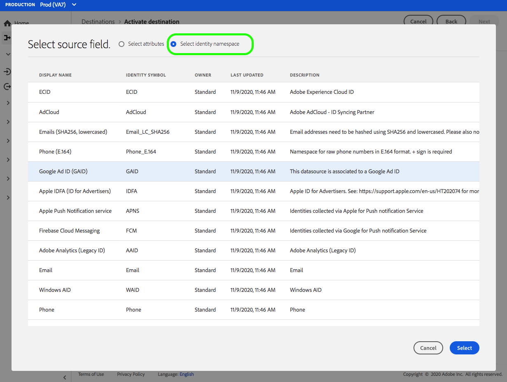
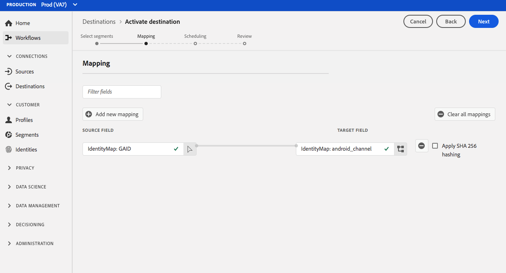

# Connexion [!DNL Airship Tags] {#airship-tags-destination}

## Présentation

[!DNL Airship] est la principale plateforme d’engagement client, qui vous aide à diffuser des messages omnicanaux personnalisés et significatifs à vos utilisateurs à chaque étape du cycle de vie des clients.

Cette intégration transmet les données d’audience Adobe Experience Platform dans [!DNL Airship] en tant que [balises](https://docs.airship.com/guides/audience/tags/) pour le ciblage ou le déclenchement.

Pour en savoir plus sur [!DNL Airship], consultez les [Airship Docs](https://docs.airship.com).

>[!TIP]
>
>Ce connecteur de destination et cette page de documentation sont créés et gérés par l’équipe [!DNL Airship]. Pour toute demande de mise à jour ou de demande de mise à jour, contactez-les directement à l’adresse [support.airship.com](https://support.airship.com/).

## Conditions préalables

Avant d’envoyer vos audiences Adobe Experience Platform vers [!DNL Airship], vous devez :

* Créez un groupe de balises dans votre projet [!DNL Airship].
* Générez un jeton porteur pour l’authentification.

>[!TIP]
> 
>Créez un compte [!DNL Airship] via [ce lien d&#39;inscription](https://go.airship.eu/accounts/register/plan/starter/) si ce n&#39;est déjà fait.

## Audiences prises en charge {#supported-audiences}

Cette section décrit les types d’audiences que vous pouvez exporter vers cette destination.

| Origine de l’audience | Pris en charge | Description |
|---------|----------|----------|
| [!DNL Segmentation Service] | ✓ | Audiences générées par l’Experience Platform [Segmentation Service](../../../segmentation/home.md). |
| Chargements personnalisés | ✓ | Audiences [importées](../../../segmentation/ui/audience-portal.md#import-audience) dans Experience Platform à partir de fichiers CSV. |

{style="table-layout:auto"}

## Type et fréquence d’exportation {#export-type-frequency}

Reportez-vous au tableau ci-dessous pour plus d’informations sur le type et la fréquence d’exportation des destinations.

| Élément | Type | Notes |
---------|----------|---------|
| Type d’exportation | **[!UICONTROL Export d’audience]** | Vous exportez tous les membres d’une audience avec les identifiants utilisés dans la destination des balises de navigation. |
| Fréquence des exportations | **[!UICONTROL Diffusion en continu]** | Les destinations de diffusion en continu sont des connexions basées sur l’API « toujours actives ». Dès qu’un profil est mis à jour dans Experience Platform en fonction de l’évaluation des audiences, le connecteur envoie la mise à jour en aval vers la plateforme de destination. En savoir plus sur les [destinations de diffusion en continu](/help/destinations/destination-types.md#streaming-destinations). |

{style="table-layout:auto"}

## Groupes de balises

Le concept d’audiences dans Adobe Experience Platform est similaire à [Tags](https://docs.airship.com/guides/audience/tags/) dans Airship, avec de légères différences de mise en oeuvre. Cette intégration mappe l’état de l’appartenance [d’un utilisateur dans un segment Experience Platform](../../../xdm/field-groups/profile/segmentation.md) à la présence ou non d’une balise [!DNL Airship]. Par exemple, dans une audience Platform où `xdm:status` devient `realized`, la balise est ajoutée au canal [!DNL Airship] ou l’utilisateur nommé auquel ce profil est mappé. Si `xdm:status` devient `exited`, la balise est supprimée.

Pour activer cette intégration, créez un *groupe de balises* dans [!DNL Airship] nommé `adobe-segments`.

>[!IMPORTANT]
>
>Lors de la création de votre nouveau groupe de balises **Ne cochez pas** le bouton radio qui indique &quot;[!DNL Allow these tags to be set only from your server]&quot;. Ce faisant, l’intégration des balises d’Adobe échouera.

Voir [Gestion des groupes de balises](https://docs.airship.com/tutorials/manage-project/messaging/tag-groups) pour obtenir des instructions sur la création du groupe de balises.

## Générer un jeton porteur

Accédez à **[!UICONTROL Settings]**&quot; **[!UICONTROL APIs &amp; Integrations]** dans le [tableau de bord Airship](https://go.airship.com) et sélectionnez **[!UICONTROL Tokens]** dans le menu de gauche.

Cliquez sur **[!UICONTROL Créer un jeton]**.

Attribuez un nom convivial à votre jeton, par exemple &quot;Destination des balises d’Adobe&quot;, puis sélectionnez &quot;Accès complet&quot; pour le rôle.

Cliquez sur **[!UICONTROL Créer un jeton]** et enregistrez les détails comme confidentiels.

## Cas d’utilisation

Pour vous aider à mieux comprendre comment et à quel moment utiliser la destination [!DNL Airship Tags], voici des exemples de cas d’utilisation que les clients Adobe Experience Platform peuvent résoudre à l’aide de cette destination.

### Cas d’utilisation #1

Les clients au détail ou les plateformes de divertissement peuvent créer des profils utilisateur sur leurs clients fidèles et transmettre ces audiences à [!DNL Airship] pour le ciblage des messages sur les campagnes mobiles.

### Cas d’utilisation #2

Déclenchez des messages un-à-un en temps réel lorsque les utilisateurs entrent ou sortent d’audiences spécifiques dans Adobe Experience Platform.

Par exemple, un détaillant configure une audience spécifique à la marque jeans dans Platform. Ce détaillant peut désormais déclencher un message mobile dès que quelqu’un définit la préférence de son jean sur une marque spécifique.

## Se connecter à la destination {#connect}

>[!IMPORTANT]
> 
>Pour vous connecter à la destination, vous avez besoin des **** et des ****  autorisations de contrôle d’accès. Lisez la [présentation du contrôle d’accès](/help/access-control/ui/overview.md) ou contactez votre administrateur de produit pour obtenir les autorisations requises.

Pour vous connecter à cette destination, procédez comme décrit dans le [tutoriel sur la configuration des destinations](../../ui/connect-destination.md). Dans le workflow de configuration des destinations, renseignez les champs répertoriés dans les deux sections ci-dessous.

### S’authentifier auprès de la destination {#authenticate}

Pour vous authentifier à la destination, renseignez les champs requis et sélectionnez **[!UICONTROL Se connecter à la destination]**.

* **[!UICONTROL Jeton de porteur]** : le jeton de porteur que vous avez généré à partir du tableau de bord [!DNL Airship].

### Renseigner les détails de la destination {#destination-details}

Pour configurer les détails de la destination, renseignez les champs obligatoires et facultatifs ci-dessous. Un astérisque situé en regard d’un champ de l’interface utilisateur indique que le champ est obligatoire.

* **[!UICONTROL Nom]** : saisissez un nom qui vous aidera à identifier cette destination.
* **[!UICONTROL Description]** : saisissez une description pour cette destination.
* **[!UICONTROL Domaine]** : sélectionnez un centre de données des États-Unis ou de l’UE, selon le centre de données [!DNL Airship] qui s’applique à cette destination.

### Activer les alertes {#enable-alerts}

Vous pouvez activer les alertes pour recevoir des notifications sur le statut de votre flux de données vers votre destination. Sélectionnez une alerte dans la liste et abonnez-vous à des notifications concernant le statut de votre flux de données. Pour plus d’informations sur les alertes, consultez le guide sur l’[abonnement aux alertes des destinations dans l’interface utilisateur](../../ui/alerts.md).

Lorsque vous avez terminé de renseigner les détails sur votre connexion de destination, sélectionnez **[!UICONTROL Suivant]**.

## Activer des audiences vers cette destination {#activate}

>[!IMPORTANT]
> 
>Pour activer les données, vous avez besoin des ****, **[!UICONTROL Activer les destinations]**, **** et **** [  autorisations de contrôle d’accès](/help/access-control/home.md#permissions). Lisez la [présentation du contrôle d’accès](/help/access-control/ui/overview.md) ou contactez votre administrateur ou administratrice du produit pour obtenir les autorisations requises.

Voir [Activer les données d’audience vers des destinations d’export d’audiences en flux continu](../../ui/activate-segment-streaming-destinations.md) pour obtenir des instructions sur l’activation des audience vers cette destination.

## Considérations relatives au mappage {#mapping-considerations}

Les balises [!DNL Airship] peuvent être définies sur un canal, qui représente l’instance de l’appareil, par exemple iPhone, ou un utilisateur nommé, qui mappe tous les appareils d’un utilisateur à un identifiant commun, tel qu’un ID de client. Si votre schéma contient des adresses électroniques en texte brut (non hachées) comme identité principale, sélectionnez le champ d’adresse électronique dans vos **[!UICONTROL attributs Source]** et mappez-le à l’utilisateur [!DNL Airship] nommé dans la colonne de droite sous **[!UICONTROL identités cibles]**, comme illustré ci-dessous.

Pour les identifiants qui doivent être mappés à un canal, c’est-à-dire un appareil, mappez-les au canal approprié en fonction de la source. Les images suivantes montrent comment mapper un Advertising ID Google à un canal Android [!DNL Airship].

## Utilisation et gouvernance des données {#data-usage-governance}

Lors de la gestion de vos données, toutes les destinations [!DNL Adobe Experience Platform] se conforment aux politiques d’utilisation des données. Pour plus d’informations sur la manière dont [!DNL Adobe Experience Platform] applique la gouvernance des données, consultez la [présentation de la gouvernance des données](../../../data-governance/home.md).
