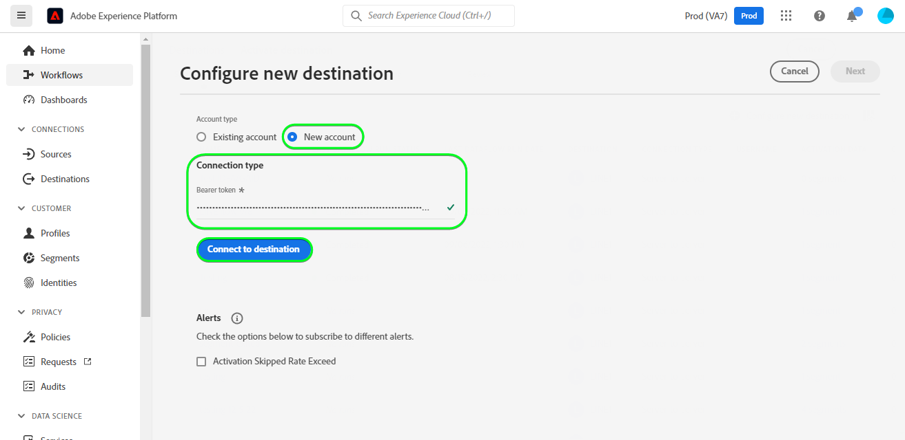

# Connexion [!DNL LINE]

## Présentation {#overview}

[[!DNL LINE]](https://line.me/en/) est une plateforme de communication populaire qui connecte les personnes, les services et l&#39;information et est passée d&#39;une application de chat à un centre de divertissement, social et d&#39;activités quotidiennes.

Cette [!DNL Adobe Experience Platform] [destination](/help/destinations/home.md) utilise l’API [[!DNL LINE] Messaging](https://developers.line.biz/en/reference/messaging-api/). Vous pouvez activer des profils de vos audiences Experience Platform en tant que connexions dans [!DNL LINE] pour les besoins de votre entreprise.

[!DNL LINE] utilise des jetons du porteur comme mécanisme d’authentification pour communiquer avec l’API de messagerie [!DNL LINE]. Les instructions vous permettant de vous authentifier sur votre instance [!DNL LINE] sont plus loin dans la section [Authentifier à la destination](#authenticate).

## Cas d’utilisation {#use-cases}

En tant que spécialiste marketing, vous pouvez cibler les utilisateurs et utilisatrices dans une destination d’engagement mobile, avec des audiences intégrées à [!DNL Adobe Experience Platform]. En outre, vous pouvez leur proposer des expériences personnalisées, en fonction des attributs de leurs profils [!DNL Adobe Experience Platform], dès que les audiences et les profils seront mis à jour dans [!DNL Adobe Experience Platform].

## Conditions préalables {#prerequisites}

### Conditions préalables de [!DNL LINE] {#prerequisites-destination}

Notez les conditions préalables suivantes dans [!DNL LINE], afin d’exporter des données d’Experience Platform vers votre compte [!DNL LINE] :

#### Vous devez avoir un compte [!DNL LINE]. {#prerequisites-account}

Vous devez vous enregistrer et créer un compte [!DNL LINE], si vous n’en avez pas déjà un. Pour créer un compte :

1. Accédez à la page [!DNL LINE] [connexion au compte](https://account.line.biz/login?redirectUri=https%3A%2F%2Fmanager.line.biz%2F)
2. Sélectionnez **[!UICONTROL Create an account]**.

#### Rassemblez le [!DNL LINE channel access token (long-lived)] à partir de la Developer Console [!DNL LINE]. {#gather-credentials}

Pour permettre à Experience Platform d’accéder aux ressources [!DNL LINE], vous devez disposer de l’*[!DNL Channel access token (long-lived)]* du canal [!DNL LINE] *API de messagerie* souhaité.

1. Connectez-vous avec votre compte [!DNL LINE] à la [[!DNL LINE]  Developer Console &#x200B;](https://developers.line.biz/console).
1. Accédez ensuite à la liste *[!DNL Providers]*, puis sélectionnez le *[!DNL Provider]* ciblé et enfin sélectionnez le canal *API de messagerie* pour accéder à ses paramètres. Si vous accédez à Developer Console pour la première fois, suivez la [[!DNL LINE] documentation](https://developers.line.biz/en/docs/messaging-api/getting-started/) afin de suivre les étapes requises pour créer un fournisseur.
1. Enfin, accédez à la section ***[!DNL Channel access token]*** et copiez la valeur ***[!DNL Channel access token (long-lived)]*** requise dans l’étape [S’authentifier auprès de la destination](#authenticate).

| Informations d’identification | Description | Exemple |
| --- | --- | --- |
| `[!DNL Channel access token (long-lived)]` | Votre [!DNL LINE Channel access token (long-lived)]. | `aaa2112XSMWqLXR7..........nyilFU=` |

Reportez-vous à la [[!DNL LINE] documentation](https://developers.line.biz/en/docs/messaging-api/getting-started/) pour obtenir des conseils sur la création d’un canal ou l’ajout d’un canal à votre compte [!DNL LINE] existant via [!DNL LINE] Developers Console.

## Identités prises en charge {#supported-identities}

[!DNL LINE] prend en charge la mise à jour et l’exportation des identités décrites dans le tableau ci-dessous. En savoir plus sur les [identités](/help/identity-service/features/namespaces.md).

| Identité cible | Description |
|---|---|
| ID pour les annonceurs (IFA) | Sélectionnez l’identifiant de l’identité cible des annonceurs (IFA) lorsque les identités sources sont des espaces de noms IFA *(Apple ID pour les annonceurs)* ou GAID *(Google Advertising ID). |
| ID d&#39;utilisateur LINE | Sélectionnez l’identité cible ID utilisateur lorsque les identités sources sont des ID utilisateur LINE. |

## Type et fréquence d’exportation {#export-type-frequency}

Reportez-vous au tableau ci-dessous pour plus d’informations sur le type et la fréquence d’exportation des destinations.

| Élément | Type | Notes |
|---------|----------|---------|
| Type d’exportation | **[!UICONTROL Profile-based]** | Vous exportez tous les profils membres d’une audience ainsi que les identifiants (nom, numéro de téléphone ou autres) utilisés dans la destination [!DNL LINE]. |
| Fréquence des exportations | **[!UICONTROL Streaming]** | Les destinations de diffusion en continu sont des connexions basées sur l’API « toujours actives ». Dès qu’un profil est mis à jour dans Experience Platform en fonction de l’évaluation des audiences, le connecteur envoie la mise à jour en aval vers la plateforme de destination. En savoir plus sur les [destinations de diffusion en continu](/help/destinations/destination-types.md#streaming-destinations). |

{style="table-layout:auto"}

## Se connecter à la destination {#connect}

>[!IMPORTANT]
>
>Pour vous connecter à la destination, vous avez besoin des **[!UICONTROL View Destinations]** et **[!UICONTROL Manage Destinations]** [autorisations de contrôle d’accès](/help/access-control/home.md#permissions). Lisez la [présentation du contrôle d’accès](/help/access-control/ui/overview.md) ou contactez votre administrateur de produit pour obtenir les autorisations requises.

Pour vous connecter à cette destination, procédez comme décrit dans le [tutoriel sur la configuration des destinations](../../ui/connect-destination.md). Dans le workflow de configuration des destinations, renseignez les champs répertoriés dans les deux sections ci-dessous.

Dans **[!UICONTROL Destinations]** > **[!UICONTROL Catalog]**, recherchez [!DNL LINE]. Vous pouvez également localiser cet élément dans la catégorie **[!UICONTROL Mobile engagement]** .

### S’authentifier auprès de la destination {#authenticate}

Pour vous authentifier auprès de la destination, sélectionnez **[!UICONTROL Connect to destination]**.

Renseignez les champs obligatoires ci-dessous.

* **[!UICONTROL Bearer token]** : [!DNL LINE Channel access token (long-lived)] à partir de la Developer Console [!DNL LINE]. Pour plus d&#39;informations, consultez la section [rassembler des informations d&#39;identification](#gather-credentials).

Si les détails fournis sont valides, l’interface utilisateur affiche un statut de **[!UICONTROL Connected]** avec une coche verte. Vous pouvez ensuite passer à l’étape suivante.

### Renseigner les détails de la destination {#destination-details}

Pour configurer les détails de la destination, renseignez les champs obligatoires et facultatifs ci-dessous. Un astérisque situé en regard d’un champ de l’interface utilisateur indique que le champ est obligatoire.

* **[!UICONTROL Name]** : nom par lequel vous reconnaîtrez cette destination à l’avenir.
* **[!UICONTROL Description]** : une description qui vous aidera à identifier cette destination à l’avenir.
* **[!UICONTROL Audience Type]** : sélectionnez **[!UICONTROL ID for Advertisers(IFAs)]** si les identités que vous souhaitez exporter sont de type *ID pour les annonceurs (IFA)*. Sélectionnez **[!UICONTROL LINE user IDs]** si les identités que vous souhaitez exporter sont de type *ID utilisateur LINE*. Reportez-vous à la section [Identités prises en charge](#supported-identities) pour plus d’informations sur les types d’identité.

### Activer les alertes {#enable-alerts}

Vous pouvez activer les alertes pour recevoir des notifications sur le statut de votre flux de données vers votre destination. Sélectionnez une alerte dans la liste et abonnez-vous à des notifications concernant le statut de votre flux de données. Pour plus d’informations sur les alertes, consultez le guide sur l’[abonnement aux alertes des destinations dans l’interface utilisateur](../../ui/alerts.md).

Lorsque vous avez terminé de renseigner les détails sur votre connexion de destination, sélectionnez **[!UICONTROL Next]**.

## Activer des audiences vers cette destination {#activate}

>[!IMPORTANT]
> 
>* Pour activer les données, vous avez besoin des autorisations de contrôle d’accès **[!UICONTROL View Destinations]**, **[!UICONTROL Activate Destinations]**, **[!UICONTROL View Profiles]** et **[!UICONTROL View Segments]** [Access control](/help/access-control/home.md#permissions). Lisez la [présentation du contrôle d’accès](/help/access-control/ui/overview.md) ou contactez votre administrateur ou administratrice du produit pour obtenir les autorisations requises.
>* Pour exporter des *identités*, vous devez disposer de l’autorisation de contrôle d’accès **[!UICONTROL View Identity Graph]**&#x200B;[&#128279;](/help/access-control/home.md#permissions).   {width="100" zoomable="yes"}

Consultez la section [Activer les profils et les audiences vers les destinations d’exportation d’audiences en flux continu](/help/destinations/ui/activate-segment-streaming-destinations.md) pour obtenir des instructions sur l’activation des audiences vers cette destination.

### Mapper les attributs et les identités {#map}

Pour envoyer correctement vos données d’audience d’Adobe Experience Platform vers la destination [!DNL LINE], vous devez passer par l’étape de mappage des champs. Le mappage consiste à créer un lien entre vos champs de schéma de modèle de données d’expérience (XDM) dans votre compte Experience Platform et leurs équivalents issus de la destination cible. Pour mapper correctement vos champs XDM vers les champs de destination [!DNL LINE], procédez comme suit :

Selon votre identité source, le ou les espaces de noms d’identité cible suivants doivent être mappés :

| Identité cible | Champ source | Champ cible |
| --- | --- | --- |
| ID pour les annonceurs (IFA) | `IDFA` ou `GAID`. | `LineId` |
| ID d&#39;utilisateur LINE | `UserID` | `LineId` |

Si vos identités cibles sont des *ID utilisateur LINE* vous aurez besoin des éléments suivants :

Si votre identité cible est *ID pour les annonceurs (IFA)* vous aurez besoin des éléments suivants :

## Valider l’exportation des données {#exported-data}

Une fois l’exportation des données réussie hors d’Experience Platform, la destination [!DNL LINE] crée une audience dans [!DNL LINE] à l’aide du nom d’audience sélectionné.

Pour vérifier que vous avez correctement configuré la destination, procédez comme suit :

1. Dans [!DNL LINE], connectez-vous à la console [Manager](https://manager.line.biz/).

1. Ensuite, accédez à **[!UICONTROL Data Controls]** > **[!UICONTROL Audiences]** et vérifiez le nom correspondant à l’audience sélectionnée dans la colonne **[!UICONTROL Audience name]**.

1. Le volume mis à jour correspondrait au nombre dans le segment.

1. La colonne *Type* indique **[!UICONTROL UserID]** si les identités que vous avez exportées sont de type *UserID*. De même, la colonne *Type* indique **[!UICONTROL Mobile ad Id]** si les identités que vous avez exportées sont de type *IDFA*.

Un exemple de configuration dans [!DNL LINE] est illustré ci-dessous :

## Utilisation et gouvernance des données {#data-usage-governance}

Lors de la gestion de vos données, toutes les destinations [!DNL Adobe Experience Platform] se conforment aux politiques d’utilisation des données. Pour obtenir des informations détaillées sur la manière dont [!DNL Adobe Experience Platform] applique la gouvernance des données, lisez la [présentation de la gouvernance des données](/help/data-governance/home.md).
