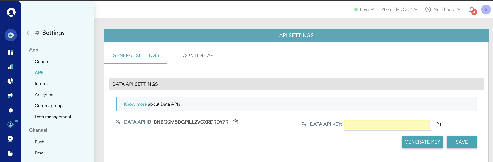

# Connexion [!DNL Moengage]

## Vue d’ensemble {#overview}

Utilisez la destination [!DNL Moengage] pour connecter et mapper vos données Adobe (attributs utilisateur, segments et événements) à MoEngage en temps réel. Les clients et clientes peuvent alors agir sur ces données, en proposant des expériences ciblées et personnalisées.

Avec Adobe, l’intégration est très simple et intuitive. Il vous suffit de prendre n’importe quel profil utilisateur Adobe et de le mapper à un attribut utilisateur MoEngage.

>[!IMPORTANT]
>
>Ce connecteur de destination et cette page de documentation sont créés et conservés par l’équipe *Moengage*. Pour toute question ou demande de mise à jour, contactez directement l’équipe d’Amazon Ads à l’adresse *`https://help.moengage.com/hc/en-us`.*

## Cas d’utilisation {#use-cases}

Un spécialiste marketing souhaite cibler un segment d’utilisateurs (intégré à Adobe Experience Platform) par le biais de campagnes [!DNL Moengage]. En outre, ils souhaitent personnaliser le contenu de la campagne en fonction des attributs des profils Adobe Experience Platform. Avec cette intégration, les utilisateurs et les attributs sont mis à jour dans MoEngage dès que les segments et les profils sont mis à jour dans Adobe Experience Platform.

## Conditions préalables {#prerequisites}

Avant d’envoyer vos données Adobe Experience Platform à [!DNL Moengage], notez les conditions préalables suivantes :

* Pour utiliser la destination MoEngage avec Adobe Experience Platform, les utilisateurs doivent d’abord avoir accès à leur compte [!DNL Moengage]. Consultez la page suivante pour vous inscrire ou vous connecter à votre compte MoEngage : https://app.moengage.com

## Identités prises en charge {#supported-identities}

[!DNL Moengage] prend en charge l’activation des identités décrites dans le tableau ci-dessous.

| Identité cible | Description | Considérations |
|---|------------------------------------------------------------------------------------------|----------------------------------------------------------------------------------------|
| user_id | Identifiant unique qui identifie de manière unique un profil utilisateur dans le système [!DNL Moengage]. | Cet identifiant prend en charge le type chaîne. Un user_id ou un anonymous_id est requis |
| anonymous_id | Un autre identifiant pour un profil utilisateur inconnu, c’est-à-dire un profil qui n’existe pas dans le système. | Cet identifiant prend en charge le type chaîne. Un user_id ou un anonymous_id est requis |

{style="table-layout:auto"}

## Audiences prises en charge {#supported-audiences}

Cette section décrit les types d’audiences que vous pouvez exporter vers cette destination.

| Origine de l’audience | Pris en charge | Description |
|---------|----------|----------|
| [!DNL Segmentation Service] | Oui | Audiences générées via Experience Platform [Segmentation Service](../../../segmentation/home.md). |
| Toutes les autres origines d’audience | Non | Cette catégorie inclut toutes les origines d’audience en dehors des audiences générées par le [!DNL Segmentation Service]. Découvrez les [différentes origines d’audience](/help/segmentation/ui/audience-portal.md#customize). Voici quelques exemples : <ul><li> audiences de chargement personnalisées [importées](../../../segmentation/ui/audience-portal.md#import-audience) dans Experience Platform à partir de fichiers CSV,</li><li> les audiences semblables, </li><li> les audiences fédérées, </li><li> les audiences générées dans d’autres applications Experience Platform telles que Adobe Journey Optimizer, </li><li> et plus encore. </li></ul> |

{style="table-layout:auto"}

Audiences prises en charge par type de données d’audience :

| Type de données d’audience | Pris en charge | Description | Cas d’utilisation |
|--------------------|-----------|-------------|-----------|
| [Audiences de personnes](/help/segmentation/types/people-audiences.md) | Oui | En fonction des profils client, ce qui vous permet de cibler des groupes spécifiques de personnes pour les campagnes marketing. | Acheteurs fréquents, personnes abandonnant leur panier |
| [Audiences de compte](/help/segmentation/types/account-audiences.md) | Non | Ciblez des individus au sein d’organisations spécifiques pour les stratégies marketing basées sur les comptes. | Marketing B2B |
| [Audiences de prospects &#x200B;](/help/segmentation/types/prospect-audiences.md) | Non | Ciblez les individus qui ne sont pas encore clients, mais qui partagent des caractéristiques avec votre audience cible. | Prospection à l’aide de données tierces |
| [Exportations de jeux de données](/help/catalog/datasets/overview.md) | Non | Collections de données structurées stockées dans le lac de données Adobe Experience Platform. | Rapports, workflows de science des données |

{style="table-layout:auto"}

## Type et fréquence d’exportation {#export-type-frequency}

Reportez-vous au tableau ci-dessous pour plus d’informations sur le type et la fréquence d’exportation des destinations.

| Élément | Type | Notes |
|---------|----------|------------------------------------------------------------------------------------------------------------------------------------------------------------------------------------------------------------------------------------------------------------------------------------------------------------------------------------|
| Type d’exportation | **[!UICONTROL Profile-based]** | Vous exportez tous les membres d’un segment (audience) avec les identifiants (user_id, anonymous_id) ainsi que les attributs personnalisés que vous avez définis et que vous avez exportés vers [!DNL Moengage]. |
| Fréquence des exportations | **[!UICONTROL Streaming]** | Les destinations de diffusion en continu sont des connexions basées sur l’API « toujours actives ». Dès qu’un profil est mis à jour dans Experience Platform en fonction de l’évaluation des segments, le connecteur envoie la mise à jour en aval vers la plateforme de destination. En savoir plus sur les [destinations de diffusion en continu](/help/destinations/destination-types.md#streaming-destinations). |

{style="table-layout:auto"}

## Se connecter à la destination {#connect}

>[!IMPORTANT]
> 
>Pour vous connecter à la destination, vous avez besoin des **[!UICONTROL View Destinations]** et **[!UICONTROL Manage Destinations]** [autorisations de contrôle d’accès](/help/access-control/home.md#permissions). Lisez la [présentation du contrôle d’accès](/help/access-control/ui/overview.md) ou contactez votre administrateur de produit pour obtenir les autorisations requises.

Pour vous connecter à cette destination, procédez comme décrit dans le [tutoriel sur la configuration des destinations](../../ui/connect-destination.md). Dans le workflow de configuration des destinations, renseignez les champs répertoriés dans les deux sections ci-dessous.

### S’authentifier auprès de la destination {#authenticate}

Pour vous authentifier auprès de la destination, renseignez les champs requis et sélectionnez **[!UICONTROL Connect to destination]**.

### Renseigner les détails de la destination {#destination-details}

Pour configurer les détails de la destination, renseignez les champs obligatoires et facultatifs ci-dessous. Un astérisque situé en regard d’un champ de l’interface utilisateur indique que le champ est obligatoire.

* **[!UICONTROL USERNAME]** : ID DE L’APPLICATION DE DONNÉES de la page des paramètres [!DNL Moengage] tableau de bord.
* **[!UICONTROL PASSWORD]** : CLÉ DE L’APPLICATION DE DONNÉES de la page paramètres [!DNL Moengage] tableau de bord.

* **[!UICONTROL Name]** : nom par lequel vous reconnaîtrez cette destination à l’avenir.
* **[!UICONTROL Description]** : une description qui vous aidera à identifier cette destination à l’avenir.
* **[!UICONTROL Region]** : votre application *centre de données*.

### Activer les alertes {#enable-alerts}

Vous pouvez activer les alertes pour recevoir des notifications sur le statut de votre flux de données vers votre destination. Sélectionnez une alerte dans la liste et abonnez-vous à des notifications concernant le statut de votre flux de données. Pour plus d’informations sur les alertes, consultez le guide sur l’[abonnement aux alertes des destinations dans l’interface utilisateur](../../ui/alerts.md).

Lorsque vous avez terminé de renseigner les détails sur votre connexion de destination, sélectionnez **[!UICONTROL Next]**.

## Activer des segments vers cette destination {#activate}

>[!IMPORTANT]
> 
>Pour activer les données, vous avez besoin des autorisations de contrôle d’accès **[!UICONTROL View Destinations]**, **[!UICONTROL Activate Destinations]**, **[!UICONTROL View Profiles]** et **[!UICONTROL View Segments]** [Access control](/help/access-control/home.md#permissions). Lisez la [présentation du contrôle d’accès](/help/access-control/ui/overview.md) ou contactez votre administrateur ou administratrice du produit pour obtenir les autorisations requises.

Voir [Activer les données d’audience vers des destinations d’exportation de segments de diffusion en continu](../../ui/activate-segment-streaming-destinations.md) pour obtenir des instructions sur l’activation des segments d’audience vers cette destination.

### Mapper les attributs et les identités {#map}

Pour envoyer correctement vos données d’audience de [!DNL Adobe Experience Platform] vers la destination [!DNL Moengage], vous devez passer par l’étape de mappage des champs.

Le mappage consiste à créer un lien entre vos champs de schéma [!DNL Experience Data Model] (XDM) dans votre compte [!DNL Experience Platform] et leurs équivalents provenant de la destination cible.

Pour mapper correctement vos champs XDM vers les champs de destination [!DNL Moengage], procédez comme suit :

À l’étape [!UICONTROL Mapping], sélectionnez **[!UICONTROL Checkbox]**.

À l’étape [!UICONTROL Mapping], sélectionnez **[!UICONTROL Add new mapping]**.

Dans la section [!UICONTROL Source Field] , sélectionnez le bouton fléché en regard du champ vide.

Dans la fenêtre [!UICONTROL Select source field] , vous pouvez choisir entre deux catégories de champs XDM :

* [!UICONTROL Select attributes] : utilisez cette option pour mapper un champ spécifique de votre schéma XDM à l’attribut [!DNL Moengage].

Choisissez votre champ source, puis sélectionnez **[!UICONTROL Select]**.

Dans la section [!UICONTROL Target Field] , sélectionnez l’icône de mappage à droite du champ.

Dans la fenêtre [!UICONTROL Select target field] , vous pouvez choisir entre deux catégories de champs cibles :

* [!UICONTROL Select identity namespace] : utilisez cette option pour mapper les espaces de noms d’identité [!DNL Experience Platform] aux espaces de noms d’identité [!DNL Moengage].
* [!UICONTROL Select custom attributes] : utilisez cette option pour mapper les attributs XDM aux attributs [!DNL Moengage] personnalisés que vous avez définis dans votre compte [!DNL Moengage].   Vous pouvez également utiliser cette option pour renommer les attributs XDM existants en [!DNL Moengage]. Par exemple, le mappage d’un attribut XDM `lastName` à un attribut `Last_Name` personnalisé dans [!DNL Moengage] crée l’attribut `Last_Name` dans [!DNL Moengage], s’il n’existe pas déjà, et lui associe l’attribut XDM `lastName`.

Choisissez votre champ cible, puis sélectionnez **[!UICONTROL Select]**.

Votre mappage de champs doit maintenant s’afficher dans la liste.

Pour ajouter d’autres mappages, répétez les étapes précédentes.

## Données exportées / Valider l’exportation des données {#exported-data}

Pour vérifier si l’exportation des données vers la destination [!DNL Moengage] a réussi, accédez au profil utilisateur dans votre compte [!DNL Moengage]. Ici, vous devriez trouver un attribut utilisateur nommé `AEPSegments`, créé automatiquement, ainsi que les autres attributs personnalisés qui ont été mappés lors des étapes précédentes dans Adobe Experience Platform.

`AEPSegments` est un attribut de type tableau dans [!DNL Moengage]. Il répertorie tous les noms d’audience Adobe auxquels l’utilisateur est associé dans Experience Platform.

## Utilisation et gouvernance des données {#data-usage-governance}

Lors de la gestion de vos données, toutes les destinations [!DNL Adobe Experience Platform] se conforment aux politiques d’utilisation des données. Pour obtenir des informations détaillées sur la manière dont [!DNL Adobe Experience Platform] applique la gouvernance des données, consultez la [Présentation de la gouvernance des données](/help/data-governance/home.md).
