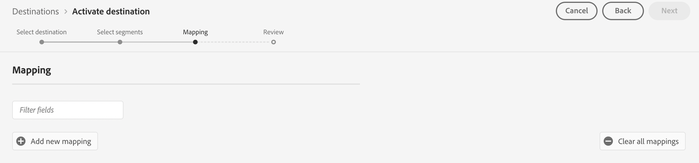

# Connexion [!DNL Moengage]

## Présentation {#overview}

Utilisez la variable [!DNL Moengage] destination pour connecter et mapper vos données d’Adobe (attributs utilisateur, segments et événements) à MoEngage en temps réel. Les clients peuvent alors agir sur ces données, en proposant des expériences ciblées et personnalisées.

Avec l’Adobe, l’intégration est très simple et intuitive. Il vous suffit de prendre n’importe quel profil utilisateur d’Adobe et de le mapper à un attribut utilisateur MoEngage.

>[!IMPORTANT]
>
>Cette page de documentation et de connecteur de destination est créée et conservée par *Moengager* l&#39;équipe. Pour toute demande ou information, contactez directement l’équipe d’Amazon Ads à l’adresse *`https://help.moengage.com/hc/en-us`.*

## Cas d’utilisation {#use-cases}

Un marketeur souhaite cibler un segment d’utilisateurs (intégré à Adobe Experience Platform) via [!DNL Moengage] campagnes. Ils souhaitent également personnaliser le contenu d’une campagne en fonction des attributs des profils Adobe Experience Platform. Avec cette intégration, les utilisateurs et les attributs sont mis à jour dans MoEngage dès que les segments et les profils sont mis à jour dans Adobe Experience Platform.

## Conditions préalables {#prerequisites}

Avant d’envoyer vos données Adobe Experience Platform à [!DNL Moengage], notez les conditions préalables suivantes :

* Pour utiliser la destination MoEngage avec Adobe Experience Platform, les utilisateurs doivent d’abord avoir accès à leur [!DNL Moengage] Compte. Consultez la page suivante pour vous inscrire ou vous connecter à votre compte MoEngage : https://app.moengage.com

## Identités prises en charge {#supported-identities}

[!DNL Moengage] prend en charge l’activation des identités décrites dans le tableau ci-dessous.

| Identité cible | Description | Considérations |
|---|------------------------------------------------------------------------------------------|----------------------------------------------------------------------------------------|
| user_id | Identifiant unique qui identifie de manière unique un profil utilisateur dans la variable [!DNL Moengage] système. | Cet identifiant prend en charge le type de chaîne. L’un des ID utilisateur ou anonymous_id est requis. |
| anonymous_id | Un autre identifiant pour un profil utilisateur inconnu, c’est-à-dire un profil qui n’existe pas dans le système. | Cet identifiant prend en charge le type de chaîne. L’un des ID utilisateur ou anonymous_id est requis. |

{style="table-layout:auto"}

## Type et fréquence d’exportation {#export-type-frequency}

Reportez-vous au tableau ci-dessous pour plus d’informations sur le type et la fréquence d’exportation des destinations.

| Élément | Type | Notes |
---------|----------|------------------------------------------------------------------------------------------------------------------------------------------------------------------------------------------------------------------------------------------------------------------------------------------------------------------------------------|
| Type d’exportation | **[!UICONTROL Basé sur les profils]** | Vous exportez tous les membres d’un segment (audience) avec les identifiants (user_id, anonymous_id) ainsi que les attributs personnalisés définis par votre exportation vers [!DNL Moengage]. |
| Fréquence des exportations | **[!UICONTROL Diffusion en continu]** | Les destinations de diffusion en continu sont des connexions basées sur l’API « toujours actives ». Dès qu’un profil est mis à jour dans Experience Platform en fonction de l’évaluation des segments, le connecteur envoie la mise à jour en aval vers la plateforme de destination. En savoir plus sur les [destinations de diffusion en continu](/help/destinations/destination-types.md#streaming-destinations). |

{style="table-layout:auto"}

## Se connecter à la destination {#connect}

>[!IMPORTANT]
> 
>Pour vous connecter à la destination, vous devez disposer de l’[autorisation de contrôle d’accès](/help/access-control/home.md#permissions) **[!UICONTROL Gérer les destinations]**. Lisez la [présentation du contrôle d’accès](/help/access-control/ui/overview.md) ou contactez votre administrateur de produit pour obtenir les autorisations requises.

Pour vous connecter à cette destination, procédez comme décrit dans le [tutoriel sur la configuration des destinations](../../ui/connect-destination.md). Dans le workflow de configuration des destinations, renseignez les champs répertoriés dans les deux sections ci-dessous.

### S’authentifier auprès de la destination {#authenticate}

Pour vous authentifier à la destination, renseignez les champs requis et sélectionnez **[!UICONTROL Se connecter à la destination]**.

### Renseigner les détails de la destination {#destination-details}

Pour configurer les détails de la destination, renseignez les champs obligatoires et facultatifs ci-dessous. Un astérisque situé en regard d’un champ de l’interface utilisateur indique que le champ est obligatoire.

* **[!UICONTROL USERNAME]**: ID de l’APPLICATION DE DONNÉES de la page des paramètres de [!DNL Moengage] tableau de bord.
* **[!UICONTROL MOT DE PASSE]**: CLÉ DE L’APPLICATION DE DONNÉES à partir de la page des paramètres de [!DNL Moengage] tableau de bord.

* **[!UICONTROL Nom]** : un nom par lequel vous reconnaîtrez cette destination à l’avenir.
* **[!UICONTROL Description]** : une description qui vous aidera à identifier cette destination à l’avenir.
* **[!UICONTROL Région]**: votre application *centre de données*.

### Activer les alertes {#enable-alerts}

Vous pouvez activer les alertes pour recevoir des notifications sur le statut de votre flux de données vers votre destination. Sélectionnez une alerte dans la liste et abonnez-vous à des notifications concernant le statut de votre flux de données. Pour plus d’informations sur les alertes, consultez le guide sur l’[abonnement aux alertes des destinations dans l’interface utilisateur](../../ui/alerts.md).

Lorsque vous avez terminé de renseigner les détails sur votre connexion de destination, sélectionnez **[!UICONTROL Suivant]**.

## Activer des segments vers cette destination {#activate}

>[!IMPORTANT]
> 
>Pour activer les données, vous avez besoin des [autorisations de contrôle d’accès](/help/access-control/home.md#permissions) pour les fonctions **[!UICONTROL Gérer les destinations]**, **[!UICONTROL Activer les destinations]**, **[!UICONTROL Afficher les profils]**, et **[!UICONTROL Afficher les segments]**. Lisez la [présentation du contrôle d’accès](/help/access-control/ui/overview.md) ou contactez votre administrateur de produit pour obtenir les autorisations requises.

Voir [Activer les données d’audience vers des destinations d’exportation de segments de diffusion en continu](../../ui/activate-segment-streaming-destinations.md) pour obtenir des instructions sur l’activation des segments d’audience vers cette destination.

### Mapper les attributs et les identités {#map}

Pour envoyer correctement les données de votre audience à partir de [!DNL Adobe Experience Platform] à la fonction [!DNL Moengage] destination, vous devez passer par l’étape de mappage des champs.

Le mappage consiste à créer un lien entre votre [!DNL Experience Data Model] Champs de schéma (XDM) dans votre [!DNL Platform] et leurs équivalents de la destination cible.

Pour mapper correctement vos champs XDM vers les champs de destination [!DNL Moengage], procédez comme suit :

Dans le [!UICONTROL Mappage] étape, sélectionnez **[!UICONTROL Case à cocher]**.

Dans l’étape [!UICONTROL Mappage], sélectionnez **[!UICONTROL Ajouter un nouveau mappage]**.

Dans le [!UICONTROL Champ source] , sélectionnez la flèche située en regard du champ vide.

Dans le [!UICONTROL Sélectionner le champ source] vous pouvez choisir entre deux catégories de champs XDM :
* [!UICONTROL Sélectionner des attributs]: utilisez cette option pour mapper un champ spécifique de votre schéma XDM à [!DNL Moengage] attribut.

Choisissez votre champ source, puis sélectionnez **[!UICONTROL Sélectionner]**.

Dans le [!UICONTROL Champ cible] , sélectionnez l’icône de mappage située à droite du champ.

Dans le [!UICONTROL Sélectionner le champ cible] , vous pouvez choisir entre deux catégories de champs cibles :
* [!UICONTROL Sélectionner un espace de noms d’identité]: utilisez cette option pour mapper [!DNL Platform] espaces de noms d’identité vers [!DNL Moengage] espaces de noms d’identité.
* [!UICONTROL Sélectionner des attributs personnalisés]: utilisez cette option pour mapper des attributs XDM à des attributs personnalisés [!DNL Moengage] attributs que vous avez définis dans votre [!DNL Moengage] compte .   Vous pouvez également utiliser cette option pour renommer les attributs XDM existants en [!DNL Moengage]. Par exemple, le mappage d’un `lastName` Attribut XDM à un `Last_Name` dans [!DNL Moengage], crée la variable `Last_Name` dans [!DNL Moengage], s’il n’existe pas déjà, et mappez la variable `lastName` Attribut XDM à celui-ci.

Choisissez votre champ cible, puis sélectionnez **[!UICONTROL Sélectionner]**.

Vous devriez maintenant voir votre mappage de champ dans la liste.

Pour ajouter d’autres mappages, répétez les étapes précédentes.

## Données exportées / Valider l’exportation des données {#exported-data}

Pour vérifier si les données ont bien été exportées vers la variable [!DNL Moengage] destination, accédez au profil utilisateur sur votre [!DNL Moengage] compte . Un attribut d’utilisateur appelé Segment AEP s’affiche.

## Utilisation et gouvernance des données {#data-usage-governance}

Lors de la gestion de vos données, toutes les destinations [!DNL Adobe Experience Platform] se conforment aux politiques d’utilisation des données. Pour obtenir des informations détaillées sur la manière dont [!DNL Adobe Experience Platform] applique la gouvernance des données, consultez la [Présentation de la gouvernance des données](/help/data-governance/home.md).

