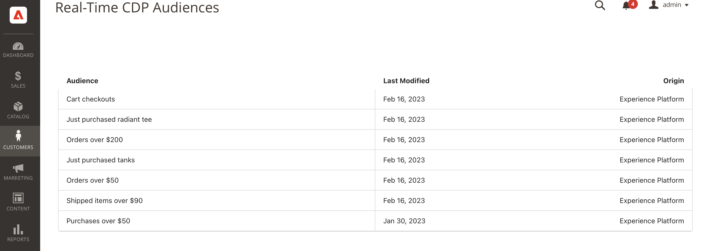

# Connexion Adobe Commerce {#adobe-commerce}

## Présentation {#overview}

Le [!DNL Adobe Commerce] Le connecteur de destination permet de sélectionner une ou plusieurs audiences Real-Time CDP à activer dans votre [!DNL Adobe Commerce] pour offrir une expérience personnalisée dynamique à vos clients. Within [!DNL Adobe Commerce], vous pouvez ensuite sélectionner ces audiences Real-Time CDP pour personnaliser les offres uniques du panier, telles que &quot;Acheter 2 et 1 gratuitement&quot;. Vous pouvez également afficher des bannières à forte identification et modifier le prix des produits au moyen d’offres promotionnelles, toutes personnalisées en fonction des audiences Adobe Real-Time CDP.

## Conditions préalables {#prerequisites}

Ce connecteur est disponible dans le catalogue des destinations pour les clients qui ont acheté Real-Time CDP Prime ou Ultimate et Adobe Commerce.

Pour utiliser cette connexion de destination, vérifiez que vous avez accès aux éléments suivants :

- [Adobe Experience Platform](https://experience.adobe.com/)
- [Adobe Developer Console](https://developer.adobe.com/developer-console/docs/guides/getting-started/). Avec l’accès à Developer Console, vous pouvez afficher les informations de compte de service et d’identification nécessaires pour [terminer la configuration](https://experienceleague.adobe.com/docs/commerce-admin/customers/customers-menu/audience-activation.html#configure-the-extension) de l’extension dans Adobe Commerce.
- [Adobe Commerce Cloud version 2.4.4 ou ultérieure](https://business.adobe.com/fr/products/magento/magento-commerce.html)

Dans Experience Platform, créez les éléments suivants :

- [Schéma](../../../xdm/schema/composition.md). Le schéma que vous créez représente les données que vous prévoyez d’ingérer à partir d’Adobe Commerce. [En savoir plus](https://experienceleague.adobe.com/docs/commerce-merchant-services/experience-platform-connector/fundamentals/update-xdm.html?lang=fr) sur la création d’un schéma contenant des groupes de champs spécifiques à Commerce.
- [Jeu de données](../../../catalog/datasets/user-guide.md#create). Un jeu de données est une structure de stockage et de gestion pour une collection de données. Vous créez ce jeu de données à partir du schéma que vous avez créé ci-dessus.
- [Flux de données](../../../edge/datastreams/overview.md#create). Identifiant qui permet aux données de passer d’Adobe Experience Platform à d’autres produits DX d’Adobe. Cet identifiant doit être associé à un site web spécifique au sein de votre instance Adobe Commerce spécifique. Lorsque vous créez ce train de données, spécifiez le schéma XDM que vous avez créé ci-dessus.

Une fois les conditions préalables remplies, connectez-vous à la destination [!DNL Commerce].

## Se connecter à la destination {#connect}

>[!IMPORTANT]
> 
>Pour vous connecter à la destination, vous devez disposer de l’[autorisation de contrôle d’accès](/help/access-control/home.md#permissions) **[!UICONTROL Gérer les destinations]**. Lisez la [présentation du contrôle d’accès](/help/access-control/ui/overview.md) ou contactez votre administrateur de produit pour obtenir les autorisations requises.

Pour vous connecter à la destination [!DNL Adobe Commerce] :

1. Dans [l’interface de Platform](https://experience.adobe.com/platform/), accédez à **[!UICONTROL Destinations]** > **[!UICONTROL Catalogue]**.
1. Sélectionnez **[!UICONTROL Personnalisation]**.
1. Sélectionnez la destination Adobe Commerce à mettre en surbrillance, puis **[!UICONTROL Configuration]**.
1. Suivez les étapes décrites dans le [tutoriel sur la configuration des destinations](../../ui/connect-destination.md).

### Paramètres de connexion {#parameters}

Pendant la [configuration](../../ui/connect-destination.md) de cette destination, vous devez fournir les informations suivantes :

- **[!UICONTROL Nom]** : renseignez le nom de votre choix pour cette destination.
- **[!UICONTROL Description]** : saisissez une description pour votre destination. Vous pouvez, par exemple, mentionner la campagne pour laquelle vous utilisez cette destination. Ce champ est facultatif.
- **[!UICONTROL Alias d’intégration]** : cette valeur est envoyée au SDK web Experience Platform sous forme de nom d’objet JSON.
- **[!UICONTROL Identifiant du flux de données]**: Cela détermine la banque de données de collecte de données qui contient les audiences incluses dans la réponse à la page. Le menu déroulant affiche uniquement les flux de données pour lesquels la configuration de destination est activée. Voir [Configurer un flux de données](../../../edge/datastreams/overview.md) pour plus d’informations.

### Activer les alertes {#enable-alerts}

Vous pouvez activer les alertes pour recevoir des notifications sur le statut de votre flux de données vers votre destination. Sélectionnez une alerte dans la liste et abonnez-vous à des notifications concernant le statut de votre flux de données. Pour plus d’informations sur les alertes, consultez le guide sur l’[abonnement aux alertes des destinations dans l’interface utilisateur](../../ui/alerts.md).

Lorsque vous avez terminé de renseigner les détails sur votre connexion de destination, sélectionnez **[!UICONTROL Suivant]**.

## Activez les audiences sur la variable [!DNL Commerce] destination {#activate}

>[!IMPORTANT]
> 
>Pour activer les données, vous avez besoin des [autorisations de contrôle d’accès](/help/access-control/home.md#permissions) pour les fonctions **[!UICONTROL Gérer les destinations]**, **[!UICONTROL Activer les destinations]**, **[!UICONTROL Afficher les profils]**, et **[!UICONTROL Afficher les segments]**. Lisez la [présentation du contrôle d’accès](/help/access-control/ui/overview.md) ou contactez votre administrateur de produit pour obtenir les autorisations requises.

Lecture [Activation des profils et des segments vers les destinations de requête de profil](../../ui/activate-edge-personalization-destinations.md) pour obtenir des instructions sur l’activation des audiences dans la variable [!DNL Commerce] destination.

## Étapes suivantes dans [!DNL Adobe Commerce]

Maintenant que vous avez configuré la variable [!DNL Commerce] destination dans Experience Platform, vous devez installer la variable [!DNL Audience Activation] extension dans [!DNL Commerce] et configurez la variable [!DNL Commerce Admin] pour importer les audiences Real-Time CDP que vous avez créées. Consultez la [[!DNL Commerce] documentation](https://experienceleague.adobe.com/docs/commerce-admin/customers/customers-menu/audience-activation.html) pour en savoir plus.

## Valider l’activation de l’audience dans Commerce {#exported-data}

Après avoir activé les audiences Real-Time CDP sur votre [!DNL Adobe Commerce] vous verrez ces audiences disponibles lorsque vous accédez au _Administration_ barre latérale, puis accédez à **[!UICONTROL Clients]** > **[!UICONTROL Audience CDP en temps réel]**.

## Utilisation et gouvernance des données {#data-usage-governance}

Lors de la gestion de vos données, toutes les destinations [!DNL Adobe Experience Platform] se conforment aux politiques d’utilisation des données. Pour obtenir des informations détaillées sur la manière dont [!DNL Adobe Experience Platform] applique la gouvernance des données, consultez la [Présentation de la gouvernance des données](/help/data-governance/home.md).
