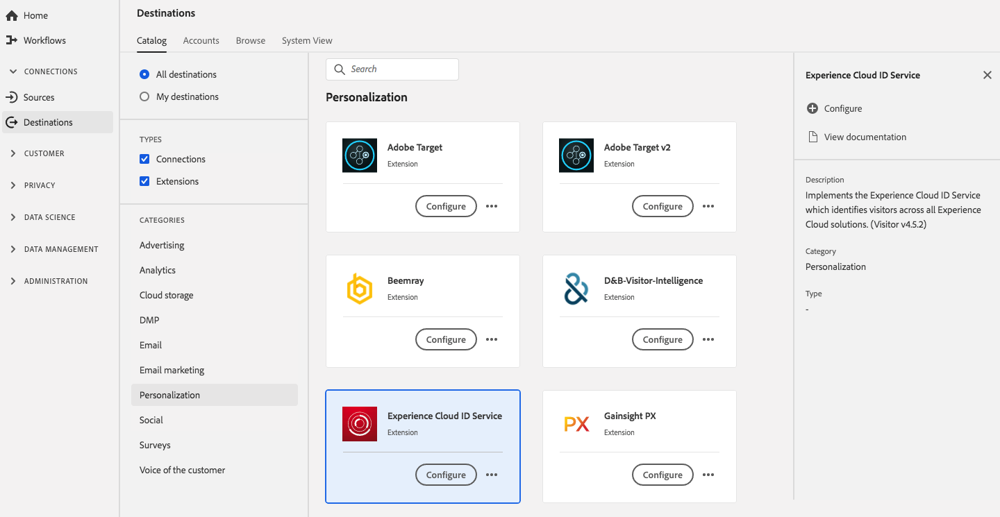

# [!DNL Experience Cloud] Extension du service d’ID {#adobe-ecid-extension}

## Présentation {#overview}

Cette extension met en oeuvre le service [!DNL Experience Cloud] ID qui identifie les visiteurs à l’échelle de toutes les solutions [!DNL Experience Cloud].

[!DNL Experience Cloud] Le service d’ID est une extension de personnalisation de Adobe Experience Platform. Pour plus d’informations sur les fonctionnalités de l’extension, consultez la [page d’extension du service Experience Cloud ID](../../../tags/extensions/web/id-service/overview.md) dans la documentation [!DNL Experience Platform Launch]

Cette destination est une extension [!DNL Adobe Experience Platform Launch]. Pour plus d’informations sur le fonctionnement des extensions [!DNL Platform Launch] dans Platform, voir [Présentation des extensions Experience Platform Launch](../launch-extensions/overview.md).

## Conditions préalables  {#prerequisites}

Cette extension est disponible dans le catalogue des destinations pour tous les clients qui ont acheté Platform.

Pour utiliser cette extension, vous devez accéder à [!DNL Experience Platform Launch]. [!DNL Experience Platform Launch] est proposée aux clients Adobe Experience Cloud en tant que fonctionnalité à valeur ajoutée incluse. Contactez l’administrateur de votre organisation pour accéder à [!DNL Launch] et demandez-lui de vous accorder l’autorisation **[!UICONTROL manage_properties]** afin que vous puissiez installer les extensions.

## Installation de l’extension {#install-extension}

Pour installer l’extension du service d’ID [!DNL Experience Cloud] :

Dans l’ [interface de Platform](http://platform.adobe.com/), accédez à **[!UICONTROL Destinations]** > **[!UICONTROL Catalogue]**.

Sélectionnez l’extension dans le catalogue ou utilisez la barre de recherche.

Cliquez sur la destination pour la mettre en surbrillance, puis sélectionnez **[!UICONTROL Configurer]** dans le rail de droite. Si le contrôle **[!UICONTROL Configure]** est grisé, vous ne disposez pas de l’autorisation **[!UICONTROL manage_properties]**. Voir les [Conditions préalables](#prerequisites).

Dans la fenêtre **[!UICONTROL Sélectionner la propriété de Platform launch disponible]** , sélectionnez la propriété [!DNL Platform Launch] dans laquelle vous souhaitez installer l’extension. Vous pouvez aussi créer une nouvelle propriété dans [!DNL Platform Launch]. Une propriété est un ensemble de règles, d’éléments de données, d’extensions configurées, d’environnements et de bibliothèques. Pour en savoir plus sur les propriétés, consultez la [section de la page Propriétés](../../../tags/ui/administration/companies-and-properties.md#properties-page) de la documentation de [!DNL Launch]

Le workflow permet d’accéder à [!DNL Platform Launch] pour terminer l’installation.

Pour plus d’informations sur les options de configuration de l’extension et sur l’aide à l’installation, consultez la [page d’extension du service Experience Cloud ID](../../../tags/extensions/web/id-service/overview.md) dans la documentation [!DNL Experience Launch]

Vous pouvez également installer l’extension directement dans l’[interface Adobe Experience Platform Launch](https://launch.adobe.com/). Consultez la section [Ajout d’une nouvelle extension](../../../tags/ui/managing-resources/extensions/overview.md#add-a-new-extension) de la documentation de [!DNL Platform Launch]

## Utilisation de l’extension {#how-to-use}

Une fois que vous avez installé l’extension, vous pouvez commencer à configurer des règles pour cette extension directement dans [!DNL Platform Launch].

Dans [!DNL Platform Launch], vous pouvez configurer des règles pour vos extensions installées afin d’envoyer des données d’événement vers la destination de l’extension uniquement dans certains cas. Pour plus d’informations sur la configuration de règles pour vos extensions, consultez la [documentation des règles](../../../tags/ui/managing-resources/rules.md).

## Configuration, mise à niveau et suppression de l’extension {#configure-upgrade-delete}

Vous pouvez configurer, mettre à niveau et supprimer des extensions dans l’interface [!DNL Platform Launch].

>[!TIP]
>
>Si l’extension est déjà installée sur l’une de vos propriétés, l’interface utilisateur de Platform affiche toujours **[!UICONTROL Install]** pour l’extension. Démarrez le workflow d’installation comme décrit dans [Installer l’extension](#install-extension) pour accéder à et configurer ou supprimer votre extension.[!DNL Platform Launch]

Pour mettre à niveau votre extension, consultez la section [Mise à niveau d’extension](../../../tags/ui/managing-resources/extensions/extension-upgrade.md) dans la documentation de [!DNL Platform Launch]
