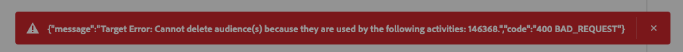

# Connexion Adobe Target {#adobe-target-connection}

## Journal des modifications de destination {#changelog}

| Mois de publication | Type de mise à jour | Description |
|---|---|---|
| Avril 2024 | Nouvelles fonctionnalités et mise à jour de la documentation | Lors de la connexion à la destination Target et de l’utilisation d’un identifiant de flux de données, vous *n’avez désormais plus besoin de* pour activer nécessairement le flux de données pour la segmentation de périphérie. Cela signifie que la destination Target fonctionnera avec les audiences par lots et en flux continu, bien que les cas d’utilisation que vous pouvez accomplir diffèrent. Pour plus d’informations, consultez le tableau de la section [paramètres de connexion](#parameters) . |
| Janvier 2024 | Nouvelles fonctionnalités et mise à jour de la documentation | Vous pouvez désormais partager des audiences et des attributs de profil avec la connexion Adobe Target pour l’environnement de test de production par défaut et d’autres environnements de test autres que ceux par défaut. |
| Juin 2023 | Nouvelles fonctionnalités et mise à jour de la documentation | Depuis juin 2023, vous pouvez sélectionner l’espace de travail Adobe Target auquel vous souhaitez partager des audiences lors de la configuration d’une nouvelle connexion à la destination Adobe Target. Consultez la section [Paramètres de connexion](#parameters) pour plus d’informations. En outre, consultez le tutoriel sur la [configuration des espaces de travail](https://experienceleague.adobe.com/docs/target-learn/tutorials/administration/set-up-workspaces.html?lang=fr) dans Adobe Target pour plus d’informations sur les espaces de travail. |
| Mai 2023 | Nouvelles fonctionnalités et mise à jour de la documentation | Depuis mai 2023, la connexion **[!UICONTROL Adobe Target]** prend en charge la [personnalisation basée sur les attributs](../../ui/activate-edge-personalization-destinations.md#map-attributes) et est généralement disponible pour tous les clients. |

{style="table-layout:auto"}

## Présentation {#overview}

Adobe Target est une application qui permet la personnalisation et l’expérimentation en temps réel, grâce à l’IA, au niveau de toutes les interactions avec les clients entrants sur les sites web, les applications mobiles, etc.

Adobe Target est une connexion de personnalisation dans le catalogue des destinations Adobe Experience Platform.

## Vue d’ensemble des vidéos {#video-overview}

Pour un bref aperçu de la configuration de la connexion Adobe Target dans Experience Platform, regardez la vidéo ci-dessous.

>[!VIDEO](https://video.tv.adobe.com/v/3418799/?quality=12&learn=on)

## Cas d’utilisation pris en charge en fonction du type d’implémentation {#supported-use-cases}

Le tableau ci-dessous présente les cas d’utilisation pris en charge pour la destination Adobe Target, en fonction de votre type d’implémentation, avec ou sans [SDK Web](/help/web-sdk/home.md) et avec ou sans [segmentation Edge](/help/segmentation/home.md#edge) activée.

| Mise en oeuvre d’Adobe Target *sans* SDK Web | Mise en oeuvre d’Adobe Target *avec* SDK Web | Mise en oeuvre d’Adobe Target *avec* SDK Web *et* segmentation de périphérie |
|---|---|---|
| <ul><li>Un flux de données n’est pas requis. Adobe Target peut être déployé par l’intermédiaire des méthodes d’implémentation [at.js](https://experienceleague.adobe.com/docs/target-dev/developer/client-side/at-js-implementation/overview.html), [côté serveur](https://experienceleague.adobe.com/docs/target-dev/developer/overview.html#server-side-implementation) ou [hybride](https://experienceleague.adobe.com/docs/target-dev/developer/overview.html#hybrid-implementation).</li><li>[La segmentation Edge](../../../segmentation/ui/edge-segmentation.md) n’est pas prise en charge.</li><li>[La personnalisation de la même page et de la page suivante](../../ui/activate-edge-personalization-destinations.md) ne sont pas prises en charge.</li><li>Vous pouvez partager des audiences et des attributs de profil avec la connexion Adobe Target pour l’ *environnement de test de production par défaut* et les environnements de test autres que les environnements par défaut.</li><li>Pour configurer la personnalisation de la prochaine session sans utiliser d’identifiant de flux de données, utilisez [at.js](https://experienceleague.adobe.com/docs/target/using/implement-target/client-side/at-js-implementation/at-js/how-atjs-works.html).</li></ul> | <ul><li>Un flux de données avec Adobe Target et Experience Platform configurés en tant que services est requis.</li><li>La segmentation Edge fonctionne comme prévu.</li><li>[La personnalisation de la même page et de la page suivante](../../ui/activate-edge-personalization-destinations.md#use-cases) sont prises en charge.</li><li>Le partage d’audiences et d’attributs de profil à partir d’autres environnements de test est pris en charge.</li></ul> | <ul><li>Un flux de données avec Adobe Target et Experience Platform configurés en tant que services est requis.</li><li>Lors de la [configuration de la banque de données](/help/destinations/ui/activate-edge-personalization-destinations.md#configure-datastream), ne cochez pas la case **Segmentation Edge** .</li><li>[La personnalisation de session suivante](../../ui/activate-edge-personalization-destinations.md#next-session) est prise en charge.</li><li>Le partage d’audiences et d’attributs de profil à partir d’autres environnements de test est pris en charge.</li></ul> |

## Conditions préalables {#prerequisites}

### Identifiant du flux de données {#datastream-id}

Lors de la configuration de la connexion Adobe Target à [, utilisez un ID de flux de données ](#parameters). Le [ SDK Web Adobe Experience Platform](/help/web-sdk/home.md) doit être implémenté.

La configuration de la connexion Adobe Target sans utiliser d’identifiant de flux de données ne nécessite pas l’implémentation du SDK Web.

>[!IMPORTANT]
>
>Avant de créer une connexion [!DNL Adobe Target], lisez le guide sur la façon de [configurer des destinations de personnalisation pour la personnalisation de la même page et de la page suivante](../../ui/activate-edge-personalization-destinations.md). Ce guide décrit les étapes de configuration requises pour les cas d’utilisation de la personnalisation de la même page et de la page suivante, pour plusieurs composants Experience Platform. Pour réaliser des cas d’utilisation de la personnalisation de la même page et de la page suivante, vous devez utiliser un identifiant de flux de données lors de la configuration de la connexion Adobe Target.

### Conditions préalables dans Adobe Target {#prerequisites-in-adobe-target}

Dans Adobe Target, assurez-vous que votre utilisateur dispose des éléments suivants :

* Accès à l’ [espace de travail par défaut](https://experienceleague.adobe.com/docs/target/using/administer/manage-users/enterprise/property-channel.html#default-workspace) ;
* **Approbateur** [rôle](https://experienceleague.adobe.com/docs/target/using/administer/manage-users/enterprise/property-channel.html#roles-and-permissions).

En savoir plus sur l&#39;octroi d&#39;autorisations pour [Target Premium](https://experienceleague.adobe.com/docs/target/using/administer/manage-users/enterprise/properties-overview.html#section_8C425E43E5DD4111BBFC734A2B7ABC80) et pour [Target Standard](https://experienceleague.adobe.com/docs/target/using/administer/manage-users/users/user-management.html#roles-permissions).

## Audiences prises en charge {#supported-audiences}

Cette section décrit les types d’audiences que vous pouvez exporter vers cette destination.

>[!IMPORTANT]
>
>Lors de l’activation des *audiences Edge pour les cas d’utilisation de personnalisation de la même page et de la page suivante*, les audiences *doivent* utiliser une [stratégie de fusion active sur la page suivante](../../../segmentation/ui/segment-builder.md#merge-policies). La stratégie de fusion [!DNL active-on-edge] garantit que les audiences sont constamment évaluées [sur la périphérie](../../../segmentation/ui/edge-segmentation.md) et qu’elles sont disponibles pour les cas d’utilisation de la personnalisation en temps réel et de la page suivante.  Lisez environ [tous les cas d’utilisation disponibles](#parameters), en fonction du type d’implémentation.
>Si vous mappez des audiences de périphérie qui utilisent une stratégie de fusion différente vers des destinations Adobe Target, ces audiences ne seront pas évaluées pour les cas d’utilisation en temps réel et de la page suivante.
>Suivez les instructions de la section [création d’une politique de fusion](../../../profile/merge-policies/ui-guide.md#create-a-merge-policy) et assurez-vous d’activer le bouton **[!UICONTROL Politique de fusion Active-On-Edge]**.

| Origine de l’audience | Pris en charge | Description |
|---------|----------|----------|
| [!DNL Segmentation Service] | ✓ | Audiences générées par l’Experience Platform [Segmentation Service](../../../segmentation/home.md). |
| Chargements personnalisés | X | Audiences [importées](../../../segmentation/ui/audience-portal.md#import-audience) dans Experience Platform à partir de fichiers CSV. |

{style="table-layout:auto"}

## Type et fréquence d’exportation {#export-type-frequency}

Reportez-vous au tableau ci-dessous pour plus d’informations sur le type et la fréquence d’exportation des destinations.

| Élément | Type | Notes |
|---------|----------|---------|
| Type d’exportation | **[!DNL Profile request]** | Vous demandez toutes les audiences qui sont mappées dans la destination Adobe Target pour un seul profil. |
| Fréquence des exportations | **[!UICONTROL Diffusion en continu]** | Les destinations de diffusion en continu sont des connexions basées sur l’API « toujours actives ». Dès qu’un profil est mis à jour dans Experience Platform en fonction de l’évaluation des audiences, le connecteur envoie la mise à jour en aval vers la plateforme de destination. En savoir plus sur les [destinations de diffusion en continu](/help/destinations/destination-types.md#streaming-destinations). |

{style="table-layout:auto"}

## Se connecter à la destination {#connect}

>[!CONTEXTUALHELP]
>id="platform_destinations_target_datastream"
>title="À propos des identifiants de flux de données"
>abstract="Cette option détermine dans quel train de données de collecte de données les audiences seront inclues. Le menu déroulant affiche uniquement les trains de données pour lesquels la configuration cible est activée. Pour utiliser la segmentation Edge, vous devez sélectionner un identifiant de train de données. Si vous sélectionnez Aucun, tous les cas d&#39;utilisation qui utilisent la segmentation Edge sont désactivés."
>additional-url="https://experienceleague.adobe.com/docs/experience-platform/destinations/catalog/personalization/adobe-target-connection.html?lang=fr#parameters" text="En savoir plus sur la sélection des trains de données"

>[!IMPORTANT]
> 
>Pour vous connecter à la destination, vous avez besoin des **** et des ****  autorisations de contrôle d’accès. Lisez la [présentation du contrôle d’accès](/help/access-control/ui/overview.md) ou contactez votre administrateur ou administratrice du produit pour obtenir les autorisations requises.

Pour vous connecter à cette destination, procédez comme décrit dans la section [tutoriel sur la configuration des destinations](../../ui/connect-destination.md).

Adobe Experience Platform se connecte automatiquement à l’instance Adobe Target de votre entreprise. Aucune authentification n’est requise.

### Paramètres de connexion {#parameters}

>[!CONTEXTUALHELP]
>id="platform_destinations_target_workspace"
>title="À propos des espaces de travail Adobe Target"
>abstract="Sélectionnez l’espace de travail Adobe Target vers lequel les audiences seront partagées. Vous pouvez sélectionner un seul espace de travail pour chaque connexion Adobe Target. Lors de l’activation, les audiences sont acheminées vers l’espace de travail sélectionné tout en suivant les libellés d’utilisation des données Experience Platform applicables."
>additional-url="https://experienceleague.adobe.com/docs/target-learn/tutorials/administration/set-up-workspaces.html?lang=fr" text="En savoir plus sur les espaces de travail Adobe Target"

Pendant la [configuration](../../ui/connect-destination.md) de cette destination, vous devez fournir les informations suivantes :

* **Nom** : renseignez le nom de votre choix pour cette destination.
* **Description** : saisissez une description pour votre destination. Vous pouvez, par exemple, mentionner la campagne pour laquelle vous utilisez cette destination. Ce champ est facultatif.
* **Identifiant du flux de données** : détermine dans quel flux de données de collecte de données les audiences seront incluses. Le menu déroulant affiche uniquement les flux de données pour lesquels les services Target et Adobe Experience Platform sont activés. Pour plus d’informations sur la configuration d’un flux de données pour Adobe Experience Platform et Adobe Target, voir [Configuration d’un flux de données](../../../datastreams/configure.md#aep) .

  >[!IMPORTANT]
  >
  >L’identifiant de flux de données est unique pour chaque connexion de destination Adobe Target. Vous ne pouvez pas utiliser le même identifiant de flux de données pour plusieurs connexions de destination Adobe Target.
  >Si vous devez mapper les mêmes audiences à plusieurs jeux de données, vous devez [créer une nouvelle connexion de destination](../../ui/connect-destination.md) pour chaque identifiant de flux de données, et passer par le [flux d’activation d’audience](#activate).

   * **[!UICONTROL Aucun]** : sélectionnez cette option si vous devez configurer la personnalisation Adobe Target, mais que vous ne pouvez pas implémenter le [SDK Web Experience Platform](/help/web-sdk/home.md). Lorsque vous utilisez cette option, les audiences exportées d’Experience Platform vers Target ne prennent en charge que la personnalisation de la prochaine session, et la segmentation Edge est désactivée. Consultez le tableau de la section [Cas d’utilisation pris en charge](#supported-use-cases) pour une comparaison des cas d’utilisation disponibles par type d’implémentation.

  | Mise en oeuvre d’Adobe Target *sans* SDK Web | Mise en oeuvre d’Adobe Target *avec* SDK Web | Mise en oeuvre d’Adobe Target *avec* SDK Web *et* segmentation de périphérie |
  |---|---|---|
  | <ul><li>Un flux de données n’est pas requis. Adobe Target peut être déployé par l’intermédiaire des méthodes d’implémentation [at.js](https://experienceleague.adobe.com/docs/target-dev/developer/client-side/at-js-implementation/overview.html), [côté serveur](https://experienceleague.adobe.com/docs/target-dev/developer/overview.html#server-side-implementation) ou [hybride](https://experienceleague.adobe.com/docs/target-dev/developer/overview.html#hybrid-implementation).</li><li>[La segmentation Edge](../../../segmentation/ui/edge-segmentation.md) n’est pas prise en charge.</li><li>[La personnalisation de la même page et de la page suivante](../../ui/activate-edge-personalization-destinations.md) ne sont pas prises en charge.</li><li>Vous pouvez partager des audiences et des attributs de profil avec la connexion Adobe Target pour l’ *environnement de test de production par défaut* et les environnements de test autres que les environnements par défaut.</li><li>Pour configurer la personnalisation de la prochaine session sans utiliser d’identifiant de flux de données, utilisez [at.js](https://experienceleague.adobe.com/docs/target/using/implement-target/client-side/at-js-implementation/at-js/how-atjs-works.html).</li></ul> | <ul><li>Un flux de données avec Adobe Target et Experience Platform configurés en tant que services est requis.</li><li>La segmentation Edge fonctionne comme prévu.</li><li>[La personnalisation de la même page et de la page suivante](../../ui/activate-edge-personalization-destinations.md#use-cases) sont prises en charge.</li><li>Le partage d’audiences et d’attributs de profil à partir d’autres environnements de test est pris en charge.</li></ul> | <ul><li>Un flux de données avec Adobe Target et Experience Platform configurés en tant que services est requis.</li><li>Lors de la [configuration de la banque de données](/help/destinations/ui/activate-edge-personalization-destinations.md#configure-datastream), ne cochez pas la case **Segmentation Edge** .</li><li>[La personnalisation de session suivante](../../ui/activate-edge-personalization-destinations.md#next-session) est prise en charge.</li><li>Le partage d’audiences et d’attributs de profil à partir d’autres environnements de test est pris en charge.</li></ul> |

* **Workspace** : sélectionnez l’ [espace de travail](https://experienceleague.adobe.com/docs/target-learn/tutorials/administration/set-up-workspaces.html?lang=fr) Adobe Target vers lequel les audiences seront partagées. Vous pouvez sélectionner un seul espace de travail pour chaque connexion Adobe Target. Lors de l’activation, les audiences sont acheminées vers l’espace de travail sélectionné tout en suivant les [libellés d’utilisation des données Experience Platform](../../../data-governance/labels/overview.md) applicables.

>[!NOTE]
>
>Lors de l’utilisation d’un espace de travail Target personnalisé pour la personnalisation de la même page et de la page suivante avec des attributs](../../ui/activate-edge-personalization-destinations.md), seules les [ audiences sélectionnées](../../ui/activate-edge-personalization-destinations.md#select-audiences) sont envoyées à l’espace de travail Target sélectionné. [ Les [attributs mappés](../../ui/activate-edge-personalization-destinations.md#mapping) sont envoyés à l’espace de travail Target par défaut.
> 
>Ce comportement changera lors d’une prochaine mise à jour.

### Activer les alertes {#enable-alerts}

Vous pouvez activer les alertes pour recevoir des notifications sur le statut de votre flux de données vers votre destination. Sélectionnez une alerte dans la liste et abonnez-vous à des notifications concernant le statut de votre flux de données. Pour plus d’informations sur les alertes, consultez le guide sur l’[abonnement aux alertes des destinations dans l’interface utilisateur](../../ui/alerts.md).

Lorsque vous avez terminé de renseigner les détails sur votre connexion de destination, sélectionnez **[!UICONTROL Suivant]**.

## Activer des audiences vers cette destination {#activate}

>[!IMPORTANT]
> 
>Pour activer les données, vous avez besoin des ****, **[!UICONTROL Activer les destinations]**, **** et **** [  autorisations de contrôle d’accès](/help/access-control/home.md#permissions). Lisez la [présentation du contrôle d’accès](/help/access-control/ui/overview.md) ou contactez votre administrateur ou administratrice du produit pour obtenir les autorisations requises.

Lisez [Activer les audiences vers les destinations de personnalisation de périphérie](../../ui/activate-edge-personalization-destinations.md) pour obtenir des instructions sur l’activation des audiences vers cette destination.

## Suppression d’audiences d’une destination Target {#remove}

Des étapes supplémentaires sont nécessaires pour supprimer une audience d’une connexion Adobe Target existante alors que cette audience est déjà utilisée dans une [activité](https://experienceleague.adobe.com/en/docs/target/using/activities/activities) Adobe Target. Toute tentative de suppression d’une audience d’une connexion Adobe Target entraîne une erreur si l’audience est utilisée par une activité Adobe Target.

Pour supprimer une audience d’une destination cible lorsque l’audience est utilisée dans une activité, vous devez d’abord supprimer l’audience de l’activité Target qui l’utilise, ou supprimer complètement l’activité. Vous pouvez ensuite supprimer l’audience de votre connexion Target.

Si l’audience n’est pas utilisée dans une activité, accédez à **[!UICONTROL Destinations]** > **[!UICONTROL Parcourir]** > **[!UICONTROL Sélectionner le flux de données de destination]** > **[!UICONTROL Données d’activation]**, sélectionnez les audiences à supprimer, puis sélectionnez **[!UICONTROL Supprimer les audiences]**.

## Données exportées {#exported-data}

Adobe Target *lit* les données de profil de l’Edge Network Adobe Experience Platform, de sorte qu’aucune donnée n’est exportée.

## Utilisation et gouvernance des données {#data-usage-governance}

Lors de la gestion de vos données, toutes les destinations [!DNL Adobe Experience Platform] se conforment aux politiques d’utilisation des données. Pour obtenir des informations détaillées sur la manière dont [!DNL Adobe Experience Platform] applique la gouvernance des données, consultez la [Présentation de la gouvernance des données](https://experienceleague.adobe.com/docs/experience-platform/data-governance/home.html?lang=fr).
