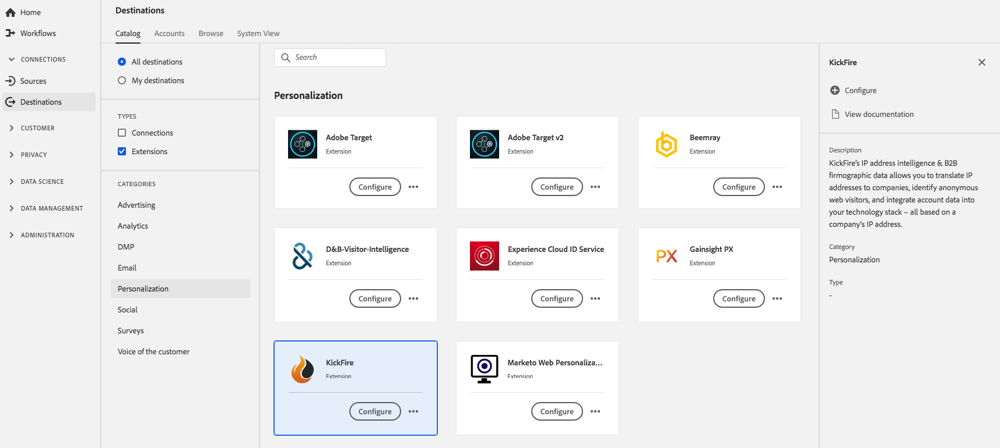

# [!DNL KickFire] Extension {#kickfire-extension}

## Présentation {#overview}

[!DNL KickFire's] Les informations d&#39;adresse IP et les données de firmographie B2B vous permettent de convertir des adresses IP en sociétés, d&#39;identifier des visiteurs Web anonymes et d&#39;intégrer des données de compte dans votre pile technologique - le tout en fonction d&#39;une adresse IP de société.

[!DNL KickFire] est une extension de personnalisation à Adobe Experience Platform. Pour plus d’informations sur les fonctionnalités de l’extension, consultez le [site web de KickFire](https://www.kickfire.com/).

Cette destination est une extension Adobe Experience Platform Launch. Pour plus d&#39;informations sur le fonctionnement des extensions de Platform launch dans Platform, voir [Présentation des extensions Adobe Experience Platform Launch](../launch-extensions/overview.md).

## Conditions préalables  {#prerequisites}

Cette extension est disponible dans le catalogue [!DNL Destinations] pour tous les clients qui ont acheté Platform.

Pour utiliser cette extension, vous devez accéder à Adobe Experience Platform Launch.  Platform Launch est une fonctionnalité gratuite intégrée à Adobe Experience Cloud. Contactez l’administrateur de votre organisation pour accéder au Platform launch et demandez-lui de vous accorder l’autorisation **[!UICONTROL manage_properties]** afin que vous puissiez installer les extensions.

## Installation de l’extension {#install-extension}

Pour installer l&#39;extension [!DNL KickFire] :

Dans l&#39;[interface de plate-forme](http://platform.adobe.com/), accédez à **[!UICONTROL Destinations]** > **[!UICONTROL Catalogue]**.

Sélectionnez l’extension dans le catalogue ou utilisez la barre de recherche.

Cliquez sur la destination pour la mettre en évidence, puis sélectionnez **[!UICONTROL Configurer]** dans le rail de droite. Si le contrôle **[!UICONTROL Configure]** est grisé, l&#39;autorisation **[!UICONTROL manage_properties]** vous manque. Voir les [Conditions préalables](#prerequisites).

Dans la fenêtre **[!UICONTROL Sélectionner la propriété de Platform launch disponible]**, sélectionnez la propriété de Platform launch dans laquelle vous souhaitez installer l&#39;extension. Vous avez également la possibilité de créer une propriété dans le Platform launch. Une propriété est un ensemble de règles, d’éléments de données, d’extensions configurées, d’environnements et de bibliothèques. Découvrez les propriétés dans la section [Page Propriétés](https://experienceleague.adobe.com/docs/launch/using/reference/admin/companies-and-properties.html#properties-page) de la documentation du Platform launch.

Le processus vous conduit au Platform launch pour terminer l’installation.

Vous pouvez également installer l&#39;extension directement dans l&#39;[interface Adobe Experience Platform Launch](https://launch.adobe.com/). Voir [Ajouter une nouvelle extension](https://experienceleague.adobe.com/docs/launch/using/reference/manage-resources/extensions/overview.html?lang=en#add-a-new-extension) dans la documentation du Platform launch.

## Utilisation de l’extension {#how-to-use}

Une fois que vous avez installé l&#39;extension, vous pouvez début la configuration des règles directement dans le Platform launch.

Dans le Platform launch, vous pouvez définir des règles pour vos extensions installées afin d’envoyer des données de événement à la destination de l’extension uniquement dans certaines situations. Pour plus d’informations sur la configuration de règles pour vos extensions, consultez la [documentation des règles](https://experienceleague.adobe.com/docs/launch/using/reference/manage-resources/rules.html).

## Configuration, mise à niveau et suppression de l’extension {#configure-upgrade-delete}

Vous pouvez configurer, mettre à niveau et supprimer des extensions dans l’interface de Platform launch.

>[!TIP]
>
>Si l&#39;extension est déjà installée sur l&#39;une de vos propriétés, l&#39;interface utilisateur de la plate-forme affiche toujours **[!UICONTROL Installer]** pour l&#39;extension. Lancez le processus d&#39;installation comme décrit dans [Installer l&#39;extension](#install-extension) pour accéder au Platform launch et configurer ou supprimer votre extension.

Pour mettre à niveau votre extension, voir [Extension upgrade](https://experienceleague.adobe.com/docs/launch/using/reference/manage-resources/extensions/extension-upgrade.html) dans la documentation du Platform launch.