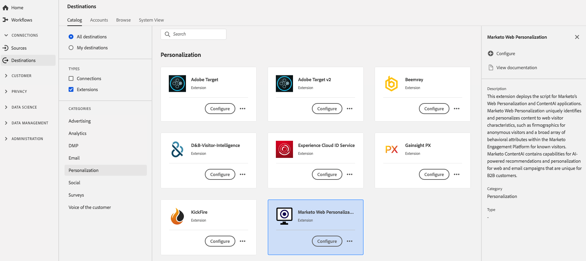

# Extension [!DNL Marketo Web Personalization] {#marketo-web-personalization-extension}

## Vue d’ensemble {#overview}

Cette extension déploie le script pour les applications Web Personalization et ContentAI [!DNL Marketo's]. [!DNL Marketo] Web Personalization identifie et personnalise de manière unique le contenu des caractéristiques des visiteurs web, telles que les données démographiques des visiteurs anonymes et un large éventail d’attributs comportementaux dans la plateforme d’engagement [!DNL Marketo] pour les visiteurs connus. [!DNL Marketo] ContentAI contient des fonctionnalités de recommandations et de personnalisation optimisées par l’IA pour les campagnes web et par e-mail qui sont uniques aux clients B2B.

[!DNL Marketo Web Personalization] est une extension de personnalisation dans Adobe Experience Platform. Pour plus d’informations sur la personnalisation web et ContentAI dans Marketo, consultez [Présentation de Web Personalization](https://experienceleague.adobe.com/docs/marketo/using/product-docs/web-personalization/understanding-web-personalization/web-personalization-overview.html).

Cette destination est une extension de balise. Pour plus d’informations sur le fonctionnement des extensions de balises dans Platform, voir la [présentation des extensions de balises](../launch-extensions/overview.md).

## Conditions préalables  {#prerequisites}

Cette extension est disponible dans le catalogue [!DNL Destinations] pour tous les clients qui ont acheté Platform.

Pour utiliser cette extension, vous devez avoir accès aux balises dans Adobe Experience Platform. Les balises sont proposées aux clients Adobe Experience Cloud en tant que fonctionnalité à valeur ajoutée incluse. Contactez l’administrateur ou l’administratrice de votre organisation pour accéder aux balises et demandez-lui de vous accorder l’autorisation **[!UICONTROL manage_properties]** afin que vous puissiez installer les extensions.

## Installation l’extension {#install-extension}

Pour installer l’extension [!DNL Marketo Web Personalization], procédez comme suit :

Dans l’[interface de Platform](https://platform.adobe.com/), accédez à **[!UICONTROL Destinations]** > **[!UICONTROL Catalogue]**.

Sélectionnez l’extension dans le catalogue ou utilisez la barre de recherche.

Cliquez sur la destination pour la mettre en surbrillance, puis sélectionnez **[!UICONTROL Configurer]** dans le rail droit. Si la commande **[!UICONTROL Configurer]** est grisée, vous ne disposez pas de l’autorisation **[!UICONTROL manage_properties]**. Voir les [Conditions préalables](#prerequisites).

Sélectionnez la propriété dans laquelle vous souhaitez installer l’extension. Vous pouvez aussi créer une propriété. Une propriété est un ensemble de règles, d’éléments de données, d’extensions configurées, d’environnements et de bibliothèques. Pour en savoir plus sur les propriétés, consultez la [section de la page propriétés](../../../tags/ui/administration/companies-and-properties.md#properties-page) de la documentation sur les balises.

Le workflow vous guide tout au long des étapes nécessaires pour terminer l’installation.

Vous pouvez également installer l’extension directement dans l’[interface utilisateur de la collecte de données](https://experience.adobe.com/#/data-collection/). Pour plus d’informations, voir la section sur l’[ajout d’une nouvelle extension](../../../tags/ui/managing-resources/extensions/overview.md#add-a-new-extension) dans la documentation sur les balises.

## Utilisation de l’extension {#how-to-use}

Une fois que vous avez installé l’extension, vous pouvez commencer à configurer des règles.

Vous pouvez configurer des règles pour vos extensions installées afin d’envoyer des données d’événement vers la destination de l’extension uniquement dans certains cas. Pour plus d’informations sur la configuration de règles pour vos extensions, consultez la [documentation sur les balises](../../../tags/ui/managing-resources/rules.md).

## Configuration, mise à niveau et suppression de l’extension {#configure-upgrade-delete}

Vous pouvez configurer, mettre à niveau et supprimer des extensions dans l’interface utilisateur de collecte de données.

>[!TIP]
>
>Si l’extension est déjà installée sur l’une de vos propriétés, l’interface utilisateur de Platform continue d’afficher **[!UICONTROL Installer]** pour cette extension. Démarrez le workflow d’installation comme décrit dans [Installation de l’extension](#install-extension) pour configurer ou supprimer votre extension.

Pour mettre à niveau votre extension, consultez le guide sur le [processus de mise à niveau d’extension](../../../tags/ui/managing-resources/extensions/extension-upgrade.md) dans la documentation sur les balises.
