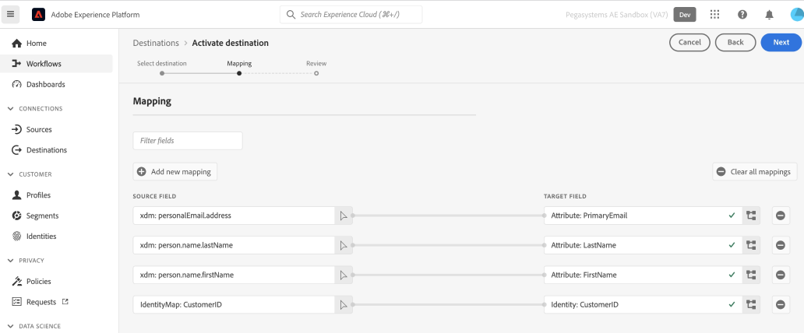

# Connexion à l’audience en temps réel Pega CDH

>[!IMPORTANT]
>
>Cette version de la destination Audience en temps réel de Pega Customer Decision Hub prend en charge une seule application de décision client Pega. Si plusieurs applications de Pega Customer Decision Hub sont configurées, vous devez utiliser le connecteur de destination d’audience en temps réel Pega CDH [(V2)](./pega-v2.md).

## Vue d’ensemble {#overview}

Utilisez la destination Audience en temps réel [!DNL Pega Customer Decision Hub] dans Adobe Experience Platform pour envoyer les attributs de profil et les données d’appartenance à l’audience aux [!DNL Pega Customer Decision Hub] pour la prise de décision la plus appropriée.

L’appartenance à une audience de profil depuis Adobe Experience Platform, lorsqu’elle est chargée dans [!DNL Pega Customer Decision Hub], peut être utilisée comme prédicteur dans les modèles adaptatifs et contribuer à fournir les données contextuelles et comportementales appropriées pour la prise de décision la plus appropriée.

>[!IMPORTANT]
>
>Ce connecteur de destination et cette page de documentation sont créés et gérés par Pegasystems. Pour toute demande ou information, veuillez contacter Pega directement [ici](mailto:support@pega.com).

## Cas d’utilisation

Pour mieux comprendre quand et comment utiliser la destination [!DNL Customer Decision Hub], consultez les exemples de cas d’utilisation ci-dessous que la clientèle de Adobe Experience Platform peut résoudre.

### Télécommunications

Un spécialiste marketing souhaite tirer parti des informations issues de la meilleure action suivante basée sur un modèle de science des données, fournie par [!DNL Pega Customer Decision Hub] pour l’engagement du client. [!DNL Pega Customer Decision Hub] dépend fortement de l’intention du client, par exemple, « Interested_In_5G », « Interested_in_Unlimited_Dataplan » ou « Interest_in_iPhone_accessoires ».

### Services financiers

Un spécialiste du marketing souhaite optimiser les offres pour les clients qui se sont inscrits ou désinscrits à des bulletins d’information sur un régime de retraite ou un régime de retraite. Les sociétés de services financiers peuvent ingérer plusieurs ID de client de leurs propres CRM dans Adobe Experience Platform, créer des audiences à partir de leurs propres données hors ligne et envoyer des profils qui entrent dans les audiences et en sortent pour [!DNL Pega Customer Decision Hub] la prise de décision de meilleure action (NBA) dans les canaux sortants.

## Conditions préalables {#prerequisites}

Avant de pouvoir utiliser cette destination pour exporter des données en dehors de Adobe Experience Platform, veillez à remplir les conditions préalables suivantes en [!DNL Pega Customer Decision Hub] :

* Configurez le composant d’intégration Profil Adobe Experience Platform et Appartenance à une audience [&#128279;](https://docs.pega.com/bundle/components/page/customer-decision-hub/components/adobe-membership-component.html) dans votre instance [!DNL Pega Customer Decision Hub].
* Configurez OAuth 2.0 [Enregistrement du client à l’aide des informations d’identification client](https://docs.pega.com/bundle/platform/page/platform/security/configure-oauth-2-client-registration.html) type d’octroi dans votre instance [!DNL Pega Customer Decision Hub].
* Configurez le [flux de données d’exécution en temps réel](https://docs.pega.com/bundle/platform/page/platform/decision-management/data-flow-run-real-time-create.html) pour le flux de données d’appartenance à une audience Adobe dans votre instance de [!DNL Pega Customer Decision Hub].

## Identités prises en charge {#supported-identities}

[!DNL Pega Customer Decision Hub] prend en charge l’activation des ID utilisateur personnalisés décrits dans le tableau ci-dessous. Pour plus d’informations, voir [identités](/help/identity-service/features/namespaces.md).

| Identité cible | Description |
|---|---|
| *CustomerID* | Identifiant utilisateur commun qui identifie de manière unique un profil dans [!DNL Pega Customer Decision Hub] et Adobe Experience Platform |

{style="table-layout:auto"}

## Type et fréquence d’exportation {#export-type-frequency}

Reportez-vous au tableau ci-dessous pour plus d’informations sur le type et la fréquence d’exportation des destinations.

| Élément | Type | Notes |
|---------|----------|---------|
| Type d’exportation | **[!UICONTROL Profile-based]** | Exportez tous les membres d’une audience avec un identifiant (*CustomerID*), des attributs (nom, prénom, emplacement, etc.) et des données d’appartenance à l’audience. |
| Fréquence des exportations | **[!UICONTROL Streaming]** | Les destinations de diffusion en continu sont des connexions basées sur l’API toujours actives. Dès qu’un profil est mis à jour dans Experience Platform, en fonction de l’évaluation de l’audience, le connecteur envoie la mise à jour en aval vers la plateforme de destination. Pour plus d’informations, voir [Destinations de diffusion en continu](/help/destinations/destination-types.md#streaming-destinations). |

{style="table-layout:auto"}

## Se connecter à la destination {#connect}

Pour vous connecter à cette destination, procédez comme décrit dans le [tutoriel sur la configuration des destinations](../../ui/connect-destination.md). Dans le workflow de configuration des destinations, renseignez les champs répertoriés dans les deux sections ci-dessous.

### S’authentifier auprès de la destination {#authenticate}

#### Authentification avec informations d’identification du client OAuth 2 {#oauth-2-client-credentials-authentication}

Renseignez les champs ci-dessous et sélectionnez **[!UICONTROL Connect to destination]** :

* **[!UICONTROL Access Token URL]** : URL du jeton d’accès OAuth 2 sur votre instance [!DNL Pega Customer Decision Hub].
* **[!UICONTROL Client ID]** : [!DNL client ID] OAuth 2 que vous avez généré dans votre instance [!DNL Pega Customer Decision Hub].
* **[!UICONTROL Client Secret]** : [!DNL client secret] OAuth 2 que vous avez généré dans votre instance [!DNL Pega Customer Decision Hub].

### Renseigner les détails de la destination {#destination-details}

Après avoir établi la connexion d’authentification au [!DNL Pega Customer Decision Hub], fournissez les informations suivantes pour la destination :

Pour configurer les détails de la destination, renseignez les champs requis et sélectionnez **[!UICONTROL Next]**.

* **[!UICONTROL Name]** : nom par lequel vous reconnaîtrez cette destination à l’avenir.
* **[!UICONTROL Description]** : une description qui vous aidera à identifier cette destination à l’avenir.
* **[!UICONTROL Pega CDH Host Name]** : nom d’hôte du Pega Customer Decision Hub vers lequel le profil est exporté en tant que données JSON.

## Activer des audiences vers cette destination {#activate}

>[!IMPORTANT]
> 
>* Pour activer les données, vous avez besoin des autorisations de contrôle d’accès **[!UICONTROL View Destinations]**, **[!UICONTROL Activate Destinations]**, **[!UICONTROL View Profiles]** et **[!UICONTROL View Segments]** [Access control](/help/access-control/home.md#permissions). Lisez la [présentation du contrôle d’accès](/help/access-control/ui/overview.md) ou contactez votre administrateur ou administratrice du produit pour obtenir les autorisations requises.
>* Pour exporter des *identités*, vous devez disposer de l’autorisation de contrôle d’accès **[!UICONTROL View Identity Graph]**&#x200B;[&#128279;](/help/access-control/home.md#permissions).   {width="100" zoomable="yes"}

Consultez [&#x200B; Activer les données d’audience vers des destinations d’exportation de profil de diffusion en continu &#x200B;](../../ui/activate-streaming-profile-destinations.md) pour obtenir des instructions sur l’activation des audiences vers cette destination.

### Attributs de destination {#attributes}

Lors de la [[!UICONTROL Select attributes]](../../ui/activate-streaming-profile-destinations.md#select-attributes) étape, Adobe vous recommande de sélectionner un identifiant unique dans votre [schéma d’union](../../../profile/home.md#profile-fragments-and-union-schemas). Sélectionnez l’identifiant unique et tout autre champ XDM que vous souhaitez exporter vers la destination.

### Exemple de mappage : activation des mises à jour de profil dans [!DNL Pega Customer Decision Hub] {#mapping-example}

Vous trouverez ci-dessous un exemple de mappage d’identité correct lors de l’exportation de profils vers [!DNL Pega Customer Decision Hub].

Sélection des champs sources :

* Sélectionnez un identifiant (par exemple : CustomerID) en tant qu’identité source qui identifie de manière unique un profil dans Adobe Experience Platform et [!DNL Pega Customer Decision Hub].
* Sélectionnez les modifications d’attribut de profil source XDM qui doivent être exportées et mises à jour en [!DNL Pega Customer Decision Hub].

Sélection des champs cibles :

* Sélectionnez l’espace de noms `CustomerID` comme identité cible.
* Sélectionnez les noms des attributs de profil de destination qui doivent être mappés aux attributs de profil source XDM correspondants.

## Données exportées / Valider l’exportation des données {#exported-data}

Une mise à jour réussie de l’appartenance à une audience pour un profil insérerait l’identifiant de l’audience, son nom et ses statuts dans le magasin de données d’appartenance à une audience marketing Pega. Les données d’abonnement sont associées à un client qui utilise le profil client Designer dans [!DNL Pega Customer Decision Hub], comme illustré ci-dessous.

Les données d’appartenance à l’audience sont utilisées dans les politiques d’engagement Designer de la prochaine meilleure action de Pega pour la prise de décision de la prochaine meilleure action, comme illustré ci-dessous.

Les champs de données Abonnement de l’audience client sont ajoutés comme prédicteurs dans les modèles adaptatifs, comme illustré ci-dessous.

## Ressources supplémentaires {#additional-resources}

Consultez les ressources de documentation [!DNL Pega] suivantes pour plus d’informations :

* [Configuration d’un enregistrement client OAuth 2.0](https://docs.pega.com/bundle/platform/page/platform/security/configure-oauth-2-client-registration.html)
* [Création d’une exécution en temps réel pour les flux de données](https://docs.pega.com/bundle/platform/page/platform/decision-management/data-flow-run-real-time-create.html)
* [Gérer les enregistrements de clients dans le Designer du profil client](https://docs.pega.com/bundle/customer-decision-hub/page/customer-decision-hub/implement/profile-designer-data-management.html)

## Utilisation et gouvernance des données {#data-usage-governance}

Lors de la gestion de vos données, toutes les destinations [!DNL Adobe Experience Platform] se conforment aux politiques d’utilisation des données. Pour obtenir des informations détaillées sur la manière dont [!DNL Adobe Experience Platform] applique la gouvernance des données, lisez la [présentation de la gouvernance des données](/help/data-governance/home.md).
